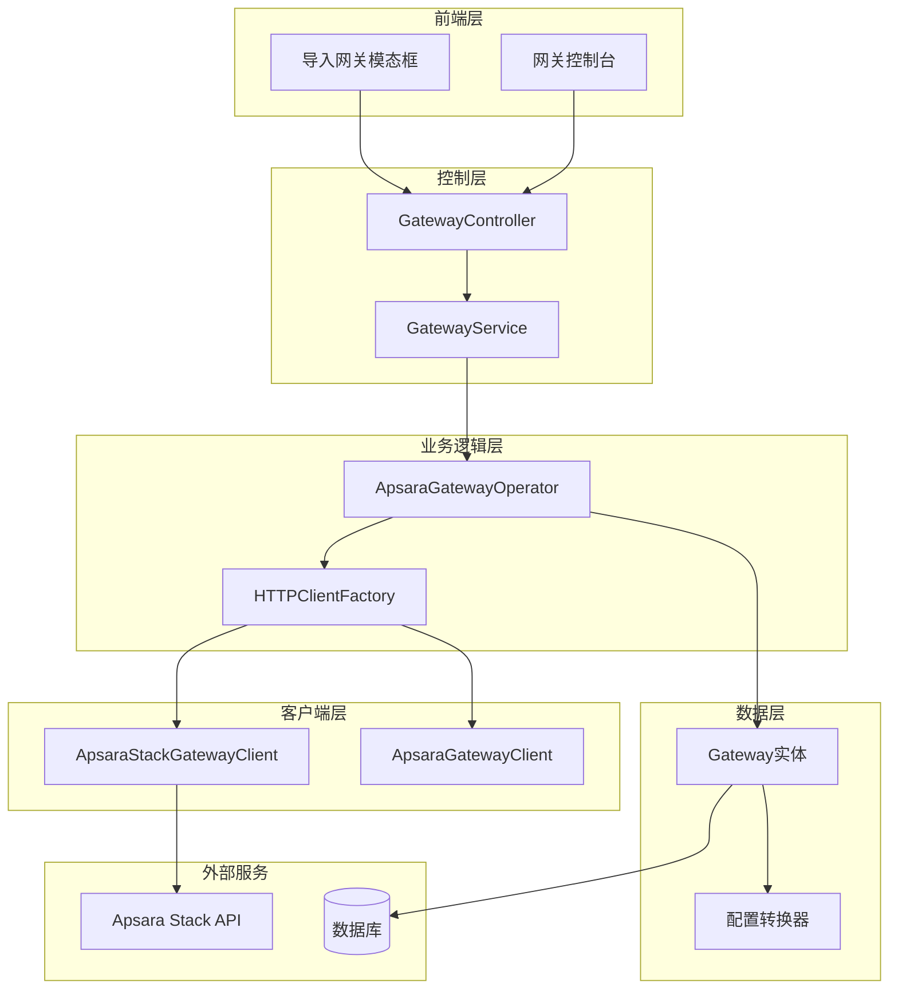
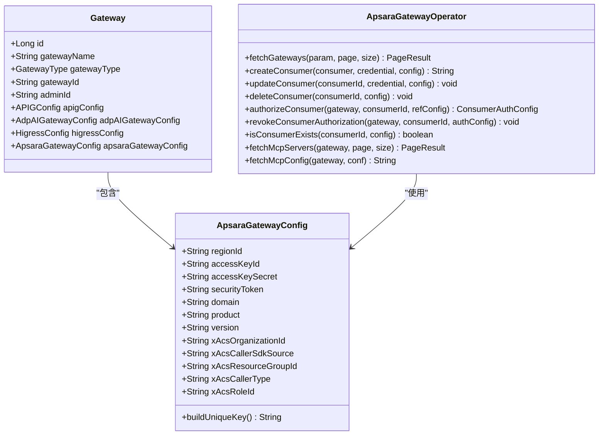
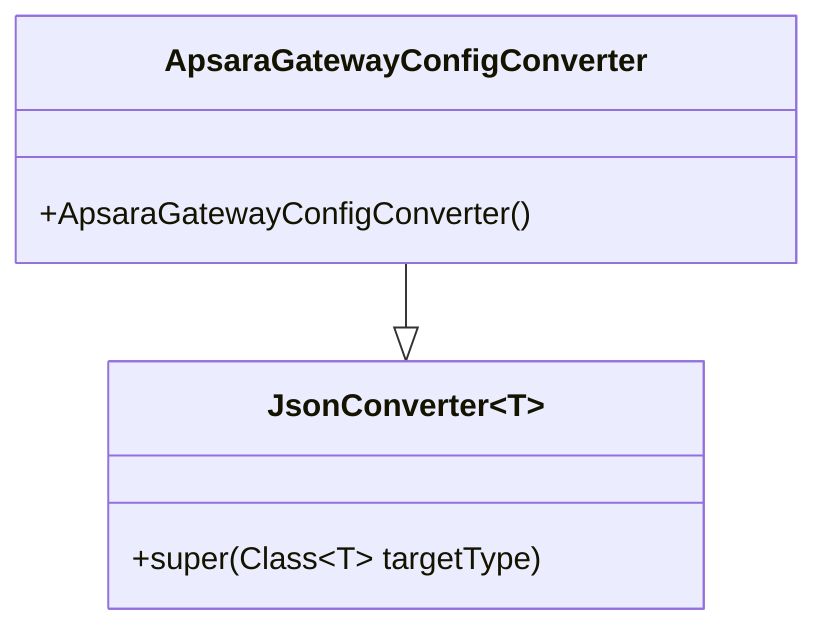
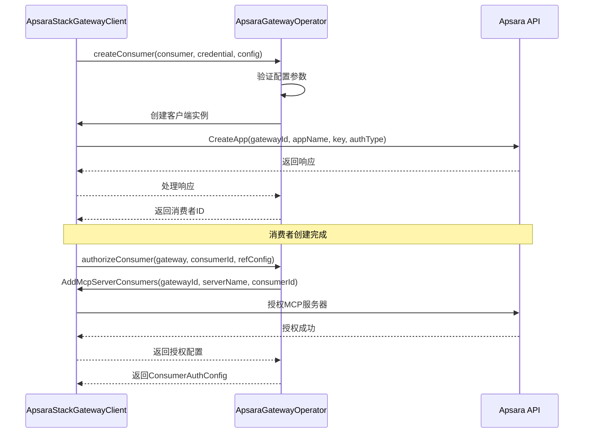
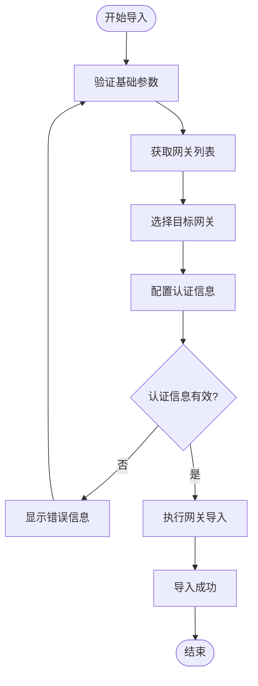

# Apsara Gateway 集成文档

<cite>
**本文档引用的文件**
- [Gateway.java](file://portal-dal/src/main/java/com/alibaba/apiopenplatform/entity/Gateway.java)
- [ApsaraGatewayConfig.java](file://portal-dal/src/main/java/com/alibaba/apiopenplatform/support/gateway/ApsaraGatewayConfig.java)
- [ApsaraGatewayConfigConverter.java](file://portal-dal/src/main/java/com/alibaba/apiopenplatform/converter/ApsaraGatewayConfigConverter.java)
- [ApsaraGatewayOperator.java](file://portal-server/src/main/java/com/alibaba/apiopenplatform/service/gateway/ApsaraGatewayOperator.java)
- [ApsaraStackGatewayClient.java](file://portal-server/src/main/java/com/alibaba/apiopenplatform/service/gateway/client/ApsaraStackGatewayClient.java)
- [ApsaraGatewayClient.java](file://portal-server/src/main/java/com/alibaba/apiopenplatform/service/gateway/client/ApsaraGatewayClient.java)
- [QueryApsaraGatewayParam.java](file://portal-server/src/main/java/com/alibaba/apiopenplatform/dto/params/gateway/QueryApsaraGatewayParam.java)
- [GatewayController.java](file://portal-server/src/main/java/com/alibaba/apiopenplatform/controller/GatewayController.java)
- [GatewayConsoles.tsx](file://portal-web/api-portal-admin/src/pages/GatewayConsoles.tsx)
- [ImportGatewayModal.tsx](file://portal-web/api-portal-admin/src/components/console/ImportGatewayModal.tsx)
- [values.yaml](file://deploy/helm/values.yaml)
</cite>

## 目录
1. [概述](#概述)
2. [系统架构](#系统架构)
3. [核心组件](#核心组件)
4. [配置管理](#配置管理)
5. [消费者管理](#消费者管理)
6. [前端界面](#前端界面)
7. [部署配置](#部署配置)
8. [API参考](#api参考)
9. [故障排除](#故障排除)
10. [最佳实践](#最佳实践)

## 概述

Apsara Gateway 是阿里云飞天企业版AI网关的服务集成模块，提供了统一的网关管理接口，支持与阿里云Apsara Stack网关的深度集成。该系统实现了完整的网关生命周期管理，包括网关发现、消费者管理、API授权等功能。

### 主要特性

- **多网关类型支持**：统一管理API Gateway、Higress、ADP AI Gateway和Apsara Gateway
- **消费者生命周期管理**：完整的消费者创建、更新、删除和授权流程
- **MCP Server集成**：支持MCP（Model Control Protocol）服务器的管理和配置
- **安全认证**：基于API Key的认证机制和STS临时凭证支持
- **可视化管理**：提供Web界面进行网关配置和监控

## 系统架构

**架构图来源**
- [GatewayController.java](file://portal-server/src/main/java/com/alibaba/apiopenplatform/controller/GatewayController.java#L43-L129)
- [ApsaraGatewayOperator.java](file://portal-server/src/main/java/com/alibaba/apiopenplatform/service/gateway/ApsaraGatewayOperator.java#L38-L694)

## 核心组件

### 网关实体模型

网关实体是系统的核心数据模型，支持多种类型的网关配置：

**类图来源**
- [Gateway.java](file://portal-dal/src/main/java/com/alibaba/apiopenplatform/entity/Gateway.java#L43-L77)
- [ApsaraGatewayConfig.java](file://portal-dal/src/main/java/com/alibaba/apiopenplatform/support/gateway/ApsaraGatewayConfig.java#L26-L68)
- [ApsaraGatewayOperator.java](file://portal-server/src/main/java/com/alibaba/apiopenplatform/service/gateway/ApsaraGatewayOperator.java#L38-L694)

### 网关客户端

系统提供了两个主要的客户端实现：

1. **ApsaraStackGatewayClient**：基于Tea SDK的新版本客户端
2. **ApsaraGatewayClient**：基于旧版SDK的客户端

这两个客户端都继承自`GatewayClient`基类，提供了统一的API调用接口。

**节来源**
- [ApsaraStackGatewayClient.java](file://portal-server/src/main/java/com/alibaba/apiopenplatform/service/gateway/client/ApsaraStackGatewayClient.java#L15-L272)
- [ApsaraGatewayClient.java](file://portal-server/src/main/java/com/alibaba/apiopenplatform/service/gateway/client/ApsaraGatewayClient.java#L22-L91)

## 配置管理

### Apsara网关配置参数

Apsara网关需要以下核心配置参数：

| 参数名称 | 类型 | 必填 | 描述 |
|---------|------|------|------|
| regionId | String | 是 | 地域ID，如cn-hangzhou |
| accessKeyId | String | 是 | 访问密钥ID |
| accessKeySecret | String | 是 | 访问密钥Secret |
| securityToken | String | 否 | STS临时凭证 |
| domain | String | 是 | API域名，如csb-cop-api-biz.inter.envXX.example.com |
| product | String | 是 | 产品名称，默认csb2 |
| version | String | 是 | API版本，默认2023-02-06 |
| xAcsOrganizationId | String | 是 | 组织ID |
| xAcsCallerSdkSource | String | 否 | SDK来源标识 |
| xAcsResourceGroupId | String | 否 | 资源组ID |
| xAcsCallerType | String | 否 | 调用者类型 |
| xAcsRoleId | String | 否 | 角色ID |

### 配置转换器

系统提供了专门的配置转换器来处理JSON序列化：

**类图来源**
- [ApsaraGatewayConfigConverter.java](file://portal-dal/src/main/java/com/alibaba/apiopenplatform/converter/ApsaraGatewayConfigConverter.java#L26-L32)

**节来源**
- [ApsaraGatewayConfig.java](file://portal-dal/src/main/java/com/alibaba/apiopenplatform/support/gateway/ApsaraGatewayConfig.java#L26-L68)
- [ApsaraGatewayConfigConverter.java](file://portal-dal/src/main/java/com/alibaba/apiopenplatform/converter/ApsaraGatewayConfigConverter.java#L26-L32)

## 消费者管理

### 消费者生命周期

Apsara网关的消费者管理包括以下核心操作：

**序列图来源**
- [ApsaraGatewayOperator.java](file://portal-server/src/main/java/com/alibaba/apiopenplatform/service/gateway/ApsaraGatewayOperator.java#L355-L418)
- [ApsaraGatewayOperator.java](file://portal-server/src/main/java/com/alibaba/apiopenplatform/service/gateway/ApsaraGatewayOperator.java#L569-L608)

### 消费者授权机制

系统支持基于MCP服务器的消费者授权：

1. **授权创建**：将消费者添加到指定的MCP服务器授权列表
2. **授权撤销**：从MCP服务器的授权列表中移除消费者
3. **存在性检查**：验证消费者是否已在网关中存在

**节来源**
- [ApsaraGatewayOperator.java](file://portal-server/src/main/java/com/alibaba/apiopenplatform/service/gateway/ApsaraGatewayOperator.java#L569-L608)
- [ApsaraGatewayOperator.java](file://portal-server/src/main/java/com/alibaba/apiopenplatform/service/gateway/ApsaraGatewayOperator.java#L626-L677)

## 前端界面

### 网关控制台

前端提供了完整的网关管理界面，支持：

- **网关类型切换**：在不同网关类型之间切换查看
- **网关列表展示**：显示网关的基本信息和操作按钮
- **导入网关向导**：提供完整的网关导入流程
- **分页查询**：支持大数据量的分页浏览

### 导入网关模态框

导入网关功能支持Apsara网关的完整配置流程：

**流程图来源**
- [ImportGatewayModal.tsx](file://portal-web/api-portal-admin/src/components/console/ImportGatewayModal.tsx#L37-L88)

**节来源**
- [GatewayConsoles.tsx](file://portal-web/api-portal-admin/src/pages/GatewayConsoles.tsx#L12-L425)
- [ImportGatewayModal.tsx](file://portal-web/api-portal-admin/src/components/console/ImportGatewayModal.tsx#L15-L416)

## 部署配置

### Helm部署配置

系统提供了完整的Kubernetes部署配置：

| 配置项 | 默认值 | 描述 |
|--------|--------|------|
| hub | opensource-registry.cn-hangzhou.cr.aliyuncs.com/higress-group | 镜像仓库地址 |
| frontend.image.repository | himarket-frontend | 前端镜像仓库 |
| frontend.image.tag | 1.0.0 | 前端镜像标签 |
| admin.image.repository | himarket-admin | 管理后台镜像仓库 |
| admin.image.tag | 1.0.0 | 管理后台镜像标签 |
| server.image.repository | himarket-server | 服务端镜像仓库 |
| server.image.tag | 1.0.0 | 服务端镜像标签 |
| mysql.enabled | true | 是否启用内置MySQL |
| mysql.auth.database | himarket_db | 数据库名称 |
| mysql.auth.username | himarket_user | 数据库用户名 |

**节来源**
- [values.yaml](file://deploy/helm/values.yaml#L1-L94)

## API参考

### 网关管理API

系统提供了完整的网关管理REST API：

| 方法 | 端点 | 描述 |
|------|------|------|
| GET | /gateways | 获取网关列表 |
| POST | /gateways | 导入网关 |
| DELETE | /gateways/{gatewayId} | 删除网关 |
| POST | /gateways/apsara | 获取Apsara网关列表 |
| GET | /gateways/{gatewayId}/mcp-servers | 获取MCP服务器列表 |
| GET | /gateways/{gatewayId}/dashboard | 获取仪表板URL |

### 消费者管理API

| 方法 | 端点 | 描述 |
|------|------|------|
| POST | /gateways/{gatewayId}/authorize-consumer | 授权消费者 |
| POST | /gateways/{gatewayId}/revoke-consumer | 撤销消费者授权 |

**节来源**
- [GatewayController.java](file://portal-server/src/main/java/com/alibaba/apiopenplatform/controller/GatewayController.java#L48-L129)

## 故障排除

### 常见问题

1. **认证失败**
   - 检查AccessKey和SecretKey是否正确
   - 验证RegionId是否匹配
   - 确认网络连接和防火墙设置

2. **网关发现失败**
   - 验证API域名配置
   - 检查产品和版本号
   - 确认组织ID和资源组配置

3. **消费者创建失败**
   - 检查消费者名称是否唯一
   - 验证API Key格式
   - 确认网关实例ID正确

### 日志分析

系统提供了详细的日志记录，可以通过以下关键字进行问题排查：
- `Apsara gateway`：网关操作相关日志
- `CreateApp`：消费者创建操作
- `AddMcpServerConsumers`：MCP服务器授权操作
- `Error fetching`：API调用错误

## 最佳实践

### 安全配置

1. **密钥管理**
   - 使用STS临时凭证替代长期凭证
   - 定期轮换AccessKey和SecretKey
   - 限制最小权限原则

2. **网络隔离**
   - 在VPC内部署网关实例
   - 配置适当的网络安全组规则
   - 使用私有DNS解析

### 性能优化

1. **连接池管理**
   - 合理配置HTTP连接超时时间
   - 使用连接池复用TCP连接
   - 监控连接池使用情况

2. **缓存策略**
   - 缓存网关实例列表
   - 缓存消费者授权状态
   - 实现智能的配置刷新机制

### 监控告警

1. **关键指标监控**
   - API调用成功率
   - 平均响应时间
   - 错误率统计
   - 并发连接数

2. **告警配置**
   - 设置阈值告警
   - 配置邮件通知
   - 实现自动恢复机制