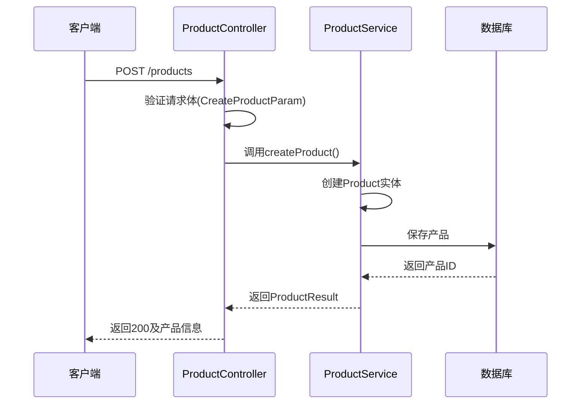
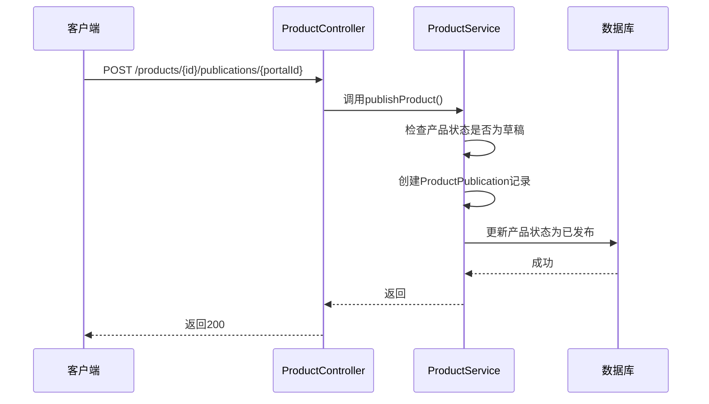
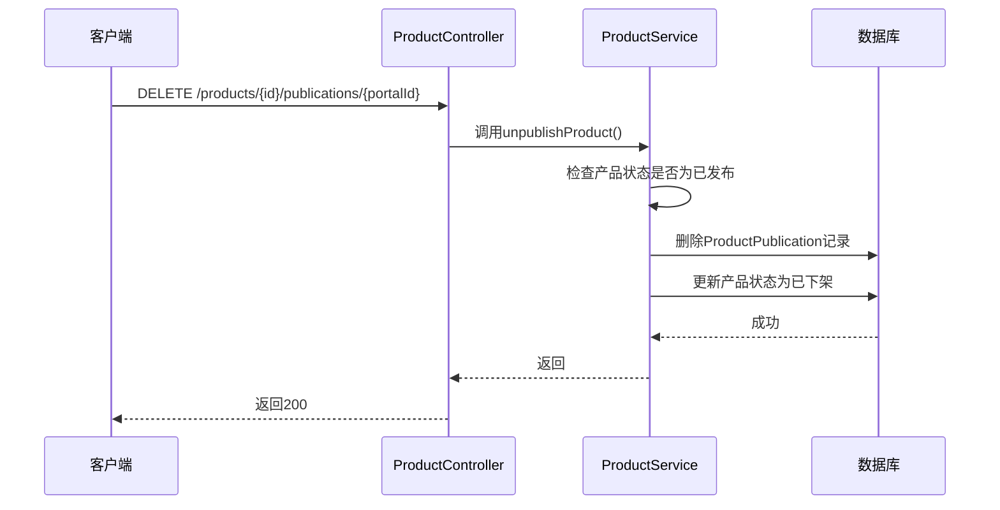
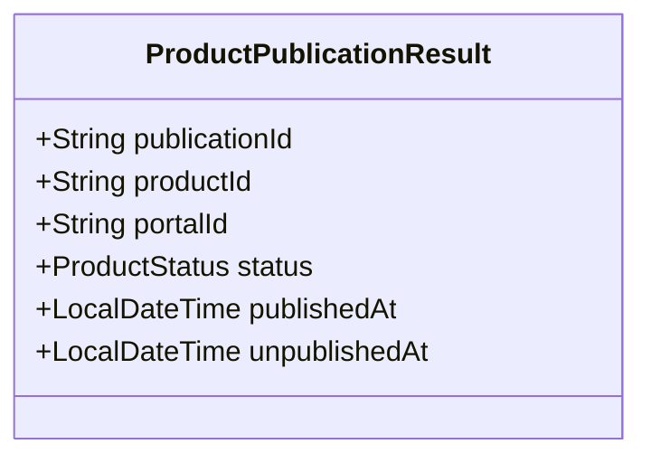
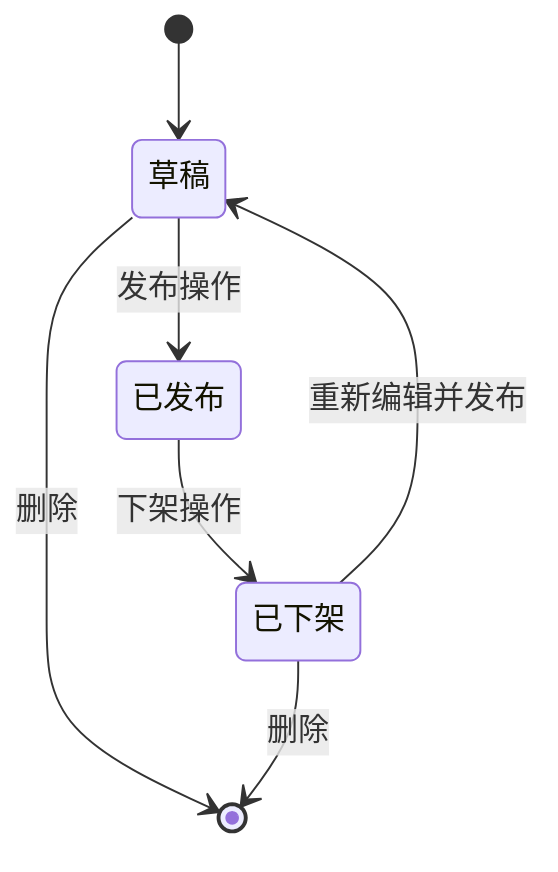
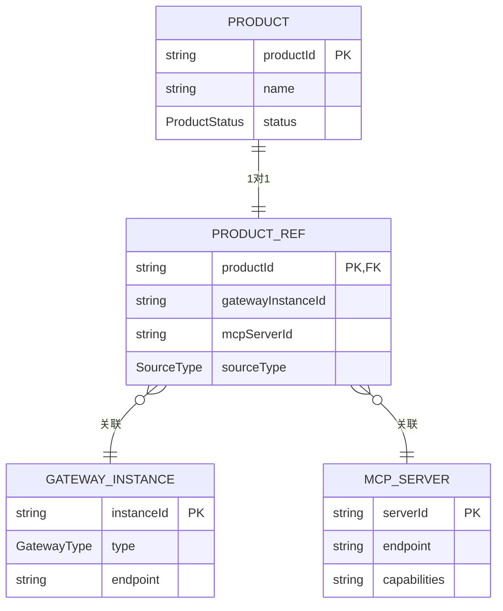

# AI产品管理API

<cite>
**本文档引用文件**  
- [ProductController.java](file://portal-server/src/main/java/com/alibaba/apiopenplatform/controller/ProductController.java#L1-L128)
- [CreateProductParam.java](file://portal-server/src/main/java/com/alibaba/apiopenplatform/dto/params/product/CreateProductParam.java#L1-L54)
- [PublishProductParam.java](file://portal-server/src/main/java/com/alibaba/apiopenplatform/dto/params/product/PublishProductParam.java#L1-L34)
- [UnPublishProductParam.java](file://portal-server/src/main/java/com/alibaba/apiopenplatform/dto/params/product/UnPublishProductParam.java#L1-L32)
- [ProductResult.java](file://portal-server/src/main/java/com/alibaba/apiopenplatform/dto/result/ProductResult.java#L1-L63)
- [ProductPublicationResult.java](file://portal-server/src/main/java/com/alibaba/apiopenplatform/dto/result/ProductPublicationResult.java)
</cite>

## 目录
1. [简介](#简介)
2. [核心端点详解](#核心端点详解)
3. [请求参数结构](#请求参数结构)
4. [响应数据格式](#响应数据格式)
5. [产品状态机与生命周期](#产品状态机与生命周期)
6. [产品与API网关实例关联机制](#产品与api网关实例关联机制)
7. [完整操作示例](#完整操作示例)
8. [验证逻辑与错误处理](#验证逻辑与错误处理)

## 简介

AI产品管理API是平台的核心功能模块之一，用于对AI产品进行全生命周期管理。该API由`ProductController`类实现，提供创建、更新、发布、下架、删除及查询AI产品的功能。所有操作均通过RESTful接口暴露，支持管理员身份认证（`@AdminAuth`），确保操作安全性。

该API不仅管理产品元数据，还支持将产品与门户（Portal）关联以实现发布，并可绑定API或MCP Server作为后端服务。产品状态通过状态机严格控制，确保业务流程的合规性。

**Section sources**
- [ProductController.java](file://portal-server/src/main/java/com/alibaba/apiopenplatform/controller/ProductController.java#L1-L128)

## 核心端点详解

### 创建AI产品

**HTTP方法**: `POST`  
**URL**: `/products`  
**认证要求**: 管理员权限  
**功能描述**: 创建一个新的AI产品，初始状态为“草稿”。



**Diagram sources**
- [ProductController.java](file://portal-server/src/main/java/com/alibaba/apiopenplatform/controller/ProductController.java#L24-L30)
- [CreateProductParam.java](file://portal-server/src/main/java/com/alibaba/apiopenplatform/dto/params/product/CreateProductParam.java#L1-L54)

### 更新AI产品

**HTTP方法**: `PUT`  
**URL**: `/products/{productId}`  
**认证要求**: 管理员权限  
**功能描述**: 更新指定ID的AI产品信息，仅允许在“草稿”状态下修改。

### 查询AI产品列表

**HTTP方法**: `GET`  
**URL**: `/products`  
**认证要求**: 无  
**功能描述**: 分页查询AI产品列表，支持按名称、类型等条件过滤。

### 获取AI产品详情

**HTTP方法**: `GET`  
**URL**: `/products/{productId}`  
**认证要求**: 无  
**功能描述**: 获取指定AI产品的完整信息。

### 发布AI产品

**HTTP方法**: `POST`  
**URL**: `/products/{productId}/publications/{portalId}`  
**认证要求**: 管理员权限  
**功能描述**: 将AI产品发布到指定门户，状态变更为“已发布”。



**Diagram sources**
- [ProductController.java](file://portal-server/src/main/java/com/alibaba/apiopenplatform/controller/ProductController.java#L53-L59)

### 获取产品发布信息

**HTTP方法**: `GET`  
**URL**: `/products/{productId}/publications`  
**认证要求**: 管理员权限  
**功能描述**: 查询AI产品在各门户的发布状态。

### 下架AI产品

**HTTP方法**: `DELETE`  
**URL**: `/products/{productId}/publications/{portalId}`  
**认证要求**: 管理员权限  
**功能描述**: 将AI产品从指定门户下架，状态变更为“已下架”。



**Diagram sources**
- [ProductController.java](file://portal-server/src/main/java/com/alibaba/apiopenplatform/controller/ProductController.java#L69-L75)

### 删除AI产品

**HTTP方法**: `DELETE`  
**URL**: `/products/{productId}`  
**认证要求**: 管理员权限  
**功能描述**: 删除AI产品，仅允许在“草稿”或“已下架”状态下删除。

### 关联后端服务

**HTTP方法**: `POST`  
**URL**: `/products/{productId}/ref`  
**认证要求**: 管理员权限  
**功能描述**: 将AI产品与API或MCP Server实例关联。

### 获取关联信息

**HTTP方法**: `GET`  
**URL**: `/products/{productId}/ref`  
**认证要求**: 无  
**功能描述**: 获取AI产品关联的后端服务信息。

### 删除关联

**HTTP方法**: `DELETE`  
**URL**: `/products/{productId}/ref`  
**认证要求**: 管理员权限  
**功能描述**: 删除AI产品与后端服务的关联。

### 获取监控面板URL

**HTTP方法**: `GET`  
**URL**: `/products/{productId}/dashboard`  
**认证要求**: 无  
**功能描述**: 获取AI产品的监控面板访问链接。

**Section sources**
- [ProductController.java](file://portal-server/src/main/java/com/alibaba/apiopenplatform/controller/ProductController.java#L24-L128)

## 请求参数结构

### 创建产品参数 (CreateProductParam)

该参数用于创建AI产品，定义了产品的基本属性。

```java
@Data
public class CreateProductParam implements InputConverter<Product> {
    @NotBlank(message = "API产品名称不能为空")
    @Size(max = 50, message = "API产品名称长度不能超过50个字符")
    private String name;

    @Size(max = 256, message = "API产品描述长度不能超过256个字符")
    private String description;

    @NotNull(message = "API产品类型不能为空")
    private ProductType type;

    private String document;
    private ProductIcon icon;
    private String category;
    private Boolean autoApprove;
}
```

**字段说明**:
- **name**: 产品名称，必填，最大50字符
- **description**: 产品描述，最大256字符
- **type**: 产品类型，必填，枚举值（如AI模型、API服务等）
- **document**: 产品文档链接
- **icon**: 产品图标
- **category**: 产品分类
- **autoApprove**: 是否自动审批订阅请求

**Section sources**
- [CreateProductParam.java](file://portal-server/src/main/java/com/alibaba/apiopenplatform/dto/params/product/CreateProductParam.java#L1-L54)

### 发布产品参数 (PublishProductParam)

该参数用于发布产品，仅包含门户ID。

```java
@Data
public class PublishProductParam implements InputConverter<ProductPublication> {
    @NotBlank(message = "门户ID不能为空")
    private String portalId;
}
```

**字段说明**:
- **portalId**: 目标门户的唯一标识，必填

### 下架产品参数 (UnPublishProductParam)

该参数用于下架产品，结构与发布参数一致。

```java
@Data
public class UnPublishProductParam {
    @NotBlank(message = "门户ID不能为空")
    private String portalId;
}
```

**字段说明**:
- **portalId**: 要下架的门户ID，必填

**Section sources**
- [PublishProductParam.java](file://portal-server/src/main/java/com/alibaba/apiopenplatform/dto/params/product/PublishProductParam.java#L1-L34)
- [UnPublishProductParam.java](file://portal-server/src/main/java/com/alibaba/apiopenplatform/dto/params/product/UnPublishProductParam.java#L1-L32)

## 响应数据格式

### 产品结果 (ProductResult)

该对象表示AI产品的完整信息。

```java
@Data
public class ProductResult implements OutputConverter<ProductResult, Product> {
    private String productId;
    private String name;
    private String description;
    private ProductStatus status = ProductStatus.PENDING;
    private Boolean enableConsumerAuth = false;
    private ProductType type;
    private String document;
    private String icon;
    private String category;
    private Boolean autoApprove;
    private LocalDateTime createAt;
    private LocalDateTime updatedAt;
    private APIConfigResult apiConfig;
    private MCPConfigResult mcpConfig;
    private Boolean enabled;
}
```

**字段说明**:
- **productId**: 产品唯一ID
- **name**: 产品名称
- **status**: 产品状态（草稿、已发布、已下架）
- **type**: 产品类型
- **createAt**: 创建时间
- **apiConfig**: 关联的API网关配置
- **mcpConfig**: 关联的MCP Server配置

### 产品发布结果 (ProductPublicationResult)

该对象表示产品在门户中的发布状态。



**字段说明**:
- **publicationId**: 发布记录ID
- **status**: 发布状态
- **publishedAt**: 发布时间
- **unpublishedAt**: 下架时间

**Section sources**
- [ProductResult.java](file://portal-server/src/main/java/com/alibaba/apiopenplatform/dto/result/ProductResult.java#L1-L63)
- [ProductPublicationResult.java](file://portal-server/src/main/java/com/alibaba/apiopenplatform/dto/result/ProductPublicationResult.java)

## 产品状态机与生命周期

AI产品遵循严格的状态机模型，确保状态转换的合法性。



**状态说明**:
- **草稿 (PENDING)**: 产品创建后初始状态，可编辑、发布或删除
- **已发布 (PUBLISHED)**: 产品已上线，开发者可见，可被订阅
- **已下架 (UNPUBLISHED)**: 产品已从门户移除，不再对开发者展示

**转换规则**:
- 只有“草稿”状态的产品可以发布
- 只有“已发布”状态的产品可以下架
- “草稿”和“已下架”状态的产品可以删除
- 下架后的产品可重新编辑并再次发布

**Section sources**
- [ProductController.java](file://portal-server/src/main/java/com/alibaba/apiopenplatform/controller/ProductController.java#L53-L75)
- [ProductResult.java](file://portal-server/src/main/java/com/alibaba/apiopenplatform/dto/result/ProductResult.java#L1-L63)

## 产品与API网关实例关联机制

AI产品通过`ProductRef`机制与后端服务实例（如API网关、MCP Server）关联。这种设计实现了产品与后端基础设施的解耦。



**关联流程**:
1. 管理员创建AI产品
2. 通过`/products/{id}/ref`接口关联后端实例
3. 系统记录`ProductRef`，包含实例ID和类型
4. 产品发布时，门户根据`ProductRef`加载后端服务配置

**Section sources**
- [ProductController.java](file://portal-server/src/main/java/com/alibaba/apiopenplatform/controller/ProductController.java#L88-L106)

## 完整操作示例

以下是一个创建并发布AI产品的完整curl调用序列：

```bash
# 1. 创建AI产品
curl -X POST http://localhost:8080/products \
  -H "Content-Type: application/json" \
  -H "Authorization: Bearer <admin_token>" \
  -d '{
    "name": "智能客服AI",
    "description": "基于大模型的智能客服解决方案",
    "type": "AI_MODEL",
    "category": "NLP",
    "autoApprove": true
  }'

# 响应: {"productId": "prod-123", "name": "智能客服AI", "status": "PENDING", ...}

# 2. 关联API网关实例
curl -X POST http://localhost:8080/products/prod-123/ref \
  -H "Content-Type: application/json" \
  -H "Authorization: Bearer <admin_token>" \
  -d '{
    "gatewayInstanceId": "gw-456",
    "sourceType": "APIG"
  }'

# 3. 发布产品到门户
curl -X POST http://localhost:8080/products/prod-123/publications/portal-789 \
  -H "Authorization: Bearer <admin_token>"

# 4. 验证发布状态
curl http://localhost:8080/products/prod-123/publications

# 5. (可选) 下架产品
curl -X DELETE http://localhost:8080/products/prod-123/publications/portal-789 \
  -H "Authorization: Bearer <admin_token>"
```

**Section sources**
- [ProductController.java](file://portal-server/src/main/java/com/alibaba/apiopenplatform/controller/ProductController.java#L24-L75)

## 验证逻辑与错误处理

系统在各操作阶段实施严格的验证逻辑：

### 创建时验证
- 名称不能为空且≤50字符
- 类型不能为空
- 描述≤256字符

### 发布时验证
- 产品必须存在
- 产品状态必须为“草稿”
- 门户ID必须有效
- 必须已关联后端服务

### 下架时验证
- 产品必须存在
- 产品状态必须为“已发布”
- 指定门户必须已发布

### 错误处理
系统通过`BusinessException`和`ErrorCode`统一处理错误，返回标准错误码和消息。例如：
- `PRODUCT_NOT_FOUND`: 产品不存在
- `INVALID_STATUS_TRANSITION`: 无效状态转换
- `PORTAL_NOT_FOUND`: 门户不存在
- `MISSING_REQUIRED_FIELD`: 必填字段缺失

**Section sources**
- [ProductController.java](file://portal-server/src/main/java/com/alibaba/apiopenplatform/controller/ProductController.java#L24-L128)
- [CreateProductParam.java](file://portal-server/src/main/java/com/alibaba/apiopenplatform/dto/params/product/CreateProductParam.java#L1-L54)