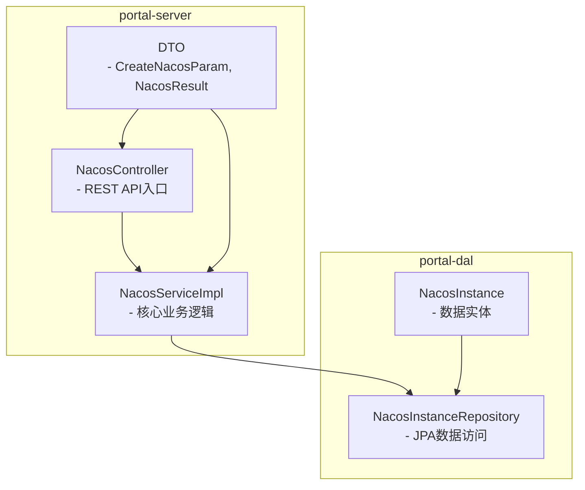
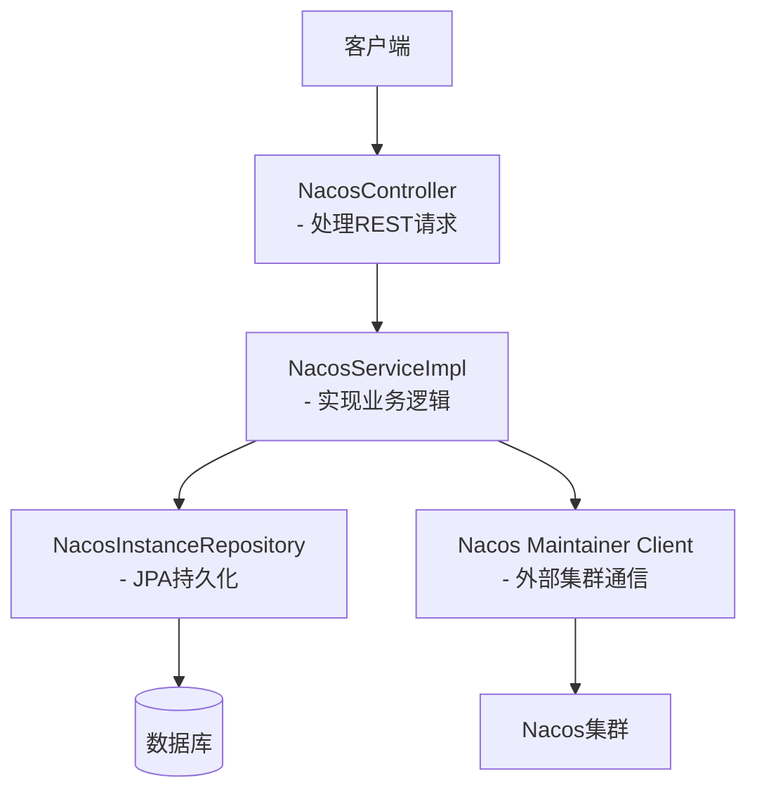
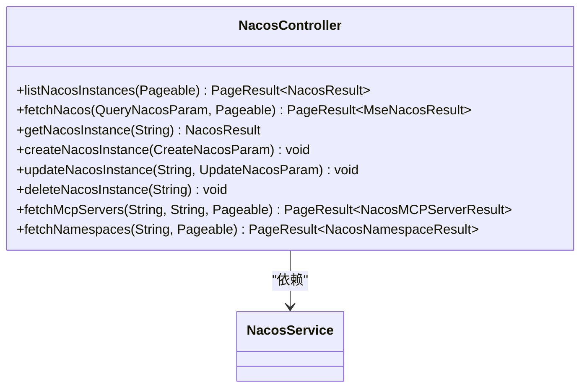
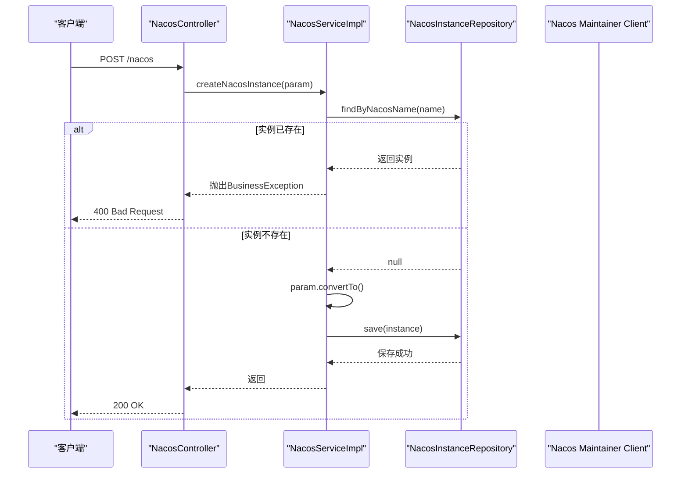
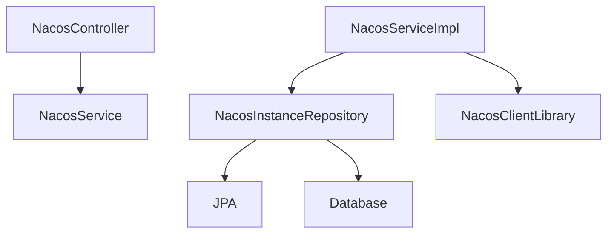
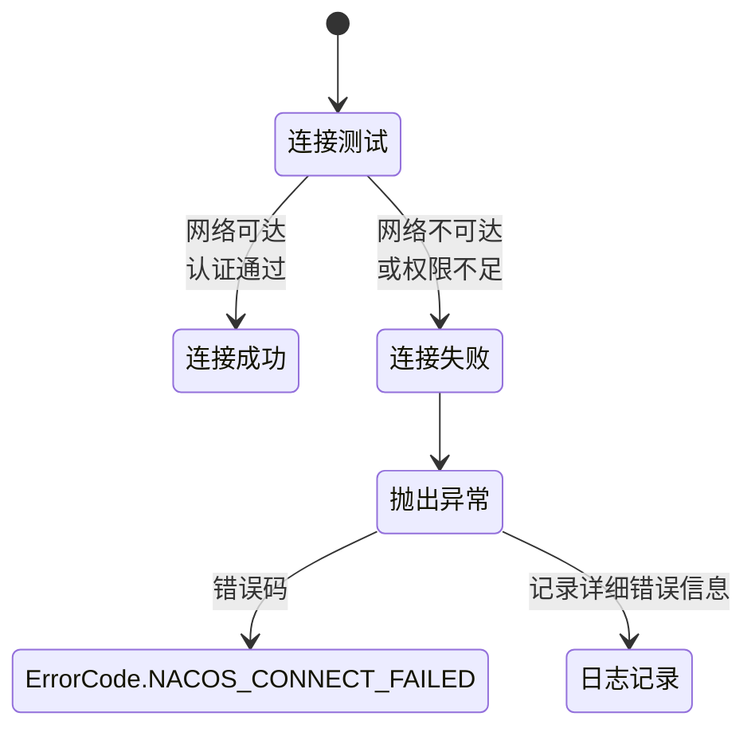

# Nacos集成API

<cite>
**本文档引用文件**   
- [NacosController.java](file://portal-server/src/main/java/com/alibaba/apiopenplatform/controller/NacosController.java)
- [NacosServiceImpl.java](file://portal-server/src/main/java/com/alibaba/apiopenplatform/service/impl/NacosServiceImpl.java)
- [CreateNacosParam.java](file://portal-server/src/main/java/com/alibaba/apiopenplatform/dto/params/nacos/CreateNacosParam.java)
- [NacosResult.java](file://portal-server/src/main/java/com/alibaba/apiopenplatform/dto/result/NacosResult.java)
- [MseNacosResult.java](file://portal-server/src/main/java/com/alibaba/apiopenplatform/dto/result/MseNacosResult.java)
- [NacosInstance.java](file://portal-dal/src/main/java/com/alibaba/apiopenplatform/entity/NacosInstance.java)
- [NacosInstanceRepository.java](file://portal-dal/src/main/java/com/alibaba/apiopenplatform/repository/NacosInstanceRepository.java)
- [ErrorCode.java](file://portal-server/src/main/java/com/alibaba/apiopenplatform/core/exception/ErrorCode.java)
</cite>

## 目录
1. [简介](#简介)
2. [项目结构](#项目结构)
3. [核心组件](#核心组件)
4. [架构概览](#架构概览)
5. [详细组件分析](#详细组件分析)
6. [依赖分析](#依赖分析)
7. [性能考虑](#性能考虑)
8. [故障排除指南](#故障排除指南)
9. [结论](#结论)

## 简介
本文档详细描述了Nacos服务发现系统集成的API接口，重点聚焦于`NacosController`暴露的RESTful端点。文档涵盖创建、查询、更新和删除Nacos实例的完整流程，解释了连接配置的存储与加密机制，并阐述了`NacosServiceImpl`如何通过Nacos API客户端与外部集群交互。同时，提供了完整的调用示例和错误处理策略。

## 项目结构
Nacos集成功能主要分布在`portal-server`和`portal-dal`模块中。`portal-server`包含控制器、服务实现和数据传输对象（DTO），而`portal-dal`负责数据持久化。



**图示来源**
- [NacosController.java](file://portal-server/src/main/java/com/alibaba/apiopenplatform/controller/NacosController.java)
- [NacosServiceImpl.java](file://portal-server/src/main/java/com/alibaba/apiopenplatform/service/impl/NacosServiceImpl.java)
- [NacosInstance.java](file://portal-dal/src/main/java/com/alibaba/apiopenplatform/entity/NacosInstance.java)

**本节来源**
- [NacosController.java](file://portal-server/src/main/java/com/alibaba/apiopenplatform/controller/NacosController.java)
- [NacosInstance.java](file://portal-dal/src/main/java/com/alibaba/apiopenplatform/entity/NacosInstance.java)

## 核心组件
核心组件包括`NacosController`（API入口）、`NacosServiceImpl`（业务逻辑）、`NacosInstance`（数据模型）和`NacosInstanceRepository`（数据访问层）。这些组件共同实现了对Nacos实例的全生命周期管理。

**本节来源**
- [NacosController.java](file://portal-server/src/main/java/com/alibaba/apiopenplatform/controller/NacosController.java)
- [NacosServiceImpl.java](file://portal-server/src/main/java/com/alibaba/apiopenplatform/service/impl/NacosServiceImpl.java)
- [NacosInstance.java](file://portal-dal/src/main/java/com/alibaba/apiopenplatform/entity/NacosInstance.java)
- [NacosInstanceRepository.java](file://portal-dal/src/main/java/com/alibaba/apiopenplatform/repository/NacosInstanceRepository.java)

## 架构概览
系统采用典型的分层架构，从上至下分为控制器层、服务层和数据访问层。`NacosController`接收HTTP请求并调用`NacosServiceImpl`，后者通过`NacosInstanceRepository`操作数据库，并使用Nacos官方客户端与外部Nacos集群通信。



**图示来源**
- [NacosController.java](file://portal-server/src/main/java/com/alibaba/apiopenplatform/controller/NacosController.java)
- [NacosServiceImpl.java](file://portal-server/src/main/java/com/alibaba/apiopenplatform/service/impl/NacosServiceImpl.java)
- [NacosInstanceRepository.java](file://portal-dal/src/main/java/com/alibaba/apiopenplatform/repository/NacosInstanceRepository.java)

## 详细组件分析

### NacosController分析
`NacosController`是Nacos功能的RESTful API入口，提供了对Nacos实例的增删改查操作。

#### REST API接口


**图示来源**
- [NacosController.java](file://portal-server/src/main/java/com/alibaba/apiopenplatform/controller/NacosController.java)

#### API调用流程


**图示来源**
- [NacosController.java](file://portal-server/src/main/java/com/alibaba/apiopenplatform/controller/NacosController.java)
- [NacosServiceImpl.java](file://portal-server/src/main/java/com/alibaba/apiopenplatform/service/impl/NacosServiceImpl.java)

**本节来源**
- [NacosController.java](file://portal-server/src/main/java/com/alibaba/apiopenplatform/controller/NacosController.java)

### NacosServiceImpl分析
`NacosServiceImpl`实现了Nacos相关的所有业务逻辑，包括与数据库和外部Nacos集群的交互。

#### 服务方法调用关系
```mermaid
flowchart TD
A[createNacosInstance] --> B[检查实例名是否已存在]
B --> C{已存在?}
C --> |是| D[抛出RESOURCE_EXIST异常]
C --> |否| E[转换参数为实体]
E --> F[生成或验证nacosId]
F --> G[设置管理员ID]
G --> H[保存到数据库]
I[fetchNamespaces] --> J[查找Nacos实例]
J --> K[构建NamingMaintainerService]
K --> L[调用getNamespaceList()]
L --> M{调用成功?}
M --> |是| N[转换为NacosNamespaceResult]
M --> |否| O[抛出INTERNAL_ERROR异常]
```

**图示来源**
- [NacosServiceImpl.java](file://portal-server/src/main/java/com/alibaba/apiopenplatform/service/impl/NacosServiceImpl.java)

#### 连接配置处理
`NacosServiceImpl`在构建与外部Nacos集群的连接时，会将`NacosInstance`实体中的连接信息（如服务器地址、用户名、密码、AK/SK）转换为Nacos客户端所需的`Properties`对象。

```java
private Properties buildProperties(NacosInstance instance, String namespace) {
    Properties properties = new Properties();
    properties.setProperty(PropertyKeyConst.SERVER_ADDR, instance.getServerUrl());
    if (instance.getUsername() != null) {
        properties.setProperty(PropertyKeyConst.USERNAME, instance.getUsername());
    }
    if (instance.getPassword() != null) {
        properties.setProperty(PropertyKeyConst.PASSWORD, instance.getPassword());
    }
    properties.setProperty(PropertyKeyConst.CONTEXT_PATH, "nacos");
    properties.setProperty(PropertyKeyConst.NAMESPACE, namespace);
    if (instance.getAccessKey() != null) {
        properties.setProperty(PropertyKeyConst.ACCESS_KEY, instance.getAccessKey());
    }
    if (instance.getSecretKey() != null) {
        properties.setProperty(PropertyKeyConst.SECRET_KEY, instance.getSecretKey());
    }
    return properties;
}
```

**本节来源**
- [NacosServiceImpl.java](file://portal-server/src/main/java/com/alibaba/apiopenplatform/service/impl/NacosServiceImpl.java)

### 数据模型分析
`NacosInstance`实体类定义了Nacos实例在数据库中的存储结构。

```mermaid
erDiagram
NacosInstance {
string nacosId PK
string nacosName UK
string serverUrl
string username
string password Encrypted
string accessKey Encrypted
string secretKey Encrypted
string description
string adminId
datetime createAt
}
```

**图示来源**
- [NacosInstance.java](file://portal-dal/src/main/java/com/alibaba/apiopenplatform/entity/NacosInstance.java)

## 依赖分析
系统依赖关系清晰，各层职责分明。`NacosController`依赖`NacosService`接口，`NacosServiceImpl`依赖`NacosInstanceRepository`和Nacos客户端库。



**图示来源**
- [NacosController.java](file://portal-server/src/main/java/com/alibaba/apiopenplatform/controller/NacosController.java)
- [NacosServiceImpl.java](file://portal-server/src/main/java/com/alibaba/apiopenplatform/service/impl/NacosServiceImpl.java)
- [NacosInstanceRepository.java](file://portal-dal/src/main/java/com/alibaba/apiopenplatform/repository/NacosInstanceRepository.java)

**本节来源**
- [NacosController.java](file://portal-server/src/main/java/com/alibaba/apiopenplatform/controller/NacosController.java)
- [NacosServiceImpl.java](file://portal-server/src/main/java/com/alibaba/apiopenplatform/service/impl/NacosServiceImpl.java)
- [NacosInstanceRepository.java](file://portal-dal/src/main/java/com/alibaba/apiopenplatform/repository/NacosInstanceRepository.java)

## 性能考虑
- **连接池**：Nacos客户端内部维护连接池，避免频繁创建销毁连接。
- **分页查询**：所有列表接口均支持分页，防止一次性加载过多数据。
- **缓存机制**：虽然当前代码未显式实现缓存，但Nacos客户端本身具有缓存能力。
- **异步处理**：外部API调用（如MSE）可能耗时，建议在高并发场景下考虑异步化。

## 故障排除指南
### 连接测试与错误处理
当系统无法连接到外部Nacos集群时，会抛出相应的业务异常。

#### 连接失败场景


#### 常见错误码
- **ErrorCode.RESOURCE_NOT_FOUND**：指定的Nacos实例ID不存在。
- **ErrorCode.RESOURCE_EXIST**：尝试创建的Nacos实例名称已存在。
- **ErrorCode.INTERNAL_ERROR**：内部错误，如调用外部API失败。
- **ErrorCode.NACOS_CONNECT_FAILED**：无法连接到Nacos集群（代码中体现为`NacosException`被包装为`INTERNAL_ERROR`）。

#### 恢复建议
1. **检查网络连通性**：确保服务器地址和端口可访问。
2. **验证认证信息**：检查用户名/密码或AK/SK是否正确。
3. **查看日志**：检查`NacosServiceImpl`中的错误日志获取详细信息。
4. **测试外部API**：如果是从MSE获取集群，确保MSE的Region和凭证正确。

**本节来源**
- [NacosServiceImpl.java](file://portal-server/src/main/java/com/alibaba/apiopenplatform/service/impl/NacosServiceImpl.java)
- [ErrorCode.java](file://portal-server/src/main/java/com/alibaba/apiopenplatform/core/exception/ErrorCode.java)

## 结论
本文档全面分析了Nacos集成API的设计与实现。系统通过清晰的分层架构，实现了对Nacos实例的高效管理。`NacosController`提供了标准化的RESTful接口，`NacosServiceImpl`封装了复杂的业务逻辑和外部通信，而数据模型和仓库确保了数据的持久化。该设计具有良好的扩展性和可维护性，为后续功能迭代奠定了坚实基础。