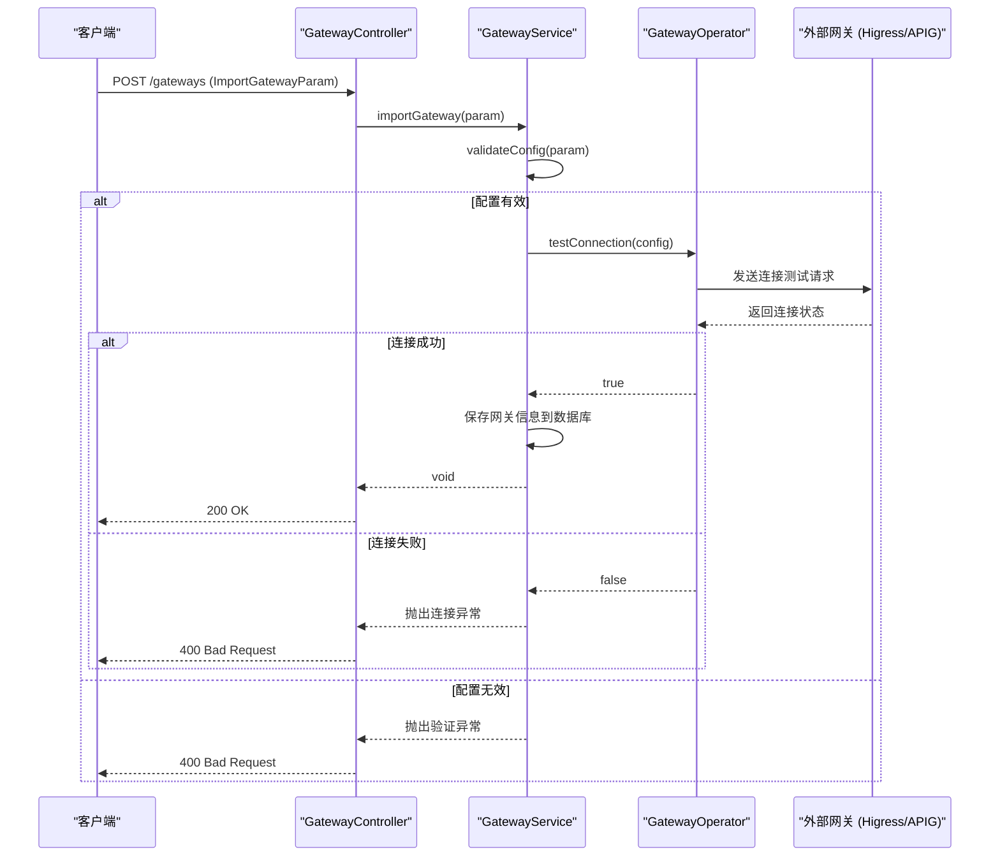

# 外部系统集成API

<cite>
**本文档引用的文件**  
- [GatewayController.java](file://portal-server/src/main/java/com/alibaba/apiopenplatform/controller/GatewayController.java)
- [NacosController.java](file://portal-server/src/main/java/com/alibaba/apiopenplatform/controller/NacosController.java)
- [ImportGatewayParam.java](file://portal-server/src/main/java/com/alibaba/apiopenplatform/dto/params/gateway/ImportGatewayParam.java)
- [CreateNacosParam.java](file://portal-server/src/main/java/com/alibaba/apiopenplatform/dto/params/nacos/CreateNacosParam.java)
- [GatewayOperator.java](file://portal-server/src/main/java/com/alibaba/apiopenplatform/service/gateway/GatewayOperator.java)
- [NacosService.java](file://portal-server/src/main/java/com/alibaba/apiopenplatform/service/NacosService.java)
</cite>

## 目录
1. [简介](#简介)
2. [核心组件概览](#核心组件概览)
3. [网关管理API详解](#网关管理api详解)
4. [Nacos服务发现API详解](#nacos服务发现api详解)
5. [配置参数结构分析](#配置参数结构分析)
6. [外部系统交互机制](#外部系统交互机制)
7. [完整调用示例](#完整调用示例)
8. [配置验证与错误排查](#配置验证与错误排查)

## 简介
本文档详细说明了外部系统集成API的功能，重点涵盖Higress和APIG网关实例的导入与管理，以及MSE Nacos服务发现实例的创建与同步。文档解析了`GatewayController`和`NacosController`中的各个端点，包括其HTTP方法、路径、请求参数和响应结果。同时，解释了不同网关类型的配置差异、连接测试机制、命名空间同步逻辑，以及`GatewayOperator`和`NacosService`如何与外部系统进行交互。

## 核心组件概览

系统通过`GatewayController`和`NacosController`提供RESTful API，用于管理外部网关和Nacos实例。`GatewayService`和`NacosService`作为业务逻辑层，协调数据持久化与外部系统通信。`GatewayOperator`和`NacosService`中的客户端（如`HigressClient`、`APIGClient`）负责与外部API进行实际交互。

**Section sources**
- [GatewayController.java](file://portal-server/src/main/java/com/alibaba/apiopenplatform/controller/GatewayController.java)
- [NacosController.java](file://portal-server/src/main/java/com/alibaba/apiopenplatform/controller/NacosController.java)

## 网关管理API详解

`GatewayController`提供了对Higress和APIG等网关实例的全生命周期管理。

### 端点列表

| HTTP方法 | 路径 | 功能 | 请求参数 |
| :--- | :--- | :--- | :--- |
| `GET` | `/gateways` | 获取已导入的网关列表 | `Pageable` |
| `POST` | `/gateways` | 导入一个新的网关实例 | `ImportGatewayParam` |
| `DELETE` | `/gateways/{gatewayId}` | 删除指定的网关实例 | `gatewayId` (路径参数) |
| `GET` | `/gateways/apig` | 从阿里云获取APIG网关列表 | `QueryAPIGParam` |
| `POST` | `/gateways/adp` | 获取ADP AI网关列表 | `QueryAdpAIGatewayParam` |
| `GET` | `/gateways/{gatewayId}/rest-apis` | 获取指定网关的REST API列表 | `gatewayId` (路径参数) |
| `GET` | `/gateways/{gatewayId}/mcp-servers` | 获取指定网关的MCP Server列表 | `gatewayId` (路径参数) |
| `GET` | `/gateways/{gatewayId}/dashboard` | 获取指定网关的仪表板URL | `gatewayId` (路径参数) |

### 导入网关流程

导入网关的核心是`/gateways`端点的`POST`请求。系统首先通过`GatewayType`判断网关类型，然后验证对应的配置对象（`apigConfig`, `higressConfig`等）是否有效。



**Diagram sources**
- [GatewayController.java](file://portal-server/src/main/java/com/alibaba/apiopenplatform/controller/GatewayController.java#L58-L62)
- [GatewayService.java](file://portal-server/src/main/java/com/alibaba/apiopenplatform/service/GatewayService.java)
- [GatewayOperator.java](file://portal-server/src/main/java/com/alibaba/apiopenplatform/service/gateway/GatewayOperator.java)

**Section sources**
- [GatewayController.java](file://portal-server/src/main/java/com/alibaba/apiopenplatform/controller/GatewayController.java)

## Nacos服务发现API详解

`NacosController`负责管理与Nacos服务发现实例的连接，支持从阿里云MSE获取集群列表和同步服务。

### 端点列表

| HTTP方法 | 路径 | 功能 | 请求参数 |
| :--- | :--- | :--- | :--- |
| `GET` | `/nacos` | 获取已创建的Nacos实例列表 | `Pageable` |
| `POST` | `/nacos` | 创建一个新的Nacos实例 | `CreateNacosParam` |
| `PUT` | `/nacos/{nacosId}` | 更新指定的Nacos实例 | `UpdateNacosParam` |
| `DELETE` | `/nacos/{nacosId}` | 删除指定的Nacos实例 | `nacosId` (路径参数) |
| `GET` | `/nacos/mse` | 从阿里云MSE获取Nacos集群列表 | `QueryNacosParam` |
| `GET` | `/nacos/{nacosId}/mcp-servers` | 获取指定Nacos实例中的MCP Server列表 | `nacosId`, `namespaceId` (可选) |
| `GET` | `/nacos/{nacosId}/namespaces` | 获取指定Nacos实例的命名空间列表 | `nacosId` |

### Nacos命名空间同步逻辑

系统通过`fetchNamespaces`和`fetchMcpServers`端点实现命名空间和服务的同步。当用户请求获取MCP Server时，系统会使用`namespaceId`作为过滤条件，从Nacos实例中拉取对应命名空间下的服务。

```mermaid
flowchart TD
A["客户端: GET /nacos/{nacosId}/mcp-servers?namespaceId=xxx"] --> B[NacosController]
B --> C[NacosService.fetchMcpServers(nacosId, namespaceId)]
C --> D{namespaceId 是否为空?}
D --> |是| E["NacosService: 使用默认命名空间"]
D --> |否| F["NacosService: 使用指定的 namespaceId"]
E --> G[NacosService 调用 NacosClient]
F --> G
G --> H["NacosClient: 向 Nacos 服务器发送 /nacos/v1/ns/service/list 请求"]
H --> I["Nacos服务器返回服务列表"]
I --> J["NacosService: 过滤出 MCP Server 类型的服务"]
J --> K["NacosService: 转换为 NacosMCPServerResult"]
K --> L["NacosController: 返回 PageResult<NacosMCPServerResult>"]
L --> M["客户端"]
```

**Diagram sources**
- [NacosController.java](file://portal-server/src/main/java/com/alibaba/apiopenplatform/controller/NacosController.java#L65-L74)
- [NacosService.java](file://portal-server/src/main/java/com/alibaba/apiopenplatform/service/NacosService.java)
- [NacosClient.java](file://portal-server/src/main/java/com/alibaba/apiopenplatform/service/gateway/client/NacosClient.java) (推断存在)

**Section sources**
- [NacosController.java](file://portal-server/src/main/java/com/alibaba/apiopenplatform/controller/NacosController.java)

## 配置参数结构分析

### ImportGatewayParam (导入网关参数)

该参数对象定义了导入网关所需的所有信息，并通过`isGatewayConfigValid()`方法进行有效性校验。

```java
public class ImportGatewayParam implements InputConverter<Gateway> {
    @NotBlank(message = "网关名称不能为空")
    private String gatewayName; // 网关名称

    private String description; // 描述

    @NotNull(message = "网关类型不能为空")
    private GatewayType gatewayType; // 网关类型 (HIGRESS, APIG, ADP_AI_GATEWAY)

    private String gatewayId; // 网关ID (APIG和ADP AI网关需要)

    private APIGConfig apigConfig; // APIG网关的配置
    private AdpAIGatewayConfig adpAIGatewayConfig; // ADP AI网关的配置
    private HigressConfig higressConfig; // Higress网关的配置

    @AssertTrue(message = "网关配置无效")
    private boolean isGatewayConfigValid() {
        return (gatewayType.isAPIG() && !gatewayType.equals(GatewayType.ADP_AI_GATEWAY) && apigConfig != null && StrUtil.isNotBlank(gatewayId))
                || (gatewayType.equals(GatewayType.ADP_AI_GATEWAY) && adpAIGatewayConfig != null && StrUtil.isNotBlank(gatewayId))
                || (gatewayType.isHigress() && higressConfig != null);
    }
}
```

**关键校验规则**:
- **Higress**: 必须提供`higressConfig`，`gatewayId`非必需。
- **APIG**: 必须提供`apigConfig`和`gatewayId`。
- **ADP AI Gateway**: 必须提供`adpAIGatewayConfig`和`gatewayId`。

**Section sources**
- [ImportGatewayParam.java](file://portal-server/src/main/java/com/alibaba/apiopenplatform/dto/params/gateway/ImportGatewayParam.java)

### CreateNacosParam (创建Nacos参数)

该参数对象用于创建一个新的Nacos实例连接。

```java
public class CreateNacosParam implements InputConverter<NacosInstance> {
    @NotBlank(message = "Nacos名称不能为空")
    private String nacosName; // Nacos实例名称

    @NotBlank(message = "服务器地址不能为空")
    private String serverUrl; // Nacos服务器地址 (e.g., http://nacos-server:8848)

    private String nacosId; // 可选：客户端指定的ID，为空则由服务端生成

    private String username; // 认证用户名
    private String password; // 认证密码
    private String accessKey; // 阿里云AccessKey
    private String secretKey; // 阿里云SecretKey

    private String description; // 描述
}
```

**认证方式**:
系统支持两种认证方式：基础用户名/密码认证和阿里云AccessKey/SecretKey认证。在创建时，应根据Nacos实例的部署环境选择合适的认证方式。

**Section sources**
- [CreateNacosParam.java](file://portal-server/src/main/java/com/alibaba/apiopenplatform/dto/params/nacos/CreateNacosParam.java)

## 外部系统交互机制

### GatewayOperator

`GatewayOperator`是与外部网关交互的核心组件。它根据`GatewayType`动态选择相应的`GatewayClient`（如`HigressClient`或`APIGClient`）来执行具体操作。

- **Higress**: `HigressClient`通过其管理API（如`/api/v1/tenants`）获取租户信息和API列表。
- **APIG**: `APIGClient`调用阿里云API网关的OpenAPI（如`DescribeApis`）来查询API和实例信息。

### NacosService

`NacosService`通过标准的Nacos HTTP API与Nacos服务器通信。
- **服务发现**: 使用`/nacos/v1/ns/service/list`接口获取服务列表。
- **实例查询**: 使用`/nacos/v1/ns/instance/list`接口获取服务下的实例。
- **配置管理**: 使用`/nacos/v1/cs/configs`接口读取和发布配置。

**Section sources**
- [GatewayOperator.java](file://portal-server/src/main/java/com/alibaba/apiopenplatform/service/gateway/GatewayOperator.java)
- [NacosService.java](file://portal-server/src/main/java/com/alibaba/apiopenplatform/service/NacosService.java)

## 完整调用示例

### 示例1: 导入一个Higress实例

**请求**:
```http
POST /gateways
Content-Type: application/json

{
  "gatewayName": "我的Higress网关",
  "description": "生产环境Higress实例",
  "gatewayType": "HIGRESS",
  "higressConfig": {
    "serverUrl": "https://higress-gateway.example.com",
    "username": "admin",
    "password": "secure_password"
  }
}
```

**响应**:
- **成功 (200)**: 无内容，表示导入成功。
- **失败 (400)**: 返回错误信息，如`{"code": "INVALID_CONFIG", "message": "网关配置无效"}`。

### 示例2: 创建一个MSE Nacos实例

**请求**:
```http
POST /nacos
Content-Type: application/json

{
  "nacosName": "MSE Nacos 生产集群",
  "serverUrl": "https://mse-nacos.aliyuncs.com",
  "accessKey": "your_access_key",
  "secretKey": "your_secret_key",
  "description": "阿里云MSE托管的Nacos集群"
}
```

**响应**:
- **成功 (200)**: 无内容，表示创建成功。
- **失败 (400)**: 返回错误信息，如`{"code": "CONNECTION_FAILED", "message": "无法连接到Nacos服务器"}`。

**Section sources**
- [GatewayController.java](file://portal-server/src/main/java/com/alibaba/apiopenplatform/controller/GatewayController.java#L58-L62)
- [NacosController.java](file://portal-server/src/main/java/com/alibaba/apiopenplatform/controller/NacosController.java#L48-L52)

## 配置验证与错误排查

### 常见错误及解决方案

| 错误现象 | 可能原因 | 解决方案 |
| :--- | :--- | :--- |
| 导入网关失败，提示“网关配置无效” | `ImportGatewayParam`中配置对象与`gatewayType`不匹配 | 检查`gatewayType`，确保为Higress时提供了`higressConfig`，为APIG时提供了`apigConfig`和`gatewayId`。 |
| 创建Nacos实例失败，提示“无法连接” | `serverUrl`错误或网络不通 | 检查`serverUrl`是否正确，确认网络可达，防火墙是否放行。 |
| 获取MCP Server列表为空 | Nacos中无MCP服务或命名空间错误 | 登录Nacos控制台，确认目标命名空间下存在`mcp-server`类型的服务。 |
| 获取APIG网关列表为空 | `QueryAPIGParam`参数错误或权限不足 | 检查`QueryAPIGParam`中的地域、AccessKey等参数，确认阿里云账号有API网关的读取权限。 |

### 验证步骤
1.  **检查参数**: 仔细核对`ImportGatewayParam`或`CreateNacosParam`中的所有字段，确保必填项已填写且格式正确。
2.  **测试连接**: 在调用创建/导入API前，可以先使用`GET /gateways/apig`或`GET /nacos/mse`来测试与阿里云API的连通性。
3.  **查看日志**: 检查后端服务日志，`GatewayOperator`和`NacosService`在连接失败时会记录详细的错误信息。
4.  **直接访问**: 尝试使用`curl`或Postman直接访问外部系统的API（如Higress的`/api/v1/tenants`），以隔离问题。

**Section sources**
- [ImportGatewayParam.java](file://portal-server/src/main/java/com/alibaba/apiopenplatform/dto/params/gateway/ImportGatewayParam.java#L50-L60)
- [GatewayOperator.java](file://portal-server/src/main/java/com/alibaba/apiopenplatform/service/gateway/GatewayOperator.java)
- [NacosService.java](file://portal-server/src/main/java/com/alibaba/apiopenplatform/service/NacosService.java)