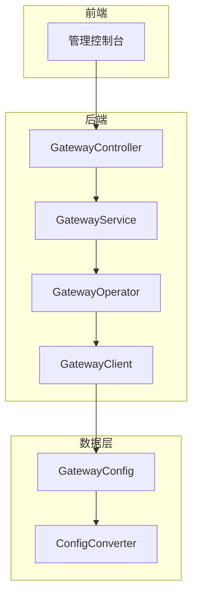
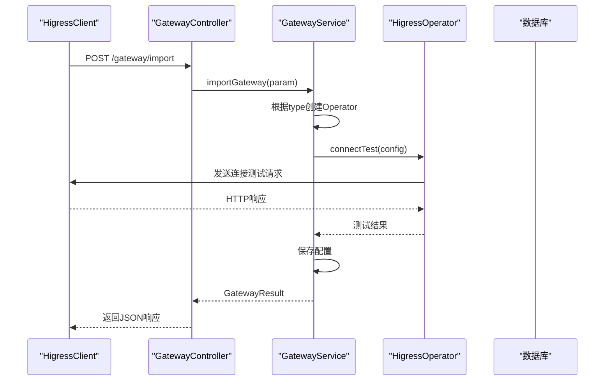
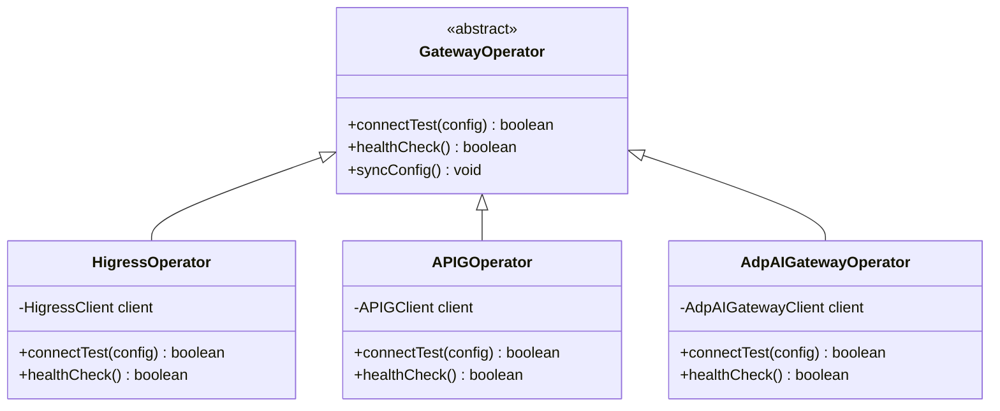
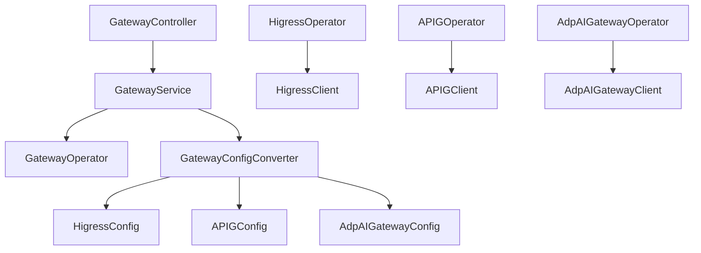

# 网关集成API

<cite>
**本文档引用文件**  
- [GatewayController.java](file://portal-server/src/main/java/com/alibaba/apiopenplatform/controller/GatewayController.java#L1-L200)
- [ImportGatewayParam.java](file://portal-server/src/main/java/com/alibaba/apiopenplatform/dto/params/gateway/ImportGatewayParam.java#L1-L50)
- [GatewayResult.java](file://portal-server/src/main/java/com/alibaba/apiopenplatform/dto/result/GatewayResult.java#L1-L30)
- [GatewayOperator.java](file://portal-server/src/main/java/com/alibaba/apiopenplatform/service/gateway/GatewayOperator.java#L1-L40)
- [HigressOperator.java](file://portal-server/src/main/java/com/alibaba/apiopenplatform/service/gateway/HigressOperator.java#L1-L60)
- [APIGOperator.java](file://portal-server/src/main/java/com/alibaba/apiopenplatform/service/gateway/APIGOperator.java#L1-L60)
- [AdpAIGatewayOperator.java](file://portal-server/src/main/java/com/alibaba/apiopenplatform/service/gateway/AdpAIGatewayOperator.java#L1-L60)
- [HigressConfig.java](file://portal-dal/src/main/java/com/alibaba/apiopenplatform/support/gateway/HigressConfig.java#L1-L50)
- [APIGConfig.java](file://portal-dal/src/main/java/com/alibaba/apiopenplatform/support/gateway/APIGConfig.java#L1-L50)
- [AdpAIGatewayConfig.java](file://portal-dal/src/main/java/com/alibaba/apiopenplatform/support/gateway/AdpAIGatewayConfig.java#L1-L50)
- [HigressConfigConverter.java](file://portal-dal/src/main/java/com/alibaba/apiopenplatform/converter/HigressConfigConverter.java#L1-L40)
- [APIGConfigConverter.java](file://portal-dal/src/main/java/com/alibaba/apiopenplatform/converter/APIGConfigConverter.java#L1-L40)
- [AdpAIGatewayConfigConverter.java](file://portal-dal/src/main/java/com/alibaba/apiopenplatform/converter/AdpAIGatewayConfigConverter.java#L1-L40)
- [GatewayClient.java](file://portal-server/src/main/java/com/alibaba/apiopenplatform/service/gateway/client/GatewayClient.java#L1-L30)
- [HigressClient.java](file://portal-server/src/main/java/com/alibaba/apiopenplatform/service/gateway/client/HigressClient.java#L1-L50)
</cite>

## 目录
1. [简介](#简介)
2. [项目结构](#项目结构)
3. [核心组件](#核心组件)
4. [架构概览](#架构概览)
5. [详细组件分析](#详细组件分析)
6. [依赖关系分析](#依赖关系分析)
7. [性能考量](#性能考量)
8. [故障排查指南](#故障排查指南)
9. [结论](#结论)

## 简介
本文档详细描述了“网关集成API”的设计与实现，重点聚焦于Higress、APIG和ADP AI网关的导入、管理与通信机制。系统通过统一的REST接口支持多种网关类型的集成，涵盖配置、认证、连接测试、健康检查及生命周期管理。文档将深入分析`GatewayController`中的REST端点、请求参数结构（如`ImportGatewayParam`）、响应模型（如`GatewayResult`），并解析`GatewayOperator`抽象层及其子类如何实现不同网关的适配逻辑。

## 项目结构
项目采用典型的分层架构，主要模块包括：
- `portal-server`：核心业务逻辑与REST API控制器
- `portal-dal`：数据访问层，包含实体、转换器与配置类
- `portal-web`：前后端分离的管理界面
- `deploy`：Docker与Helm部署配置

网关相关功能集中在`portal-server`和`portal-dal`模块中，遵循MVC模式，控制器调用服务层，服务层通过操作符（Operator）与具体网关客户端通信。



**图示来源**
- [GatewayController.java](file://portal-server/src/main/java/com/alibaba/apiopenplatform/controller/GatewayController.java#L1-L20)
- [GatewayOperator.java](file://portal-server/src/main/java/com/alibaba/apiopenplatform/service/gateway/GatewayOperator.java#L1-L10)
- [HigressConfig.java](file://portal-dal/src/main/java/com/alibaba/apiopenplatform/support/gateway/HigressConfig.java#L1-L10)

**本节来源**
- [GatewayController.java](file://portal-server/src/main/java/com/alibaba/apiopenplatform/controller/GatewayController.java#L1-L50)

## 核心组件
核心组件包括：
- `GatewayController`：提供REST API入口
- `ImportGatewayParam`：定义导入网关的请求参数
- `GatewayResult`：定义API响应结构
- `GatewayOperator`及其子类：实现网关操作的抽象与具体逻辑
- `GatewayConfig`及其子类：存储网关配置数据
- `ConfigConverter`：在DTO与实体间进行数据转换

这些组件共同构成了网关集成的核心功能链路。

**本节来源**
- [ImportGatewayParam.java](file://portal-server/src/main/java/com/alibaba/apiopenplatform/dto/params/gateway/ImportGatewayParam.java#L1-L20)
- [GatewayResult.java](file://portal-server/src/main/java/com/alibaba/apiopenplatform/dto/result/GatewayResult.java#L1-L20)
- [HigressConfig.java](file://portal-dal/src/main/java/com/alibaba/apiopenplatform/support/gateway/HigressConfig.java#L1-L20)

## 架构概览
系统采用分层与策略模式结合的设计。`GatewayController`接收HTTP请求，经由`GatewayService`调度至具体的`GatewayOperator`实现。每个`Operator`负责与特定网关（如Higress、APIG）通信，通过`GatewayClient`执行HTTP调用，并利用`ConfigConverter`完成数据持久化。



**图示来源**
- [GatewayController.java](file://portal-server/src/main/java/com/alibaba/apiopenplatform/controller/GatewayController.java#L30-L50)
- [GatewayService.java](file://portal-server/src/main/java/com/alibaba/apiopenplatform/service/impl/GatewayServiceImpl.java#L20-L40)
- [HigressOperator.java](file://portal-server/src/main/java/com/alibaba/apiopenplatform/service/gateway/HigressOperator.java#L15-L30)

## 详细组件分析

### GatewayController分析
`GatewayController`是网关管理功能的REST API入口，主要端点如下：

#### 导入网关
- **HTTP方法**: POST
- **URL路径**: `/gateway/import`
- **请求参数**: `ImportGatewayParam`
- **响应结构**: `GatewayResult`

```java
@PostMapping("/import")
public Response<GatewayResult> importGateway(@RequestBody ImportGatewayParam param) {
    return gatewayService.importGateway(param);
}
```

#### 查询网关列表
- **HTTP方法**: GET
- **URL路径**: `/gateway/list`
- **响应结构**: `PageResult<GatewayResult>`

#### 删除网关
- **HTTP方法**: DELETE
- **URL路径**: `/gateway/{id}`
- **路径参数**: `id` (网关实例ID)

**本节来源**
- [GatewayController.java](file://portal-server/src/main/java/com/alibaba/apiopenplatform/controller/GatewayController.java#L30-L100)

### ImportGatewayParam与GatewayResult分析
`ImportGatewayParam`是导入网关的请求数据传输对象（DTO），其结构根据`type`字段动态变化。

#### ImportGatewayParam结构
```json
{
  "name": "higress-test",
  "type": "HIGRESS",
  "config": {
    "address": "https://higress-gateway.example.com",
    "token": "xxxx-xxxx-xxxx"
  }
}
```

或用于APIG：
```json
{
  "name": "apig-test",
  "type": "APIG",
  "config": {
    "endpoint": "https://apig.aliyuncs.com",
    "regionId": "cn-hangzhou",
    "accessKey": "LTAIxxxx",
    "secretKey": "xxxx"
  }
}
```

`GatewayResult`为响应结构，包含网关基本信息与状态。

#### GatewayResult示例
```json
{
  "id": "gw-123",
  "name": "higress-test",
  "type": "HIGRESS",
  "status": "ACTIVE",
  "createdAt": "2023-01-01T00:00:00Z"
}
```

**本节来源**
- [ImportGatewayParam.java](file://portal-server/src/main/java/com/alibaba/apiopenplatform/dto/params/gateway/ImportGatewayParam.java#L1-L50)
- [GatewayResult.java](file://portal-server/src/main/java/com/alibaba/apiopenplatform/dto/result/GatewayResult.java#L1-L30)

### GatewayOperator抽象层分析
`GatewayOperator`是网关操作的抽象基类，定义了所有网关必须实现的核心方法。

#### 类图


**图示来源**
- [GatewayOperator.java](file://portal-server/src/main/java/com/alibaba/apiopenplatform/service/gateway/GatewayOperator.java#L1-L40)
- [HigressOperator.java](file://portal-server/src/main/java/com/alibaba/apiopenplatform/service/gateway/HigressOperator.java#L1-L20)
- [APIGOperator.java](file://portal-server/src/main/java/com/alibaba/apiopenplatform/service/gateway/APIGOperator.java#L1-L20)

#### 配置参数差异
不同网关类型的`config`参数结构不同：

| 网关类型 | 配置参数 | 认证方式 |
|--------|--------|--------|
| Higress | address, token | Bearer Token |
| APIG | endpoint, regionId, accessKey, secretKey | AK/SK签名 |
| ADP AI | serverUrl, apiKey | API Key |

**本节来源**
- [HigressConfig.java](file://portal-dal/src/main/java/com/alibaba/apiopenplatform/support/gateway/HigressConfig.java#L1-L30)
- [APIGConfig.java](file://portal-dal/src/main/java/com/alibaba/apiopenplatform/support/gateway/APIGConfig.java#L1-L30)
- [AdpAIGatewayConfig.java](file://portal-dal/src/main/java/com/alibaba/apiopenplatform/support/gateway/AdpAIGatewayConfig.java#L1-L30)

### 连接测试与健康检查
`connectTest`方法在导入时验证网关可达性与凭证有效性。`healthCheck`由后台定时任务调用，监控网关状态。

```java
public boolean connectTest(GatewayConfig config) {
    try {
        HttpResponse response = client.get("/health");
        return response.getStatusCode() == 200;
    } catch (Exception e) {
        log.error("连接测试失败", e);
        return false;
    }
}
```

**本节来源**
- [HigressOperator.java](file://portal-server/src/main/java/com/alibaba/apiopenplatform/service/gateway/HigressOperator.java#L25-L40)
- [APIGOperator.java](file://portal-server/src/main/java/com/alibaba/apiopenplatform/service/gateway/APIGOperator.java#L25-L40)

## 依赖关系分析
系统依赖关系清晰，各层职责分明。



**图示来源**
- [GatewayService.java](file://portal-server/src/main/java/com/alibaba/apiopenplatform/service/impl/GatewayServiceImpl.java#L10-L20)
- [HigressConfigConverter.java](file://portal-dal/src/main/java/com/alibaba/apiopenplatform/converter/HigressConfigConverter.java#L1-L10)
- [APIGConfigConverter.java](file://portal-dal/src/main/java/com/alibaba/apiopenplatform/converter/APIGConfigConverter.java#L1-L10)

**本节来源**
- [GatewayService.java](file://portal-server/src/main/java/com/alibaba/apiopenplatform/service/impl/GatewayServiceImpl.java#L1-L50)

## 性能考量
- **连接池**：`HTTPClientFactory`复用HTTP连接，减少握手开销。
- **异步处理**：部分操作（如配置同步）可异步执行，避免阻塞主线程。
- **缓存**：网关元数据可缓存，减少重复查询数据库。

## 故障排查指南
### 配置验证失败常见原因
1. **网络不通**：检查网关`address`或`endpoint`是否可达。
2. **凭证错误**：确认AK/SK、Token或API Key正确无误。
3. **权限不足**：确保凭证具有足够的API调用权限。
4. **SSL问题**：若使用自签名证书，需配置信任。

### 排查方法
1. 使用`curl`手动测试网关健康接口。
2. 查看服务日志中的`connectTest`异常堆栈。
3. 验证数据库中`gateway`表的记录是否正确。

### 实例管理
- **更新**：通过`PUT /gateway/{id}`更新配置，触发重新连接测试。
- **删除**：`DELETE /gateway/{id}`移除实例，关联数据一并清理。
- **状态同步**：后台定时任务定期调用`healthCheck`更新`status`字段。

**本节来源**
- [GatewayController.java](file://portal-server/src/main/java/com/alibaba/apiopenplatform/controller/GatewayController.java#L101-L150)
- [GatewayServiceImpl.java](file://portal-server/src/main/java/com/alibaba/apiopenplatform/service/impl/GatewayServiceImpl.java#L80-L120)

## 结论
本文档全面解析了网关集成API的设计与实现。系统通过`GatewayController`暴露REST接口，利用`GatewayOperator`策略模式实现多网关适配，确保了扩展性与维护性。开发者可参考本文档理解API用法、排查集成问题，并基于现有架构扩展新的网关类型。