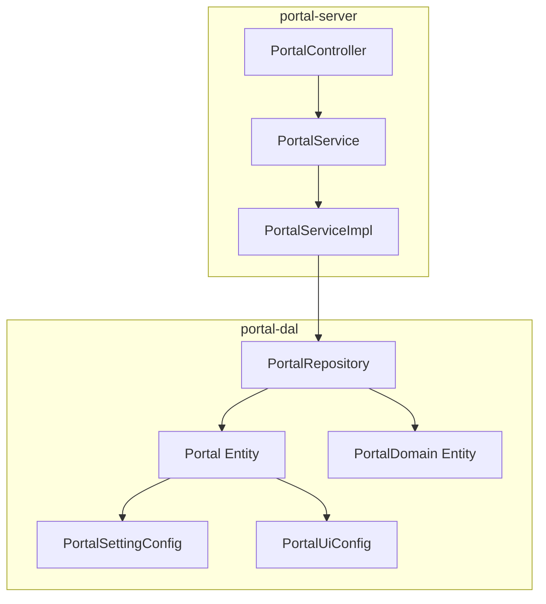
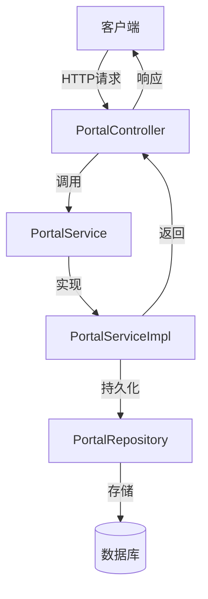
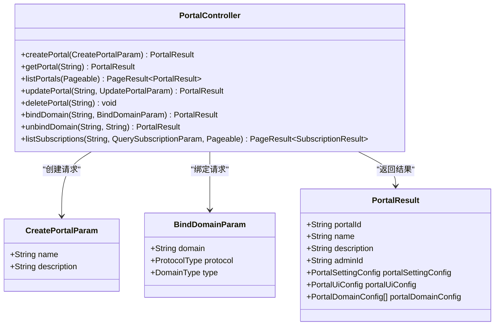
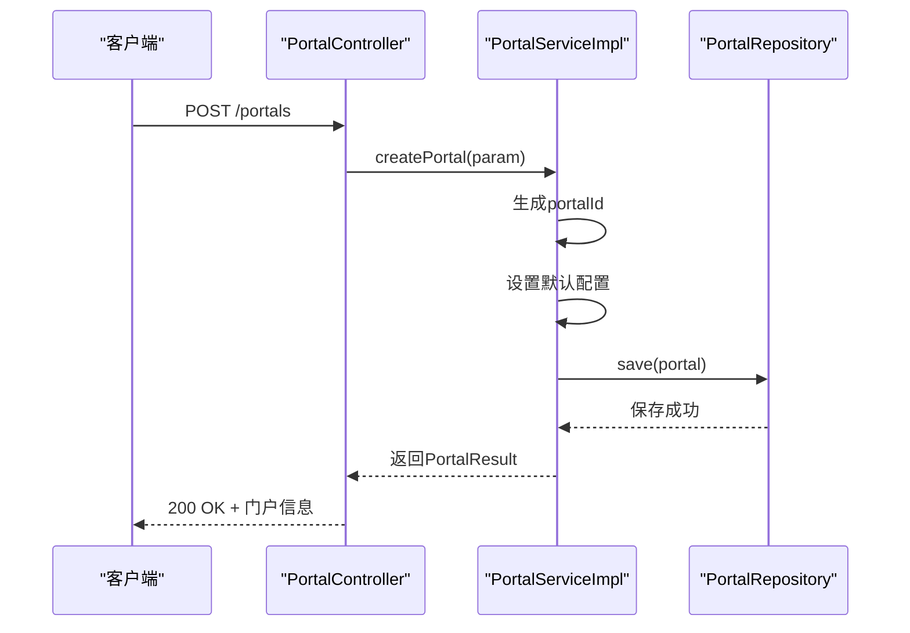
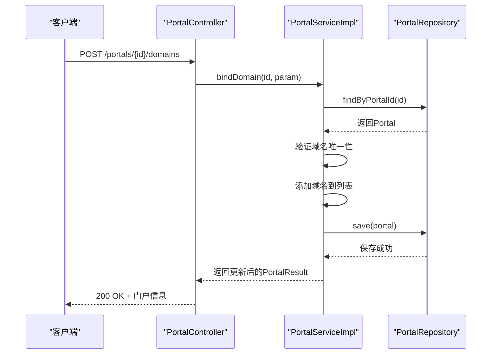
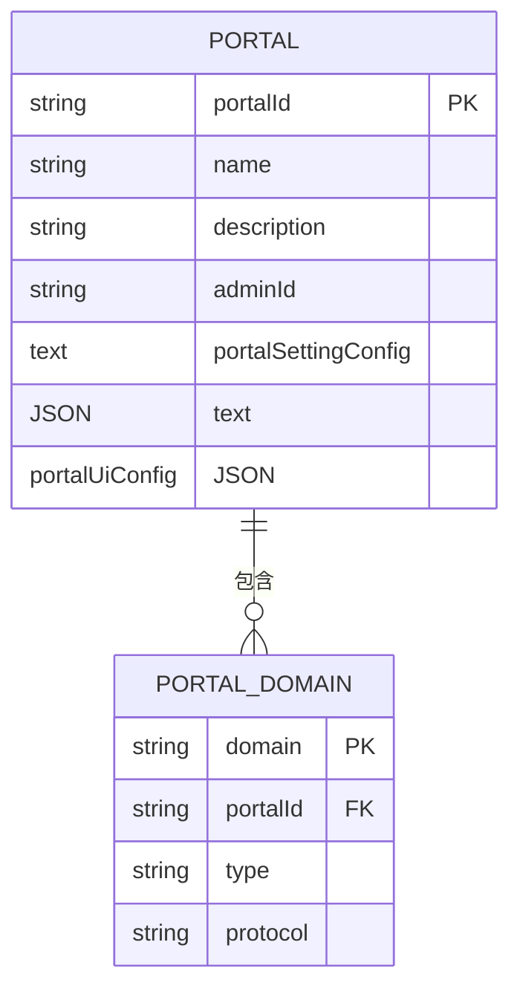
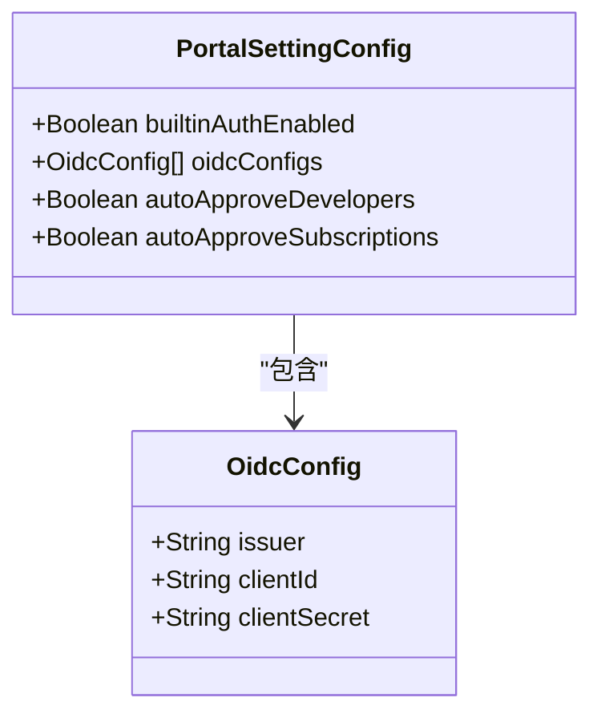
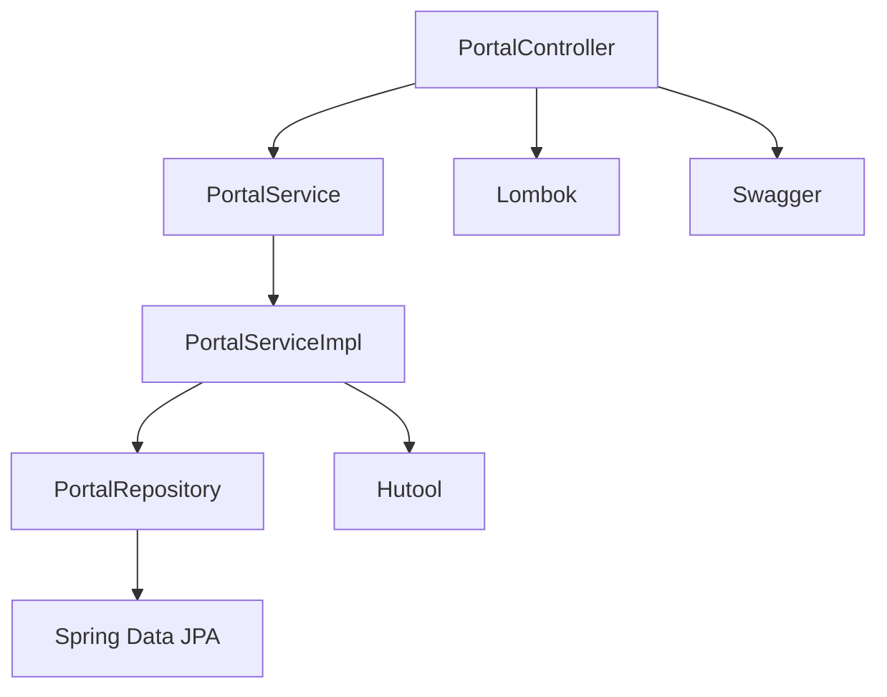

# 多租户门户管理API

<cite>
**本文档引用的文件**  
- [PortalController.java](file://portal-server/src/main/java/com/alibaba/apiopenplatform/controller/PortalController.java)
- [CreatePortalParam.java](file://portal-server/src/main/java/com/alibaba/apiopenplatform/dto/params/portal/CreatePortalParam.java)
- [BindDomainParam.java](file://portal-server/src/main/java/com/alibaba/apiopenplatform/dto/params/portal/BindDomainParam.java)
- [PortalResult.java](file://portal-server/src/main/java/com/alibaba/apiopenplatform/dto/result/PortalResult.java)
- [PortalSettingConfig.java](file://portal-dal/src/main/java/com/alibaba/apiopenplatform/support/portal/PortalSettingConfig.java)
- [PortalUiConfig.java](file://portal-dal/src/main/java/com/alibaba/apiopenplatform/support/portal/PortalUiConfig.java)
- [PortalRepository.java](file://portal-dal/src/main/java/com/alibaba/apiopenplatform/repository/PortalRepository.java)
- [PortalServiceImpl.java](file://portal-server/src/main/java/com/alibaba/apiopenplatform/service/impl/PortalServiceImpl.java)
</cite>

## 目录
1. [简介](#简介)
2. [项目结构](#项目结构)
3. [核心组件](#核心组件)
4. [架构概览](#架构概览)
5. [详细组件分析](#详细组件分析)
6. [依赖分析](#依赖分析)
7. [性能考虑](#性能考虑)
8. [故障排除指南](#故障排除指南)
9. [结论](#结论)

## 简介
本文档详细描述了多租户门户管理API的核心功能，重点围绕`PortalController`提供的REST接口展开。该系统支持创建和管理多个独立的门户实例，每个门户可绑定自定义域名，并配置独立的UI和认证设置。文档涵盖门户创建、域名绑定、配置持久化机制，并提供实际调用示例。

## 项目结构
本项目采用典型的分层微服务架构，主要模块包括：
- `portal-bootstrap`：应用启动与配置模块
- `portal-dal`：数据访问层，包含实体、仓库和转换器
- `portal-server`：核心业务逻辑与API控制器
- `portal-web`：前后端分离的管理界面

门户管理功能主要集中在`portal-server`模块的`controller`和`service`包中，数据模型定义在`portal-dal`中。



**图示来源**
- [PortalController.java](file://portal-server/src/main/java/com/alibaba/apiopenplatform/controller/PortalController.java)
- [PortalServiceImpl.java](file://portal-server/src/main/java/com/alibaba/apiopenplatform/service/impl/PortalServiceImpl.java)
- [PortalRepository.java](file://portal-dal/src/main/java/com/alibaba/apiopenplatform/repository/PortalRepository.java)

## 核心组件
门户管理的核心组件包括：
- `PortalController`：提供HTTP REST接口
- `PortalService`：定义业务接口
- `PortalServiceImpl`：实现具体业务逻辑
- `PortalRepository`：负责数据持久化
- `Portal`实体：代表一个门户实例
- `PortalDomain`：关联门户与域名
- `PortalSettingConfig` 和 `PortalUiConfig`：存储门户的配置信息

这些组件共同实现了门户的全生命周期管理。

**节来源**
- [PortalController.java](file://portal-server/src/main/java/com/alibaba/apiopenplatform/controller/PortalController.java)
- [PortalServiceImpl.java](file://portal-server/src/main/java/com/alibaba/apiopenplatform/service/impl/PortalServiceImpl.java)

## 架构概览
系统采用Spring Boot构建，通过分层架构实现关注点分离。API控制器接收请求，服务层处理业务逻辑，数据访问层与数据库交互。门户的隔离通过`portalId`实现，每个门户拥有独立的配置和域名。



**图示来源**
- [PortalController.java](file://portal-server/src/main/java/com/alibaba/apiopenplatform/controller/PortalController.java)
- [PortalServiceImpl.java](file://portal-server/src/main/java/com/alibaba/apiopenplatform/service/impl/PortalServiceImpl.java)
- [PortalRepository.java](file://portal-dal/src/main/java/com/alibaba/apiopenplatform/repository/PortalRepository.java)

## 详细组件分析

### PortalController 分析
`PortalController`是门户管理的API入口，提供7个REST端点，均需管理员权限（`@AdminAuth`）。

#### API端点详情


**图示来源**
- [PortalController.java](file://portal-server/src/main/java/com/alibaba/apiopenplatform/controller/PortalController.java)
- [CreatePortalParam.java](file://portal-server/src/main/java/com/alibaba/apiopenplatform/dto/params/portal/CreatePortalParam.java)
- [BindDomainParam.java](file://portal-server/src/main/java/com/alibaba/apiopenplatform/dto/params/portal/BindDomainParam.java)
- [PortalResult.java](file://portal-server/src/main/java/com/alibaba/apiopenplatform/dto/result/PortalResult.java)

#### 创建门户流程


**图示来源**
- [PortalController.java](file://portal-server/src/main/java/com/alibaba/apiopenplatform/controller/PortalController.java#L25-L30)
- [PortalServiceImpl.java](file://portal-server/src/main/java/com/alibaba/apiopenplatform/service/impl/PortalServiceImpl.java#L45-L60)

#### 绑定域名流程


**图示来源**
- [PortalController.java](file://portal-server/src/main/java/com/alibaba/apiopenplatform/controller/PortalController.java#L65-L70)
- [PortalServiceImpl.java](file://portal-server/src/main/java/com/alibaba/apiopenplatform/service/impl/PortalServiceImpl.java#L85-L100)

### 配置持久化机制
门户的配置信息通过嵌套对象持久化到数据库。



**图示来源**
- [Portal.java](file://portal-dal/src/main/java/com/alibaba/apiopenplatform/entity/Portal.java)
- [PortalDomain.java](file://portal-dal/src/main/java/com/alibaba/apiopenplatform/entity/PortalDomain.java)

#### 门户设置配置
`PortalSettingConfig`类定义了门户的认证和审批策略。



**图示来源**
- [PortalSettingConfig.java](file://portal-dal/src/main/java/com/alibaba/apiopenplatform/support/portal/PortalSettingConfig.java)
- [OidcConfig.java](file://portal-dal/src/main/java/com/alibaba/apiopenplatform/support/portal/OidcConfig.java)

## 依赖分析
门户管理模块依赖于以下核心组件：
- Spring Web：提供REST支持
- Spring Data JPA：数据持久化
- Lombok：减少样板代码
- Hutool：工具类库
- Swagger：API文档



**图示来源**
- [PortalController.java](file://portal-server/src/main/java/com/alibaba/apiopenplatform/controller/PortalController.java)
- [pom.xml](file://portal-server/pom.xml)

## 性能考虑
- 门户查询使用分页（`Pageable`），避免大数据集加载
- 域名绑定时验证唯一性，防止重复数据
- 配置信息以JSON格式存储，减少表关联
- 使用`@Validated`进行请求参数校验，提前拦截无效请求

## 故障排除指南
常见问题及解决方案：
- **创建门户失败**：检查`name`字段是否为空或超过50字符
- **绑定域名失败**：确认域名未被其他门户占用
- **403权限错误**：确保请求携带有效的管理员JWT令牌
- **500服务器错误**：检查数据库连接和实体映射

**节来源**
- [PortalController.java](file://portal-server/src/main/java/com/alibaba/apiopenplatform/controller/PortalController.java)
- [PortalServiceImpl.java](file://portal-server/src/main/java/com/alibaba/apiopenplatform/service/impl/PortalServiceImpl.java)

## 结论
多租户门户管理API提供了一套完整的门户生命周期管理功能。通过清晰的分层架构和RESTful设计，实现了门户创建、域名绑定和配置管理。系统支持灵活的认证配置和UI定制，适用于多租户SaaS场景。建议在生产环境中配合API网关实现域名路由，确保请求正确转发到对应门户实例。

### 使用示例
创建新门户并绑定域名的curl命令：

```bash
# 创建门户
curl -X POST http://localhost:8080/portals \
  -H "Content-Type: application/json" \
  -H "Authorization: Bearer <admin_token>" \
  -d '{
    "name": "开发者门户",
    "description": "阿里云API开发者门户"
}'

# 响应示例
{
  "portalId": "p-12345",
  "name": "开发者门户",
  "description": "阿里云API开发者门户",
  "adminId": "admin-001",
  "portalSettingConfig": {
    "builtinAuthEnabled": true,
    "autoApproveDevelopers": false,
    "autoApproveSubscriptions": true
  },
  "portalDomainConfig": []
}

# 绑定自定义域名
curl -X POST http://localhost:8080/portals/p-12345/domains \
  -H "Content-Type: application/json" \
  -H "Authorization: Bearer <admin_token>" \
  -d '{
    "domain": "api.example.com",
    "protocol": "HTTPS",
    "type": "CUSTOM"
}'
```

门户创建后，可通过`/portals/{portalId}`端点获取实例信息，并使用`PUT`请求更新`portalSettingConfig`和`portalUiConfig`进行初始化配置。