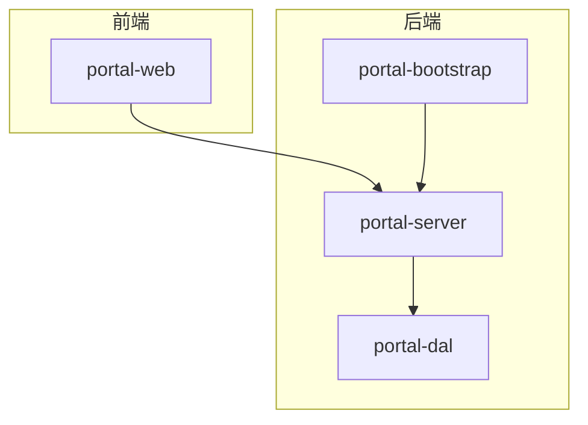
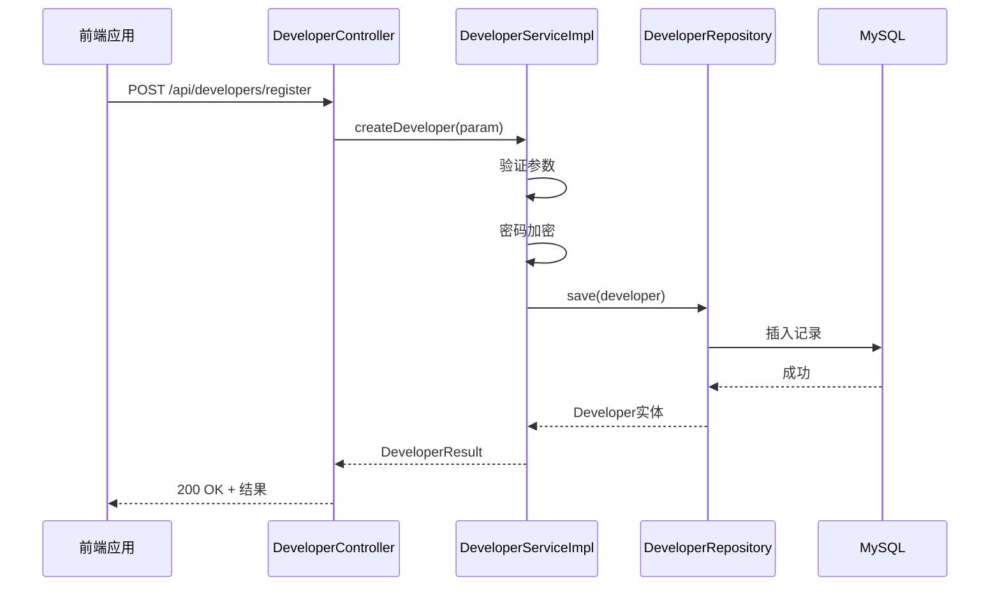
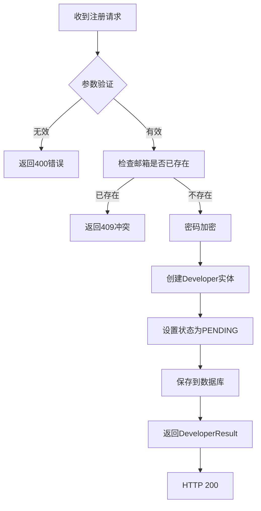
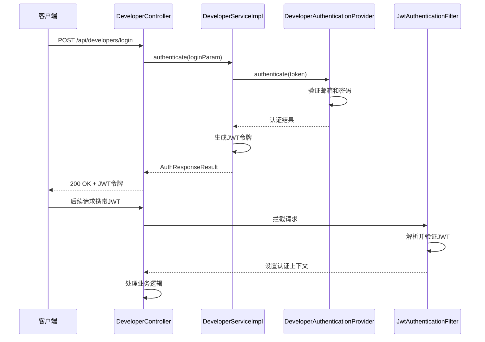
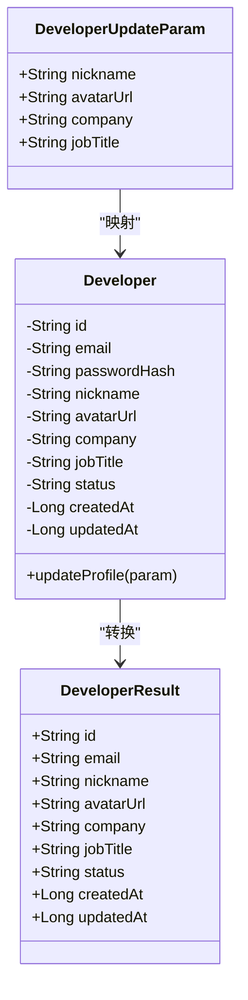
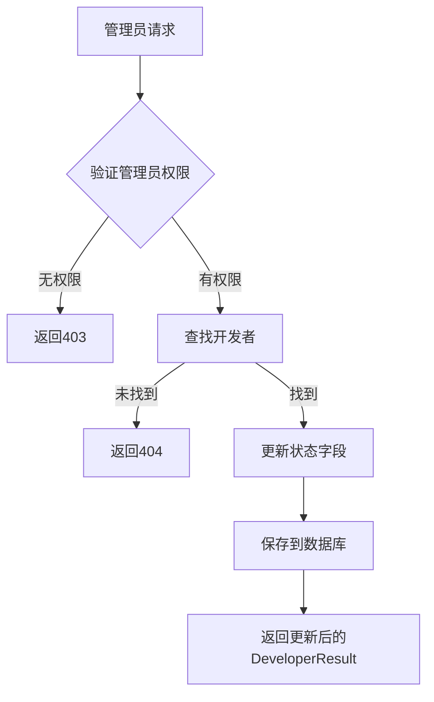
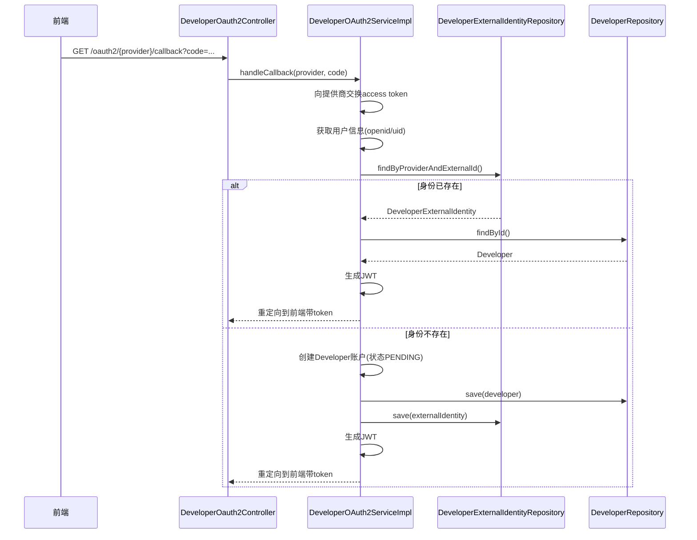
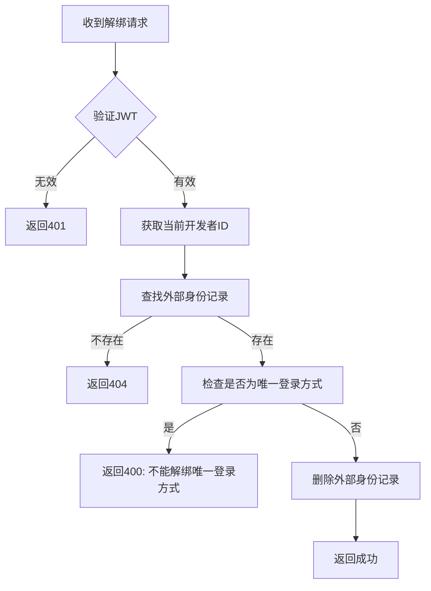
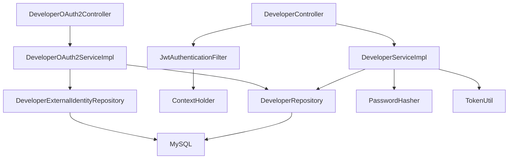

# 开发者管理API

<cite>
**本文档引用文件**  
- [DeveloperController.java](file://portal-server/src/main/java/com/alibaba/apiopenplatform/controller/DeveloperController.java#L1-L300)
- [DeveloperOAuth2Controller.java](file://portal-server/src/main/java/com/alibaba/apiopenplatform/controller/DeveloperOauth2Controller.java#L1-L200)
- [DeveloperServiceImpl.java](file://portal-server/src/main/java/com/alibaba/apiopenplatform/service/impl/DeveloperServiceImpl.java#L1-L500)
- [DeveloperOAuth2ServiceImpl.java](file://portal-server/src/main/java/com/alibaba/apiopenplatform/service/impl/DeveloperOAuth2ServiceImpl.java#L1-L400)
- [DeveloperCreateParam.java](file://portal-server/src/main/java/com/alibaba/apiopenplatform/dto/params/developer/DeveloperCreateParam.java#L1-L50)
- [DeveloperLoginParam.java](file://portal-server/src/main/java/com/alibaba/apiopenplatform/dto/params/developer/DeveloperLoginParam.java#L1-L40)
- [UpdateDeveloperProfileParam.java](file://portal-server/src/main/java/com/alibaba/apiopenplatform/dto/params/developer/UpdateDeveloperProfileParam.java#L1-L60)
- [DeveloperStatusParam.java](file://portal-server/src/main/java/com/alibaba/apiopenplatform/dto/params/developer/DeveloperStatusParam.java#L1-L30)
- [UnbindExternalIdentityParam.java](file://portal-server/src/main/java/com/alibaba/apiopenplatform/dto/params/developer/UnbindExternalIdentityParam.java#L1-L30)
- [DeveloperResult.java](file://portal-server/src/main/java/com/alibaba/apiopenplatform/dto/result/DeveloperResult.java#L1-L100)
- [Developer.java](file://portal-dal/src/main/java/com/alibaba/apiopenplatform/entity/Developer.java#L1-L150)
- [DeveloperExternalIdentity.java](file://portal-dal/src/main/java/com/alibaba/apiopenplatform/entity/DeveloperExternalIdentity.java#L1-L80)
- [DeveloperRepository.java](file://portal-dal/src/main/java/com/alibaba/apiopenplatform/repository/DeveloperRepository.java#L1-L100)
- [DeveloperExternalIdentityRepository.java](file://portal-dal/src/main/java/com/alibaba/apiopenplatform/repository/DeveloperExternalIdentityRepository.java#L1-L90)
- [JwtAuthenticationFilter.java](file://portal-server/src/main/java/com/alibaba/apiopenplatform/core/security/JwtAuthenticationFilter.java#L1-L120)
- [ContextHolder.java](file://portal-server/src/main/java/com/alibaba/apiopenplatform/core/security/ContextHolder.java#L1-L60)
- [DeveloperStatus.java](file://portal-dal/src/main/java/com/alibaba/apiopenplatform/support/enums/DeveloperStatus.java#L1-L40)
</cite>

## 目录
1. [简介](#简介)
2. [项目结构](#项目结构)
3. [核心组件](#核心组件)
4. [架构概览](#架构概览)
5. [详细组件分析](#详细组件分析)
6. [依赖分析](#依赖分析)
7. [性能考量](#性能考量)
8. [故障排查指南](#故障排查指南)
9. [结论](#结论)

## 简介
HiMarket开发者管理API为平台提供完整的开发者生命周期管理功能，涵盖注册、登录、资料更新、状态管理及第三方OAuth2登录集成。本API基于Spring Boot构建，采用JWT进行身份认证，并支持与阿里云、Google、GitHub等平台的OAuth2集成。开发者账户需经管理员审批后方可访问受保护资源，确保平台安全性。

## 项目结构
HiMarket项目采用典型的分层微服务架构，主要分为`portal-bootstrap`（启动模块）、`portal-dal`（数据访问层）、`portal-server`（业务逻辑层）和`portal-web`（前端模块）。开发者管理功能的核心逻辑位于`portal-server`的`controller`和`service`包中，数据模型定义于`portal-dal`的`entity`包。

**图示来源**
- [DeveloperController.java](file://portal-server/src/main/java/com/alibaba/apiopenplatform/controller/DeveloperController.java#L1-L300)
- [Developer.java](file://portal-dal/src/main/java/com/alibaba/apiopenplatform/entity/Developer.java#L1-L150)

**本节来源**
- [DeveloperController.java](file://portal-server/src/main/java/com/alibaba/apiopenplatform/controller/DeveloperController.java#L1-L300)
- [Developer.java](file://portal-dal/src/main/java/com/alibaba/apiopenplatform/entity/Developer.java#L1-L150)

## 核心组件
开发者管理API的核心组件包括：
- **DeveloperController**：处理所有开发者相关的HTTP请求
- **DeveloperServiceImpl**：实现开发者业务逻辑，如注册、登录、资料更新
- **DeveloperOAuth2ServiceImpl**：处理OAuth2第三方登录及身份绑定
- **DeveloperResult**：统一的开发者信息返回结构
- **DeveloperStatus**：定义开发者账户状态枚举

这些组件协同工作，提供完整的开发者管理功能。

**本节来源**
- [DeveloperController.java](file://portal-server/src/main/java/com/alibaba/apiopenplatform/controller/DeveloperController.java#L1-L300)
- [DeveloperServiceImpl.java](file://portal-server/src/main/java/com/alibaba/apiopenplatform/service/impl/DeveloperServiceImpl.java#L1-L500)

## 架构概览
系统采用MVC架构，前端通过HTTP请求与后端交互，后端通过JWT进行身份验证和授权。开发者状态由`DeveloperStatus`枚举管理，包含`PENDING`（待审批）、`ACTIVE`（激活）、`INACTIVE`（禁用）等状态。

**图示来源**
- [DeveloperController.java](file://portal-server/src/main/java/com/alibaba/apiopenplatform/controller/DeveloperController.java#L50-L80)
- [DeveloperServiceImpl.java](file://portal-server/src/main/java/com/alibaba/apiopenplatform/service/impl/DeveloperServiceImpl.java#L30-L100)
- [DeveloperRepository.java](file://portal-dal/src/main/java/com/alibaba/apiopenplatform/repository/DeveloperRepository.java#L1-L50)

## 详细组件分析

### 开发者注册与登录分析

#### 开发者注册流程
开发者注册通过`POST /api/developers/register`端点处理，接收`DeveloperCreateParam`参数。

**图示来源**
- [DeveloperServiceImpl.java](file://portal-server/src/main/java/com/alibaba/apiopenplatform/service/impl/DeveloperServiceImpl.java#L30-L80)
- [DeveloperCreateParam.java](file://portal-server/src/main/java/com/alibaba/apiopenplatform/dto/params/developer/DeveloperCreateParam.java#L1-L50)

#### 开发者登录流程
登录通过`POST /api/developers/login`处理，使用JWT进行认证。

**图示来源**
- [DeveloperController.java](file://portal-server/src/main/java/com/alibaba/apiopenplatform/controller/DeveloperController.java#L100-L130)
- [DeveloperServiceImpl.java](file://portal-server/src/main/java/com/alibaba/apiopenplatform/service/impl/DeveloperServiceImpl.java#L100-L150)
- [JwtAuthenticationFilter.java](file://portal-server/src/main/java/com/alibaba/apiopenplatform/core/security/JwtAuthenticationFilter.java#L1-L120)

**本节来源**
- [DeveloperLoginParam.java](file://portal-server/src/main/java/com/alibaba/apiopenplatform/dto/params/developer/DeveloperLoginParam.java#L1-L40)
- [DeveloperResult.java](file://portal-server/src/main/java/com/alibaba/apiopenplatform/dto/result/DeveloperResult.java#L1-L100)

### 开发者资料更新分析

#### 资料更新流程
已认证开发者可更新个人资料，需提供JWT令牌。

**图示来源**
- [UpdateDeveloperProfileParam.java](file://portal-server/src/main/java/com/alibaba/apiopenplatform/dto/params/developer/UpdateDeveloperProfileParam.java#L1-L60)
- [Developer.java](file://portal-dal/src/main/java/com/alibaba/apiopenplatform/entity/Developer.java#L1-L150)
- [DeveloperResult.java](file://portal-server/src/main/java/com/alibaba/apiopenplatform/dto/result/DeveloperResult.java#L1-L100)

**本节来源**
- [UpdateDeveloperProfileParam.java](file://portal-server/src/main/java/com/alibaba/apiopenplatform/dto/params/developer/UpdateDeveloperProfileParam.java#L1-L60)
- [Developer.java](file://portal-dal/src/main/java/com/alibaba/apiopenplatform/entity/Developer.java#L1-L150)

### 开发者状态管理分析
管理员可通过`PUT /api/admin/developers/status`修改开发者状态。

**图示来源**
- [DeveloperStatusParam.java](file://portal-server/src/main/java/com/alibaba/apiopenplatform/dto/params/developer/DeveloperStatusParam.java#L1-L30)
- [DeveloperStatus.java](file://portal-dal/src/main/java/com/alibaba/apiopenplatform/support/enums/DeveloperStatus.java#L1-L40)

**本节来源**
- [DeveloperStatusParam.java](file://portal-server/src/main/java/com/alibaba/apiopenplatform/dto/params/developer/DeveloperStatusParam.java#L1-L30)
- [DeveloperStatus.java](file://portal-dal/src/main/java/com/alibaba/apiopenplatform/support/enums/DeveloperStatus.java#L1-L40)

### OAuth2第三方登录分析

#### OAuth2登录与绑定流程
系统支持通过阿里云、Google、GitHub等OAuth2提供商登录。

**图示来源**
- [DeveloperOauth2Controller.java](file://portal-server/src/main/java/com/alibaba/apiopenplatform/controller/DeveloperOauth2Controller.java#L1-L200)
- [DeveloperOAuth2ServiceImpl.java](file://portal-server/src/main/java/com/alibaba/apiopenplatform/service/impl/DeveloperOAuth2ServiceImpl.java#L1-L400)
- [DeveloperExternalIdentity.java](file://portal-dal/src/main/java/com/alibaba/apiopenplatform/entity/DeveloperExternalIdentity.java#L1-L80)

**本节来源**
- [DeveloperOauth2Controller.java](file://portal-server/src/main/java/com/alibaba/apiopenplatform/controller/DeveloperOauth2Controller.java#L1-L200)
- [DeveloperOAuth2ServiceImpl.java](file://portal-server/src/main/java/com/alibaba/apiopenplatform/service/impl/DeveloperOAuth2ServiceImpl.java#L1-L400)

#### 外部身份解绑流程
开发者可解绑已关联的第三方身份。

**图示来源**
- [UnbindExternalIdentityParam.java](file://portal-server/src/main/java/com/alibaba/apiopenplatform/dto/params/developer/UnbindExternalIdentityParam.java#L1-L30)
- [DeveloperExternalIdentityRepository.java](file://portal-dal/src/main/java/com/alibaba/apiopenplatform/repository/DeveloperExternalIdentityRepository.java#L1-L90)

**本节来源**
- [UnbindExternalIdentityParam.java](file://portal-server/src/main/java/com/alibaba/apiopenplatform/dto/params/developer/UnbindExternalIdentityParam.java#L1-L30)
- [DeveloperExternalIdentityRepository.java](file://portal-dal/src/main/java/com/alibaba/apiopenplatform/repository/DeveloperExternalIdentityRepository.java#L1-L90)

## 依赖分析
开发者管理模块依赖于多个核心组件：

**图示来源**
- [DeveloperController.java](file://portal-server/src/main/java/com/alibaba/apiopenplatform/controller/DeveloperController.java#L1-L300)
- [DeveloperServiceImpl.java](file://portal-server/src/main/java/com/alibaba/apiopenplatform/service/impl/DeveloperServiceImpl.java#L1-L500)
- [DeveloperRepository.java](file://portal-dal/src/main/java/com/alibaba/apiopenplatform/repository/DeveloperRepository.java#L1-L100)

**本节来源**
- [DeveloperController.java](file://portal-server/src/main/java/com/alibaba/apiopenplatform/controller/DeveloperController.java#L1-L300)
- [DeveloperServiceImpl.java](file://portal-server/src/main/java/com/alibaba/apiopenplatform/service/impl/DeveloperServiceImpl.java#L1-L500)

## 性能考量
- **数据库索引**：`Developer`表的`email`字段和`DeveloperExternalIdentity`表的`provider+externalId`组合字段应建立唯一索引，确保查询性能
- **JWT验证**：`JwtAuthenticationFilter`在每次请求时解析JWT，建议使用Redis缓存已验证的令牌以减少重复解析开销
- **密码加密**：使用BCrypt算法进行密码哈希，虽然安全但计算密集，建议在注册和登录时异步处理或使用更高效的算法配置
- **OAuth2回调**：第三方回调处理涉及网络请求，应设置合理的超时和重试机制

## 故障排查指南
- **注册失败**：检查邮箱是否已存在，确认`DeveloperStatus.PENDING`是否正确设置
- **登录失败**：验证密码哈希是否正确，检查JWT密钥配置
- **OAuth2回调失败**：确认重定向URI配置正确，检查第三方应用的客户端密钥
- **状态更新无效果**：确保管理员身份验证通过，检查`AdminOrDeveloperAuth`注解使用
- **外部身份无法解绑**：确认开发者有其他登录方式（如密码登录），避免锁定账户

**本节来源**
- [DeveloperServiceImpl.java](file://portal-server/src/main/java/com/alibaba/apiopenplatform/service/impl/DeveloperServiceImpl.java#L1-L500)
- [DeveloperOAuth2ServiceImpl.java](file://portal-server/src/main/java/com/alibaba/apiopenplatform/service/impl/DeveloperOAuth2ServiceImpl.java#L1-L400)
- [JwtAuthenticationFilter.java](file://portal-server/src/main/java/com/alibaba/apiopenplatform/core/security/JwtAuthenticationFilter.java#L1-L120)

## 结论
HiMarket开发者管理API提供了完整的开发者生命周期管理功能，通过清晰的分层架构和安全的JWT认证机制，确保了系统的可维护性和安全性。OAuth2集成设计合理，支持灵活的第三方登录和身份管理。建议在生产环境中加强日志记录和监控，特别是对登录和状态变更操作的审计。