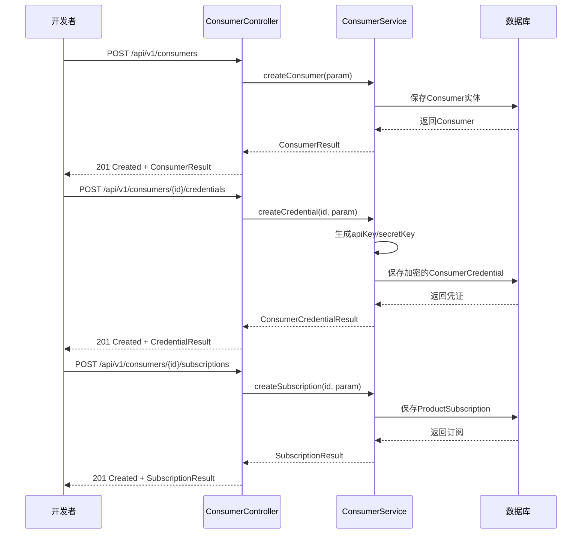

# 消费者与订阅管理API

<cite>
**本文档引用的文件**  
- [ConsumerController.java](file://portal-server/src/main/java/com/alibaba/apiopenplatform/controller/ConsumerController.java)
- [CreateConsumerParam.java](file://portal-server/src/main/java/com/alibaba/apiopenplatform/dto/params/consumer/CreateConsumerParam.java)
- [CreateCredentialParam.java](file://portal-server/src/main/java/com/alibaba/apiopenplatform/dto/params/consumer/CreateCredentialParam.java)
- [ConsumerResult.java](file://portal-server/src/main/java/com/alibaba/apiopenplatform/dto/result/ConsumerResult.java)
- [SubscriptionResult.java](file://portal-server/src/main/java/com/alibaba/apiopenplatform/dto/result/SubscriptionResult.java)
- [ConsumerAuthConfig.java](file://portal-dal/src/main/java/com/alibaba/apiopenplatform/support/consumer/ConsumerAuthConfig.java)
- [ApiKeyConfig.java](file://portal-dal/src/main/java/com/alibaba/apiopenplatform/support/consumer/ApiKeyConfig.java)
- [HmacConfig.java](file://portal-dal/src/main/java/com/alibaba/apiopenplatform/support/consumer/HmacConfig.java)
- [ConsumerServiceImpl.java](file://portal-server/src/main/java/com/alibaba/apiopenplatform/service/impl/ConsumerServiceImpl.java)
- [Consumer.java](file://portal-dal/src/main/java/com/alibaba/apiopenplatform/entity/Consumer.java)
- [ConsumerCredential.java](file://portal-dal/src/main/java/com/alibaba/apiopenplatform/entity/ConsumerCredential.java)
- [ConsumerRepository.java](file://portal-dal/src/main/java/com/alibaba/apiopenplatform/repository/ConsumerRepository.java)
- [ConsumerCredentialRepository.java](file://portal-dal/src/main/java/com/alibaba/apiopenplatform/repository/ConsumerCredentialRepository.java)
- [ConsumerAuthType.java](file://portal-dal/src/main/java/com/alibaba/apiopenplatform/support/enums/ConsumerAuthType.java)
- [ConsumerStatus.java](file://portal-dal/src/main/java/com/alibaba/apiopenplatform/support/enums/ConsumerStatus.java)
- [ConsumerAuthConfigConverter.java](file://portal-dal/src/main/java/com/alibaba/apiopenplatform/converter/ConsumerAuthConfigConverter.java)
- [ApiKeyConfigConverter.java](file://portal-dal/src/main/java/com/alibaba/apiopenplatform/converter/ApiKeyConfigConverter.java)
- [HmacConfigConverter.java](file://portal-dal/src/main/java/com/alibaba/apiopenplatform/converter/HmacConfigConverter.java)
</cite>

## 目录
1. [简介](#简介)
2. [核心功能概览](#核心功能概览)
3. [消费者管理接口](#消费者管理接口)
4. [凭证管理接口](#凭证管理接口)
5. [订阅管理接口](#订阅管理接口)
6. [安全与认证机制](#安全与认证机制)
7. [数据模型与实体关系](#数据模型与实体关系)
8. [调用流程示例](#调用流程示例)
9. [状态生命周期管理](#状态生命周期管理)
10. [异常处理与错误码](#异常处理与错误码)

## 简介
本API文档详细描述了“消费者与订阅管理”模块的核心功能，涵盖消费者创建、访问凭证生成（API Key、HMAC等）、AI产品订阅等关键操作。系统通过`ConsumerController`提供RESTful接口，支持开发者快速集成并管理其应用对平台AI服务的访问权限。整体设计遵循分层架构，确保安全性、可扩展性和易用性。

## 核心功能概览
系统提供三大核心能力：
- **消费者管理**：创建、查询、更新和禁用消费者账户
- **凭证管理**：为消费者生成和管理多种认证方式的访问凭证
- **订阅管理**：管理消费者对AI产品的订阅关系，控制服务访问权限

所有接口均通过JWT进行身份验证，确保调用安全。

## 消费者管理接口

### 创建消费者
**HTTP方法**: `POST`  
**路径**: `/api/v1/consumers`  
**请求参数**: `CreateConsumerParam`

```json
{
  "name": "string",
  "description": "string",
  "authType": "API_KEY | HMAC | JWT",
  "authConfig": {
    "apiKey": {
      "headerName": "string",
      "prefix": "string"
    },
    "hmac": {
      "headerName": "string",
      "algorithm": "HMAC_SHA_256",
      "timestampTolerance": 300
    }
  }
}
```

**响应数据结构**: `ConsumerResult`
```json
{
  "id": "string",
  "name": "string",
  "description": "string",
  "status": "ACTIVE | INACTIVE",
  "authType": "API_KEY | HMAC | JWT",
  "createdAt": "datetime",
  "updatedAt": "datetime"
}
```

**功能说明**：  
根据`CreateConsumerParam`参数创建新的消费者实体。`authType`字段指定认证类型，`authConfig`包含具体配置。创建成功后返回`ConsumerResult`对象，包含唯一ID和基础信息。

**Section sources**
- [ConsumerController.java](file://portal-server/src/main/java/com/alibaba/apiopenplatform/controller/ConsumerController.java#L25-L60)
- [CreateConsumerParam.java](file://portal-server/src/main/java/com/alibaba/apiopenplatform/dto/params/consumer/CreateConsumerParam.java#L5-L40)
- [ConsumerResult.java](file://portal-server/src/main/java/com/alibaba/apiopenplatform/dto/result/ConsumerResult.java#L5-L35)
- [ConsumerServiceImpl.java](file://portal-server/src/main/java/com/alibaba/apiopenplatform/service/impl/ConsumerServiceImpl.java#L30-L80)

### 查询消费者
**HTTP方法**: `GET`  
**路径**: `/api/v1/consumers`  
**请求参数**: `QueryConsumerParam`（可选，支持分页和条件过滤）

**响应数据结构**: `PageResult<ConsumerResult>`  
返回分页的消费者列表，包含总数和当前页数据。

**Section sources**
- [ConsumerController.java](file://portal-server/src/main/java/com/alibaba/apiopenplatform/controller/ConsumerController.java#L62-L75)
- [QueryConsumerParam.java](file://portal-server/src/main/java/com/alibaba/apiopenplatform/dto/params/consumer/QueryConsumerParam.java#L5-L25)

## 凭证管理接口

### 创建访问凭证
**HTTP方法**: `POST`  
**路径**: `/api/v1/consumers/{consumerId}/credentials`  
**路径参数**: `consumerId`（消费者ID）  
**请求参数**: `CreateCredentialParam`

```json
{
  "mode": "API_KEY | HMAC",
  "apiKey": {
    "headerName": "X-API-Key",
    "prefix": "Bearer"
  },
  "hmac": {
    "headerName": "Authorization",
    "algorithm": "HMAC_SHA_256"
  }
}
```

**响应数据结构**: `ConsumerCredentialResult`
```json
{
  "id": "string",
  "consumerId": "string",
  "mode": "API_KEY | HMAC",
  "apiKeyValue": "string",
  "secretKey": "string",
  "status": "ACTIVE | INACTIVE",
  "createdAt": "datetime"
}
```

**功能说明**：  
为指定消费者创建新的访问凭证。`mode`决定凭证类型。系统会生成加密的`apiKeyValue`和`secretKey`，并通过响应返回。**敏感字段在数据库中加密存储**。

**Section sources**
- [ConsumerController.java](file://portal-server/src/main/java/com/alibaba/apiopenplatform/controller/ConsumerController.java#L80-L110)
- [CreateCredentialParam.java](file://portal-server/src/main/java/com/alibaba/apiopenplatform/dto/params/consumer/CreateCredentialParam.java#L5-L50)
- [ConsumerCredentialResult.java](file://portal-server/src/main/java/com/alibaba/apiopenplatform/dto/result/ConsumerCredentialResult.java#L5-L40)

### 更新凭证状态
**HTTP方法**: `PUT`  
**路径**: `/api/v1/consumers/{consumerId}/credentials/{credentialId}`  
**请求参数**: `UpdateCredentialParam`（包含新状态：ACTIVE/INACTIVE）

**响应**: `ConsumerCredentialResult`

**功能说明**：  
支持启用或禁用特定凭证，实现细粒度的访问控制。

## 订阅管理接口

### 创建订阅
**HTTP方法**: `POST`  
**路径**: `/api/v1/consumers/{consumerId}/subscriptions`  
**路径参数**: `consumerId`  
**请求参数**: `CreateSubscriptionParam`
```json
{
  "productId": "string",
  "planId": "string"
}
```

**响应数据结构**: `SubscriptionResult`
```json
{
  "id": "string",
  "consumerId": "string",
  "productId": "string",
  "planId": "string",
  "status": "PENDING | ACTIVE | INACTIVE | EXPIRED",
  "createdAt": "datetime",
  "activatedAt": "datetime",
  "expiresAt": "datetime"
}
```

**功能说明**：  
建立消费者与AI产品的订阅关系。状态机管理订阅生命周期。

**Section sources**
- [ConsumerController.java](file://portal-server/src/main/java/com/alibaba/apiopenplatform/controller/ConsumerController.java#L115-L140)
- [CreateSubscriptionParam.java](file://portal-server/src/main/java/com/alibaba/apiopenplatform/dto/params/consumer/CreateSubscriptionParam.java#L5-L25)
- [SubscriptionResult.java](file://portal-server/src/main/java/com/alibaba/apiopenplatform/dto/result/SubscriptionResult.java#L5-L45)

### 查询订阅
**HTTP方法**: `GET`  
**路径**: `/api/v1/consumers/{consumerId}/subscriptions`  
**请求参数**: `QuerySubscriptionParam`（可选）

**响应**: `PageResult<SubscriptionResult>`

## 安全与认证机制

### 凭证安全存储
所有敏感凭证（如`secretKey`）在`ConsumerCredential`实体中标记为`@Encrypted`，通过`Encryptor`组件在持久化前加密，读取时解密。

```java
// portal-dal/src/main/java/com/alibaba/apiopenplatform/entity/ConsumerCredential.java
@Encrypted
private String secretKey;
```

**Section sources**
- [ConsumerCredential.java](file://portal-dal/src/main/java/com/alibaba/apiopenplatform/entity/ConsumerCredential.java#L20-L25)
- [Encrypted.java](file://portal-dal/src/main/java/com/alibaba/apiopenplatform/support/common/Encrypted.java#L5-L10)
- [Encryptor.java](file://portal-dal/src/main/java/com/alibaba/apiopenplatform/support/common/Encryptor.java#L10-L50)

### 多种认证方式配置

#### API Key 配置
通过`ApiKeyConfig`类定义：
- `headerName`: 传输API Key的HTTP头名称（如`X-API-Key`）
- `prefix`: 前缀（如`Bearer`）

```java
public class ApiKeyConfig {
    private String headerName;
    private String prefix;
    // getters and setters
}
```

**Section sources**
- [ApiKeyConfig.java](file://portal-dal/src/main/java/com/alibaba/apiopenplatform/support/consumer/ApiKeyConfig.java#L5-L20)
- [ApiKeyConfigConverter.java](file://portal-dal/src/main/java/com/alibaba/apiopenplatform/converter/ApiKeyConfigConverter.java#L10-L30)

#### HMAC 配置
通过`HmacConfig`类定义：
- `headerName`: 签名头名称
- `algorithm`: 签名算法（如`HMAC_SHA_256`）
- `timestampTolerance`: 时间戳容差（秒）

```java
public class HmacConfig {
    private String headerName;
    private String algorithm;
    private Integer timestampTolerance;
    // getters and setters
}
```

**Section sources**
- [HmacConfig.java](file://portal-dal/src/main/java/com/alibaba/apiopenplatform/support/consumer/HmacConfig.java#L5-L25)
- [HmacConfigConverter.java](file://portal-dal/src/main/java/com/alibaba/apiopenplatform/converter/HmacConfigConverter.java#L10-L35)

### 认证类型枚举
`ConsumerAuthType`枚举定义了支持的认证方式：
- `API_KEY`
- `HMAC`
- `JWT`

**Section sources**
- [ConsumerAuthType.java](file://portal-dal/src/main/java/com/alibaba/apiopenplatform/support/enums/ConsumerAuthType.java#L5-L15)

## 数据模型与实体关系

```mermaid
classDiagram
class Consumer {
+String id
+String name
+String description
+ConsumerStatus status
+ConsumerAuthType authType
+String authConfigJson
+LocalDateTime createdAt
+LocalDateTime updatedAt
}
class ConsumerCredential {
+String id
+String consumerId
+CredentialMode mode
+String apiKeyValue
+String secretKey
+String configJson
+ConsumerCredentialStatus status
+LocalDateTime createdAt
+LocalDateTime updatedAt
}
class ProductSubscription {
+String id
+String consumerId
+String productId
+String planId
+SubscriptionStatus status
+LocalDateTime createdAt
+LocalDateTime activatedAt
+LocalDateTime expiresAt
}
Consumer "1" --> "0..*" ConsumerCredential : 拥有
Consumer "1" --> "0..*" ProductSubscription : 订阅
ConsumerCredential --> ApiKeyConfig : 包含
ConsumerCredential --> HmacConfig : 包含
class ApiKeyConfig {
+String headerName
+String prefix
}
class HmacConfig {
+String headerName
+String algorithm
+Integer timestampTolerance
}
note right of ConsumerCredential
secretKey字段使用@Encrypted注解
在数据库中加密存储
end note
```

**Diagram sources**
- [Consumer.java](file://portal-dal/src/main/java/com/alibaba/apiopenplatform/entity/Consumer.java#L10-L40)
- [ConsumerCredential.java](file://portal-dal/src/main/java/com/alibaba/apiopenplatform/entity/ConsumerCredential.java#L10-L50)
- [ProductSubscription.java](file://portal-dal/src/main/java/com/alibaba/apiopenplatform/entity/ProductSubscription.java#L10-L45)
- [ApiKeyConfig.java](file://portal-dal/src/main/java/com/alibaba/apiopenplatform/support/consumer/ApiKeyConfig.java#L5-L20)
- [HmacConfig.java](file://portal-dal/src/main/java/com/alibaba/apiopenplatform/support/consumer/HmacConfig.java#L5-L25)

## 调用流程示例

### 完整流程：创建消费者并订阅产品


**Diagram sources**
- [ConsumerController.java](file://portal-server/src/main/java/com/alibaba/apiopenplatform/controller/ConsumerController.java#L25-L140)
- [ConsumerServiceImpl.java](file://portal-server/src/main/java/com/alibaba/apiopenplatform/service/impl/ConsumerServiceImpl.java#L30-L150)

## 状态生命周期管理

### 消费者状态 (ConsumerStatus)
- `ACTIVE`: 活跃，可正常访问服务
- `INACTIVE`: 已禁用，无法访问服务

### 订阅状态 (SubscriptionStatus)
- `PENDING`: 待激活
- `ACTIVE`: 已激活，可使用服务
- `INACTIVE`: 已停用
- `EXPIRED`: 已过期

状态转换由服务层逻辑控制，确保数据一致性。

**Section sources**
- [ConsumerStatus.java](file://portal-dal/src/main/java/com/alibaba/apiopenplatform/support/enums/ConsumerStatus.java#L5-L15)
- [SubscriptionStatus.java](file://portal-dal/src/main/java/com/alibaba/apiopenplatform/support/enums/SubscriptionStatus.java#L5-L20)

## 异常处理与错误码
系统通过`ExceptionAdvice`统一处理异常，返回标准化错误响应。

常见错误码：
- `400`: 请求参数无效
- `404`: 消费者或产品不存在
- `409`: 状态冲突（如重复创建）
- `500`: 服务器内部错误

**Section sources**
- [ExceptionAdvice.java](file://portal-server/src/main/java/com/alibaba/apiopenplatform/core/advice/ExceptionAdvice.java#L15-L80)
- [ErrorCode.java](file://portal-server/src/main/java/com/alibaba/apiopenplatform/core/exception/ErrorCode.java#L10-L100)