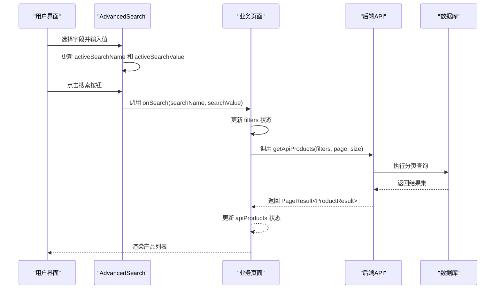
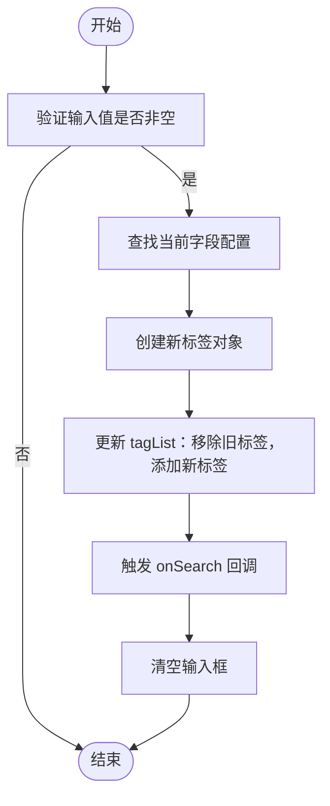
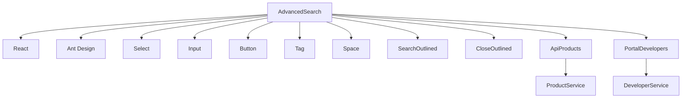

# AdvancedSearch 组件详解

<cite>
**本文档引用的文件**  
- [AdvancedSearch.tsx](file://portal-web/api-portal-admin/src/components/common/AdvancedSearch.tsx)
- [ApiProducts.tsx](file://portal-web/api-portal-admin/src/pages/ApiProducts.tsx)
- [ProductController.java](file://portal-server/src/main/java/com/alibaba/apiopenplatform/controller/ProductController.java)
- [DeveloperController.java](file://portal-server/src/main/java/com/alibaba/apiopenplatform/controller/DeveloperController.java)
- [PortalDevelopers.tsx](file://portal-web/api-portal-admin/src/components/portal/PortalDevelopers.tsx)
</cite>

## 目录
1. [简介](#简介)
2. [项目结构](#项目结构)
3. [核心组件](#核心组件)
4. [架构概览](#架构概览)
5. [详细组件分析](#详细组件分析)
6. [依赖分析](#依赖分析)
7. [性能考量](#性能考量)
8. [故障排除指南](#故障排除指南)
9. [结论](#结论)

## 简介
`AdvancedSearch` 是一个可复用的高级搜索组件，用于支持多条件组合搜索功能。该组件广泛应用于 `ApiProducts` 和 `PortalDevelopers` 页面中，为用户提供灵活的字段筛选、操作符选择和值输入交互逻辑。本文档将深入解析其设计机制、与后端 API 的集成方式以及在实际场景中的应用模式。

## 项目结构
`AdvancedSearch` 组件位于前端项目 `api-portal-admin` 的通用组件目录中，体现了高内聚、低耦合的设计原则。其结构清晰，便于在多个页面间复用。

```mermaid
graph TB
subgraph "前端 (portal-web)"
subgraph "管理后台 (api-portal-admin)"
AS[AdvancedSearch.tsx]
AP[ApiProducts.tsx]
PD[PortalDevelopers.tsx]
end
end
subgraph "后端 (portal-server)"
PC[ProductController.java]
DC[DeveloperController.java]
end
AS --> AP : "在 ApiProducts 中使用"
AS --> PD : "在 PortalDevelopers 中使用"
AP --> PC : "调用 /products 接口"
PD --> DC : "调用 /developers 接口"
```

**图示来源**  
- [AdvancedSearch.tsx](file://portal-web/api-portal-admin/src/components/common/AdvancedSearch.tsx)
- [ApiProducts.tsx](file://portal-web/api-portal-admin/src/pages/ApiProducts.tsx)
- [PortalDevelopers.tsx](file://portal-web/api-portal-admin/src/components/portal/PortalDevelopers.tsx)
- [ProductController.java](file://portal-server/src/main/java/com/alibaba/apiopenplatform/controller/ProductController.java)
- [DeveloperController.java](file://portal-server/src/main/java/com/alibaba/apiopenplatform/controller/DeveloperController.java)

## 核心组件
`AdvancedSearch` 组件的核心功能包括：
- 支持动态配置搜索字段（`searchParamsList`）
- 提供输入框和下拉选择两种输入类型
- 支持即时搜索与标签化筛选条件展示
- 允许清除单个或全部筛选条件
- 通过回调函数 `onSearch` 和 `onClear` 与父组件通信

该组件使用 React 函数式组件 + Hooks 实现状态管理，结合 Ant Design 的 Select、Input、Tag 等 UI 组件构建交互界面。

**组件来源**  
- [AdvancedSearch.tsx](file://portal-web/api-portal-admin/src/components/common/AdvancedSearch.tsx#L1-L206)

## 架构概览
`AdvancedSearch` 组件作为前端搜索功能的统一入口，通过标准化接口与业务页面集成，并最终与后端分页查询 API 交互，形成完整的数据过滤闭环。



**图示来源**  
- [AdvancedSearch.tsx](file://portal-web/api-portal-admin/src/components/common/AdvancedSearch.tsx#L1-L206)
- [ApiProducts.tsx](file://portal-web/api-portal-admin/src/pages/ApiProducts.tsx#L1-L329)
- [ProductController.java](file://portal-server/src/main/java/com/alibaba/apiopenplatform/controller/ProductController.java#L1-L128)

## 详细组件分析

### AdvancedSearch 组件分析
`AdvancedSearch` 是一个高度可配置的搜索组件，其主要逻辑围绕状态管理和用户交互展开。

#### 状态定义
```typescript
const [activeSearchName, setActiveSearchName] = useState<string>(''); // 当前选中的搜索字段名
const [activeSearchValue, setActiveSearchValue] = useState<string>(''); // 当前输入的搜索值
const [tagList, setTagList] = useState<Array<SearchParam & { value: string }>>([]); // 已应用的筛选标签
```

#### 属性接口
```typescript
export interface SearchParam {
  label: string;           // 字段显示名称
  name: string;            // 字段实际名称（用于后端参数）
  placeholder: string;     // 输入提示
  type?: 'input' | 'select'; // 输入类型
  optionList?: Array<{ label: string; value: string }>; // 下拉选项列表
}

interface AdvancedSearchProps {
  searchParamsList: SearchParam[]; // 可选搜索字段列表
  onSearch: (searchName: string, searchValue: string) => void; // 搜索回调
  onClear?: () => void; // 清除回调
  className?: string; // 自定义样式类
}
```

#### 生命周期逻辑
- `useEffect` 监听 `activeSearchName` 变化时，自动清空输入框并触发空值搜索（用于重置）
- `useEffect` 在 `searchParamsList` 初始化后，默认选中第一个字段

#### 搜索处理流程


**图示来源**  
- [AdvancedSearch.tsx](file://portal-web/api-portal-admin/src/components/common/AdvancedSearch.tsx#L1-L206)

**组件来源**  
- [AdvancedSearch.tsx](file://portal-web/api-portal-admin/src/components/common/AdvancedSearch.tsx#L1-L206)

### 在 ApiProducts 页面中的应用
`AdvancedSearch` 被集成到 `ApiProducts.tsx` 中，用于实现产品列表的多条件筛选。

#### 配置示例
```typescript
const searchParamsList: SearchParam[] = useMemo(() => [
  {
    label: '产品名称',
    name: 'name',
    placeholder: '请输入产品名称',
    type: 'input'
  },
  {
    label: '产品类型',
    name: 'type',
    placeholder: '选择类型',
    type: 'select',
    optionList: [
      { label: 'REST API', value: 'REST_API' },
      { label: 'MCP Server', value: 'MCP_SERVER' }
    ]
  }
], [typeOptions]);
```

#### 搜索回调处理
```typescript
const handleSearch = (searchName: string, searchValue: string) => {
  const next = { [searchName]: searchValue || undefined };
  setFilters(next);
  fetchApiProducts(1, pagination.pageSize, next);
};
```

此逻辑将搜索条件同步到页面状态，并重新发起分页请求。

**组件来源**  
- [ApiProducts.tsx](file://portal-web/api-portal-admin/src/pages/ApiProducts.tsx#L1-L329)

### 与后端 API 集成
`AdvancedSearch` 通过 `ProductController` 和 `DeveloperController` 实现服务端数据过滤。

#### ProductController 查询接口
```java
@GetMapping
public PageResult<ProductResult> listProducts(QueryProductParam param, Pageable pageable) {
    return productService.listProducts(param, pageable);
}
```
- `QueryProductParam` 接收 `name` 和 `type` 参数
- `Pageable` 提供分页信息
- 返回 `PageResult<ProductResult>` 分页结果

#### DeveloperController 查询接口
```java
@GetMapping
public PageResult<DeveloperResult> listDevelopers(QueryDeveloperParam param, Pageable pageable) {
    return developerService.listDevelopers(param, pageable);
}
```
同样支持分页和条件查询。

**接口来源**  
- [ProductController.java](file://portal-server/src/main/java/com/alibaba/apiopenplatform/controller/ProductController.java#L1-L128)
- [DeveloperController.java](file://portal-server/src/main/java/com/alibaba/apiopenplatform/controller/DeveloperController.java#L1-L121)

## 依赖分析
`AdvancedSearch` 组件依赖于 Ant Design 的 UI 组件库，并通过 props 与父组件进行数据通信。其依赖关系如下：



**图示来源**  
- [AdvancedSearch.tsx](file://portal-web/api-portal-admin/src/components/common/AdvancedSearch.tsx)
- [ApiProducts.tsx](file://portal-web/api-portal-admin/src/pages/ApiProducts.tsx)
- [PortalDevelopers.tsx](file://portal-web/api-portal-admin/src/components/portal/PortalDevelopers.tsx)

## 性能考量
- **防抖优化**：当前实现为即时搜索（select 类型），建议对 input 类型增加防抖机制以减少频繁请求。
- **状态管理**：使用 `useMemo` 缓存 `searchParamsList` 和 `typeOptions`，避免不必要的重渲染。
- **标签复用**：已选标签可点击回填，提升用户体验和操作效率。
- **分页集成**：搜索后自动重置页码至第一页，符合用户直觉。

## 故障排除指南
### 常见问题
1. **搜索无反应**
   - 检查 `onSearch` 回调是否正确传递
   - 确认 `searchParamsList` 是否为空或配置错误
   - 查看浏览器控制台是否有 JavaScript 错误

2. **标签未更新**
   - 确保 `activeSearchName` 和 `activeSearchValue` 正确设置
   - 检查 `tagList` 更新逻辑是否被阻断

3. **后端未收到参数**
   - 检查字段 `name` 是否与后端 `QueryProductParam` 属性名一致
   - 确认请求参数序列化方式（如是否需转换为 query string）

### 调试建议
- 使用 React DevTools 检查组件状态变化
- 在 `onSearch` 回调中添加 `console.log` 输出参数
- 利用浏览器 Network 面板查看实际发送的请求参数

**组件来源**  
- [AdvancedSearch.tsx](file://portal-web/api-portal-admin/src/components/common/AdvancedSearch.tsx#L1-L206)
- [ApiProducts.tsx](file://portal-web/api-portal-admin/src/pages/ApiProducts.tsx#L1-L329)

## 结论
`AdvancedSearch` 组件通过简洁的 API 设计和灵活的配置能力，成功实现了跨页面的多条件搜索功能复用。它不仅提升了开发效率，也保证了用户界面的一致性。未来可通过增加防抖、支持更多输入类型（如日期范围）、保存搜索历史等特性进一步增强其功能性。