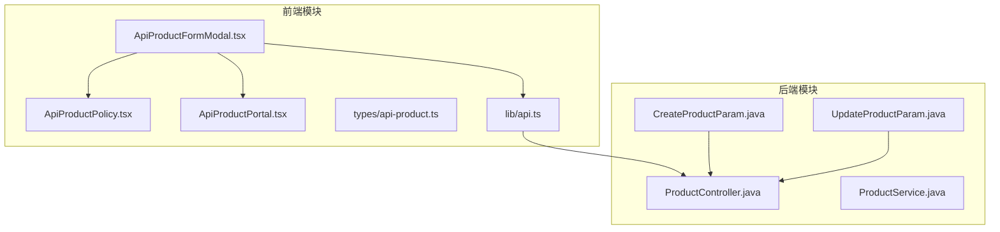
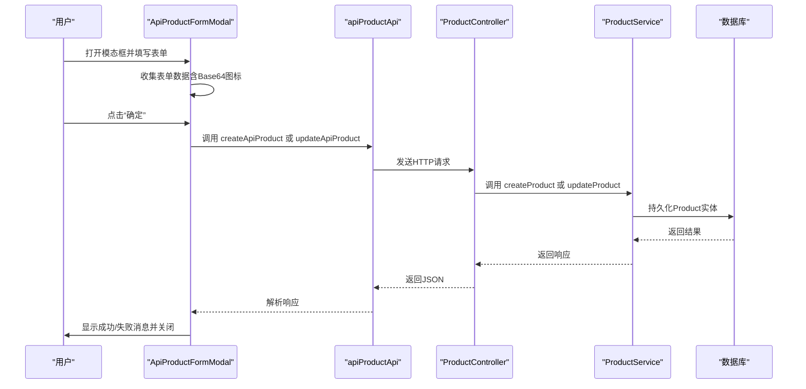
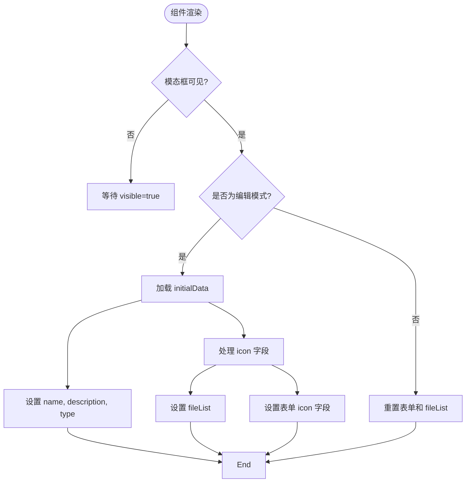
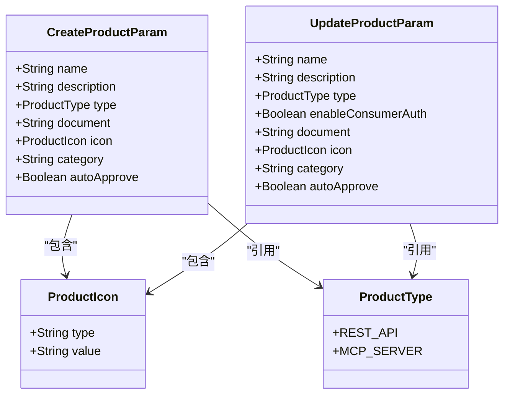
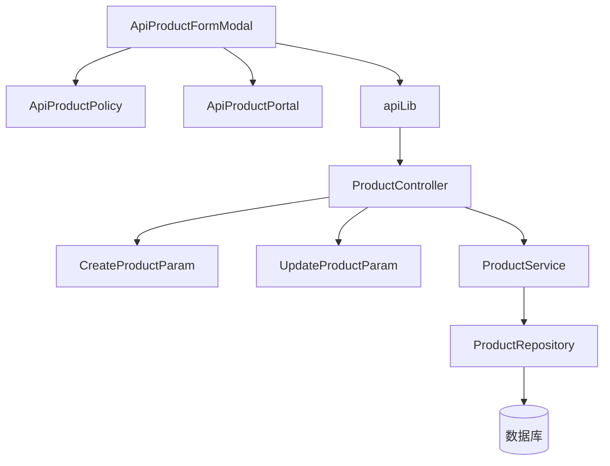

# ApiProductFormModal 详解

<cite>
**本文档引用的文件**  
- [ApiProductFormModal.tsx](file://portal-web/api-portal-admin/src/components/api-product/ApiProductFormModal.tsx)
- [ApiProductPolicy.tsx](file://portal-web/api-portal-admin/src/components/api-product/ApiProductPolicy.tsx)
- [ApiProductPortal.tsx](file://portal-web/api-portal-admin/src/components/api-product/ApiProductPortal.tsx)
- [CreateProductParam.java](file://portal-server/src/main/java/com/alibaba/apiopenplatform/dto/params/product/CreateProductParam.java)
- [UpdateProductParam.java](file://portal-server/src/main/java/com/alibaba/apiopenplatform/dto/params/product/UpdateProductParam.java)
</cite>

## 目录
1. [简介](#简介)
2. [项目结构](#项目结构)
3. [核心组件](#核心组件)
4. [架构概览](#架构概览)
5. [详细组件分析](#详细组件分析)
6. [依赖分析](#依赖分析)
7. [性能考虑](#性能考虑)
8. [故障排除指南](#故障排除指南)
9. [结论](#结论)

## 简介
`ApiProductFormModal` 是一个用于创建和编辑 API 产品的复杂表单组件，位于 `portal-web` 前端模块中。该组件采用多步骤配置流程，支持基本信息设置、API 关联、访问策略（通过 `ApiProductPolicy.tsx`）和发布设置（通过 `ApiProductPortal.tsx`）。其设计结合了动态字段渲染、状态管理与前后端数据契约，为开发者提供了高度可扩展的表单架构。本文将深入剖析其内部机制，并提供扩展指南。

## 项目结构
该组件属于 `portal-web/api-portal-admin` 子项目，位于 `src/components/api-product/` 目录下，与 `ApiProductPolicy.tsx` 和 `ApiProductPortal.tsx` 共同构成 API 产品管理的核心 UI 模块。后端 DTO 定义位于 `portal-server` 模块的 `dto/params/product/` 包中。



**图示来源**
- [ApiProductFormModal.tsx](file://portal-web/api-portal-admin/src/components/api-product/ApiProductFormModal.tsx)
- [ApiProductPolicy.tsx](file://portal-web/api-portal-admin/src/components/api-product/ApiProductPolicy.tsx)
- [ApiProductPortal.tsx](file://portal-web/api-portal-admin/src/components/api-product/ApiProductPortal.tsx)
- [CreateProductParam.java](file://portal-server/src/main/java/com/alibaba/apiopenplatform/dto/params/product/CreateProductParam.java)
- [UpdateProductParam.java](file://portal-server/src/main/java/com/alibaba/apiopenplatform/dto/params/product/UpdateProductParam.java)

## 核心组件
`ApiProductFormModal` 是一个受控的 Ant Design 模态表单，支持创建和编辑两种模式。其核心功能包括：
- **表单状态管理**：使用 `Form.useForm()` 进行集中式表单控制。
- **文件上传处理**：支持 Base64 编码的图标上传与预览。
- **动态初始化**：根据 `initialData` 和 `productId` 判断编辑或新建模式，并正确填充表单。
- **提交逻辑**：调用 `apiProductApi` 进行创建或更新操作，并处理响应。

**组件来源**
- [ApiProductFormModal.tsx](file://portal-web/api-portal-admin/src/components/api-product/ApiProductFormModal.tsx#L1-L250)

## 架构概览
整个 API 产品管理功能从前端到后端形成了清晰的数据流与职责划分。前端组件负责 UI 展示与用户交互，后端 DTO 定义了数据契约，Controller 层处理请求，Service 层执行业务逻辑。



**图示来源**
- [ApiProductFormModal.tsx](file://portal-web/api-portal-admin/src/components/api-product/ApiProductFormModal.tsx#L1-L250)
- [CreateProductParam.java](file://portal-server/src/main/java/com/alibaba/apiopenplatform/dto/params/product/CreateProductParam.java#L1-L54)
- [UpdateProductParam.java](file://portal-server/src/main/java/com/alibaba/apiopenplatform/dto/params/product/UpdateProductParam.java#L1-L50)

## 详细组件分析

### ApiProductFormModal 分析
该组件是整个流程的入口，负责收集产品基本信息。

#### 表单字段与校验
| 字段名 | 类型 | 必填 | 说明 |
|-------|------|------|------|
| **名称** | Input | 是 | 产品名称，最大50字符 |
| **描述** | TextArea | 是 | 产品描述，最大256字符 |
| **类型** | Select | 是 | REST_API 或 MCP_SERVER |
| **自动审批订阅** | Select | 否 | 控制订阅是否自动审批 |
| **上传头像** | Upload | 否 | 上传Base64编码的图标 |

#### 状态管理与生命周期
组件使用 `useState` 管理加载、预览、文件列表等状态，并通过 `useEffect` 在模态框可见时初始化数据。关键逻辑如下：
- **编辑模式**：当 `productId` 存在时，从 `initialData` 加载数据，包括将 Base64 图标字符串解析并设置到 `fileList` 和表单中。
- **新建模式**：清空所有表单和文件列表。



**图示来源**
- [ApiProductFormModal.tsx](file://portal-web/api-portal-admin/src/components/api-product/ApiProductFormModal.tsx#L1-L250)

#### 文件上传处理
文件上传采用 `beforeUpload={() => false}` 阻止自动上传，改为在 `onChange` 事件中手动将文件转为 Base64 并更新表单值。这确保了图标数据能与其他字段一起在提交时发送。

**组件来源**
- [ApiProductFormModal.tsx](file://portal-web/api-portal-admin/src/components/api-product/ApiProductFormModal.tsx#L1-L250)

### ApiProductPolicy 分析
该组件负责管理 API 产品的访问策略，如限流、认证、CORS 等。它提供了一个策略列表、添加/编辑/删除功能以及全局策略设置开关。

**组件来源**
- [ApiProductPolicy.tsx](file://portal-web/api-portal-admin/src/components/api-product/ApiProductPolicy.tsx#L1-L284)

### ApiProductPortal 分析
该组件管理 API 产品在不同门户（Portal）的发布状态。它支持：
- **查看已发布门户**：分页展示当前产品已发布的所有门户。
- **发布到新门户**：通过模态框选择未发布的门户进行批量发布。
- **移除发布**：从特定门户取消发布。

**组件来源**
- [ApiProductPortal.tsx](file://portal-web/api-portal-admin/src/components/api-product/ApiProductPortal.tsx#L1-L274)

### 前后端数据契约分析
前后端通过 DTO（Data Transfer Object）进行数据交换，确保类型安全和校验一致性。

#### 创建数据契约 (CreateProductParam)
```java
@Data
public class CreateProductParam implements InputConverter<Product> {
    @NotBlank(message = "API产品名称不能为空")
    @Size(max = 50, message = "API产品名称长度不能超过50个字符")
    private String name;

    @Size(max = 256, message = "API产品描述长度不能超过256个字符")
    private String description;

    @NotNull(message = "API产品类型不能为空")
    private ProductType type;

    private String document;
    private ProductIcon icon;
    private String category;
    private Boolean autoApprove;
}
```

#### 更新数据契约 (UpdateProductParam)
```java
@Data
public class UpdateProductParam implements InputConverter<Product> {
    private String name;
    private String description;
    private ProductType type;
    private Boolean enableConsumerAuth;
    private String document;
    private ProductIcon icon;
    private String category;
    private Boolean autoApprove;
}
```

**关键差异**：`UpdateProductParam` 中所有字段均为可选，符合 PATCH 语义，允许部分更新。



**图示来源**
- [CreateProductParam.java](file://portal-server/src/main/java/com/alibaba/apiopenplatform/dto/params/product/CreateProductParam.java#L1-L54)
- [UpdateProductParam.java](file://portal-server/src/main/java/com/alibaba/apiopenplatform/dto/params/product/UpdateProductParam.java#L1-L50)

## 依赖分析
该功能模块的依赖关系清晰，前端组件依赖 `api` 库与后端 API 通信，后端 DTO 被 Controller 和 Service 层使用。



**图示来源**
- [ApiProductFormModal.tsx](file://portal-web/api-portal-admin/src/components/api-product/ApiProductFormModal.tsx)
- [ApiProductPolicy.tsx](file://portal-web/api-portal-admin/src/components/api-product/ApiProductPolicy.tsx)
- [ApiProductPortal.tsx](file://portal-web/api-portal-admin/src/components/api-product/ApiProductPortal.tsx)
- [CreateProductParam.java](file://portal-server/src/main/java/com/alibaba/apiopenplatform/dto/params/product/CreateProductParam.java)
- [UpdateProductParam.java](file://portal-server/src/main/java/com/alibaba/apiopenplatform/dto/params/product/UpdateProductParam.java)

## 性能考虑
- **文件处理**：图标以 Base64 形式嵌入请求，可能增加网络负载。建议对大文件进行压缩或考虑使用文件存储服务。
- **数据加载**：`ApiProductPortal` 在初始化时加载所有门户，若门户数量庞大，应实现分页或懒加载。
- **状态更新**：`ApiProductPolicy` 使用本地状态模拟数据，真实场景应对接后端 API。

## 故障排除指南
- **表单无法提交**：检查必填字段是否填写，以及 `initialData` 结构是否正确。
- **图标不显示**：确认 Base64 字符串格式正确，且 `initialData.icon` 的解析逻辑（`substring(startIndex, endIndex)`）与后端返回格式匹配。
- **更新后图标丢失**：在编辑模式下，若未上传新图标，`handleSubmit` 中会 `delete params.icon`，确保后端能正确处理此逻辑。
- **网络请求失败**：检查 `apiProductApi` 的端点配置和网络连接。

## 结论
`ApiProductFormModal` 及其关联组件构成了一个功能完整、结构清晰的 API 产品管理界面。其采用的前后端分离架构、明确的数据契约和模块化设计，使得系统易于维护和扩展。开发者可基于此模式，通过新增步骤组件、扩展 DTO 字段和集成自定义校验逻辑，轻松满足更多业务需求。