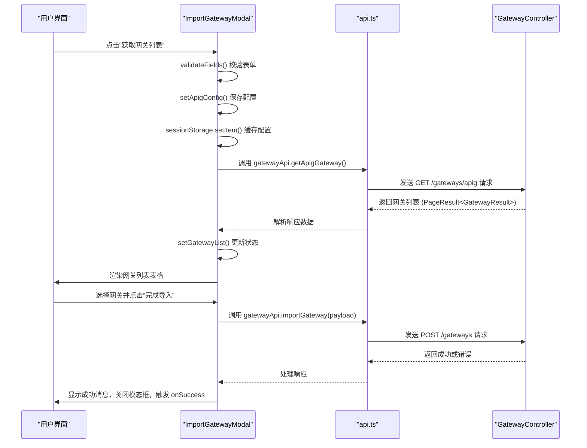

# ImportGatewayModal 与 ImportHigressModal 详解

<cite>
**本文档引用的文件**  
- [ImportGatewayModal.tsx](file://portal-web/api-portal-admin/src/components/console/ImportGatewayModal.tsx)
- [ImportHigressModal.tsx](file://portal-web/api-portal-admin/src/components/console/ImportHigressModal.tsx)
- [GatewayTypeSelector.tsx](file://portal-web/api-portal-admin/src/components/console/GatewayTypeSelector.tsx)
- [api.ts](file://portal-web/api-portal-admin/src/lib/api.ts)
- [GatewayController.java](file://portal-server/src/main/java/com/alibaba/apiopenplatform/controller/GatewayController.java)
</cite>

## 目录
1. [简介](#简介)
2. [核心组件概览](#核心组件概览)
3. [表单结构与UI设计](#表单结构与ui设计)
4. [网关类型选择机制](#网关类型选择机制)
5. [表单提交与后端交互流程](#表单提交与后端交互流程)
6. [错误处理与用户体验优化](#错误处理与用户体验优化)
7. [组件复用建议](#组件复用建议)

## 简介
本文档深入解析网关导入功能的前端实现，重点分析 `ImportGatewayModal` 和 `ImportHigressModal` 两个模态框组件的表单设计、状态管理、与后端交互逻辑。同时阐述 `GatewayTypeSelector` 如何实现网关类型的动态选择，并追踪从用户输入到调用后端服务完成网关实例注册的完整链路。

## 核心组件概览

本文档分析的核心组件包括：
- **ImportGatewayModal**: 用于导入 APIG_API、APIG_AI 和 ADP_AI_GATEWAY 类型网关的通用模态框。
- **ImportHigressModal**: 专门用于导入 Higress 类型网关的模态框。
- **GatewayTypeSelector**: 提供图形化界面让用户选择要导入的网关类型。

这些组件共同构成了网关导入功能的用户界面层。

**Section sources**
- [ImportGatewayModal.tsx](file://portal-web/api-portal-admin/src/components/console/ImportGatewayModal.tsx#L1-L325)
- [ImportHigressModal.tsx](file://portal-web/api-portal-admin/src/components/console/ImportHigressModal.tsx#L1-L109)
- [GatewayTypeSelector.tsx](file://portal-web/api-portal-admin/src/components/console/GatewayTypeSelector.tsx#L1-L75)

## 表单结构与UI设计

### ImportGatewayModal 表单结构
`ImportGatewayModal` 组件根据 `gatewayType` 属性动态渲染不同的认证信息表单，其UI流程分为两个阶段。

#### 第一阶段：连接信息输入
当网关列表为空时，显示连接信息输入表单。此阶段根据 `gatewayType` 分为两种情况：

1.  **APIG_API / APIG_AI 类型**:
    ```tsx
    {gatewayList.length === 0 && ['APIG_API', 'APIG_AI'].includes(gatewayType) && (
      <div className="mb-4">
        <h3>认证信息</h3>
        <Form.Item label="Region" name="region" rules={[{ required: true }]}>
          <Input />
        </Form.Item>
        <Form.Item label="Access Key" name="accessKey" rules={[{ required: true }]}>
          <Input />
        </Form.Item>
        <Form.Item label="Secret Key" name="secretKey" rules={[{ required: true }]}>
          <Input.Password />
        </Form.Item>
        <Button type="primary" onClick={...}>获取网关列表</Button>
      </div>
    )}
    ```
    - **字段**: Region、Access Key、Secret Key。
    - **验证规则**: 所有字段均为必填项。

2.  **ADP_AI_GATEWAY 类型**:
    ```tsx
    {['ADP_AI_GATEWAY'].includes(gatewayType) && gatewayList.length === 0 && (
      <div className="mb-4">
        <h3>认证信息</h3>
        <Form.Item label="服务地址" name="baseUrl" rules={[{ required: true }, { pattern: /^https?:\/\//i }]}>
          <Input />
        </Form.Item>
        <Form.Item label="端口" name="port" rules={[{ required: true }, { validator: ... }]}>
          <Input type="text" />
        </Form.Item>
        <Form.Item label="认证方式" name="authType" initialValue="Seed">
          <Select>
            <Select.Option value="Seed">Seed</Select.Option>
            <Select.Option value="Header">固定Header</Select.Option>
          </Select>
        </Form.Item>
        {authType === 'Seed' && (
          <Form.Item label="Seed" name="authSeed" rules={[{ required: true }]}>
            <Input />
          </Form.Item>
        )}
        {authType === 'Header' && (
          <Form.Item label="Headers">
            <Form.List name="authHeaders">
              {/* 动态Header列表 */}
            </Form.List>
          </Form.Item>
        )}
        <Button type="primary" onClick={...}>获取网关列表</Button>
      </div>
    )}
    ```
    - **字段**: 服务地址（需以 `http://` 或 `https://` 开头）、端口（1-65535）、认证方式（下拉选择）。
    - **联动逻辑**: 使用 `Form.useWatch('authType', importForm)` 监听“认证方式”字段的变化，动态显示 `Seed` 输入框或 `Headers` 列表。
    - **动态列表**: `Form.List` 组件用于管理可增删的Header键值对。

#### 第二阶段：网关实例选择
成功获取网关列表后，进入第二阶段，用户从表格中选择一个实例进行导入。
```tsx
{gatewayList.length > 0 && (
  <div className="mb-4">
    <h3>选择网关实例</h3>
    <Table
      rowKey="gatewayId"
      columns={[
        { title: 'ID', dataIndex: 'gatewayId' },
        { title: '类型', dataIndex: 'gatewayType', render: getGatewayTypeLabel },
        { title: '名称', dataIndex: 'gatewayName' },
      ]}
      dataSource={gatewayList}
      rowSelection={{
        type: 'radio',
        selectedRowKeys: selectedGateway ? [selectedGateway.gatewayId] : [],
        onChange: (_, selectedRows) => handleGatewaySelect(selectedRows[0]),
      }}
      pagination={gatewayPagination}
    />
  </div>
)}
```
- **数据展示**: 使用 `Table` 组件展示从后端获取的网关列表。
- **选择机制**: `rowSelection` 配置为单选（radio），用户选择后通过 `handleGatewaySelect` 函数更新 `selectedGateway` 状态。
- **分页**: 支持分页，`onChange` 回调会重新调用 `fetchGateways` 或 `fetchAdpGateways` 获取新页数据。

**Section sources**
- [ImportGatewayModal.tsx](file://portal-web/api-portal-admin/src/components/console/ImportGatewayModal.tsx#L100-L325)

### ImportHigressModal 表单结构
`ImportHigressModal` 是一个更简单的表单，用于导入 Higress 网关。
```tsx
<Form form={form} layout="vertical" onFinish={handleSubmit}>
  <Form.Item label="网关名称" name="gatewayName" rules={[{ required: true }]}>
    <Input placeholder="请输入网关名称" />
  </Form.Item>
  <Form.Item label="描述" name="description">
    <Input.TextArea placeholder="请输入网关描述（可选）" rows={3} />
  </Form.Item>
  <Form.Item label="服务地址" name="address" rules={[{ required: true }]}>
    <Input placeholder="例如：higress.example.com" />
  </Form.Item>
  <Form.Item label="用户名" name="username" rules={[{ required: true }]}>
    <Input placeholder="例如：8080" />
  </Form.Item>
  <Form.Item label="密码" name="password">
    <Input.Password placeholder="请输入密码" />
  </Form.Item>
  <div className="flex justify-end space-x-2 pt-4">
    <Button onClick={handleCancel}>取消</Button>
    <Button type="primary" htmlType="submit" loading={loading}>导入</Button>
  </div>
</Form>
```
- **字段**: 网关名称（必填）、描述（可选）、服务地址（必填）、用户名（必填）、密码。
- **验证规则**: 除描述外，其余字段均有必填验证。
- **提交**: 使用 `onFinish` 回调处理表单提交。

**Section sources**
- [ImportHigressModal.tsx](file://portal-web/api-portal-admin/src/components/console/ImportHigressModal.tsx#L1-L109)

## 网关类型选择机制

`GatewayTypeSelector` 组件提供了一个模态框，让用户在导入网关前选择其类型。

```tsx
<Radio.Group value={selectedType} onChange={(e) => setSelectedType(e.target.value)}>
  <Space direction="vertical" className="w-full">
    <Radio value="APIG_API">
      <div>
        <div>{GATEWAY_TYPE_LABELS.APIG_API}</div>
        <div>阿里云 API 网关服务</div>
      </div>
    </Radio>
    <Radio value="APIG_AI">
      <div>
        <div>{GATEWAY_TYPE_LABELS.APIG_AI}</div>
        <div>阿里云 AI 网关服务</div>
      </div>
    </Radio>
    <Radio value="HIGRESS">
      <div>
        <div>{GATEWAY_TYPE_LABELS.HIGRESS}</div>
        <div>Higress 云原生网关</div>
      </div>
    </Radio>
    <Radio value="ADP_AI_GATEWAY">
      <div>
        <div>{GATEWAY_TYPE_LABELS.ADP_AI_GATEWAY}</div>
        <div>专有云 AI 网关服务</div>
      </div>
    </Radio>
  </Space>
</Radio.Group>
```

- **UI设计**: 使用 `Radio.Group` 和 `Radio` 组件，每个选项包含一个标题和描述，提供良好的用户体验。
- **状态管理**: 使用 `useState` 管理当前选中的类型 `selectedType`。
- **交互逻辑**: 用户点击“确定”按钮后，通过 `onSelect` 回调函数将选中的类型传递给父组件，父组件据此决定渲染 `ImportGatewayModal` 还是 `ImportHigressModal`。

**Section sources**
- [GatewayTypeSelector.tsx](file://portal-web/api-portal-admin/src/components/console/GatewayTypeSelector.tsx#L1-L75)

## 表单提交与后端交互流程

整个导入流程涉及前端组件与后端API的紧密协作。

### 前端到后端的调用链


**Diagram sources**
- [ImportGatewayModal.tsx](file://portal-web/api-portal-admin/src/components/console/ImportGatewayModal.tsx#L150-L180)
- [api.ts](file://portal-web/api-portal-admin/src/lib/api.ts#L220-L235)
- [GatewayController.java](file://portal-server/src/main/java/com/alibaba/apiopenplatform/controller/GatewayController.java#L37-L110)

### 关键代码分析
1.  **获取网关列表**:
    - 前端调用 `gatewayApi.getApigGateway({...values, gatewayType})`。
    - 后端 `GatewayController.fetchGateways()` 方法接收参数，调用 `GatewayService` 查询并返回结果。

2.  **导入网关实例**:
    - 前端构建 `payload` 对象，包含选中的网关信息和配置。
    ```tsx
    const payload: any = {
      ...selectedGateway,
      gatewayType: gatewayType,
    }
    if (gatewayType === 'ADP_AI_GATEWAY') {
      payload.adpAIGatewayConfig = apigConfig
    } else {
      payload.apigConfig = apigConfig
    }
    ```
    - 前端调用 `gatewayApi.importGateway(payload)`。
    - 后端 `GatewayController.importGateway()` 方法接收 `ImportGatewayParam` 参数，交由 `GatewayService` 处理注册逻辑。

**Section sources**
- [ImportGatewayModal.tsx](file://portal-web/api-portal-admin/src/components/console/ImportGatewayModal.tsx#L150-L180)
- [api.ts](file://portal-web/api-portal-admin/src/lib/api.ts#L220-L235)
- [GatewayController.java](file://portal-server/src/main/java/com/alibaba/apiopenplatform/controller/GatewayController.java#L37-L110)

## 错误处理与用户体验优化

### 错误处理
- **前端**:
  - **表单验证**: 使用 `rules` 属性对输入进行即时验证，如必填、格式、范围检查。
  - **API调用**: 在 `try...catch` 块中处理异步请求，捕获网络错误或服务端返回的错误。
  - **用户反馈**: 使用 `message.error()` 显示错误信息，`message.success()` 显示成功提示。
- **后端**:
  - 使用 `@Valid` 注解进行参数校验。
  - 抛出 `BusinessException` 并通过 `ExceptionAdvice` 统一处理，返回结构化的错误信息。

### 用户体验优化
- **加载状态**: 在获取网关列表和提交导入时，使用 `loading` 状态和 `Button` 的 `loading` 属性，防止用户重复操作。
- **状态持久化**: 将用户输入的连接配置（`apigConfig`）通过 `sessionStorage` 缓存，用户在分页或返回后无需重新输入。
- **清晰的流程**: 将复杂的导入过程分解为“输入连接信息 -> 获取实例列表 -> 选择实例 -> 完成导入”四个清晰的步骤。
- **直观的UI**: `GatewayTypeSelector` 使用卡片式设计，清晰地展示了每种网关类型的名称和描述。

**Section sources**
- [ImportGatewayModal.tsx](file://portal-web/api-portal-admin/src/components/console/ImportGatewayModal.tsx#L150-L180)
- [ImportHigressModal.tsx](file://portal-web/api-portal-admin/src/components/console/ImportHigressModal.tsx#L30-L60)

## 组件复用建议

`ImportGatewayModal` 的设计模式非常适合复用在其他需要复杂表单向导的场景中：

1.  **分步向导**: 可以将“连接信息”和“实例选择”抽象为两个独立的步骤组件，通过一个父级向导组件管理流程。
2.  **动态表单**: `Form.useWatch` 和条件渲染的模式可以用于任何需要根据用户选择动态改变表单内容的场景，例如配置向导。
3.  **状态缓存**: `sessionStorage` 缓存用户输入的模式可以应用于任何长流程表单，防止用户因意外刷新而丢失数据。
4.  **API调用封装**: `api.ts` 中对 `axios` 的封装和拦截器处理是标准的实践，可以作为项目中所有API调用的基础。