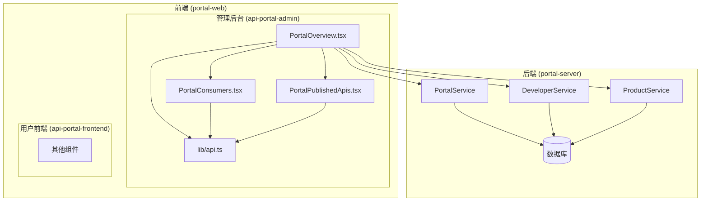
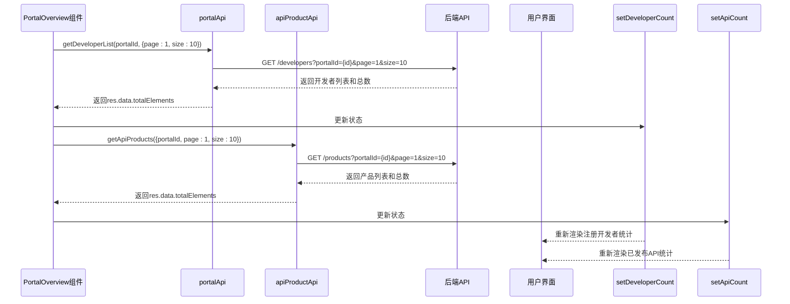
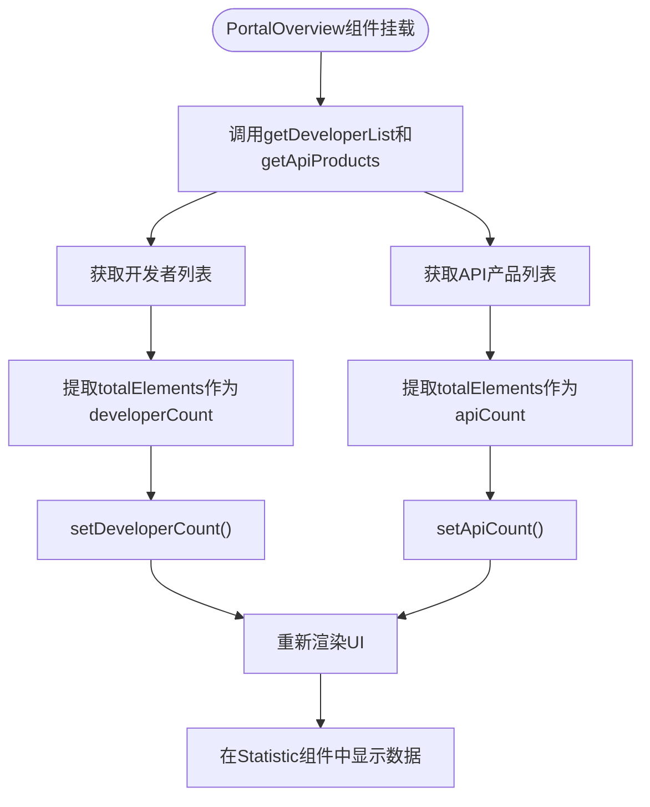
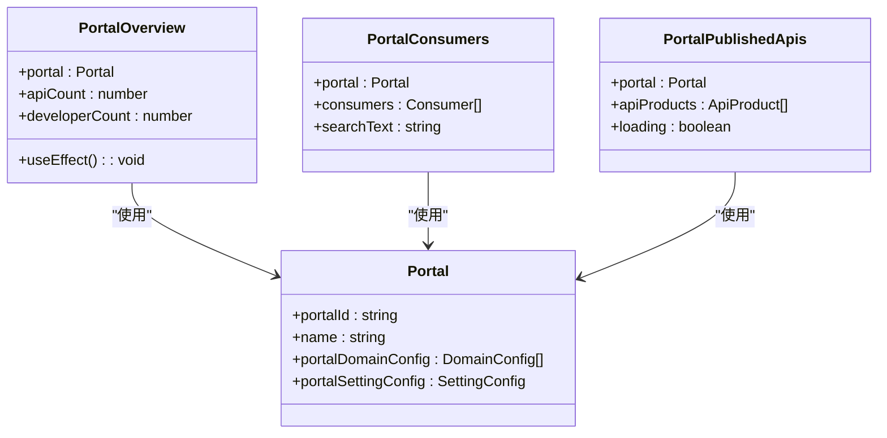
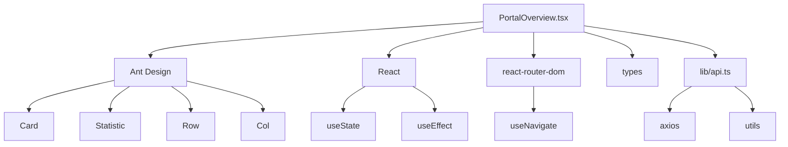

# PortalOverview 组件详解

<cite>
**本文档引用的文件**  
- [PortalOverview.tsx](file://portal-web/api-portal-admin/src/components/portal/PortalOverview.tsx#L1-L166)
- [PortalConsumers.tsx](file://portal-web/api-portal-admin/src/components/portal/PortalConsumers.tsx#L1-L226)
- [PortalPublishedApis.tsx](file://portal-web/api-portal-admin/src/components/portal/PortalPublishedApis.tsx#L1-L265)
- [api.ts](file://portal-web/api-portal-admin/src/lib/api.ts#L1-L252)
</cite>

## 目录
1. [简介](#简介)
2. [项目结构](#项目结构)
3. [核心组件](#核心组件)
4. [架构概览](#架构概览)
5. [详细组件分析](#详细组件分析)
6. [依赖分析](#依赖分析)
7. [性能考虑](#性能考虑)
8. [故障排除指南](#故障排除指南)
9. [结论](#结论)

## 简介
`PortalOverview` 是门户管理系统中的核心视图组件，负责展示特定门户的关键指标和基本信息。该组件通过调用后端服务接口，动态获取并展示已发布的 API 数量、注册开发者总数等核心数据。其设计采用卡片式布局，结合 Ant Design 的统计组件和交互元素，提供直观的数据可视化体验。本文档将深入分析其实现机制、数据流、与子组件的协作关系，并提出性能优化建议。

## 项目结构
`PortalOverview` 组件位于前端管理模块 `api-portal-admin` 的 `components/portal` 目录下，是门户详情页的主要组成部分。整个项目采用典型的前后端分离架构，前端使用 React + TypeScript + Vite 构建，后端提供 RESTful API。

**图示来源**  
- [PortalOverview.tsx](file://portal-web/api-portal-admin/src/components/portal/PortalOverview.tsx#L1-L166)
- [api.ts](file://portal-web/api-portal-admin/src/lib/api.ts#L1-L252)

## 核心组件
`PortalOverview` 组件的核心功能是聚合展示门户的关键业务指标。它通过 `useEffect` 钩子在组件挂载或门户信息变更时，调用 `portalApi` 和 `apiProductApi` 来获取开发者数量和已发布 API 数量。这些数据通过 `useState` 状态管理，并在 UI 中以 `Statistic` 组件的形式动态更新。组件还展示了门户的名称、ID、域名、登录配置等基本信息，并支持点击卡片跳转到相应的管理页面。

**组件来源**  
- [PortalOverview.tsx](file://portal-web/api-portal-admin/src/components/portal/PortalOverview.tsx#L1-L166)

## 架构概览
该组件遵循 React 的函数式组件模式，结合 Hooks 进行状态和副作用管理。其数据流清晰：组件接收 `Portal` 类型的 `portal` 属性作为输入，通过调用封装在 `lib/api.ts` 中的 API 函数与后端通信，获取数据后更新本地状态，最终驱动 UI 渲染。

**图示来源**  
- [PortalOverview.tsx](file://portal-web/api-portal-admin/src/components/portal/PortalOverview.tsx#L25-L45)
- [api.ts](file://portal-web/api-portal-admin/src/lib/api.ts#L50-L90)

## 详细组件分析

### PortalOverview 组件分析
`PortalOverview` 是一个函数式 React 组件，接收 `Portal` 对象作为属性。它使用 `useState` 创建 `apiCount` 和 `developerCount` 两个状态变量来存储统计数据。`useEffect` 钩子是数据获取的核心，它在依赖项 `portal` 变化时执行，分别调用 `portalApi.getDeveloperList` 和 `apiProductApi.getApiProducts` 来获取数据。获取成功后，使用 `setDeveloperCount` 和 `setApiCount` 更新状态，触发组件重新渲染。

#### 组件结构与数据流

**图示来源**  
- [PortalOverview.tsx](file://portal-web/api-portal-admin/src/components/portal/PortalOverview.tsx#L25-L45)

#### 与子组件的组合关系
`PortalOverview` 与 `PortalConsumers` 和 `PortalPublishedApis` 共同构成了门户详情页的完整视图。虽然 `PortalOverview` 本身不直接渲染这两个子组件，但它们在同一个父级路由下，共享 `portal` 数据。`PortalOverview` 提供概览入口，其统计卡片的点击事件会通过 `navigate` 函数跳转到包含 `PortalConsumers` 或 `PortalPublishedApis` 的详情页标签。

**图示来源**  
- [PortalOverview.tsx](file://portal-web/api-portal-admin/src/components/portal/PortalOverview.tsx#L10-L11)
- [PortalConsumers.tsx](file://portal-web/api-portal-admin/src/components/portal/PortalConsumers.tsx#L15-L16)
- [PortalPublishedApis.tsx](file://portal-web/api-portal-admin/src/components/portal/PortalPublishedApis.tsx#L12-L13)

## 依赖分析
`PortalOverview` 组件的依赖关系清晰，主要依赖于 Ant Design 组件库、React Hooks、路由库和自定义的 API 模块。

**图示来源**  
- [PortalOverview.tsx](file://portal-web/api-portal-admin/src/components/portal/PortalOverview.tsx#L1-L10)
- [api.ts](file://portal-web/api-portal-admin/src/lib/api.ts#L1-L10)

## 性能考虑
当前实现存在潜在的性能瓶颈，尤其是在门户关联大量开发者或 API 产品时。`useEffect` 中的 API 调用使用了分页参数 `page=1, size=10`，但目的是为了获取总数 (`totalElements`)，这可能导致不必要的数据传输。

**优化建议：**
1.  **数据缓存策略**：引入 `React Query` 或 `SWR` 等状态管理库，它们内置了数据缓存、自动去重和定时刷新功能，可以有效减少重复的网络请求。
2.  **懒加载机制**：对于 `PortalConsumers` 和 `PortalPublishedApis` 等数据量可能较大的子组件，应实现懒加载。可以在用户切换到对应标签页时再发起数据请求，而不是在门户详情页加载时就全部加载。
3.  **优化API调用**：后端可以提供专门的聚合统计接口（如 `/portals/{id}/stats`），一次性返回门户的开发者总数、API总数等信息，避免前端发起多个请求。

## 故障排除指南
- **统计数据不更新**：检查 `portal` 属性是否正确传递，确认 `useEffect` 的依赖项 `[portal]` 是否包含所有需要监听变化的变量。
- **API调用失败**：检查浏览器开发者工具的网络面板，确认请求URL、参数和认证头（Authorization）是否正确。查看 `lib/api.ts` 中的响应拦截器是否会因401/403状态码而重定向到登录页。
- **点击卡片无反应**：确保 `useNavigate` 钩子正确导入，并且 `navigate` 函数的跳转路径与路由配置匹配。

**组件来源**  
- [PortalOverview.tsx](file://portal-web/api-portal-admin/src/components/portal/PortalOverview.tsx#L25-L45)
- [api.ts](file://portal-web/api-portal-admin/src/lib/api.ts#L100-L120)

## 结论
`PortalOverview` 组件是门户管理系统的数据中枢，通过简洁的卡片布局和动态数据更新，为管理员提供了直观的门户运营概览。其设计合理，依赖清晰，但仍有优化空间。通过引入数据缓存和懒加载机制，可以显著提升在大数据量场景下的响应速度和用户体验。该组件与 `PortalConsumers` 和 `PortalPublishedApis` 等子组件共同构成了一个功能完整、层次分明的门户管理界面。