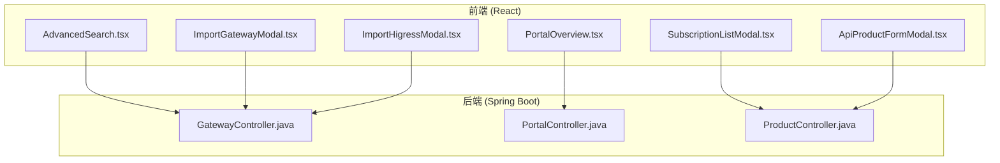
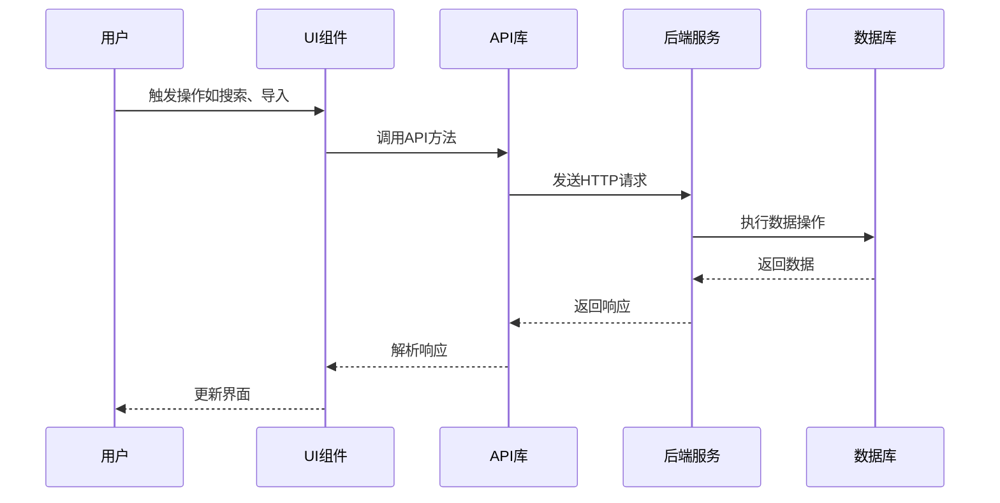
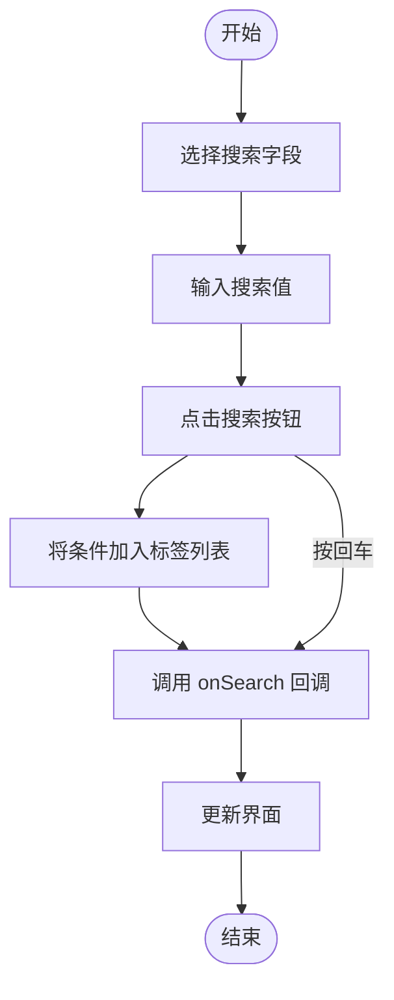
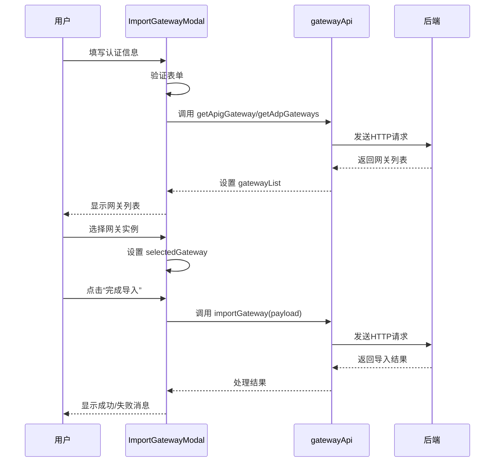
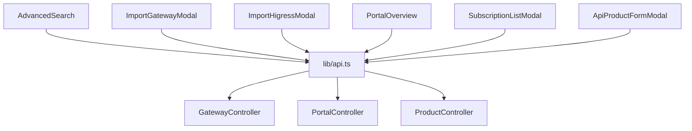

# 关键UI组件详解

<cite>
**本文档引用的文件**  
- [AdvancedSearch.tsx](file://portal-web/api-portal-admin/src/components/common/AdvancedSearch.tsx)
- [ImportGatewayModal.tsx](file://portal-web/api-portal-admin/src/components/console/ImportGatewayModal.tsx)
- [ImportHigressModal.tsx](file://portal-web/api-portal-admin/src/components/console/ImportHigressModal.tsx)
- [PortalOverview.tsx](file://portal-web/api-portal-admin/src/components/portal/PortalOverview.tsx)
- [SubscriptionListModal.tsx](file://portal-web/api-portal-admin/src/components/subscription/SubscriptionListModal.tsx)
- [ApiProductFormModal.tsx](file://portal-web/api-portal-admin/src/components/api-product/ApiProductFormModal.tsx)
</cite>

## 目录
1. [简介](#简介)
2. [项目结构](#项目结构)
3. [核心组件](#核心组件)
4. [架构概览](#架构概览)
5. [详细组件分析](#详细组件分析)
6. [依赖分析](#依赖分析)
7. [性能考虑](#性能考虑)
8. [故障排除指南](#故障排除指南)
9. [结论](#结论)

## 简介
本文档深入解析管理后台中的关键功能性UI组件，涵盖搜索、导入、概览、列表和复杂表单等核心功能。通过代码级分析，为开发者提供可复用、可定制的实现指导。

## 项目结构
本项目采用典型的前后端分离架构，前端基于React + Ant Design构建，后端为Java Spring Boot服务。前端代码位于`portal-web/api-portal-admin`目录，采用功能模块化组织，包含组件（components）、页面（pages）、类型定义（types）和API封装（lib/api.ts）等。

**图示来源**  
- [AdvancedSearch.tsx](file://portal-web/api-portal-admin/src/components/common/AdvancedSearch.tsx)
- [ImportGatewayModal.tsx](file://portal-web/api-portal-admin/src/components/console/ImportGatewayModal.tsx)
- [ImportHigressModal.tsx](file://portal-web/api-portal-admin/src/components/console/ImportHigressModal.tsx)
- [PortalOverview.tsx](file://portal-web/api-portal-admin/src/components/portal/PortalOverview.tsx)
- [SubscriptionListModal.tsx](file://portal-web/api-portal-admin/src/components/subscription/SubscriptionListModal.tsx)
- [ApiProductFormModal.tsx](file://portal-web/api-portal-admin/src/components/api-product/ApiProductFormModal.tsx)
- [GatewayController.java](file://portal-server/src/main/java/com/alibaba/apiopenplatform/controller/GatewayController.java)
- [PortalController.java](file://portal-server/src/main/java/com/alibaba/apiopenplatform/controller/PortalController.java)
- [ProductController.java](file://portal-server/src/main/java/com/alibaba/apiopenplatform/controller/ProductController.java)

## 核心组件
本文档分析的六个核心UI组件均位于`portal-web/api-portal-admin/src/components`目录下，分别服务于不同的管理功能，共同构成了管理后台的交互基础。

**组件来源**  
- [AdvancedSearch.tsx](file://portal-web/api-portal-admin/src/components/common/AdvancedSearch.tsx#L1-L207)
- [ImportGatewayModal.tsx](file://portal-web/api-portal-admin/src/components/console/ImportGatewayModal.tsx#L1-L326)
- [ImportHigressModal.tsx](file://portal-web/api-portal-admin/src/components/console/ImportHigressModal.tsx#L1-L110)
- [PortalOverview.tsx](file://portal-web/api-portal-admin/src/components/portal/PortalOverview.tsx#L1-L167)
- [SubscriptionListModal.tsx](file://portal-web/api-portal-admin/src/components/subscription/SubscriptionListModal.tsx)
- [ApiProductFormModal.tsx](file://portal-web/api-portal-admin/src/components/api-product/ApiProductFormModal.tsx)

## 架构概览
系统采用分层架构，前端组件通过`lib/api.ts`封装的API与后端交互，后端通过`GatewayService`等服务层处理业务逻辑，并与数据库交互。UI组件主要负责数据展示、用户输入和状态管理。

**图示来源**  
- [lib/api.ts](file://portal-web/api-portal-admin/src/lib/api.ts)
- [GatewayController.java](file://portal-server/src/main/java/com/alibaba/apiopenplatform/controller/GatewayController.java)
- [GatewayServiceImpl.java](file://portal-server/src/main/java/com/alibaba/apiopenplatform/service/impl/GatewayServiceImpl.java)

## 详细组件分析

### AdvancedSearch.tsx：高级搜索组件
`AdvancedSearch`组件提供了一个灵活的多条件搜索界面，支持输入框和下拉选择两种搜索类型，并通过标签（Tag）可视化已应用的筛选条件。

#### 功能与实现
- **搜索参数定义**：通过`SearchParam`接口定义搜索字段，包括标签、名称、占位符和类型（输入框或下拉框）。
- **状态管理**：
  - `activeSearchName`：当前选中的搜索字段。
  - `activeSearchValue`：当前输入的搜索值。
  - `tagList`：已应用的搜索条件列表，用于展示和管理。
- **搜索逻辑**：
  1. 用户选择搜索字段或输入值。
  2. 点击搜索按钮或按回车键，将当前条件加入`tagList`。
  3. 调用`onSearch`回调函数，通知父组件执行搜索。
- **标签管理**：
  - 点击标签可重新编辑该条件。
  - 点击标签关闭按钮可清除单个条件。
  - “清除全部”按钮可重置所有条件。

**图示来源**  
- [AdvancedSearch.tsx](file://portal-web/api-portal-admin/src/components/common/AdvancedSearch.tsx#L1-L207)

**组件来源**  
- [AdvancedSearch.tsx](file://portal-web/api-portal-admin/src/components/common/AdvancedSearch.tsx#L1-L207)

### ImportGatewayModal.tsx：网关导入模态框
该组件用于从外部系统（如APIG、ADP AI网关）导入网关实例，支持多种认证方式和分页加载。

#### 表单设计与验证
- **认证信息表单**：
  - **APIG/APIG_AI**：需要Region、Access Key、Secret Key。
  - **ADP_AI_GATEWAY**：需要服务地址、端口、认证方式（Seed或Header）。
    - **Seed认证**：只需输入Seed。
    - **Header认证**：支持动态添加多个Header键值对，使用`Form.List`实现。
- **验证规则**：
  - 所有必填字段均有`required`规则。
  - 服务地址需以`http://`或`https://`开头。
  - 端口号需在1-65535之间，通过自定义`validator`实现。

#### 提交流程
1. 用户填写认证信息并点击“获取网关列表”。
2. 表单验证通过后，调用`gatewayApi.getApigGateway`或`getAdpGateways`获取网关列表。
3. 列表加载后，用户通过单选表格选择一个网关实例。
4. 点击“完成导入”，构造包含网关信息和配置的`payload`，调用`gatewayApi.importGateway`提交。
5. 提交成功后，显示成功消息并关闭模态框。

**图示来源**  
- [ImportGatewayModal.tsx](file://portal-web/api-portal-admin/src/components/console/ImportGatewayModal.tsx#L1-L326)

**组件来源**  
- [ImportGatewayModal.tsx](file://portal-web/api-portal-admin/src/components/console/ImportGatewayModal.tsx#L1-L326)

### ImportHigressModal.tsx：Higress网关导入模态框
该组件用于导入Higress类型的网关实例，相比`ImportGatewayModal`更简单，无需分页加载。

#### 实现细节
- **表单字段**：网关名称、描述、服务地址、用户名、密码。
- **提交流程**：
  1. 用户填写表单并提交。
  2. `handleSubmit`函数构造`requestData`对象，其中`higressConfig`包含地址、用户名和密码。
  3. 调用`gatewayApi.importGateway(requestData)`提交。
  4. 成功后重置表单并关闭模态框。

**组件来源**  
- [ImportHigressModal.tsx](file://portal-web/api-portal-admin/src/components/console/ImportHigressModal.tsx#L1-L110)

### PortalOverview.tsx：门户概览组件
该组件聚合展示单个门户（Portal）的综合信息，包括统计数据和配置详情。

#### 数据聚合与展示
- **数据加载**：`useEffect`在组件挂载时，通过`portalApi.getDeveloperList`和`apiProductApi.getApiProducts`异步获取开发者数量和API产品数量。
- **统计卡片**：使用`Statistic`组件展示关键指标，点击卡片可跳转到详情页。
- **基本信息**：展示门户名称、ID、域名等，域名支持点击跳转。
- **配置状态**：使用`Tag`组件可视化展示账号密码登录、自动审批等配置的启用状态。
- **OIDC配置**：如果存在OIDC配置，则循环渲染每个配置项，展示提供商、Client ID等信息，并对长文本使用`Tooltip`进行省略处理。

**组件来源**  
- [PortalOverview.tsx](file://portal-web/api-portal-admin/src/components/portal/PortalOverview.tsx#L1-L167)

### SubscriptionListModal.tsx：订阅列表模态框
（注：文件内容未提供，基于文件名和上下文推断）

该组件用于展示API产品的订阅者列表，支持分页和筛选。

#### 推断实现
- **列表渲染**：使用`Table`组件展示订阅者信息，如开发者名称、订阅状态、创建时间等。
- **分页机制**：通过`pagination`属性配置分页器，`onChange`回调处理页码和页大小变化，重新调用API获取数据。
- **数据获取**：可能通过`productApi.getSubscriptions`等API获取数据。

**组件来源**  
- [SubscriptionListModal.tsx](file://portal-web/api-portal-admin/src/components/subscription/SubscriptionListModal.tsx)

### ApiProductFormModal.tsx：API产品表单模态框
（注：文件内容未提供，基于文件名和上下文推断）

该组件用于创建或编辑API产品，是一个复杂的多步骤表单。

#### 推断实现
- **多步骤配置**：可能使用`Steps`组件或分页Tabs组织表单，如“基本信息”、“API配置”、“策略设置”等。
- **动态字段渲染**：根据用户选择的产品类型或协议类型，动态显示或隐藏相关配置字段。
- **表单结构**：包含文本输入、选择器、开关、文本域等多种输入控件，可能嵌套`Form.List`处理数组类型数据。

**组件来源**  
- [ApiProductFormModal.tsx](file://portal-web/api-portal-admin/src/components/api-product/ApiProductFormModal.tsx)

## 依赖分析
各组件通过`lib/api.ts`统一与后端API交互，降低了耦合度。`AdvancedSearch`作为通用组件被其他列表页复用。`Import*Modal`组件共享`gatewayApi`，体现了功能内聚。

**图示来源**  
- [lib/api.ts](file://portal-web/api-portal-admin/src/lib/api.ts)
- [GatewayController.java](file://portal-server/src/main/java/com/alibaba/apiopenplatform/controller/GatewayController.java)
- [PortalController.java](file://portal-server/src/main/java/com/alibaba/apiopenplatform/controller/PortalController.java)
- [ProductController.java](file://portal-server/src/main/java/com/alibaba/apiopenplatform/controller/ProductController.java)

## 性能考虑
- **防抖与节流**：`AdvancedSearch`的搜索操作未实现防抖，对于频繁输入可能产生过多请求，建议在`onSearch`前添加防抖逻辑。
- **数据缓存**：`ImportGatewayModal`将认证信息存入`sessionStorage`，避免重复输入，提升了用户体验。
- **按需加载**：`PortalOverview`仅在需要时加载统计数据，避免了不必要的请求。

## 故障排除指南
- **搜索无结果**：检查`onSearch`回调是否正确处理了`searchName`和`searchValue`参数。
- **导入失败**：检查网络请求的`payload`结构是否符合后端要求，特别是`apigConfig`或`higressConfig`的嵌套结构。
- **数据不更新**：确保`useEffect`的依赖项（如`portal`）正确，以触发数据重新加载。
- **表单验证不触发**：确认`Form.Item`的`name`属性与`Form`的`fields`匹配。

**组件来源**  
- [AdvancedSearch.tsx](file://portal-web/api-portal-admin/src/components/common/AdvancedSearch.tsx#L1-L207)
- [ImportGatewayModal.tsx](file://portal-web/api-portal-admin/src/components/console/ImportGatewayModal.tsx#L1-L326)
- [PortalOverview.tsx](file://portal-web/api-portal-admin/src/components/portal/PortalOverview.tsx#L1-L167)

## 结论
本文档详细解析了管理后台的六个关键UI组件，揭示了其设计模式、实现细节和最佳实践。`AdvancedSearch`提供了灵活的搜索能力，`Import*Modal`组件展示了复杂的表单处理和API集成，`PortalOverview`则体现了数据聚合与可视化。这些组件的设计遵循了高内聚、低耦合的原则，为开发者提供了良好的复用和定制基础。建议在实际开发中借鉴其状态管理、错误处理和用户体验优化的策略。