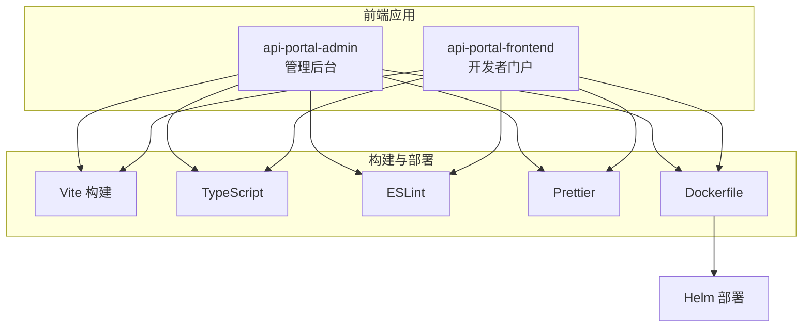

# 前端应用架构

<cite>
**本文档引用的文件**  
- [package.json](file://portal-web/api-portal-admin/package.json)
- [package.json](file://portal-web/api-portal-frontend/package.json)
- [vite.config.ts](file://portal-web/api-portal-admin/vite.config.ts)
- [vite.config.ts](file://portal-web/api-portal-frontend/vite.config.ts)
- [proxy.conf](file://portal-web/api-portal-admin/proxy.conf)
- [proxy.conf](file://portal-web/api-portal-frontend/proxy.conf)
- [Dockerfile](file://portal-web/api-portal-admin/Dockerfile)
- [Dockerfile](file://portal-web/api-portal-frontend/Dockerfile)
- [tsconfig.json](file://portal-web/api-portal-admin/tsconfig.json)
- [tsconfig.json](file://portal-web/api-portal-frontend/tsconfig.json)
</cite>

## 目录
1. [简介](#简介)
2. [项目结构](#项目结构)
3. [核心构建配置](#核心构建配置)
4. [TypeScript 与代码质量保障](#typescript-与代码质量保障)
5. [启动流程与代理配置](#启动流程与代理配置)
6. [容器化与部署集成](#容器化与部署集成)
7. [开发环境搭建指南](#开发环境搭建指南)

## 简介
本文档深入分析 HiMarket 项目的两大前端应用：管理后台（api-portal-admin）和开发者门户（api-portal-frontend）。文档涵盖基于 Vite 的构建系统、TypeScript 类型系统、代码质量工具链、开发代理配置、容器化打包及与 Helm 的部署集成。目标是为新开发者提供清晰的前端架构概览和开发入门指导。

## 项目结构
HiMarket 的前端应用位于 `portal-web` 目录下，包含两个独立的 Vite + React + TypeScript 项目：
- `api-portal-admin`：面向平台管理员的管理后台，提供 API、门户、用户等全量管理功能。
- `api-portal-frontend`：面向开发者的门户前端，提供 API 浏览、注册、订阅和使用等功能。

两个项目共享相似的技术栈和构建配置，但职责分离，便于独立开发和部署。



**图示来源**
- [api-portal-admin](file://portal-web/api-portal-admin)
- [api-portal-frontend](file://portal-web/api-portal-frontend)

## 核心构建配置
### Vite 构建系统
两个前端应用均采用 Vite 作为构建工具，其配置文件为 `vite.config.ts`。Vite 提供了快速的开发服务器启动和高效的生产构建。

#### 别名设置
通过 `resolve.alias` 配置路径别名，简化模块导入。例如：
```ts
// vite.config.ts
export default defineConfig({
  resolve: {
    alias: {
      '@': path.resolve(__dirname, 'src'),
      '@components': path.resolve(__dirname, 'src/components'),
      '@lib': path.resolve(__dirname, 'src/lib'),
      '@types': path.resolve(__dirname, 'src/types'),
    },
  },
})
```
此配置允许使用 `import Layout from '@/components/Layout'` 而非冗长的相对路径。

#### CSS 预处理与 Tailwind CSS
项目集成 Tailwind CSS 进行原子化样式开发。相关配置如下：
- `tailwind.config.js`：定义主题、插件和内容扫描路径。
- `postcss.config.js`：配置 PostCSS，引入 Tailwind 和 Autoprefixer。
- `index.css`：在 `@tailwind` 指令中引入 base、components 和 utilities。

#### 构建优化
Vite 配置中包含生产环境优化：
- `build.outDir`：指定输出目录为 `dist`。
- `build.assetsDir`：静态资源子目录。
- `build.sourcemap`：控制是否生成 sourcemap。
- 利用 Vite 的原生 ES 模块支持和 Rollup 的生产打包能力。

**本节来源**
- [vite.config.ts](file://portal-web/api-portal-admin/vite.config.ts)
- [vite.config.ts](file://portal-web/api-portal-frontend/vite.config.ts)

## TypeScript 与代码质量保障
### TypeScript 类型系统
项目使用 TypeScript (`tsconfig.json`) 提供静态类型检查，提升代码健壮性和可维护性。

#### 核心配置
```json
// tsconfig.json
{
  "compilerOptions": {
    "target": "ES2020",
    "useDefineForClassFields": true,
    "lib": ["ES2020", "DOM", "DOM.Iterable"],
    "module": "ESNext",
    "skipLibCheck": true,
    "allowJs": false,
    "esModuleInterop": false,
    "allowSyntheticDefaultImports": true,
    "strict": true,
    "forceConsistentCasingInFileNames": true,
    "moduleResolution": "node",
    "resolveJsonModule": true,
    "isolatedModules": true,
    "noEmit": true,
    "jsx": "react-jsx",
    "baseUrl": ".",
    "paths": {
      "@/*": ["src/*"],
      "@components/*": ["src/components/*"],
      "@lib/*": ["src/lib/*"],
      "@types/*": ["src/types/*"]
    }
  },
  "include": ["src"]
}
```
- `strict: true` 启用所有严格类型检查选项。
- `paths` 与 Vite 别名保持一致，确保编辑器和编译器识别。
- `noEmit: true` 配合 Vite 使用，由 Vite 负责编译输出。

#### 类型定义
在 `src/types` 目录下定义了项目特定的类型，如 `api-product.ts`、`gateway.ts`、`portal.ts` 等，用于接口数据结构的类型约束。

### 代码质量保障
#### ESLint
`eslint.config.js` 配置了代码检查规则，集成 `@typescript-eslint` 插件以支持 TypeScript，并可能采用 `eslint:recommended` 或团队规范。

#### Prettier
通过 Prettier 统一代码格式。通常与 ESLint 集成（通过 `eslint-config-prettier`），避免规则冲突，并通过编辑器插件或 `pre-commit` 钩子自动格式化。

**本节来源**
- [tsconfig.json](file://portal-web/api-portal-admin/tsconfig.json)
- [tsconfig.json](file://portal-web/api-portal-frontend/tsconfig.json)

## 启动流程与代理配置
### 启动流程
1. **开发环境**：执行 `npm run dev`，Vite 启动开发服务器，默认监听 `localhost:5173`（admin）或 `localhost:5174`（frontend）。
2. **生产环境**：执行 `npm run build`，Vite 将源码编译并输出到 `dist` 目录。
3. **预览环境**：执行 `npm run preview`，启动一个本地服务器来预览生产构建。

### 代理配置
为解决开发时的跨域问题，项目使用 `proxy.conf` 文件配置开发服务器代理。

#### 配置示例
```json
// proxy.conf
{
  "/api": {
    "target": "http://localhost:8080",
    "changeOrigin": true,
    "secure": false
  }
}
```
- **管理后台**：将 `/api` 开头的请求代理到后端服务（如 `portal-server`）的 `8080` 端口。
- **开发者门户**：同样配置代理，确保前端 API 调用能正确转发。

此配置在 Vite 中通过 `server.proxy` 选项加载，实现无缝的前后端联调。

**本节来源**
- [proxy.conf](file://portal-web/api-portal-admin/proxy.conf)
- [proxy.conf](file://portal-web/api-portal-frontend/proxy.conf)

## 容器化与部署集成
### Docker 打包
每个前端应用都有独立的 `Dockerfile`，用于构建生产镜像。

#### Dockerfile 示例
```Dockerfile
# Dockerfile
FROM nginx:alpine
COPY dist /usr/share/nginx/html
COPY nginx.conf /etc/nginx/nginx.conf
EXPOSE 80
CMD ["nginx", "-g", "daemon off;"]
```
1. 基于轻量级的 `nginx:alpine` 镜像。
2. 将 Vite 构建生成的 `dist` 目录复制到 Nginx 的默认 HTML 目录。
3. 覆盖默认的 `nginx.conf` 以配置路由（如 SPA 的 history 模式）。
4. 暴露 80 端口并启动 Nginx 服务。

### Helm 部署集成
前端应用的部署由 Helm Chart 统一管理，位于 `deploy/helm` 目录。

#### 部署资源
- `himarket-admin-deployment.yaml`：定义管理后台的 Deployment，引用其 Docker 镜像。
- `himarket-admin-service.yaml`：定义服务，暴露前端应用。
- `himarket-frontend-deployment.yaml` 和 `himarket-frontend-service.yaml`：同理，用于开发者门户。
- `values.yaml`：包含可配置的参数，如镜像版本、副本数、资源限制等。

通过 `helm install` 或 `helm upgrade` 命令，可以一键部署或更新整个 HiMarket 平台，包括前端、后端和数据库。

**本节来源**
- [Dockerfile](file://portal-web/api-portal-admin/Dockerfile)
- [Dockerfile](file://portal-web/api-portal-frontend/Dockerfile)

## 开发环境搭建指南
1. **克隆仓库**：获取 HiMarket 代码仓库。
2. **安装依赖**：进入 `portal-web/api-portal-admin` 或 `api-portal-frontend` 目录，运行 `npm install`。
3. **配置代理**：确认 `proxy.conf` 中的 `target` 指向正在运行的后端服务地址。
4. **启动应用**：运行 `npm run dev`，浏览器访问 `http://localhost:5173` (admin) 或 `http://localhost:5174` (frontend)。
5. **代码修改**：编辑 `src` 目录下的文件，Vite 会自动热重载。
6. **构建生产包**：运行 `npm run build` 生成 `dist` 目录。
7. **容器化测试**：使用 `docker build -t himarket-admin .` 构建镜像，并用 `docker run -p 8080:80 himarket-admin` 测试。