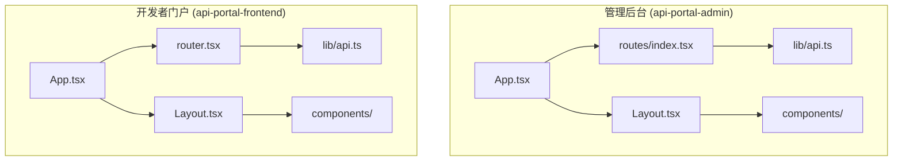
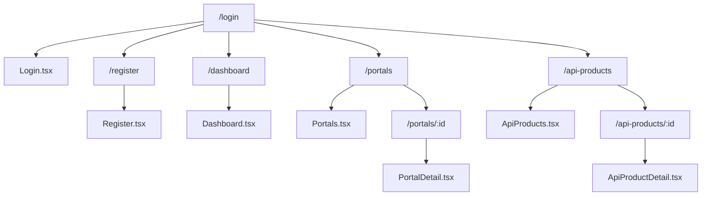
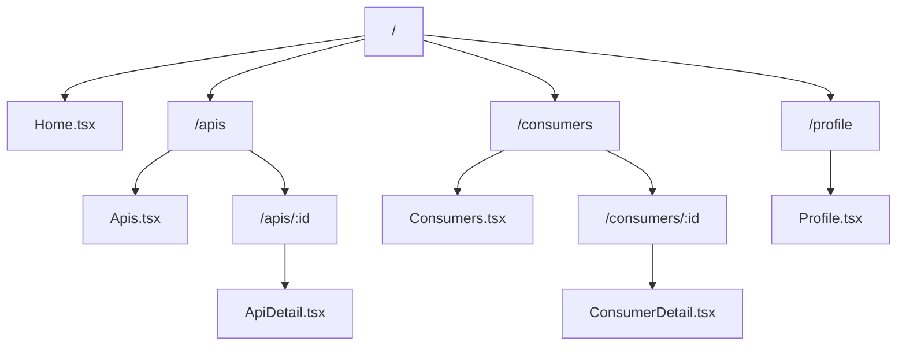

# 前端架构与组件

<cite>
**本文档引用文件**  
- [api.ts](file://portal-web/api-portal-admin/src/lib/api.ts)
- [api.ts](file://portal-web/api-portal-frontend/src/lib/api.ts)
- [index.tsx](file://portal-web/api-portal-admin/src/routes/index.tsx)
- [router.tsx](file://portal-web/api-portal-frontend/src/router.tsx)
- [Layout.tsx](file://portal-web/api-portal-admin/src/components/Layout.tsx)
- [Layout.tsx](file://portal-web/api-portal-frontend/src/components/Layout.tsx)
- [AdvancedSearch.tsx](file://portal-web/api-portal-admin/src/components/common/AdvancedSearch.tsx)
- [ImportGatewayModal.tsx](file://portal-web/api-portal-admin/src/components/console/ImportGatewayModal.tsx)
- [App.tsx](file://portal-web/api-portal-admin/src/App.tsx)
- [App.tsx](file://portal-web/api-portal-frontend/src/App.tsx)
</cite>

## 目录
1. [项目结构](#项目结构)
2. [构建流程与技术栈](#构建流程与技术栈)
3. [路由配置](#路由配置)
4. [核心布局组件](#核心布局组件)
5. [API客户端封装](#api客户端封装)
6. [关键UI组件分析](#关键ui组件分析)
7. [状态管理与上下文](#状态管理与上下文)
8. [开发指南](#开发指南)

## 项目结构

Himarket前端应用由两个独立的React项目构成：管理后台（api-portal-admin）和开发者门户（api-portal-frontend），均基于Vite构建。两个项目共享相似的技术栈，包括TypeScript、React、Tailwind CSS和Ant Design组件库。



**图示来源**  
- [App.tsx](file://portal-web/api-portal-admin/src/App.tsx)
- [App.tsx](file://portal-web/api-portal-frontend/src/App.tsx)
- [routes/index.tsx](file://portal-web/api-portal-admin/src/routes/index.tsx)
- [router.tsx](file://portal-web/api-portal-frontend/src/router.tsx)

**本节来源**  
- [App.tsx](file://portal-web/api-portal-admin/src/App.tsx)
- [App.tsx](file://portal-web/api-portal-frontend/src/App.tsx)

## 构建流程与技术栈

Himarket前端采用现代化的前端构建工具链，以Vite为核心构建工具，提供快速的开发服务器启动和热模块替换（HMR）功能。项目使用TypeScript进行类型安全开发，结合ESLint和Prettier保证代码质量和风格统一。

构建配置通过`vite.config.ts`定义，包含别名配置、CSS预处理（Tailwind）、代理设置（proxy.conf）等。生产构建输出静态资源，通过Nginx容器化部署。

**本节来源**  
- [vite.config.ts](file://portal-web/api-portal-admin/vite.config.ts)
- [vite.config.ts](file://portal-web/api-portal-frontend/vite.config.ts)

## 路由配置

### 管理后台路由
管理后台使用`react-router-dom`进行路由管理，路由配置集中定义在`src/routes/index.tsx`文件中。采用基于组件的路由组织方式，通过嵌套路由实现页面层级结构。



**图示来源**  
- [index.tsx](file://portal-web/api-portal-admin/src/routes/index.tsx)

**本节来源**  
- [index.tsx](file://portal-web/api-portal-admin/src/routes/index.tsx)

### 开发者门户路由
开发者门户的路由配置位于`src/router.tsx`，结构更为简洁，主要面向开发者使用场景，包含API浏览、消费者管理、个人资料等核心功能。



**图示来源**  
- [router.tsx](file://portal-web/api-portal-frontend/src/router.tsx)

**本节来源**  
- [router.tsx](file://portal-web/api-portal-frontend/src/router.tsx)

## 核心布局组件

### 管理后台布局
管理后台的`Layout.tsx`组件实现了标准的管理界面布局，包含顶部导航栏、侧边菜单栏和主内容区域。采用响应式设计，支持移动端适配。

```tsx
function Layout() {
  return (
    <div className="h-screen flex flex-col">
      <Header />
      <div className="flex flex-1 overflow-hidden">
        <Sidebar />
        <main className="flex-1 overflow-y-auto p-6">
          <Outlet />
        </main>
      </div>
    </div>
  );
}
```

该布局通过React Router的`Outlet`组件实现内容区域的动态渲染，支持路由嵌套。布局组件还集成了权限控制逻辑，根据用户角色显示不同的菜单项。

**图示来源**  
- [Layout.tsx](file://portal-web/api-portal-admin/src/components/Layout.tsx)

**本节来源**  
- [Layout.tsx](file://portal-web/api-portal-admin/src/components/Layout.tsx)

### 开发者门户布局
开发者门户的`Layout.tsx`组件设计更为简洁，突出内容展示，包含导航栏、面包屑和主要内容区域，适合开发者浏览API文档和管理订阅。

```tsx
function Layout() {
  return (
    <div className="min-h-screen bg-gray-50">
      <Navigation />
      <div className="container mx-auto px-4 py-6">
        <Outlet />
      </div>
    </div>
  );
}
```

**图示来源**  
- [Layout.tsx](file://portal-web/api-portal-frontend/src/components/Layout.tsx)

**本节来源**  
- [Layout.tsx](file://portal-web/api-portal-frontend/src/components/Layout.tsx)

## API客户端封装

### 统一API客户端
两个前端项目均在`lib/api.ts`中封装了对后端RESTful API的调用，使用`axios`作为HTTP客户端，实现了请求拦截、响应拦截、错误处理和认证令牌注入等核心功能。

```tsx
import axios from 'axios';

const apiClient = axios.create({
  baseURL: import.meta.env.VITE_API_BASE_URL,
  timeout: 10000,
});

// 请求拦截器：注入认证令牌
apiClient.interceptors.request.use(
  (config) => {
    const token = localStorage.getItem('authToken');
    if (token) {
      config.headers.Authorization = `Bearer ${token}`;
    }
    return config;
  },
  (error) => Promise.reject(error)
);

// 响应拦截器：统一错误处理
apiClient.interceptors.response.use(
  (response) => response.data,
  (error) => {
    if (error.response?.status === 401) {
      localStorage.removeItem('authToken');
      window.location.href = '/login';
    }
    return Promise.reject(error);
  }
);

export default apiClient;
```

### API方法封装
在基础客户端之上，项目封装了具体的API方法，按功能模块组织，如门户管理、产品管理、网关管理等，提供类型安全的接口调用。

```tsx
// 示例：门户相关API
export const portalApi = {
  getList: () => apiClient.get('/portals'),
  getById: (id: string) => apiClient.get(`/portals/${id}`),
  create: (data: CreatePortalParam) => apiClient.post('/portals', data),
  update: (id: string, data: UpdatePortalParam) => apiClient.put(`/portals/${id}`, data),
  delete: (id: string) => apiClient.delete(`/portals/${id}`),
};
```

**图示来源**  
- [api.ts](file://portal-web/api-portal-admin/src/lib/api.ts)
- [api.ts](file://portal-web/api-portal-frontend/src/lib/api.ts)

**本节来源**  
- [api.ts](file://portal-web/api-portal-admin/src/lib/api.ts)
- [api.ts](file://portal-web/api-portal-frontend/src/lib/api.ts)

## 关键UI组件分析

### AdvancedSearch 高级搜索组件
`AdvancedSearch.tsx`组件为管理后台提供了灵活的搜索功能，支持多字段条件筛选、关键字搜索和结果排序。组件采用受控组件模式，通过props接收搜索配置和回调函数。

```tsx
interface AdvancedSearchProps {
  fields: SearchField[];
  onSearch: (conditions: SearchCondition[]) => void;
  onReset: () => void;
}

function AdvancedSearch({ fields, onSearch, onReset }: AdvancedSearchProps) {
  const [conditions, setConditions] = useState<SearchCondition[]>([]);
  
  const handleAddCondition = () => {
    // 添加搜索条件
  };

  const handleRemoveCondition = (index: number) => {
    // 移除搜索条件
  };

  const handleSubmit = () => {
    onSearch(conditions.filter(c => c.value));
  };

  return (
    <div className="bg-white p-4 rounded-lg shadow">
      {/* 搜索条件表单 */}
      {conditions.map((cond, index) => (
        <SearchConditionItem 
          key={index} 
          field={cond.field}
          value={cond.value}
          onChange={(value) => {/* 更新值 */}}
          onRemove={() => handleRemoveCondition(index)}
        />
      ))}
      <div className="flex gap-2">
        <Button onClick={handleAddCondition}>添加条件</Button>
        <Button onClick={onReset}>重置</Button>
        <Button type="primary" onClick={handleSubmit}>搜索</Button>
      </div>
    </div>
  );
}
```

该组件体现了可复用UI组件的设计原则，通过配置化的方式适应不同页面的搜索需求。

**图示来源**  
- [AdvancedSearch.tsx](file://portal-web/api-portal-admin/src/components/common/AdvancedSearch.tsx)

**本节来源**  
- [AdvancedSearch.tsx](file://portal-web/api-portal-admin/src/components/common/AdvancedSearch.tsx)

### ImportGatewayModal 网关导入模态框
`ImportGatewayModal.tsx`组件用于导入API网关实例，提供表单输入、数据验证和提交处理的完整流程。组件使用Ant Design的Modal和Form组件构建，确保用户体验一致性。

```tsx
function ImportGatewayModal({ visible, onClose, onSuccess }) {
  const [form] = Form.useForm();
  
  const handleSubmit = async () => {
    try {
      const values = await form.validateFields();
      const result = await gatewayApi.import(values);
      message.success('网关导入成功');
      onSuccess?.(result);
      onClose();
    } catch (error) {
      message.error('导入失败：' + error.message);
    }
  };

  return (
    <Modal
      title="导入网关"
      open={visible}
      onOk={handleSubmit}
      onCancel={onClose}
      width={800}
    >
      <Form form={form} layout="vertical">
        <Form.Item name="type" label="网关类型" rules={[{ required: true }]}>
          <GatewayTypeSelector />
        </Form.Item>
        <Form.Item name="name" label="网关名称" rules={[{ required: true }]}>
          <Input />
        </Form.Item>
        {/* 其他表单项 */}
      </Form>
    </Modal>
  );
}
```

该组件展示了复杂表单处理的最佳实践，包括异步提交、错误处理和成功回调。

**图示来源**  
- [ImportGatewayModal.tsx](file://portal-web/api-portal-admin/src/components/console/ImportGatewayModal.tsx)

**本节来源**  
- [ImportGatewayModal.tsx](file://portal-web/api-portal-admin/src/components/console/ImportGatewayModal.tsx)

## 状态管理与上下文

项目采用React Context API进行全局状态管理，避免了引入额外的状态管理库的复杂性。在`contexts/LoadingContext.tsx`中定义了全局加载状态，供多个组件共享。

```tsx
// LoadingContext.tsx
const LoadingContext = createContext<{
  loading: boolean;
  setLoading: (loading: boolean) => void;
}>({
  loading: false,
  setLoading: () => {},
});

export function LoadingProvider({ children }) {
  const [loading, setLoading] = useState(false);
  
  return (
    <LoadingContext.Provider value={{ loading, setLoading }}>
      {children}
    </LoadingContext.Provider>
  );
}
```

在需要显示加载状态的组件中，通过`useContext`消费该上下文：

```tsx
const { setLoading } = useContext(LoadingContext);
useEffect(() => {
  setLoading(true);
  fetchData().finally(() => setLoading(false));
}, []);
```

这种轻量级的状态管理方案适合中小型应用，降低了项目复杂度。

**本节来源**  
- [LoadingContext.tsx](file://portal-web/api-portal-admin/src/contexts/LoadingContext.tsx)

## 开发指南

### 新增页面流程
1. 在`pages/`目录下创建新页面组件
2. 在路由配置中添加新路由
3. 如需布局，确保在正确布局组件内渲染
4. 通过API客户端获取数据
5. 使用Ant Design组件构建UI

### 组件开发规范
- 组件文件命名采用PascalCase（如`UserProfileCard.tsx`）
- 组件按功能组织在`components/`目录下
- 复用组件放置在`components/common/`目录
- 类型定义统一在`types/`目录管理
- 样式优先使用Tailwind CSS实用类

### API调用最佳实践
- 所有API调用必须通过`lib/api.ts`封装
- 为新API端点在对应模块中添加类型安全的方法
- 处理可能的网络错误和认证失效
- 在UI中提供适当的加载状态和错误提示

**本节来源**  
- [App.tsx](file://portal-web/api-portal-admin/src/App.tsx)
- [App.tsx](file://portal-web/api-portal-frontend/src/App.tsx)
- [api.ts](file://portal-web/api-portal-admin/src/lib/api.ts)
- [types/index.ts](file://portal-web/api-portal-admin/src/types/index.ts)