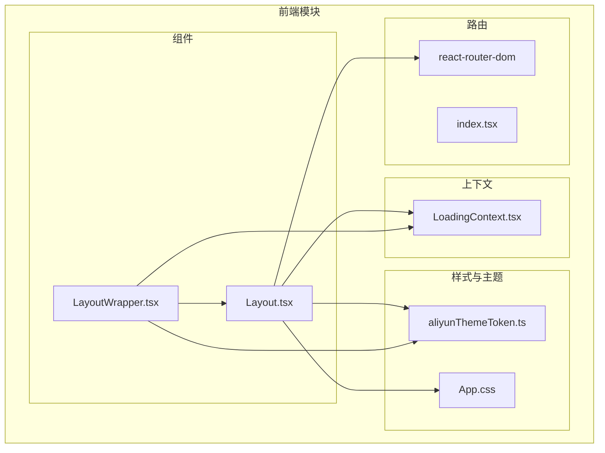
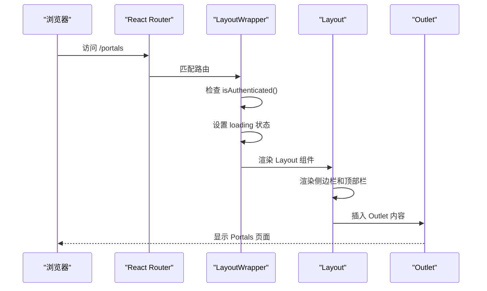
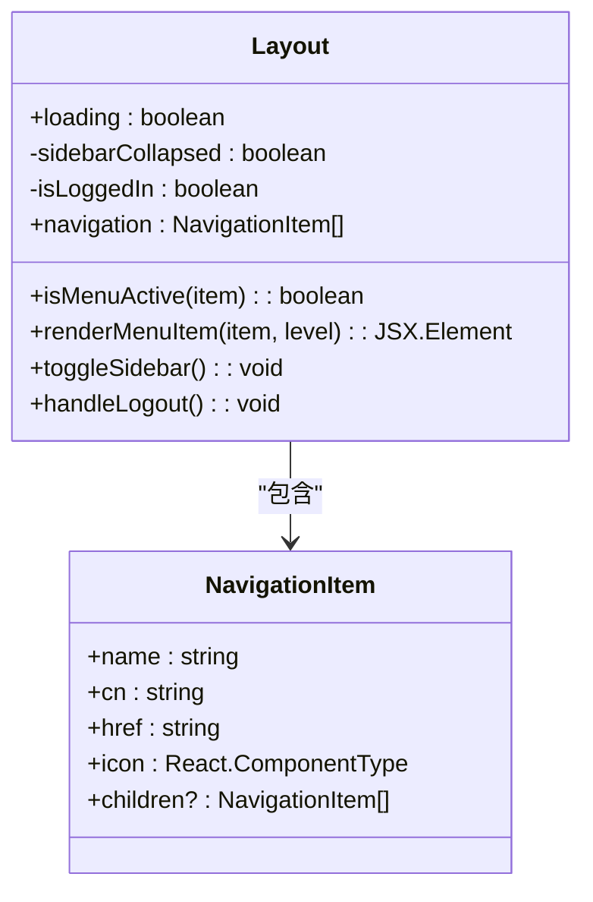
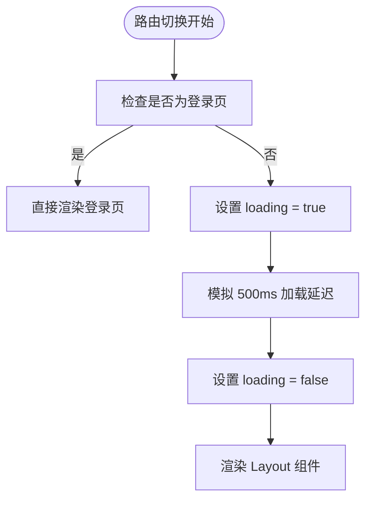
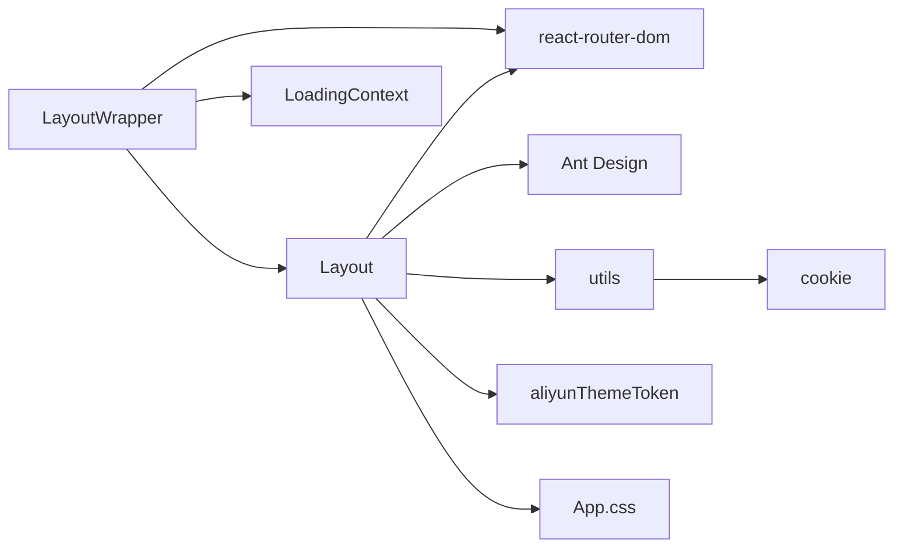

# 核心布局组件

<cite>
**本文档引用的文件**  
- [Layout.tsx](file://portal-web/api-portal-admin/src/components/Layout.tsx)
- [LayoutWrapper.tsx](file://portal-web/api-portal-admin/src/components/LayoutWrapper.tsx)
- [aliyunThemeToken.ts](file://portal-web/api-portal-admin/src/aliyunThemeToken.ts)
- [App.css](file://portal-web/api-portal-admin/src/App.css)
</cite>

## 目录
1. [简介](#简介)
2. [项目结构](#项目结构)
3. [核心组件](#核心组件)
4. [架构概览](#架构概览)
5. [详细组件分析](#详细组件分析)
6. [依赖分析](#依赖分析)
7. [性能考虑](#性能考虑)
8. [故障排除指南](#故障排除指南)
9. [结论](#结论)

## 简介
本文档深入剖析管理后台的核心布局组件 `Layout.tsx` 和 `LayoutWrapper.tsx`，重点分析其响应式设计、主题定制、路由集成及可扩展性。文档旨在为开发者提供清晰的实现原理和复用指导，帮助理解如何构建现代化的管理界面布局。

## 项目结构
核心布局组件位于 `portal-web/api-portal-admin/src/components/` 目录下，是管理后台前端应用的视觉骨架。其与主题配置、全局样式和路由系统紧密协作，共同构成用户界面的基础。



**图示来源**  
- [Layout.tsx](file://portal-web/api-portal-admin/src/components/Layout.tsx)
- [LayoutWrapper.tsx](file://portal-web/api-portal-admin/src/components/LayoutWrapper.tsx)
- [aliyunThemeToken.ts](file://portal-web/api-portal-admin/src/aliyunThemeToken.ts)

## 核心组件
核心布局由 `Layout` 和 `LayoutWrapper` 两个组件协同工作。`Layout` 负责定义UI结构，`LayoutWrapper` 则处理路由逻辑和权限控制。

## 架构概览
系统采用分层架构，`LayoutWrapper` 作为路由守卫，确保用户登录状态；`Layout` 组件则专注于渲染导航结构和内容区域。



**图示来源**  
- [LayoutWrapper.tsx](file://portal-web/api-portal-admin/src/components/LayoutWrapper.tsx#L10-L45)
- [Layout.tsx](file://portal-web/api-portal-admin/src/components/Layout.tsx#L1-L215)

## 详细组件分析

### Layout 组件分析
`Layout` 组件是管理后台的视觉容器，实现了响应式侧边栏、动态菜单和骨架屏加载效果。

#### 响应式设计与结构实现
组件采用 Flexbox 布局，通过 `sidebarCollapsed` 状态控制侧边栏的展开与折叠。当屏幕尺寸较小时，侧边栏自动收起，仅显示图标。



**图示来源**  
- [Layout.tsx](file://portal-web/api-portal-admin/src/components/Layout.tsx#L15-L215)

**本节来源**  
- [Layout.tsx](file://portal-web/api-portal-admin/src/components/Layout.tsx#L1-L215)

#### 侧边栏与菜单高亮
侧边栏菜单通过 `navigation` 数组定义，支持多级嵌套。`isMenuActive` 函数根据当前 `location.pathname` 判断菜单项是否处于激活状态，实现高亮。

```typescript
// 菜单激活逻辑
const isMenuActive = (item: NavigationItem): boolean => {
  if (location.pathname === item.href) return true
  if (item.children) {
    return item.children.some(child => location.pathname === child.href)
  }
  return false
}
```

#### 骨架屏加载状态
当 `loading` 属性为 `true` 时，组件会渲染 Ant Design 的 `Skeleton` 组件，模拟内容加载时的占位效果，提升用户体验。

### LayoutWrapper 组件分析
`LayoutWrapper` 是 `Layout` 的包装器，负责权限验证和页面加载状态管理。

#### 路由与权限集成
组件通过 `useLocation` 监听路由变化，并使用 `isAuthenticated` 函数检查本地存储中的 `token`。若用户未登录且不在登录页，则重定向至 `/login`。

```typescript
// 权限验证逻辑
if (!isAuthenticated() && !isLoginPage) {
  return <Navigate to="/login" replace />;
}
```

#### 页面切换动画
通过 `useLoading` 上下文，在路由切换时设置 `loading` 状态。`setTimeout` 模拟了短暂的加载过程，为页面切换提供平滑过渡。



**图示来源**  
- [LayoutWrapper.tsx](file://portal-web/api-portal-admin/src/components/LayoutWrapper.tsx#L10-L45)

**本节来源**  
- [LayoutWrapper.tsx](file://portal-web/api-portal-admin/src/components/LayoutWrapper.tsx#L1-L47)

## 依赖分析
布局组件依赖于多个外部库和内部模块，形成了清晰的依赖链。



**图示来源**  
- [Layout.tsx](file://portal-web/api-portal-admin/src/components/Layout.tsx)
- [LayoutWrapper.tsx](file://portal-web/api-portal-admin/src/components/LayoutWrapper.tsx)

## 性能考虑
- **骨架屏**：使用 `Skeleton` 组件避免页面内容的突然跳动，提升感知性能。
- **状态管理**：`useEffect` 中正确清理事件监听器，防止内存泄漏。
- **条件渲染**：仅在必要时渲染子菜单，减少不必要的 DOM 操作。

## 故障排除指南
- **问题：登录后无法跳转到主页**
  - 检查 `localStorage` 中的 `token` 是否正确设置。
  - 确认 `isAuthenticated` 工具函数的实现逻辑。
- **问题：侧边栏无法折叠**
  - 检查 `toggleSidebar` 函数是否被正确绑定。
  - 确认 `useState` 的初始值和更新逻辑。
- **问题：菜单高亮失效**
  - 检查 `location.pathname` 是否与 `href` 完全匹配。
  - 确认 `isMenuActive` 函数的逻辑是否覆盖了所有情况。

**本节来源**  
- [Layout.tsx](file://portal-web/api-portal-admin/src/components/Layout.tsx#L100-L150)
- [LayoutWrapper.tsx](file://portal-web/api-portal-admin/src/components/LayoutWrapper.tsx#L15-L25)

## 结论
`Layout` 和 `LayoutWrapper` 组件共同构建了一个功能完整、响应式的管理后台布局。通过合理的状态管理、权限控制和用户体验优化，为上层业务组件提供了稳定的基础。开发者可基于此结构轻松扩展新功能。