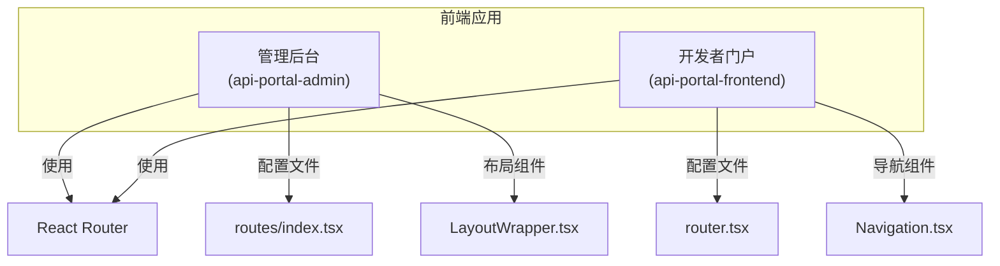
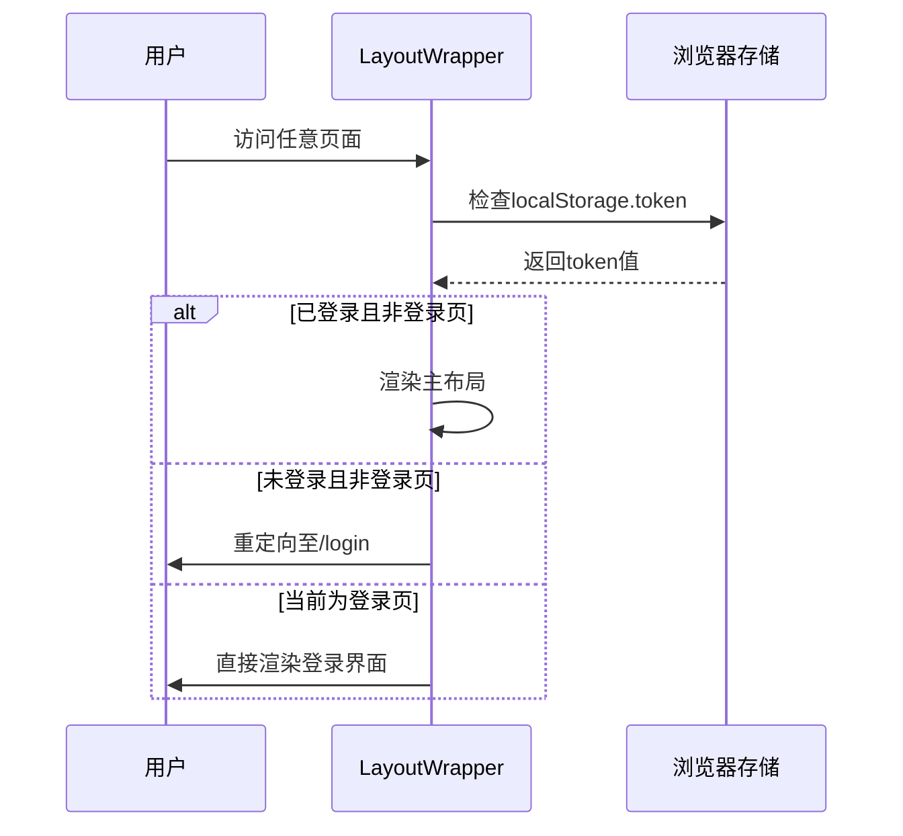
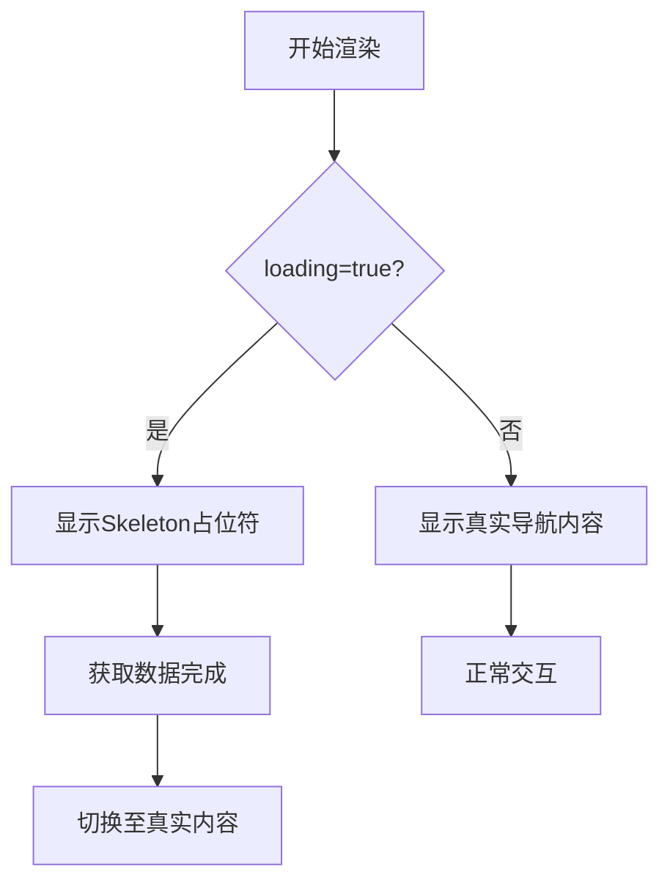

# 路由与导航系统

<cite>
**本文档引用文件**  
- [portal-web/api-portal-admin/src/routes/index.tsx](file://portal-web/api-portal-admin/src/routes/index.tsx#L1-L58)
- [portal-web/api-portal-frontend/src/router.tsx](file://portal-web/api-portal-frontend/src/router.tsx#L1-L33)
- [portal-web/api-portal-frontend/src/components/Navigation.tsx](file://portal-web/api-portal-frontend/src/components/Navigation.tsx#L1-L102)
- [portal-web/api-portal-admin/src/components/LayoutWrapper.tsx](file://portal-web/api-portal-admin/src/components/LayoutWrapper.tsx#L1-L46)
</cite>

## 目录
1. [简介](#简介)
2. [项目结构概览](#项目结构概览)
3. [核心路由机制分析](#核心路由机制分析)
4. [管理后台路由配置](#管理后台路由配置)
5. [开发者门户路由逻辑](#开发者门户路由逻辑)
6. [导航菜单动态生成](#导航菜单动态生成)
7. [布局与路由协调机制](#布局与路由协调机制)
8. [路由使用示例](#路由使用示例)
9. [新增路由页面指南](#新增路由页面指南)
10. [结论](#结论)

## 简介
Himarket前端系统包含两个主要应用：管理后台（api-portal-admin）和开发者门户（api-portal-frontend），分别服务于平台管理员和开发者用户。本系统基于React技术栈构建，采用React Router作为核心路由解决方案。本文档深入解析其路由配置机制、权限控制策略、导航生成逻辑及布局协调方式，为开发人员提供全面的技术指导。

## 项目结构概览
Himarket前端代码位于`portal-web`目录下，分为两个子应用：
- **api-portal-admin**：管理后台，面向平台运营人员
- **api-portal-frontend**：开发者门户，面向外部开发者

每个子应用独立配置路由系统，体现了前后端分离架构下的模块化设计思想。



**图示来源**  
- [portal-web/api-portal-admin/src/routes/index.tsx](file://portal-web/api-portal-admin/src/routes/index.tsx#L1-L58)
- [portal-web/api-portal-frontend/src/router.tsx](file://portal-web/api-portal-frontend/src/router.tsx#L1-L33)
- [portal-web/api-portal-frontend/src/components/Navigation.tsx](file://portal-web/api-portal-frontend/src/components/Navigation.tsx#L1-L102)
- [portal-web/api-portal-admin/src/components/LayoutWrapper.tsx](file://portal-web/api-portal-admin/src/components/LayoutWrapper.tsx#L1-L46)

## 核心路由机制分析
Himarket前端采用React Router v6作为路由解决方案，通过声明式编程实现URL与UI组件的映射。两个子应用分别采用不同的API风格：
- 管理后台使用`createBrowserRouter`创建基于浏览器历史记录的路由器
- 开发者门户使用`<Routes>`和`<Route>`组件进行路由定义

这种差异化设计反映了不同应用场景的需求差异：管理后台需要更复杂的路由嵌套和守卫机制，而开发者门户侧重简洁直观的导航体验。

## 管理后台路由配置

### 路由定义与结构
管理后台的路由配置位于`routes/index.tsx`文件中，使用`createBrowserRouter`函数创建路由实例。该配置采用树形结构组织路由，支持嵌套路由。

```typescript
export const router = createBrowserRouter([
  {
    path: '/login',
    element: <Login />,
  },
  {
    path: '/',
    element: <LayoutWrapper />,
    children: [
      { index: true, element: <Navigate to="/portals" replace /> },
      { path: 'portals', element: <Portals /> },
      { path: 'portals/detail', element: <PortalDetail /> },
      // 其他子路由...
    ],
  },
]);
```

**关键特性：**
- **懒加载支持**：可通过`lazy`函数实现组件懒加载
- **嵌套路由**：通过`children`属性实现布局级路由嵌套
- **重定向**：使用`<Navigate>`组件实现路由跳转

### 路由守卫与权限控制
权限控制逻辑实现在`LayoutWrapper.tsx`组件中，通过React的`useEffect`和路由钩子实现。



**图示来源**  
- [portal-web/api-portal-admin/src/components/LayoutWrapper.tsx](file://portal-web/api-portal-admin/src/components/LayoutWrapper.tsx#L1-L46)

#### 权限验证实现
```typescript
const isAuthenticated = () => {
  return localStorage.getItem('token') !== null;
};
```

该函数检查本地存储中的认证令牌，是权限判断的核心依据。

#### 路由守卫逻辑
```typescript
if (!isAuthenticated() && !isLoginPage) {
  return <Navigate to="/login" replace />;
}
```

此逻辑确保未认证用户无法访问受保护资源，体现了前端安全的基本原则。

### 加载状态管理
`LayoutWrapper`还集成了加载状态管理，利用`LoadingContext`在路由切换时显示加载指示器：

```typescript
useEffect(() => {
  if (!isLoginPage) {
    setLoading(true);
    const timer = setTimeout(() => {
      setLoading(false);
    }, 500);
    return () => clearTimeout(timer);
  }
}, [location.pathname, setLoading, isLoginPage]);
```

**节流机制**：设置500ms延迟避免短暂闪烁，提升用户体验。

**本节来源**  
- [portal-web/api-portal-admin/src/routes/index.tsx](file://portal-web/api-portal-admin/src/routes/index.tsx#L1-L58)
- [portal-web/api-portal-admin/src/components/LayoutWrapper.tsx](file://portal-web/api-portal-admin/src/components/LayoutWrapper.tsx#L1-L46)

## 开发者门户路由逻辑
开发者门户的路由配置位于`router.tsx`文件中，采用组件化方式定义路由。

### 路由定义方式
```typescript
export function Router() {
  return (
    <Routes>
      <Route path="/" element={<Home />} />
      <Route path="/apis/:id" element={<ApiDetail />} />
      {/* 其他路由... */}
    </Routes>
  );
}
```

**特点分析：**
- **简洁直观**：直接在JSX中定义路由映射
- **参数传递**：支持动态路由参数（如`:id`）
- **易于维护**：适合中小型应用的路由管理

### 动态参数处理
系统支持从URL中提取参数，例如API详情页：

```typescript
<Route path="/apis/:id" element={<ApiDetail />} />
```

在`ApiDetail`组件中可通过`useParams()`钩子获取`:id`参数值，实现内容动态渲染。

**本节来源**  
- [portal-web/api-portal-frontend/src/router.tsx](file://portal-web/api-portal-frontend/src/router.tsx#L1-L33)

## 导航菜单动态生成
导航组件`Navigation.tsx`负责在开发者门户中生成顶部导航栏。

### 激活状态检测
通过`useLocation`钩子监听当前路径，并判断导航项是否处于激活状态：

```typescript
const isActive = (path: string) => {
  if (path === '/') {
    return location.pathname === '/';
  }
  return location.pathname.startsWith(path);
};
```

此逻辑确保"/"路径仅在首页完全匹配时激活，其他路径采用前缀匹配策略。

### 样式动态应用
根据激活状态动态应用CSS类名：

```typescript
const getNavLinkClass = (path: string) => {
  const baseClass = "font-medium transition-colors";
  return isActive(path) 
    ? `${baseClass} text-blue-600 border-b-2 border-blue-600 pb-1` 
    : `${baseClass} text-gray-700 hover:text-gray-900`;
};
```

视觉反馈包括蓝色下划线和文字颜色变化，符合现代Web设计规范。

### 加载状态处理
组件支持`loading`属性，在数据加载期间显示骨架屏（Skeleton）：



**图示来源**  
- [portal-web/api-portal-frontend/src/components/Navigation.tsx](file://portal-web/api-portal-frontend/src/components/Navigation.tsx#L1-L102)

**本节来源**  
- [portal-web/api-portal-frontend/src/components/Navigation.tsx](file://portal-web/api-portal-frontend/src/components/Navigation.tsx#L1-L102)

## 布局与路由协调机制
`LayoutWrapper.tsx`组件在管理后台中扮演着关键角色，协调布局与路由内容的渲染。

### 组件职责
1. **权限验证**：拦截未授权访问
2. **加载控制**：管理页面切换时的加载状态
3. **布局包装**：包裹主布局组件`<Layout>`
4. **内容插槽**：通过`<Outlet>`渲染子路由内容

### 技术实现要点
- **上下文消费**：使用`useLoading`从`LoadingContext`读取状态
- **副作用管理**：`useEffect`监听路由变化并更新加载状态
- **条件渲染**：根据不同条件返回不同React元素

这种设计模式实现了关注点分离，使路由逻辑与UI表现解耦。

**本节来源**  
- [portal-web/api-portal-admin/src/components/LayoutWrapper.tsx](file://portal-web/api-portal-admin/src/components/LayoutWrapper.tsx#L1-L46)

## 路由使用示例

### 路由跳转
```typescript
// 编程式导航
import { useNavigate } from 'react-router-dom';

const navigate = useNavigate();
navigate('/portals'); // 跳转到门户列表页

// 声明式导航
<Link to="/login">登录</Link>
```

### 参数传递
```typescript
// 传递参数
navigate(`/apis/${apiId}`);

// 接收参数
import { useParams } from 'react-router-dom';
const { id } = useParams();
```

### 嵌套路由
管理后台中，`/consoles`路径下嵌套了`/gateway`和`/nacos`子路由，通过`children`配置实现：

```typescript
{
  path: 'consoles',
  element: <Navigate to="/consoles/gateway" replace />,
  children: [
    { path: 'gateway', element: <GatewayConsoles /> },
    { path: 'nacos', element: <NacosConsoles /> }
  ]
}
```

## 新增路由页面指南
### 步骤一：创建页面组件
在`pages`目录下创建新页面文件，如`NewPage.tsx`。

### 步骤二：导入路由配置
#### 管理后台
```typescript
// 在routes/index.tsx中
import NewPage from '@/pages/NewPage';

// 添加到children数组
{
  path: 'new-page',
  element: <NewPage />
}
```

#### 开发者门户
```typescript
// 在router.tsx中
import NewPage from "./pages/NewPage";

// 添加Route
<Route path="/new-page" element={<NewPage />} />
```

### 步骤三：添加导航链接（如需）
在`Navigation.tsx`中添加新的`<Link>`：

```tsx
<Link to="/new-page" className={getNavLinkClass('/new-page')}>
  新功能
</Link>
```

### 注意事项
- 确保路径唯一性，避免冲突
- 考虑权限需求，必要时在`LayoutWrapper`中添加验证逻辑
- 遵循现有代码风格，保持一致性

## 结论
Himarket前端的路由系统展现了现代化React应用的最佳实践。管理后台通过`createBrowserRouter`和`LayoutWrapper`实现了复杂的权限控制和嵌套路由，而开发者门户则采用简洁的组件化路由定义，兼顾了灵活性与可维护性。导航组件`Navigation`利用React Router的钩子实现了智能的激活状态管理，配合骨架屏提升了用户体验。整体架构清晰，职责分明，为系统的持续演进奠定了坚实基础。