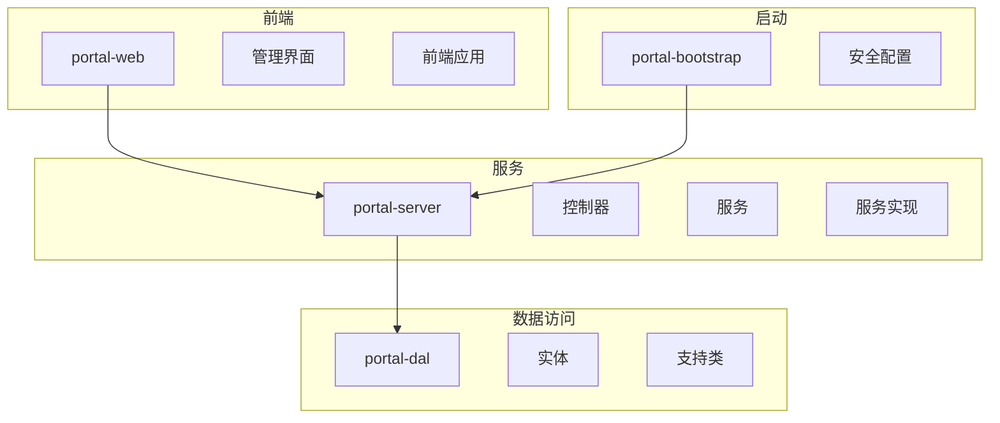
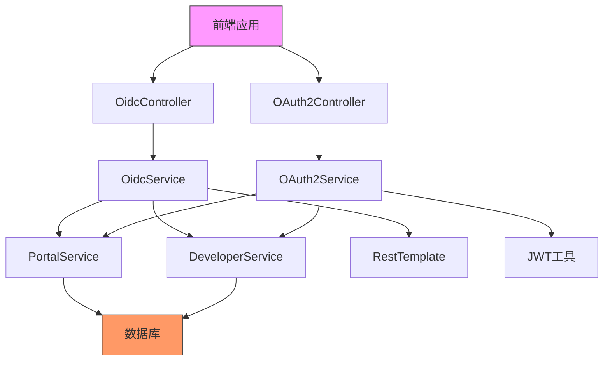
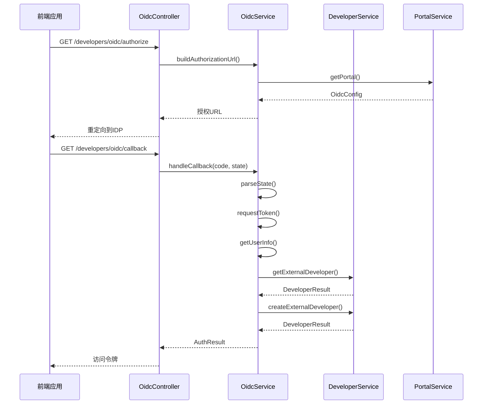
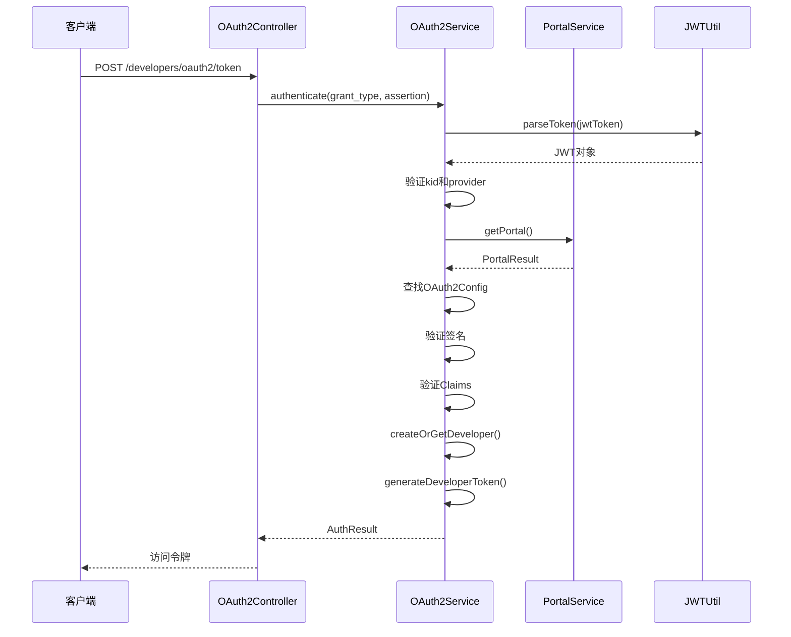
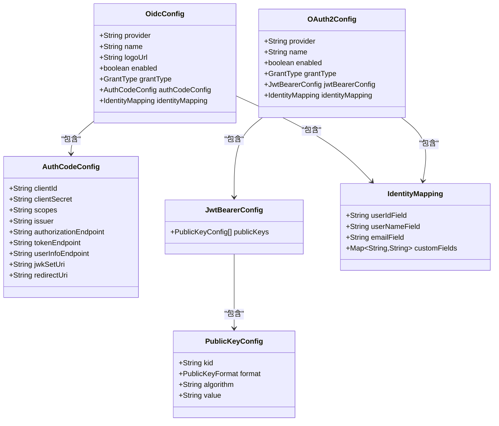
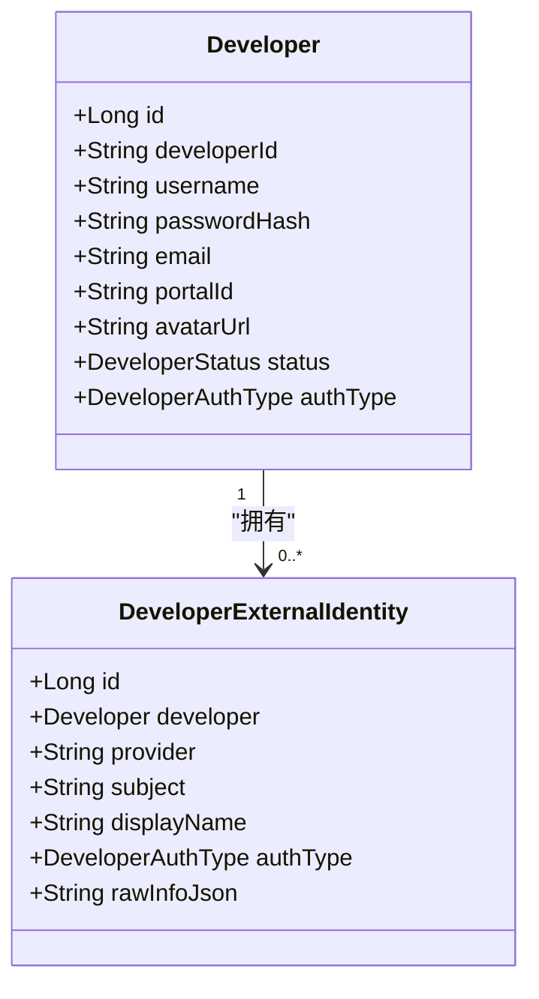
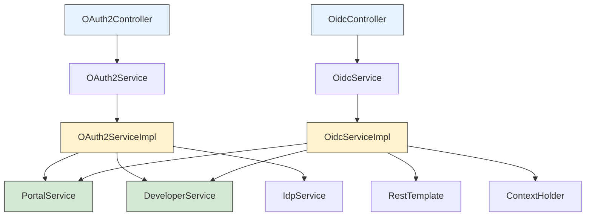

# OAuth2 OIDC 认证

<cite>
**本文档引用的文件**   
- [SecurityConfig.java](file://portal-bootstrap/src/main/java/com/alibaba/apiopenplatform/config/SecurityConfig.java)
- [OAuth2Controller.java](file://portal-server/src/main/java/com/alibaba/apiopenplatform/controller/OAuth2Controller.java)
- [OidcController.java](file://portal-server/src/main/java/com/alibaba/apiopenplatform/controller/OidcController.java)
- [OAuth2Service.java](file://portal-server/src/main/java/com/alibaba/apiopenplatform/service/OAuth2Service.java)
- [OidcService.java](file://portal-server/src/main/java/com/alibaba/apiopenplatform/service/OidcService.java)
- [OAuth2ServiceImpl.java](file://portal-server/src/main/java/com/alibaba/apiopenplatform/service/impl/OAuth2ServiceImpl.java)
- [OidcServiceImpl.java](file://portal-server/src/main/java/com/alibaba/apiopenplatform/service/impl/OidcServiceImpl.java)
- [Developer.java](file://portal-dal/src/main/java/com/alibaba/apiopenplatform/entity/Developer.java)
- [DeveloperExternalIdentity.java](file://portal-dal/src/main/java/com/alibaba/apiopenplatform/entity/DeveloperExternalIdentity.java)
- [OAuth2Config.java](file://portal-dal/src/main/java/com/alibaba/apiopenplatform/support/portal/OAuth2Config.java)
- [OidcConfig.java](file://portal-dal/src/main/java/com/alibaba/apiopenplatform/support/portal/OidcConfig.java)
- [AuthCodeConfig.java](file://portal-dal/src/main/java/com/alibaba/apiopenplatform/support/portal/AuthCodeConfig.java)
- [JwtBearerConfig.java](file://portal-dal/src/main/java/com/alibaba/apiopenplatform/support/portal/JwtBearerConfig.java)
- [IdentityMapping.java](file://portal-dal/src/main/java/com/alibaba/apiopenplatform/support/portal/IdentityMapping.java)
- [ThirdPartyAuthManager.tsx](file://portal-web/api-portal-admin/src/components/portal/ThirdPartyAuthManager.tsx)
</cite>

## 目录
1. [简介](#简介)
2. [项目结构](#项目结构)
3. [核心组件](#核心组件)
4. [架构概述](#架构概述)
5. [详细组件分析](#详细组件分析)
6. [依赖分析](#依赖分析)
7. [性能考虑](#性能考虑)
8. [故障排除指南](#故障排除指南)
9. [结论](#结论)

## 简介
本文档详细介绍了HiMarket平台中的OAuth2和OIDC认证机制。该系统支持两种主要的第三方认证方式：OIDC授权码模式和OAuth2 JWT Bearer模式，允许开发者通过外部身份提供商进行安全认证。系统设计灵活，支持多身份提供商配置，并通过JWT令牌实现无状态认证。

## 项目结构
HiMarket平台的认证功能分布在多个模块中，形成了清晰的分层架构。认证相关的代码主要分布在portal-bootstrap、portal-server和portal-dal三个模块中，前端管理界面位于portal-web模块。

**图示来源**
- [portal-bootstrap](file://portal-bootstrap)
- [portal-server](file://portal-server)
- [portal-dal](file://portal-dal)
- [portal-web](file://portal-web)

## 核心组件
OAuth2/OIDC认证系统的核心组件包括安全配置、控制器、服务接口及其实现、数据实体和配置类。系统通过Spring Security框架集成JWT认证，并支持管理员和开发者多用户体系。认证白名单包含了所有认证相关的端点，包括OIDC授权、回调和令牌获取等接口。

**本节来源**
- [SecurityConfig.java](file://portal-bootstrap/src/main/java/com/alibaba/apiopenplatform/config/SecurityConfig.java#L59-L71)
- [OAuth2Controller.java](file://portal-server/src/main/java/com/alibaba/apiopenplatform/controller/OAuth2Controller.java)
- [OidcController.java](file://portal-server/src/main/java/com/alibaba/apiopenplatform/controller/OidcController.java)

## 架构概述
HiMarket平台的OAuth2/OIDC认证架构采用分层设计，从前端到后端各组件协同工作，实现安全的第三方认证流程。系统支持两种主要的认证模式：OIDC授权码模式和OAuth2 JWT Bearer模式。

**图示来源**
- [OidcController.java](file://portal-server/src/main/java/com/alibaba/apiopenplatform/controller/OidcController.java)
- [OAuth2Controller.java](file://portal-server/src/main/java/com/alibaba/apiopenplatform/controller/OAuth2Controller.java)
- [OidcService.java](file://portal-server/src/main/java/com/alibaba/apiopenplatform/service/OidcService.java)
- [OAuth2Service.java](file://portal-server/src/main/java/com/alibaba/apiopenplatform/service/OAuth2Service.java)

## 详细组件分析
### OAuth2与OIDC认证组件分析
HiMarket平台实现了完整的OAuth2和OIDC认证流程，支持开发者通过外部身份提供商进行安全登录。系统设计灵活，允许配置多个身份提供商，并通过JWT令牌实现无状态认证。

#### 认证流程组件

**图示来源**
- [OidcController.java](file://portal-server/src/main/java/com/alibaba/apiopenplatform/controller/OidcController.java#L43-L65)
- [OidcServiceImpl.java](file://portal-server/src/main/java/com/alibaba/apiopenplatform/service/impl/OidcServiceImpl.java#L81-L132)

#### OAuth2 JWT Bearer认证组件

**图示来源**
- [OAuth2Controller.java](file://portal-server/src/main/java/com/alibaba/apiopenplatform/controller/OAuth2Controller.java#L41-L45)
- [OAuth2ServiceImpl.java](file://portal-server/src/main/java/com/alibaba/apiopenplatform/service/impl/OAuth2ServiceImpl.java#L69-L127)

#### 认证配置类

**图示来源**
- [OidcConfig.java](file://portal-dal/src/main/java/com/alibaba/apiopenplatform/support/portal/OidcConfig.java)
- [OAuth2Config.java](file://portal-dal/src/main/java/com/alibaba/apiopenplatform/support/portal/OAuth2Config.java)
- [AuthCodeConfig.java](file://portal-dal/src/main/java/com/alibaba/apiopenplatform/support/portal/AuthCodeConfig.java)
- [JwtBearerConfig.java](file://portal-dal/src/main/java/com/alibaba/apiopenplatform/support/portal/JwtBearerConfig.java)
- [IdentityMapping.java](file://portal-dal/src/main/java/com/alibaba/apiopenplatform/support/portal/IdentityMapping.java)

#### 开发者身份实体

**图示来源**
- [Developer.java](file://portal-dal/src/main/java/com/alibaba/apiopenplatform/entity/Developer.java)
- [DeveloperExternalIdentity.java](file://portal-dal/src/main/java/com/alibaba/apiopenplatform/entity/DeveloperExternalIdentity.java)

**本节来源**
- [OAuth2ServiceImpl.java](file://portal-server/src/main/java/com/alibaba/apiopenplatform/service/impl/OAuth2ServiceImpl.java)
- [OidcServiceImpl.java](file://portal-server/src/main/java/com/alibaba/apiopenplatform/service/impl/OidcServiceImpl.java)
- [Developer.java](file://portal-dal/src/main/java/com/alibaba/apiopenplatform/entity/Developer.java)
- [DeveloperExternalIdentity.java](file://portal-dal/src/main/java/com/alibaba/apiopenplatform/entity/DeveloperExternalIdentity.java)

## 依赖分析
OAuth2/OIDC认证系统的组件依赖关系清晰，遵循了良好的分层架构原则。控制器层依赖服务接口，服务实现层依赖数据访问层和其他服务，形成了松耦合的设计。

**图示来源**
- [OAuth2Controller.java](file://portal-server/src/main/java/com/alibaba/apiopenplatform/controller/OAuth2Controller.java#L39)
- [OidcController.java](file://portal-server/src/main/java/com/alibaba/apiopenplatform/controller/OidcController.java#L41)
- [OAuth2ServiceImpl.java](file://portal-server/src/main/java/com/alibaba/apiopenplatform/service/impl/OAuth2ServiceImpl.java#L62-L66)
- [OidcServiceImpl.java](file://portal-server/src/main/java/com/alibaba/apiopenplatform/service/impl/OidcServiceImpl.java#L73-L79)

## 性能考虑
OAuth2/OIDC认证系统在设计时考虑了性能因素。系统采用无状态JWT认证，避免了服务器端会话存储，提高了可扩展性。对于OIDC流程中的外部HTTP请求，系统使用RestTemplate进行同步调用，建议在高并发场景下考虑异步化处理。JWT签名验证和解析操作使用了高效的Hutool库，确保了认证流程的性能。此外，系统对state参数设置了10分钟的有效期，防止过期请求的处理，减少了不必要的计算资源消耗。

## 故障排除指南
当OAuth2/OIDC认证出现问题时，可以按照以下步骤进行排查：

1. **检查配置**：确保OidcConfig或OAuth2Config中的端点URL、客户端ID和密钥等配置正确无误。
2. **验证令牌**：对于JWT Bearer认证，检查JWT令牌的签名、过期时间和必要字段（kid、provider、portal等）是否正确。
3. **检查网络连接**：确保服务器能够访问外部身份提供商的授权、令牌和用户信息端点。
4. **查看日志**：检查系统日志中是否有相关的错误信息，如"ID Token已过期"、"JWT签名验证失败"等。
5. **验证回调URL**：确保OIDC流程中的重定向URI配置正确，并且与身份提供商的注册信息一致。
6. **检查数据库**：确认Developer和DeveloperExternalIdentity表中是否存在对应的开发者记录。

**本节来源**
- [OidcServiceImpl.java](file://portal-server/src/main/java/com/alibaba/apiopenplatform/service/impl/OidcServiceImpl.java#L195-L199)
- [OAuth2ServiceImpl.java](file://portal-server/src/main/java/com/alibaba/apiopenplatform/service/impl/OAuth2ServiceImpl.java#L173-L174)
- [OidcServiceImpl.java](file://portal-server/src/main/java/com/alibaba/apiopenplatform/service/impl/OidcServiceImpl.java#L272-L275)

## 结论
HiMarket平台的OAuth2/OIDC认证系统提供了一套完整、安全且灵活的第三方认证解决方案。系统支持两种主流的认证模式：OIDC授权码模式和OAuth2 JWT Bearer模式，能够满足不同场景下的认证需求。通过清晰的分层架构和模块化设计，系统实现了高内聚低耦合，便于维护和扩展。未来可以考虑增加对更多身份提供商的支持，以及优化外部HTTP请求的处理方式，进一步提升系统的性能和可靠性。