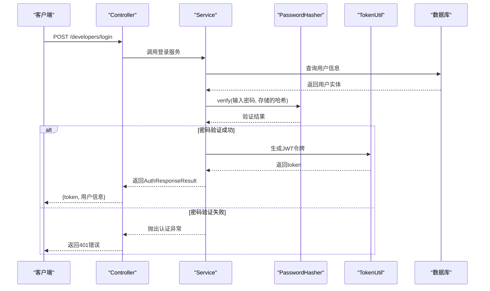
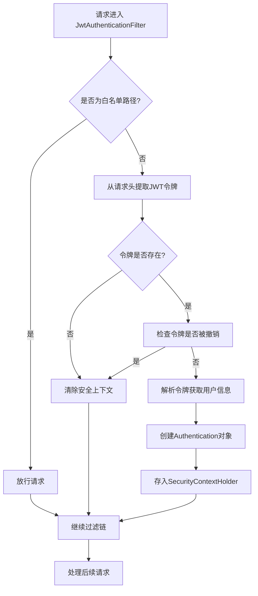
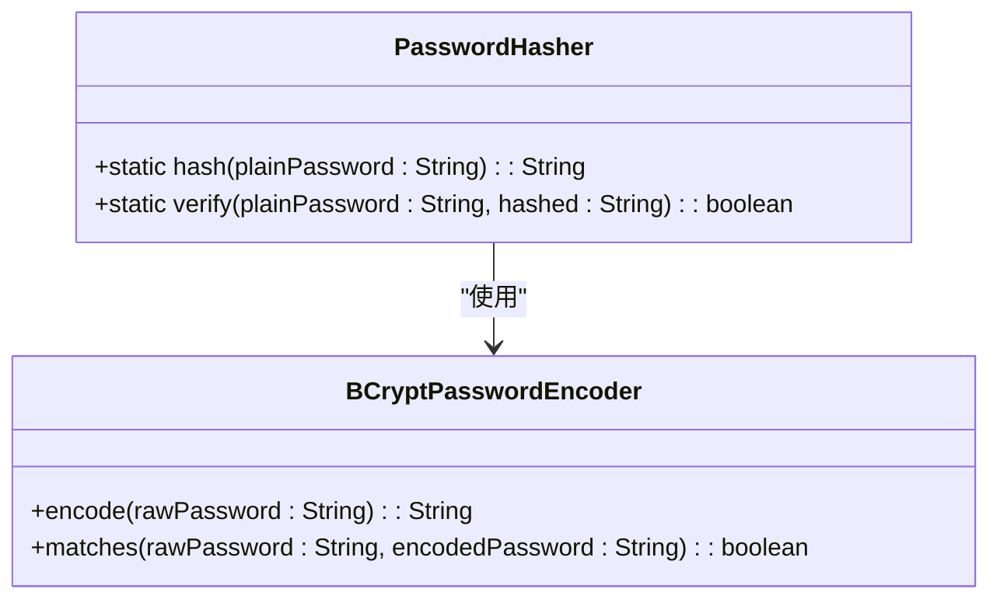

# 安全机制与认证

<cite>
**本文档引用文件**  
- [SecurityConfig.java](file://portal-bootstrap/src/main/java/com/alibaba/apiopenplatform/config/SecurityConfig.java#L1-L125)
- [JwtAuthenticationFilter.java](file://portal-server/src/main/java/com/alibaba/apiopenplatform/core/security/JwtAuthenticationFilter.java#L1-L120)
- [PasswordHasher.java](file://portal-server/src/main/java/com/alibaba/apiopenplatform/core/utils/PasswordHasher.java#L1-L34)
- [DeveloperLoginParam.java](file://portal-server/src/main/java/com/alibaba/apiopenplatform/dto/params/developer/DeveloperLoginParam.java#L1-L42)
- [AdminAuth.java](file://portal-server/src/main/java/com/alibaba/apiopenplatform/core/annotation/AdminAuth.java)
- [OidcConfig.java](file://portal-dal/src/main/java/com/alibaba/apiopenplatform/support/portal/OidcConfig.java)
</cite>

## 目录
1. [简介](#简介)
2. [认证流程详解](#认证流程详解)
3. [JWT认证机制](#jwt认证机制)
4. [Spring Security配置](#spring-security配置)
5. [密码存储机制](#密码存储机制)
6. [第三方OIDC登录集成](#第三方oidc登录集成)
7. [安全最佳实践与漏洞防范](#安全最佳实践与漏洞防范)

## 简介
HiMarket平台采用基于JWT（JSON Web Token）的统一认证体系，支持开发者与管理员双用户体系，并通过Spring Security实现细粒度的权限控制。本文档深入分析其安全架构，涵盖从用户登录、令牌生成、请求验证到权限校验的完整流程，并探讨密码存储、会话管理及第三方OIDC登录集成等关键安全机制。

**Section sources**
- [SecurityConfig.java](file://portal-bootstrap/src/main/java/com/alibaba/apiopenplatform/config/SecurityConfig.java#L1-L125)

## 认证流程详解

### 开发者/管理员登录流程
当开发者或管理员发起登录请求时，系统接收`DeveloperLoginParam`或`AdminLoginParam`参数对象，其中包含用户名和密码。



**Diagram sources**
- [DeveloperLoginParam.java](file://portal-server/src/main/java/com/alibaba/apiopenplatform/dto/params/developer/DeveloperLoginParam.java#L1-L42)
- [PasswordHasher.java](file://portal-server/src/main/java/com/alibaba/apiopenplatform/core/utils/PasswordHasher.java#L1-L34)

**Section sources**
- [DeveloperLoginParam.java](file://portal-server/src/main/java/com/alibaba/apiopenplatform/dto/params/developer/DeveloperLoginParam.java#L1-L42)

## JWT认证机制

### JWT令牌生成与解析
系统使用`TokenUtil`工具类生成和解析JWT令牌。令牌中包含用户ID、用户类型（开发者或管理员）、过期时间等信息，并使用HS512算法签名以确保完整性。

### JwtAuthenticationFilter工作流程
`JwtAuthenticationFilter`是核心的认证过滤器，在每次请求时执行以下逻辑：



**Diagram sources**
- [JwtAuthenticationFilter.java](file://portal-server/src/main/java/com/alibaba/apiopenplatform/core/security/JwtAuthenticationFilter.java#L1-L120)

**Section sources**
- [JwtAuthenticationFilter.java](file://portal-server/src/main/java/com/alibaba/apiopenplatform/core/security/JwtAuthenticationFilter.java#L1-L120)

## Spring Security配置

### SecurityConfig安全规则
`SecurityConfig.java`配置了Spring Security的核心行为，主要包括：

- **无状态会话管理**：`sessionCreationPolicy(SessionCreationPolicy.STATELESS)`确保服务器不保存会话状态，所有认证信息由客户端在每次请求中携带。
- **跨域支持**：启用默认的CORS配置，允许所有来源、方法和头部。
- **CSRF禁用**：由于使用JWT进行认证，禁用CSRF保护。
- **路径权限控制**：通过`antMatchers`定义白名单路径，其余所有请求均需认证。

### 方法级权限控制
通过`@EnableGlobalMethodSecurity(prePostEnabled = true)`启用基于注解的方法级安全控制。系统使用自定义注解如`@AdminAuth`来限制特定接口的访问角色。

```java
@Target(ElementType.METHOD)
@Retention(RetentionPolicy.RUNTIME)
@PreAuthorize("hasRole('ADMIN')")
public @interface AdminAuth {
}
```

该注解确保只有具有`ADMIN`角色的用户才能调用被标注的方法。

**Section sources**
- [SecurityConfig.java](file://portal-bootstrap/src/main/java/com/alibaba/apiopenplatform/config/SecurityConfig.java#L1-L125)
- [AdminAuth.java](file://portal-server/src/main/java/com/alibaba/apiopenplatform/core/annotation/AdminAuth.java)

## 密码存储机制

### PasswordHasher实现
系统使用`BCryptPasswordEncoder`对用户密码进行哈希存储，确保即使数据库泄露，攻击者也无法轻易还原原始密码。



**Diagram sources**
- [PasswordHasher.java](file://portal-server/src/main/java/com/alibaba/apiopenplatform/core/utils/PasswordHasher.java#L1-L34)

**Section sources**
- [PasswordHasher.java](file://portal-server/src/main/java/com/alibaba/apiopenplatform/core/utils/PasswordHasher.java#L1-L34)

## 第三方OIDC登录集成

### OIDC配置模型
系统通过`OidcConfig`类支持Aliyun、Google、Github等第三方OIDC提供商的集成。配置包括客户端ID、客户端密钥、授权端点、令牌端点等信息。

```java
public class OidcConfig {
    private String providerName; // 提供商名称 (如: aliyun, google, github)
    private String clientId;
    private String clientSecret;
    private String authorizationUri;
    private String tokenUri;
    private String userInfoUri;
    private String redirectUri;
    // getters and setters...
}
```

### 集成流程
1. 前端请求可用的OIDC提供商列表
2. 用户选择提供商并跳转至其授权页面
3. 用户授权后，提供商重定向回系统回调接口`/developers/callback`
4. 系统使用授权码向提供商请求访问令牌
5. 使用访问令牌获取用户信息
6. 在本地创建或关联用户账户
7. 生成并返回本地JWT令牌

**Section sources**
- [OidcConfig.java](file://portal-dal/src/main/java/com/alibaba/apiopenplatform/support/portal/OidcConfig.java)

## 安全最佳实践与漏洞防范

### 推荐的安全实践
- **JWT令牌安全**：设置合理的过期时间（如1小时），并实现令牌撤销机制（通过`TokenUtil.isTokenRevoked`检查）。
- **密码策略**：强制使用强密码，并定期提示用户更换密码。
- **HTTPS强制**：生产环境中必须启用HTTPS以保护传输中的认证信息。
- **敏感信息保护**：避免在日志中记录完整的JWT令牌或用户密码。
- **输入验证**：对所有用户输入进行严格验证，防止注入攻击。

### 潜在漏洞与防范
- **令牌劫持**：通过HTTPS和短期令牌降低风险，提供用户会话管理界面以撤销可疑令牌。
- **暴力破解**：在登录接口实现账户锁定或验证码机制。
- **第三方登录信任**：仅允许预配置的OIDC提供商，严格验证ID Token的签名和声明。
- **权限提升**：确保`@AdminAuth`等注解正确应用于所有敏感接口，防止未授权访问。

**Section sources**
- [SecurityConfig.java](file://portal-bootstrap/src/main/java/com/alibaba/apiopenplatform/config/SecurityConfig.java#L1-L125)
- [JwtAuthenticationFilter.java](file://portal-server/src/main/java/com/alibaba/apiopenplatform/core/security/JwtAuthenticationFilter.java#L1-L120)
- [PasswordHasher.java](file://portal-server/src/main/java/com/alibaba/apiopenplatform/core/utils/PasswordHasher.java#L1-L34)