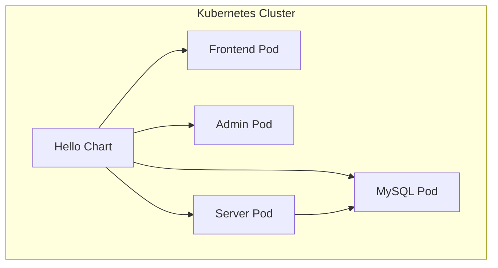

# 快速入门指南

<cite>
**本文档引用的文件**   
- [README.md](file://README.md)
- [build.sh](file://build.sh)
- [docker-compose.yml](file://deploy/docker/docker-compose.yml)
- [Chart.yaml](file://deploy/helm/Chart.yaml)
- [values.yaml](file://deploy/helm/values.yaml)
- [application.yaml](file://portal-bootstrap/src/main/resources/application.yaml)
- [Dockerfile](file://portal-web/api-portal-admin/Dockerfile)
</cite>

## 目录
1. [简介](#简介)
2. [环境先决条件](#环境先决条件)
3. [通过Docker Compose快速部署](#通过docker-compose快速部署)
4. [通过Helm进行Kubernetes部署](#通过helm进行kubernetes部署)
5. [验证安装](#验证安装)
6. [故障排除](#故障排除)

## 简介

Himarket 是一个开箱即用的 AI 开放平台解决方案，旨在帮助企业快速构建 AI 能力市场与开发者生态中心。该平台由三大核心组件构成：管理后台（供管理员/运营使用）、开放门户（供开发者/企业用户使用）以及 AI 网关。本指南将指导您如何在本地或生产环境中快速启动和运行 Himarket，涵盖从克隆仓库到服务启动的完整流程。

**Section sources**
- [README.md](file://README.md#L1-L219)

## 环境先决条件

在开始部署之前，请确保您的系统已安装以下软件：

- **Git**：用于克隆项目代码库。
- **Java 8 或更高版本**：后端服务基于 Java 构建。
- **Node.js v20+**：前端项目依赖 Node.js 进行构建和运行。
- **Maven**：用于构建 Java 后端服务。
- **Docker**：用于容器化部署。
- **Helm**（可选）：用于 Kubernetes 部署。
- **数据库**：后端服务依赖外部数据库（如 MySQL/MariaDB），需提前准备并配置连接参数。

这些工具是成功部署 Himarket 的基础，建议在继续下一步前确认所有依赖项均已正确安装。

**Section sources**
- [README.md](file://README.md#L22-L34)

## 通过Docker Compose快速部署

使用 Docker Compose 可以在本地环境中快速启动 Himarket 的所有服务。以下是具体步骤：

### 1. 克隆项目代码

首先，从 GitHub 克隆 Himarket 项目代码：

```bash
git clone https://github.com/higress-group/himarket.git
cd himarket
```

### 2. 构建项目

运行 `build.sh` 脚本以构建后端和前端镜像：

```bash
chmod +x build.sh
./build.sh
```

该脚本会依次执行以下操作：
- 使用 Maven 打包后端服务。
- 构建 `himarket-server`、`himarket-admin` 和 `himarket-frontend` 的 Docker 镜像。

### 3. 启动服务

使用 `docker-compose.yml` 文件启动所有服务：

```bash
cd deploy/docker
docker-compose up -d
```

此命令将在后台启动以下容器：
- **mysql**：运行 MySQL 数据库，用于存储平台数据。
- **himarket-server**：后端服务，处理业务逻辑和 API 请求。
- **himarket-admin**：管理后台前端，供管理员操作。
- **himarket-frontend**：开放门户前端，供开发者访问。

### 4. 配置数据库连接

默认情况下，`docker-compose.yml` 中的数据库配置如下：

```yaml
environment:
  - MYSQL_ROOT_PASSWORD=123456
  - MYSQL_DATABASE=portal_db
  - MYSQL_USER=portal_user
  - MYSQL_PASSWORD=portal_pass
```

后端服务通过环境变量连接数据库，确保 `DB_HOST` 指向 `mysql` 容器名称。

**Section sources**
- [build.sh](file://build.sh#L1-L44)
- [docker-compose.yml](file://deploy/docker/docker-compose.yml#L1-L52)
- [README.md](file://README.md#L36-L68)

## 通过Helm进行Kubernetes部署

对于生产环境，推荐使用 Helm 在 Kubernetes 集群中部署 Himarket。

### 1. 准备 Helm Chart

Helm 配置文件位于 `deploy/helm/` 目录下，主要包含以下文件：
- `Chart.yaml`：定义 Chart 的元信息。
- `values.yaml`：包含可自定义的部署参数。

### 2. 配置 values.yaml

根据您的环境修改 `values.yaml` 文件中的关键参数：

```yaml
hub: opensource-registry.cn-hangzhou.cr.aliyuncs.com/higress-group

frontend:
  image:
    tag: "latest"
  service:
    type: LoadBalancer

admin:
  image:
    tag: "latest"
  service:
    type: LoadBalancer

server:
  image:
    tag: "latest"

# 外部数据库配置
database:
  host: "your-db-host"
  port: "3306"
  name: "himarket_db"
  username: "himarket_user"
  password: "your-db-password"
```

您可以选择使用内置 MySQL 或连接外部数据库。若使用外部数据库，请将 `mysql.enabled` 设置为 `false`。

### 3. 安装 Helm Chart

执行以下命令部署 Himarket：

```bash
cd deploy/helm
helm install himarket . --namespace himarket --create-namespace
```

该命令将在 `himarket` 命名空间中部署所有服务，并根据 `values.yaml` 中的配置创建相应的资源。



**Diagram sources**
- [Chart.yaml](file://deploy/helm/Chart.yaml#L1-L25)
- [values.yaml](file://deploy/helm/values.yaml#L1-L94)

**Section sources**
- [Chart.yaml](file://deploy/helm/Chart.yaml#L1-L25)
- [values.yaml](file://deploy/helm/values.yaml#L1-L94)

## 验证安装

部署完成后，您可以通过以下方式验证 Himarket 是否成功运行：

### 1. 访问前端页面

- **管理后台**：访问 `http://localhost:5174`，首次访问时可注册管理员账号。
- **开放门户**：访问 `http://localhost:5173`，测试开发者注册与登录功能。

### 2. 检查 Swagger UI

Himarket 提供了 Swagger UI 用于查看和测试 API 接口。访问以下地址：

```
http://localhost:8080/portal/swagger-ui.html
```

您应能看到所有可用的 API 列表，并可进行在线测试。

### 3. 检查容器状态

使用以下命令检查所有容器是否正常运行：

```bash
docker-compose ps
```

输出应显示所有服务的状态为 `Up`。

**Section sources**
- [application.yaml](file://portal-bootstrap/src/main/resources/application.yaml#L35-L40)
- [README.md](file://README.md#L69-L100)

## 故障排除

### 1. 数据库连接失败

如果后端服务无法连接数据库，请检查以下几点：
- 确认数据库服务已启动。
- 检查 `application.yaml` 或 `docker-compose.yml` 中的数据库连接参数是否正确。
- 确保网络配置允许服务间通信。

### 2. 前端无法访问后端 API

前端通过环境变量 `HIMARKET_SERVER` 指定后端地址。若出现跨域问题，请确认：
- `HIMARKET_SERVER` 指向正确的后端服务地址。
- 后端服务的 CORS 配置允许前端域名访问。

### 3. 构建失败

若 `build.sh` 脚本执行失败，请检查：
- Maven 和 Node.js 是否已正确安装。
- 网络连接是否正常，能否下载依赖包。
- Docker 是否已启动并具有足够权限。

**Section sources**
- [application.yaml](file://portal-bootstrap/src/main/resources/application.yaml#L1-L44)
- [docker-compose.yml](file://deploy/docker/docker-compose.yml#L1-L52)