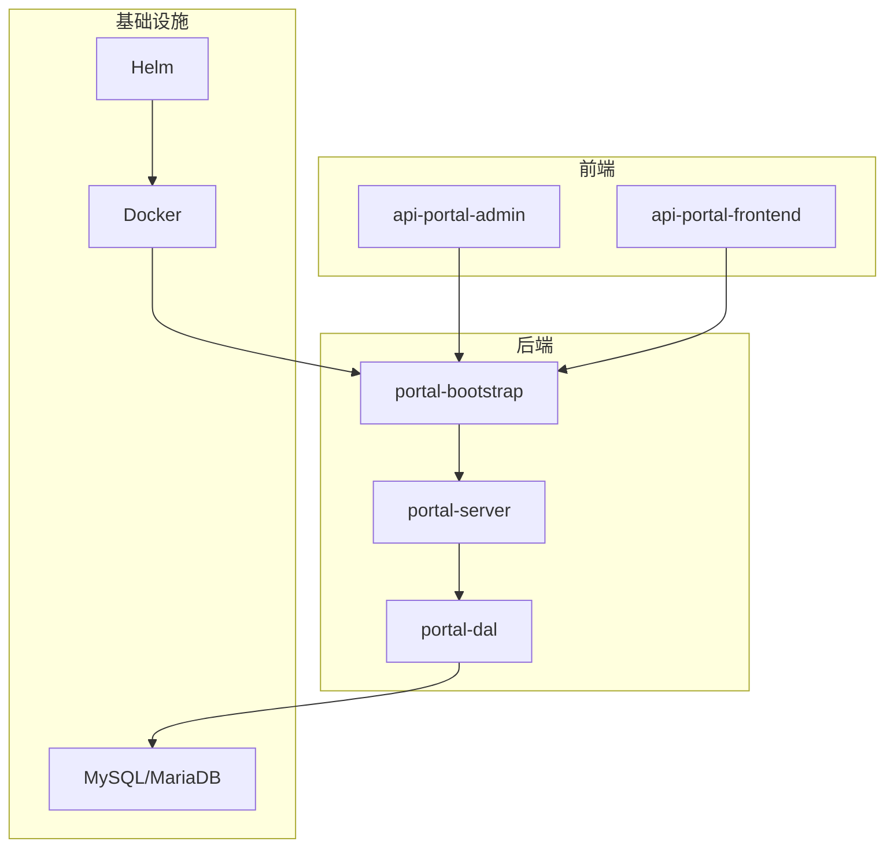

# 技术栈与依赖

<cite>
**本文档引用文件**   
- [PortalApplication.java](file://portal-bootstrap/src/main/java/com/alibaba/apiopenplatform/PortalApplication.java)
- [RestTemplateConfig.java](file://portal-bootstrap/src/main/java/com/alibaba/apiopenplatform/config/RestTemplateConfig.java)
- [SwaggerConfig.java](file://portal-bootstrap/src/main/java/com/alibaba/apiopenplatform/config/SwaggerConfig.java)
- [SecurityConfig.java](file://portal-bootstrap/src/main/java/com/alibaba/apiopenplatform/config/SecurityConfig.java)
- [pom.xml](file://pom.xml)
- [portal-bootstrap/pom.xml](file://portal-bootstrap/pom.xml)
- [portal-dal/pom.xml](file://portal-dal/pom.xml)
- [portal-server/pom.xml](file://portal-server/pom.xml)
- [package.json](file://portal-web/api-portal-admin/package.json)
- [package.json](file://portal-web/api-portal-frontend/package.json)
</cite>

## 目录
1. [项目结构概览](#项目结构概览)
2. [后端技术栈分析](#后端技术栈分析)
3. [前端技术栈分析](#前端技术栈分析)
4. [运行环境与数据库依赖](#运行环境与数据库依赖)
5. [核心配置类详解](#核心配置类详解)
6. [依赖管理机制](#依赖管理机制)

## 项目结构概览

HiMarket项目采用模块化架构设计，主要分为四个核心模块：`portal-bootstrap`（启动模块）、`portal-dal`（数据访问层）、`portal-server`（业务逻辑层）和`portal-web`（前端应用）。此外，项目还包含部署相关的`deploy`目录，支持Docker和Helm部署。



**图示来源**
- [项目结构](file://#L1-L200)

## 后端技术栈分析

### Spring Boot 核心框架

Spring Boot作为本项目的核心后端框架，提供了自动配置、嵌入式服务器和生产级监控等特性，极大简化了Spring应用的搭建和开发过程。`PortalApplication.java`是整个应用的入口点，通过`@SpringBootApplication`注解启用自动配置、组件扫描和配置属性加载。

```java
@SpringBootApplication
@EnableJpaAuditing
public class PortalApplication {
    public static void main(String[] args) {
        SpringApplication.run(PortalApplication.class, args);
    }
}
```

该类位于`portal-bootstrap`模块中，负责启动整个Spring Boot应用上下文。

**代码来源**
- [PortalApplication.java](file://portal-bootstrap/src/main/java/com/alibaba/apiopenplatform/PortalApplication.java#L1-L35)

### Spring Data JPA 数据持久化

Spring Data JPA用于实现数据访问层的持久化操作。在`portal-dal`模块中，通过JPA Repository接口简化了数据库CRUD操作。项目通过`BaseRepository`扩展了基本的JPA功能，并结合实体类如`Administrator`、`Developer`、`Product`等进行数据映射。

`pom.xml`文件中引入了`spring-boot-starter-data-jpa`依赖，确保JPA功能的完整支持。

```xml
<dependency>
    <groupId>org.springframework.boot</groupId>
    <artifactId>spring-boot-starter-data-jpa</artifactId>
</dependency>
```

**配置来源**
- [portal-dal/pom.xml](file://portal-dal/pom.xml#L1-L47)

### Spring Security 安全控制

Spring Security用于实现系统的安全认证与授权机制。`SecurityConfig.java`类定义了完整的安全策略，包括JWT认证、CORS配置、接口权限控制等。

关键特性包括：
- 使用`JwtAuthenticationFilter`实现无状态JWT认证
- 配置白名单路径（登录、注册、Swagger文档等）
- 启用全局方法级安全控制（`@EnableGlobalMethodSecurity`）
- 支持管理员与开发者双用户体系

```java
@Configuration
@EnableGlobalMethodSecurity(prePostEnabled = true)
public class SecurityConfig {
    // ...
}
```

**安全配置来源**
- [SecurityConfig.java](file://portal-bootstrap/src/main/java/com/alibaba/apiopenplatform/config/SecurityConfig.java#L1-L125)

## 前端技术栈分析

### React 与 Vite 构建系统

前端项目分为两个子应用：`api-portal-admin`（管理后台）和`api-portal-frontend`（开发者门户），均基于React框架构建。Vite作为现代前端构建工具，提供快速的冷启动和热更新体验。

`vite.config.ts`配置文件定义了构建参数、插件和服务器代理规则，提升开发效率。

### TypeScript 类型安全

TypeScript为前端代码提供静态类型检查，增强代码可维护性和开发体验。项目中定义了多个类型文件，如：
- `types/api-product.ts`：API产品相关类型
- `types/gateway.ts`：网关配置类型
- `types/portal.ts`：门户管理类型

### Tailwind CSS 与 Ant Design UI框架

项目采用Tailwind CSS作为实用优先的CSS框架，结合Ant Design组件库构建用户界面。`aliyunThemeToken.ts`文件用于定制阿里云风格的主题样式，确保视觉一致性。

### 前端依赖管理

通过`package.json`文件管理前端依赖，主要依赖包括：
- `react`, `react-dom`：核心React库
- `vite`, `@vitejs/plugin-react`：构建工具
- `antd`：UI组件库
- `tailwindcss`, `postcss`, `autoprefixer`：样式处理

```json
{
  "dependencies": {
    "react": "^18.2.0",
    "antd": "^5.0.0",
    "tailwindcss": "^3.3.0"
  }
}
```

**前端依赖来源**
- [api-portal-admin/package.json](file://portal-web/api-portal-admin/package.json)
- [api-portal-frontend/package.json](file://portal-web/api-portal-frontend/package.json)

## 运行环境与数据库依赖

### 运行环境要求

| 组件 | 版本要求 | 说明 |
|------|----------|------|
| Java | 8+ | 后端服务运行环境 |
| Node.js | v20+ | 前端构建与开发服务器 |
| Maven | 3.6+ | Java项目构建工具 |

### 数据库依赖

项目使用MariaDB/MySQL作为持久化存储，通过`mariadb-java-client`驱动连接数据库。在`portal-dal/pom.xml`中声明了数据库驱动依赖：

```xml
<dependency>
    <groupId>org.mariadb.jdbc</groupId>
    <artifactId>mariadb-java-client</artifactId>
</dependency>
```

实体类通过JPA注解映射数据库表结构，如`Administrator.java`、`Product.java`等，实现对象关系映射（ORM）。

**数据库配置来源**
- [portal-dal/pom.xml](file://portal-dal/pom.xml#L1-L47)

## 核心配置类详解

### RestTemplateConfig HTTP客户端配置

`RestTemplateConfig.java`类配置了基于OkHttp的HTTP客户端，用于系统内部服务调用。通过自定义连接池和超时设置，提升远程调用性能与稳定性。

```java
@Bean
public RestTemplate restTemplate(OkHttpClient okHttpClient) {
    return new RestTemplate(new OkHttp3ClientHttpRequestFactory(okHttpClient));
}
```

配置了5秒的连接、读取和写入超时，并使用10个连接的连接池，适用于高并发场景。

**HTTP客户端配置来源**
- [RestTemplateConfig.java](file://portal-bootstrap/src/main/java/com/alibaba/apiopenplatform/config/RestTemplateConfig.java#L1-L49)

### SwaggerConfig API文档生成

`SwaggerConfig.java`类启用OpenAPI 3.0规范的API文档生成功能，便于开发者查阅和测试接口。

```java
@Bean
public OpenAPI openAPI() {
    return new OpenAPI()
            .info(new Info()
                    .title("开放平台 API")
                    .version("1.0.0")
                    .description("API 文档描述"));
}
```

生成的文档可通过`/portal/swagger-ui.html`访问，包含所有RESTful接口的详细参数和示例。

**API文档配置来源**
- [SwaggerConfig.java](file://portal-bootstrap/src/main/java/com/alibaba/apiopenplatform/config/SwaggerConfig.java#L1-L37)

## 依赖管理机制

### Maven 多模块依赖管理

项目采用Maven多模块结构，通过父POM统一管理版本和依赖。根目录下的`pom.xml`定义了项目基本信息和模块结构：

```xml
<modules>
    <module>portal-bootstrap</module>
    <module>portal-dal</module>
    <module>portal-server</module>
</modules>
```

各子模块通过`<parent>`标签继承父POM配置，确保依赖版本一致性。例如，`portal-bootstrap`依赖`portal-server`模块：

```xml
<dependency>
    <groupId>com.alibaba.apiopenplatform</groupId>
    <artifactId>portal-server</artifactId>
    <version>1.0-SNAPSHOT</version>
</dependency>
```

这种结构实现了关注点分离，同时保证了模块间的松耦合与高内聚。

**依赖管理来源**
- [pom.xml](file://pom.xml)
- [portal-bootstrap/pom.xml](file://portal-bootstrap/pom.xml#L1-L51)
- [portal-server/pom.xml](file://portal-server/pom.xml)