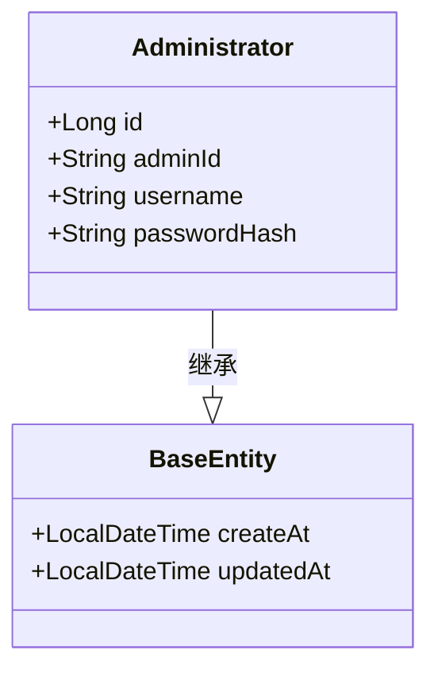
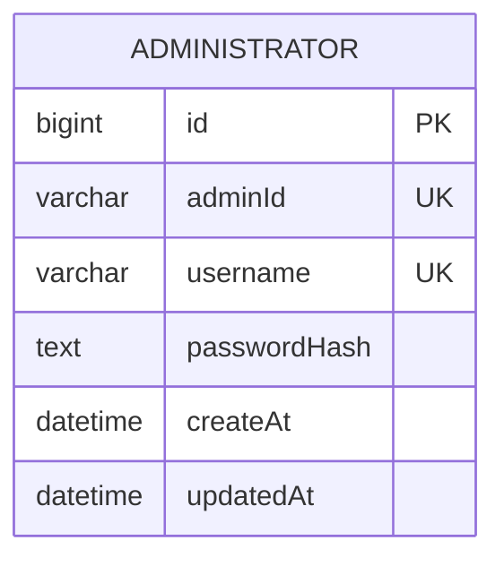
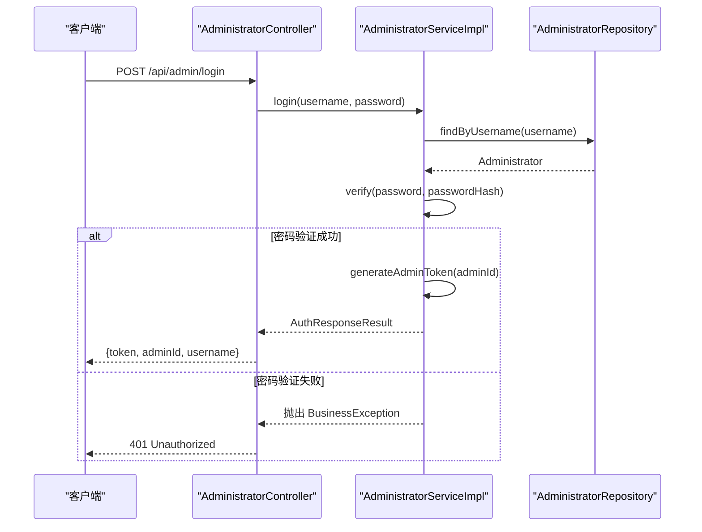

# Administrator

<cite>
**本文档引用的文件**  
- [Administrator.java](file://portal-dal/src/main/java/com/alibaba/apiopenplatform/entity/Administrator.java#L1-L55)
- [BaseEntity.java](file://portal-dal/src/main/java/com/alibaba/apiopenplatform/entity/BaseEntity.java#L1-L42)
- [Portal.java](file://portal-dal/src/main/java/com/alibaba/apiopenplatform/entity/Portal.java#L1-L67)
- [AdministratorServiceImpl.java](file://portal-server/src/main/java/com/alibaba/apiopenplatform/service/impl/AdministratorServiceImpl.java#L1-L105)
</cite>

## 目录
1. [简介](#简介)
2. [数据模型定义](#数据模型定义)
3. [字段详细说明](#字段详细说明)
4. [继承行为与审计字段](#继承行为与审计字段)
5. [与Portal实体的关系](#与portal实体的关系)
6. [JPA注解与数据库映射](#jpa注解与数据库映射)
7. [使用场景与业务逻辑](#使用场景与业务逻辑)
8. [安全上下文中的作用](#安全上下文中的作用)

## 简介
`Administrator` 实体是系统中用于表示管理员账户的核心数据模型。它定义了管理员的身份信息、认证凭据以及系统行为。该实体位于 `portal-dal` 模块中，通过 JPA 映射到数据库表 `administrator`，并被 `portal-server` 模块的服务层用于实现管理员的登录、初始化、密码重置等关键功能。

## 数据模型定义
`Administrator` 类是一个 JPA 实体，继承自 `BaseEntity`，并映射到数据库中的 `administrator` 表。其核心结构如下：

```java
@Entity
@Table(name = "administrator", uniqueConstraints = {
    @UniqueConstraint(columnNames = {"adminId"}),
    @UniqueConstraint(columnNames = {"username"})
})
public class Administrator extends BaseEntity {
    @Id
    @GeneratedValue(strategy = GenerationType.IDENTITY)
    private Long id;

    @Column(nullable = false, unique = true, length = 64)
    private String adminId;

    @Column(nullable = false, unique = true, length = 64)
    private String username;

    @Column(nullable = false)
    private String passwordHash;
}
```

**Section sources**
- [Administrator.java](file://portal-dal/src/main/java/com/alibaba/apiopenplatform/entity/Administrator.java#L32-L55)

## 字段详细说明
以下是对 `Administrator` 实体各字段的详细解释：

### id
- **数据类型**: `Long`
- **约束条件**: `@Id`, `@GeneratedValue(strategy = GenerationType.IDENTITY)`
- **业务含义**: 主键，由数据库自增生成，是管理员记录在数据库中的唯一标识。

### adminId
- **数据类型**: `String`
- **约束条件**: `@Column(nullable = false, unique = true, length = 64)`
- **业务含义**: 管理员的全局唯一ID，用于在系统内部（如生成Token、服务间调用）标识管理员，区别于用于登录的用户名。该字段不可为空且必须唯一。

### username
- **数据类型**: `String`
- **约束条件**: `@Column(nullable = false, unique = true, length = 64)`
- **业务含义**: 管理员的登录用户名。该字段不可为空且必须唯一，是管理员登录系统的凭证之一。

### passwordHash
- **数据类型**: `String`
- **约束条件**: `@Column(nullable = false)`
- **业务含义**: 存储管理员密码的哈希值，而非明文密码。系统使用 `PasswordHasher` 工具类进行密码的哈希和验证，确保密码存储的安全性。该字段不可为空。

**Section sources**
- [Administrator.java](file://portal-dal/src/main/java/com/alibaba/apiopenplatform/entity/Administrator.java#L32-L55)

## 继承行为与审计字段
`Administrator` 实体继承自 `BaseEntity` 类，从而自动获得创建时间和更新时间的审计功能。



**Diagram sources**
- [Administrator.java](file://portal-dal/src/main/java/com/alibaba/apiopenplatform/entity/Administrator.java#L32-L55)
- [BaseEntity.java](file://portal-dal/src/main/java/com/alibaba/apiopenplatform/entity/BaseEntity.java#L1-L42)

### createAt
- **数据类型**: `LocalDateTime`
- **JPA注解**: `@CreatedDate`, `@Column(name = "created_at", updatable = false)`
- **业务含义**: 记录管理员账户创建的时间。该字段由 `@CreatedDate` 注解自动填充，且 `updatable = false` 确保其值在记录创建后不可被修改。

### updatedAt
- **数据类型**: `LocalDateTime`
- **JPA注解**: `@LastModifiedDate`, `@Column(name = "updated_at")`
- **业务含义**: 记录管理员账户最后一次被修改的时间。该字段由 `@LastModifiedDate` 注解自动填充，每次实体被更新时，JPA 会自动更新此字段。

**Section sources**
- [BaseEntity.java](file://portal-dal/src/main/java/com/alibaba/apiopenplatform/entity/BaseEntity.java#L1-L42)

## 与Portal实体的关系
根据现有代码分析，`Administrator` 实体与 `Portal` 实体之间存在一种逻辑上的归属关系，但这种关系在 `Administrator` 类中并未通过 JPA 注解直接体现。

在 `Portal` 实体中，存在一个名为 `adminId` 的字段：
```java
@Column(name = "admin_id", length = 64)
private String adminId;
```
该字段明确指向 `Administrator` 的 `adminId`，表明一个门户（Portal）实例归属于一个特定的管理员。这构成了一种 **@ManyToOne** 的关系：多个门户可以由同一个管理员管理，但一个门户只能属于一个管理员。

**Section sources**
- [Portal.java](file://portal-dal/src/main/java/com/alibaba/apiopenplatform/entity/Portal.java#L1-L67)

## JPA注解与数据库映射
`Administrator` 实体使用了标准的 JPA 注解来定义其与数据库表的映射关系：



**Diagram sources**
- [Administrator.java](file://portal-dal/src/main/java/com/alibaba/apiopenplatform/entity/Administrator.java#L32-L55)
- [BaseEntity.java](file://portal-dal/src/main/java/com/alibaba/apiopenplatform/entity/BaseEntity.java#L1-L42)

- `@Entity`: 声明此类为 JPA 实体，将映射到数据库表。
- `@Table(name = "administrator")`: 指定实体映射的数据库表名为 `administrator`。
- `@Id`: 标识 `id` 字段为主键。
- `@GeneratedValue(strategy = GenerationType.IDENTITY)`: 指定主键由数据库自增生成。
- `@Column`: 定义字段与数据库列的映射，可设置 `nullable`, `unique`, `length`, `name` 等属性。
- `@UniqueConstraint`: 在表级别定义唯一约束，确保 `adminId` 和 `username` 的值在表中唯一。

**Section sources**
- [Administrator.java](file://portal-dal/src/main/java/com/alibaba/apiopenplatform/entity/Administrator.java#L32-L55)

## 使用场景与业务逻辑
`Administrator` 实体在系统中扮演着核心角色，主要使用场景由 `AdministratorServiceImpl` 类实现。

### 管理员登录


**Diagram sources**
- [AdministratorServiceImpl.java](file://portal-server/src/main/java/com/alibaba/apiopenplatform/service/impl/AdministratorServiceImpl.java#L1-L105)

1.  **流程**: 客户端提交用户名和密码。
2.  **查找**: 服务层通过 `AdministratorRepository.findByUsername()` 方法根据用户名查找管理员。
3.  **验证**: 使用 `PasswordHasher.verify()` 方法验证提供的密码与数据库中存储的哈希值是否匹配。
4.  **生成Token**: 验证成功后，调用 `TokenUtil.generateAdminToken()` 生成JWT Token。
5.  **返回结果**: 返回包含管理员ID、用户名和Token的 `AuthResponseResult`。

### 系统初始化
系统首次启动时，需要创建第一个管理员账户。
- **方法**: `initAdmin(String username, String password)`
- **逻辑**: 检查数据库中是否已存在管理员（`needInit()`），若不存在，则创建新管理员，生成 `adminId`，对密码进行哈希处理并保存。

### 密码重置
已登录的管理员可以修改自己的密码。
- **方法**: `resetPassword(String oldPassword, String newPassword)`
- **逻辑**: 先验证旧密码是否正确，然后对新密码进行哈希处理并更新数据库。

**Section sources**
- [AdministratorServiceImpl.java](file://portal-server/src/main/java/com/alibaba/apiopenplatform/service/impl/AdministratorServiceImpl.java#L1-L105)

## 安全上下文中的作用
`Administrator` 实体是系统安全机制的基石。
- **身份认证**: 通过用户名和密码哈希验证管理员身份。
- **会话管理**: 登录成功后生成的Token（包含 `adminId`）用于后续所有需要管理员权限的API调用。
- **权限校验**: `ContextHolder` 类存储当前登录管理员的 `adminId`，其他服务在执行敏感操作前，可以通过 `getAdministrator()` 获取当前管理员信息，实现基于身份的权限控制。

**Section sources**
- [AdministratorServiceImpl.java](file://portal-server/src/main/java/com/alibaba/apiopenplatform/service/impl/AdministratorServiceImpl.java#L1-L105)
- [ContextHolder.java](file://portal-server/src/main/java/com/alibaba/apiopenplatform/core/security/ContextHolder.java)