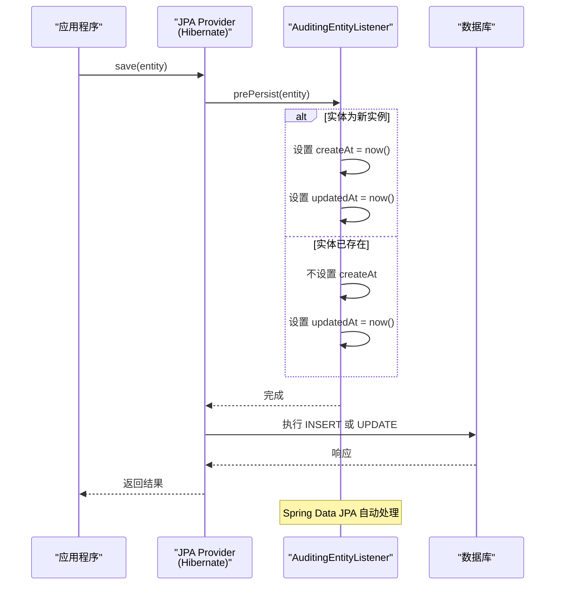
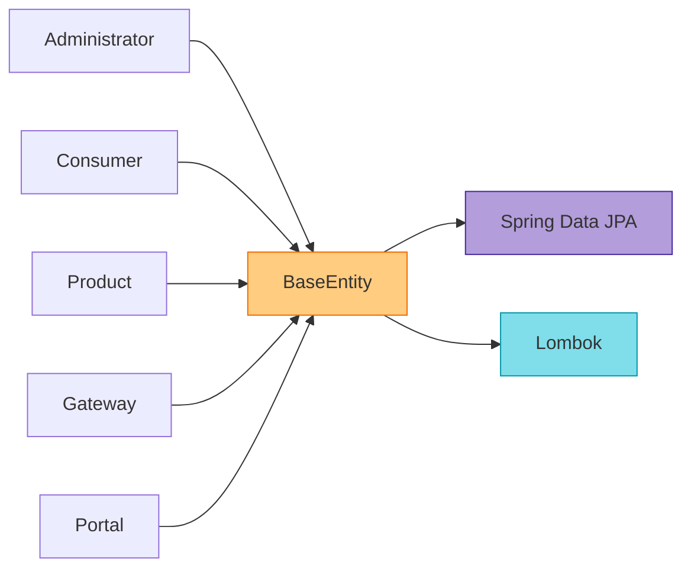

# BaseEntity

<cite>
**本文档引用的文件**  
- [BaseEntity.java](file://portal-dal/src/main/java/com/alibaba/apiopenplatform/entity/BaseEntity.java#L1-L42)
- [BaseRepository.java](file://portal-dal/src/main/java/com/alibaba/apiopenplatform/repository/BaseRepository.java#L1-L51)
- [Administrator.java](file://portal-dal/src/main/java/com/alibaba/apiopenplatform/entity/Administrator.java)
- [Consumer.java](file://portal-dal/src/main/java/com/alibaba/apiopenplatform/entity/Consumer.java)
- [Product.java](file://portal-dal/src/main/java/com/alibaba/apiopenplatform/entity/Product.java)
- [Gateway.java](file://portal-dal/src/main/java/com/alibaba/apiopenplatform/entity/Gateway.java)
- [Portal.java](file://portal-dal/src/main/java/com/alibaba/apiopenplatform/entity/Portal.java)
</cite>

## 目录
1. [简介](#简介)
2. [项目结构](#项目结构)
3. [核心组件](#核心组件)
4. [架构概述](#架构概述)
5. [详细组件分析](#详细组件分析)
6. [依赖分析](#依赖分析)
7. [性能考量](#性能考量)
8. [故障排除指南](#故障排除指南)
9. [结论](#结论)

## 简介
`BaseEntity` 是本项目中所有持久化实体类的抽象基类，位于 `portal-dal` 模块中。其设计目标是为所有数据库实体提供统一的审计字段（如创建时间、更新时间）和通用行为，从而提升代码复用性、数据一致性和可维护性。通过 JPA 注解与 Spring Data JPA 的审计功能结合，`BaseEntity` 实现了自动填充时间戳的能力，无需在业务逻辑中手动设置。

## 项目结构
`BaseEntity` 位于数据访问层（DAL）模块 `portal-dal` 的 `entity` 包中，是整个数据模型的基石。所有具体的业务实体（如 `Administrator`、`Consumer`、`Product`、`Gateway` 等）均继承自 `BaseEntity`，形成一个清晰的继承体系。

```mermaid
graph TD
subgraph "portal-dal 模块"
subgraph "实体层"
BaseEntity[BaseEntity<br/>抽象基类]:::class
Administrator[Administrator]:::class
Consumer[Consumer]:::class
Product[Product]:::class
Gateway[Gateway]:::class
Portal[Portal]:::class
end
subgraph "仓库层"
BaseRepository[BaseRepository<br/>泛型接口]:::class
end
end
Administrator --> BaseEntity
Consumer --> BaseEntity
Product --> BaseEntity
Gateway --> BaseEntity
Portal --> BaseEntity
BaseRepository -.-> BaseEntity : "泛型约束"
classDef class fill:#e1f5fe,stroke:#1565c0,stroke-width:2px;
```

**图示来源**
- [BaseEntity.java](file://portal-dal/src/main/java/com/alibaba/apiopenplatform/entity/BaseEntity.java#L1-L42)
- [Administrator.java](file://portal-dal/src/main/java/com/alibaba/apiopenplatform/entity/Administrator.java)
- [Consumer.java](file://portal-dal/src/main/java/com/alibaba/apiopenplatform/entity/Consumer.java)
- [Product.java](file://portal-dal/src/main/java/com/alibaba/apiopenplatform/entity/Product.java)
- [Gateway.java](file://portal-dal/src/main/java/com/alibaba/apiopenplatform/entity/Gateway.java)
- [Portal.java](file://portal-dal/src/main/java/com/alibaba/apiopenplatform/entity/Portal.java)
- [BaseRepository.java](file://portal-dal/src/main/java/com/alibaba/apiopenplatform/repository/BaseRepository.java#L1-L51)

## 核心组件
`BaseEntity` 的核心在于封装了所有实体共有的审计字段，并利用 JPA 生命周期回调机制实现自动化管理。其主要功能包括：
- **字段封装**：统一定义 `createdAt` 和 `updatedAt` 字段。
- **自动填充**：通过注解驱动，在实体持久化时自动设置时间。
- **代码复用**：避免在每个实体类中重复定义相同的字段和注解。
- **数据一致性**：确保所有实体的时间戳记录规则统一。

**组件来源**
- [BaseEntity.java](file://portal-dal/src/main/java/com/alibaba/apiopenplatform/entity/BaseEntity.java#L1-L42)

## 架构概述
`BaseEntity` 是领域驱动设计（DDD）中“实体”概念的实现基础。它与 `BaseRepository` 接口共同构成了数据访问层的核心骨架。`BaseEntity` 提供数据模型的通用属性，而 `BaseRepository` 提供通用的数据访问方法，两者结合实现了对数据库操作的高度抽象。

```mermaid
graph TB
subgraph "数据访问层 (portal-dal)"
BaseEntity[BaseEntity<br/>- createAt<br/>- updatedAt]
BaseRepository[BaseRepository<br/>- findAllByIdIn()]
SpecificEntity[具体实体<br/>如: Administrator]
SpecificRepository[具体仓库<br/>如: AdministratorRepository]
end
SpecificEntity --> BaseEntity : "继承"
SpecificRepository --> BaseRepository : "继承"
SpecificRepository --> SpecificEntity : "操作"
style BaseEntity fill:#c8e6c9,stroke:#388e3c
style BaseRepository fill:#c8e6c9,stroke:#388e3c
```

**图示来源**
- [BaseEntity.java](file://portal-dal/src/main/java/com/alibaba/apiopenplatform/entity/BaseEntity.java#L1-L42)
- [BaseRepository.java](file://portal-dal/src/main/java/com/alibaba/apiopenplatform/repository/BaseRepository.java#L1-L51)

## 详细组件分析
### BaseEntity 类分析
`BaseEntity` 是一个抽象的持久化实体基类，使用了 Lombok 的 `@Data` 注解来自动生成 getter、setter、`toString`、`equals` 和 `hashCode` 方法，极大地简化了代码。

#### 类定义与注解
```java
@MappedSuperclass
@EntityListeners(AuditingEntityListener.class)
@Data
public class BaseEntity implements Serializable {
    // ...
}
```

- **`@MappedSuperclass`**：此注解表明 `BaseEntity` 本身不是一个独立的数据库表，但其字段会被映射到所有继承它的实体类的数据库表中。这是实现字段复用的关键。
- **`@EntityListeners(AuditingEntityListener.class)`**：注册了 Spring Data JPA 的审计监听器 `AuditingEntityListener`。该监听器负责在实体生命周期的特定时刻（如持久化前）触发审计逻辑。
- **`@Data`**：Lombok 注解，生成样板代码。

**组件来源**
- [BaseEntity.java](file://portal-dal/src/main/java/com/alibaba/apiopenplatform/entity/BaseEntity.java#L30-L33)

#### 审计字段
`BaseEntity` 定义了两个核心的审计字段：

```java
@CreatedDate
@Column(name = "created_at", updatable = false, columnDefinition = "datetime(3)")
private LocalDateTime createAt;

@LastModifiedDate
@Column(name = "updated_at", columnDefinition = "datetime(3)")
private LocalDateTime updatedAt;
```

- **`createAt` 字段**:
  - **`@CreatedDate`**：此注解标记该字段为“创建时间”。当一个新实体被首次保存到数据库时（即 JPA 的 `persist` 操作），`AuditingEntityListener` 会自动将当前时间注入此字段。
  - **`@Column`**：配置数据库列的映射。
    - `name = "created_at"`：指定数据库列名为 `created_at`。
    - `updatable = false`：确保该字段一旦创建后，后续的更新操作不会修改它，保证了创建时间的不可变性。
    - `columnDefinition = "datetime(3)"`：指定数据库列的数据类型为 `datetime`，并保留 3 位毫秒精度。

- **`updatedAt` 字段**:
  - **`@LastModifiedDate`**：此注解标记该字段为“最后更新时间”。每当一个实体被保存（无论是新建还是更新）时，`AuditingEntityListener` 都会自动更新此字段为当前时间。
  - **`@Column`**：配置数据库列的映射。
    - `name = "updated_at"`：指定数据库列名为 `updated_at`。
    - `columnDefinition = "datetime(3)"`：同上，保留毫秒精度。

#### JPA 生命周期回调执行逻辑
`BaseEntity` 的自动填充机制依赖于 JPA 的生命周期回调和 Spring Data JPA 的审计功能。其执行逻辑如下：



**图示来源**
- [BaseEntity.java](file://portal-dal/src/main/java/com/alibaba/apiopenplatform/entity/BaseEntity.java#L35-L42)

1.  **触发**：当应用程序调用 `JpaRepository` 的 `save()` 方法时，JPA 会介入。
2.  **回调**：根据 `@EntityListeners` 的配置，JPA 会在 `persist`（保存）操作之前触发 `prePersist` 回调，调用 `AuditingEntityListener`。
3.  **审计处理**：`AuditingEntityListener` 检查实体上的 `@CreatedDate` 和 `@LastModifiedDate` 注解。
    - 对于 `@CreatedDate` 字段（`createAt`），仅在实体是新创建（即 `id` 为空）时，才会设置当前时间。
    - 对于 `@LastModifiedDate` 字段（`updatedAt`），无论实体是新建还是更新，都会设置当前时间。
4.  **持久化**：回调完成后，JPA 执行实际的 SQL 操作（INSERT 或 UPDATE），将包含正确时间戳的数据写入数据库。

## 依赖分析
`BaseEntity` 本身不依赖其他业务实体，但它被项目中几乎所有的实体类所依赖。同时，它的功能依赖于 Spring Data JPA 的审计机制。



**图示来源**
- [BaseEntity.java](file://portal-dal/src/main/java/com/alibaba/apiopenplatform/entity/BaseEntity.java#L1-L42)
- [Administrator.java](file://portal-dal/src/main/java/com/alibaba/apiopenplatform/entity/Administrator.java)
- [Consumer.java](file://portal-dal/src/main/java/com/alibaba/apiopenplatform/entity/Consumer.java)
- [Product.java](file://portal-dal/src/main/java/com/alibaba/apiopenplatform/entity/Product.java)
- [Gateway.java](file://portal-dal/src/main/java/com/alibaba/apiopenplatform/entity/Gateway.java)
- [Portal.java](file://portal-dal/src/main/java/com/alibaba/apiopenplatform/entity/Portal.java)

## 性能考量
`BaseEntity` 的设计对性能影响极小：
- **无运行时开销**：`@CreatedDate` 和 `@LastModifiedDate` 的处理在 JPA 持久化上下文中完成，属于框架的常规操作，性能开销可以忽略不计。
- **数据库索引**：`created_at` 和 `updated_at` 字段通常是查询的热点（如按时间排序、筛选），建议在数据库中为这些列创建索引以优化查询性能。
- **字段冗余**：虽然每个表都包含这两个字段，但这属于合理的数据冗余，对于审计和追踪至关重要，且存储成本很低。

## 故障排除指南
- **问题：`created_at` 字段未被自动填充。**
  - **检查点**：确认 Spring Boot 应用的主配置类上是否添加了 `@EnableJpaAuditing` 注解。缺少此注解会导致 `AuditingEntityListener` 不生效。
- **问题：`updated_at` 在新建记录时为空。**
  - **检查点**：检查 `updatedAt` 字段上的 `@LastModifiedDate` 注解是否拼写正确，并且导入的是 `org.springframework.data.annotation.LastModifiedDate`。
- **问题：`created_at` 字段在更新操作时被修改。**
  - **检查点**：确认 `createAt` 字段上的 `@Column` 注解是否包含 `updatable = false`。

**组件来源**
- [BaseEntity.java](file://portal-dal/src/main/java/com/alibaba/apiopenplatform/entity/BaseEntity.java#L35-L42)

## 结论
`BaseEntity` 作为所有实体的基类，通过巧妙地结合 `@MappedSuperclass`、`@CreatedDate`、`@LastModifiedDate` 和 `@EntityListeners` 等注解，实现了审计字段的自动化管理。这种设计模式显著提升了代码的复用性和数据的一致性，是构建健壮、可维护的数据访问层的最佳实践。开发者在创建新的实体时，只需继承 `BaseEntity`，即可自动获得创建和更新时间的追踪能力，无需关心底层实现细节。