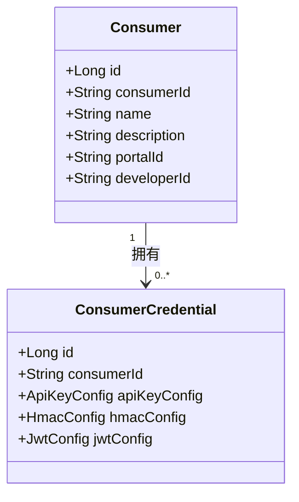
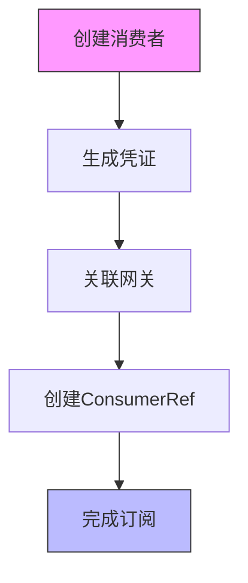
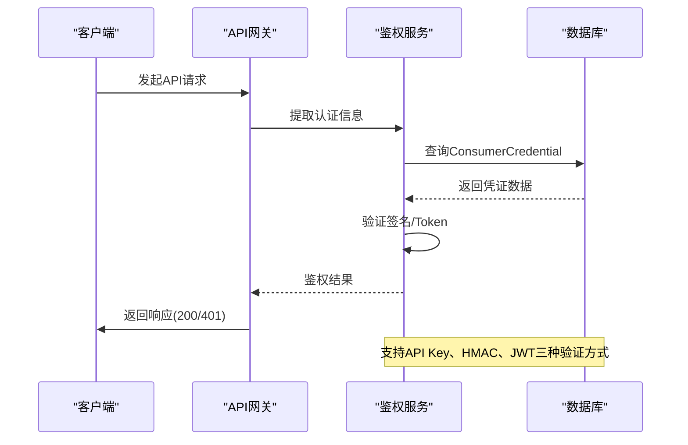
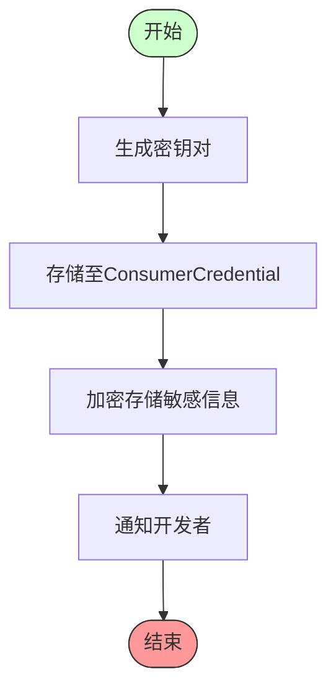

# Consumer

<cite>
**本文档引用文件**  
- [Consumer.java](file://portal-dal/src/main/java/com/alibaba/apiopenplatform/entity/Consumer.java)
- [ConsumerAuthType.java](file://portal-dal/src/main/java/com/alibaba/apiopenplatform/support/enums/ConsumerAuthType.java)
- [ConsumerCredential.java](file://portal-dal/src/main/java/com/alibaba/apiopenplatform/entity/ConsumerCredential.java)
- [ConsumerRef.java](file://portal-dal/src/main/java/com/alibaba/apiopenplatform/entity/ConsumerRef.java)
</cite>

## 目录
1. [简介](#简介)
2. [核心实体结构](#核心实体结构)
3. [认证方式详解](#认证方式详解)
4. [凭证管理机制](#凭证管理机制)
5. [消费者与产品订阅关系](#消费者与产品订阅关系)
6. [API调用鉴权流程](#api调用鉴权流程)
7. [凭证生成与验证机制](#凭证生成与验证机制)

## 简介
Consumer（消费者）是API开放平台中的核心实体之一，代表使用API服务的外部应用或用户。该实体通过多种认证方式（如API Key、HMAC、JWT）实现安全访问控制，并支持与多个网关实例的关联。每个消费者可拥有多个凭证（ConsumerCredential），并可通过ConsumerRef与具体的产品订阅关系绑定，从而实现精细化的权限管理和访问控制。

**本系统设计目标**：
- 支持多类型认证方式，提升安全性与灵活性
- 实现消费者与凭证的一对多关系，满足复杂场景需求
- 通过ConsumerRef实现消费者与网关的解耦，支持跨平台集成

## 核心实体结构

### Consumer实体字段说明
Consumer实体定义了消费者的基本信息和标识，其主要字段如下：

```java
public class Consumer extends BaseEntity {
    private Long id;
    private String consumerId;
    private String name;
    private String description;
    private String portalId;
    private String developerId;
}
```

| 字段名 | 类型 | 是否必填 | 说明 |
|-------|------|----------|------|
| **id** | Long | 是 | 主键，自增 |
| **consumerId** | String | 是 | 消费者唯一标识符 |
| **name** | String | 是 | 消费者名称 |
| **description** | String | 否 | 描述信息 |
| **portalId** | String | 是 | 所属门户ID |
| **developerId** | String | 是 | 关联开发者ID |

**Section sources**
- [Consumer.java](file://portal-dal/src/main/java/com/alibaba/apiopenplatform/entity/Consumer.java#L15-L35)

### 消费者与凭证的一对多关系
一个消费者可以拥有多个认证凭证，这种设计允许同一应用使用不同认证方式访问不同API资源。



**Diagram sources**
- [Consumer.java](file://portal-dal/src/main/java/com/alibaba/apiopenplatform/entity/Consumer.java#L15-L35)
- [ConsumerCredential.java](file://portal-dal/src/main/java/com/alibaba/apiopenplatform/entity/ConsumerCredential.java#L15-L35)

## 认证方式详解

### ConsumerAuthType枚举类型
系统支持三种主要的认证方式，定义在`ConsumerAuthType`枚举中：

```java
public enum ConsumerAuthType {
    KEY_AUTH,
    HMAC,
    JWT;
}
```

#### API Key认证（KEY_AUTH）
- **原理**：通过在HTTP请求头中携带预分配的密钥进行身份验证
- **优点**：实现简单，易于集成
- **缺点**：密钥明文传输存在泄露风险
- **适用场景**：内部系统、低安全要求的API调用

#### HMAC认证（HMAC）
- **原理**：使用哈希消息认证码，基于密钥对请求内容进行签名
- **优点**：
  - 防止请求被篡改
  - 验证请求来源真实性
  - 支持时间戳防重放攻击
- **安全特性**：
  - 请求头包含`X-HMAC-SIGNATURE`、`X-HMAC-ALGORITHM`、`X-HMAC-TIMESTAMP`
  - 服务端使用相同算法和密钥重新计算签名进行比对
- **适用场景**：高安全性要求的金融、支付类API

#### JWT认证（JWT）
- **原理**：使用JSON Web Token进行无状态认证
- **优点**：
  - 无需服务端存储会话信息
  - 支持跨域认证
  - 可携带用户声明信息
- **安全特性**：
  - 使用HS256或RS256算法签名
  - 支持Token过期机制
  - 可包含权限范围（scope）信息
- **适用场景**：微服务架构、单点登录（SSO）系统

**Section sources**
- [ConsumerAuthType.java](file://portal-dal/src/main/java/com/alibaba/apiopenplatform/support/enums/ConsumerAuthType.java#L10-L15)

## 凭证管理机制

### ConsumerCredential实体结构
该实体用于存储消费者的认证凭证信息，采用多配置字段设计以支持多种认证方式：

```java
public class ConsumerCredential extends BaseEntity {
    private Long id;
    private String consumerId;
    
    @Convert(converter = ApiKeyConfigConverter.class)
    private ApiKeyConfig apiKeyConfig;
    
    @Convert(converter = HmacConfigConverter.class)
    private HmacConfig hmacConfig;
    
    @Convert(converter = JwtConfigConverter.class)
    private JwtConfig jwtConfig;
}
```

| 配置类型 | 说明 |
|--------|------|
| **apiKeyConfig** | 存储API Key相关配置 |
| **hmacConfig** | 存储HMAC密钥和算法配置 |
| **jwtConfig** | 存储JWT签发者、密钥等信息 |

> **设计优势**：通过`@Convert`注解实现对象与数据库文本字段的自动转换，保证了数据的可读性和扩展性。

**Section sources**
- [ConsumerCredential.java](file://portal-dal/src/main/java/com/alibaba/apiopenplatform/entity/ConsumerCredential.java#L15-L35)

## 消费者与产品订阅关系

### ConsumerRef实体作用
`ConsumerRef`实体用于建立消费者与网关之间的关联关系，实现订阅模型：

```java
public class ConsumerRef extends BaseEntity {
    private Long id;
    private String consumerId;
    private GatewayType gatewayType;
    private String gwConsumerId;
    private GatewayConfig gatewayConfig;
}
```

#### 关键字段说明
- **consumerId**：指向Consumer实体的唯一标识
- **gatewayType**：网关类型（如Higress、APIG等）
- **gwConsumerId**：在目标网关中的消费者ID
- **gatewayConfig**：网关特定配置信息

#### 数据流示意图


**Diagram sources**
- [ConsumerRef.java](file://portal-dal/src/main/java/com/alibaba/apiopenplatform/entity/ConsumerRef.java#L15-L25)

## API调用鉴权流程

### 鉴权流程时序图


**Diagram sources**
- [Consumer.java](file://portal-dal/src/main/java/com/alibaba/apiopenplatform/entity/Consumer.java#L15-L35)
- [ConsumerCredential.java](file://portal-dal/src/main/java/com/alibaba/apiopenplatform/entity/ConsumerCredential.java#L15-L35)

## 凭证生成与验证机制

### 凭证生成流程


### 安全存储策略
- 敏感字段（如密钥）使用`@Encrypted`注解进行加密存储
- 数据库字段定义为`text`类型，支持大容量配置信息
- 使用Converter机制实现对象序列化与反序列化

### 验证机制对比
| 认证方式 | 验证频率 | 存储开销 | 性能影响 | 安全等级 |
|---------|----------|----------|----------|----------|
| **API Key** | 每次请求 | 低 | 低 | ★★☆☆☆ |
| **HMAC** | 每次请求 | 中 | 中 | ★★★★☆ |
| **JWT** | 每次请求 | 高 | 高 | ★★★★★ |

> **最佳实践建议**：对于高并发场景，建议结合Redis缓存验证结果以提升性能。

**Section sources**
- [ConsumerCredential.java](file://portal-dal/src/main/java/com/alibaba/apiopenplatform/entity/ConsumerCredential.java#L15-L35)
- [ConsumerAuthType.java](file://portal-dal/src/main/java/com/alibaba/apiopenplatform/support/enums/ConsumerAuthType.java#L10-L15)