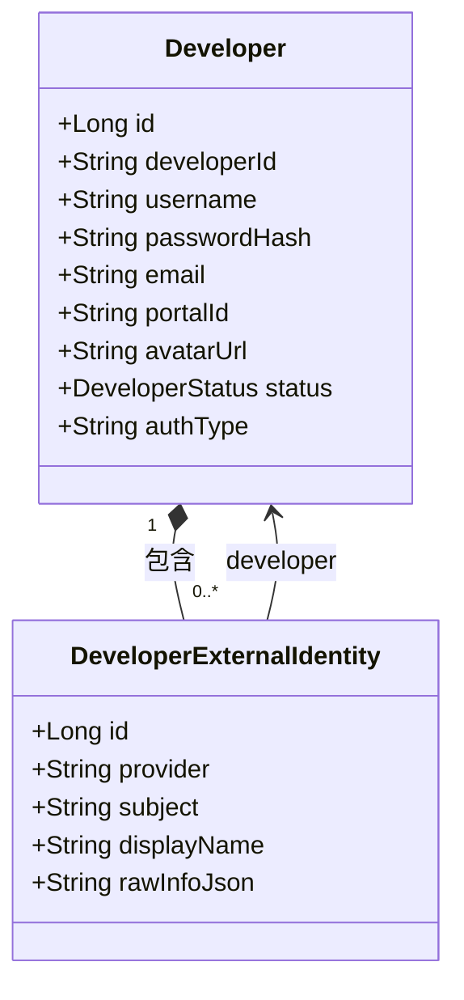
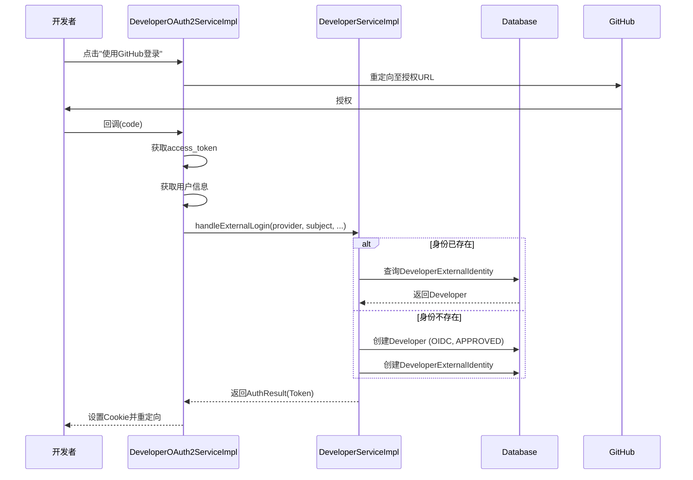

# Developer

<cite>
**本文档引用文件**  
- [Developer.java](file://portal-dal/src/main/java/com/alibaba/apiopenplatform/entity/Developer.java#L1-L76)
- [DeveloperExternalIdentity.java](file://portal-dal/src/main/java/com/alibaba/apiopenplatform/entity/DeveloperExternalIdentity.java#L1-L61)
- [DeveloperStatus.java](file://portal-dal/src/main/java/com/alibaba/apiopenplatform/support/enums/DeveloperStatus.java#L1-L35)
- [DeveloperServiceImpl.java](file://portal-server/src/main/java/com/alibaba/apiopenplatform/service/impl/DeveloperServiceImpl.java#L1-L393)
- [DeveloperOAuth2ServiceImpl.java](file://portal-server/src/main/java/com/alibaba/apiopenplatform/service/impl/DeveloperOAuth2ServiceImpl.java#L1-L428)
</cite>

## 目录
1. [引言](#引言)
2. [核心数据结构分析](#核心数据结构分析)
3. [开发者状态管理](#开发者状态管理)
4. [第三方身份认证机制](#第三方身份认证机制)
5. [开发者实体关系图](#开发者实体关系图)
6. [注册与登录流程](#注册与登录流程)
7. [权限与安全控制](#权限与安全控制)
8. [服务实现分析](#服务实现分析)
9. [总结](#总结)

## 引言
本文档深入解析`Developer`实体类及其在系统中的核心作用。该实体是开发者门户系统中用户账户管理的基础，承载了开发者身份信息、认证方式、账户状态等关键数据。通过分析其字段设计、枚举类型、与外部身份的关联关系，以及在服务层的实现逻辑，全面揭示开发者账户的生命周期管理机制。

## 核心数据结构分析
`Developer`实体类定义了开发者账户的核心属性，是系统用户管理的基石。其字段设计兼顾了本地认证与第三方OIDC登录的需求。

### 字段说明
- **id**: 主键，自增长，用于数据库唯一标识。
- **developerId**: 开发者全局唯一ID，由系统生成，作为主要业务标识符。
- **username**: 用户名，在同一门户（portalId）下具有唯一性。
- **passwordHash**: 密码哈希值，仅在本地认证（BUILT）时使用，使用安全哈希算法存储。
- **email**: 电子邮箱，可选字段，用于联系和身份识别。
- **portalId**: 所属门户ID，标识该开发者属于哪个API门户实例。
- **avatarUrl**: 头像URL，存储开发者头像的链接。
- **status**: 账户状态，使用`DeveloperStatus`枚举类型，控制账户的生命周期。
- **authType**: 认证类型，区分`LOCAL`（本地密码）和`OIDC`（第三方登录）。

```java
@Entity
@Table(name = "developer", uniqueConstraints = {
    @UniqueConstraint(columnNames = {"developerId"}),
    @UniqueConstraint(columnNames = {"portalId", "username"})  // 按portalId+username组合唯一
})
public class Developer extends BaseEntity implements Serializable {
    // ... 字段定义
}
```

**Section sources**
- [Developer.java](file://portal-dal/src/main/java/com/alibaba/apiopenplatform/entity/Developer.java#L1-L76)

## 开发者状态管理
`DeveloperStatus`枚举类型定义了开发者账户的生命周期状态，是实现账户审批流程的核心。

### 状态枚举
```java
public enum DeveloperStatus {
    /**
     * 已激活
     */
    APPROVED,

    /**
     * 待审核
     */
    PENDING,
}
```

### 状态流转逻辑
- **待审核 (PENDING)**: 新注册的开发者（除非门户设置自动审批）默认处于此状态，无法登录系统。
- **已激活 (APPROVED)**: 经管理员审批或门户配置为自动审批后，账户被激活，开发者可正常登录。

#### 状态变更实现
在`DeveloperServiceImpl`中，通过`setDeveloperStatus`方法实现状态变更：
```java
@Override
@Transactional
public void setDeveloperStatus(String developerId, DeveloperStatus status) {
    Developer developer = findDeveloper(developerId);
    developer.setStatus(status);
    developerRepository.save(developer);
}
```
此方法由管理员调用，直接修改数据库中的状态字段，从而控制账户的访问权限。

**Section sources**
- [DeveloperStatus.java](file://portal-dal/src/main/java/com/alibaba/apiopenplatform/support/enums/DeveloperStatus.java#L1-L35)
- [DeveloperServiceImpl.java](file://portal-server/src/main/java/com/alibaba/apiopenplatform/service/impl/DeveloperServiceImpl.java#L240-L246)

## 第三方身份认证机制
系统支持通过Aliyun、Google、Github等第三方OIDC提供商进行登录，其核心是`Developer`与`DeveloperExternalIdentity`的一对多关系。

### 外部身份实体
`DeveloperExternalIdentity`实体存储了第三方认证的详细信息：
- **developer**: 外键，关联到`Developer`实体，形成一对多关系。
- **provider**: 提供商名称（如 "github", "google"）。
- **subject**: 在第三方系统中的唯一用户标识（Subject）。
- **displayName**: 显示名称。
- **rawInfoJson**: 从第三方获取的原始用户信息JSON。

```java
@ManyToOne
@JoinColumn(name = "developer_id", referencedColumnName = "developerId", nullable = false)
private Developer developer;
```

### 关系模型
一个`Developer`可以绑定多个`DeveloperExternalIdentity`（例如，同时绑定GitHub和Google账号），但一个外部身份（provider + subject）只能绑定到一个开发者账户。

**Section sources**
- [DeveloperExternalIdentity.java](file://portal-dal/src/main/java/com/alibaba/apiopenplatform/entity/DeveloperExternalIdentity.java#L1-L61)

## 开发者实体关系图


**Diagram sources**
- [Developer.java](file://portal-dal/src/main/java/com/alibaba/apiopenplatform/entity/Developer.java#L1-L76)
- [DeveloperExternalIdentity.java](file://portal-dal/src/main/java/com/alibaba/apiopenplatform/entity/DeveloperExternalIdentity.java#L1-L61)

## 注册与登录流程
### 本地注册流程
1. 开发者提交注册表单（用户名、密码、邮箱）。
2. `DeveloperServiceImpl.createDeveloper()`方法检查用户名在当前门户下的唯一性。
3. 生成`developerId`，对密码进行哈希处理。
4. 根据门户设置的`autoApproveDevelopers`决定初始状态为`PENDING`或`APPROVED`。
5. 保存`Developer`记录。

### 第三方登录流程
1. 开发者点击第三方登录按钮（如“使用GitHub登录”）。
2. `DeveloperOAuth2ServiceImpl.handleAuthorize()`生成授权URL并重定向到第三方。
3. 第三方认证后回调`handleCallback()`。
4. 服务获取`access_token`并调用用户信息接口。
5. 提取`provider`和`subject`，查询`DeveloperExternalIdentity`。
    - **已存在**：直接登录。
    - **不存在**：创建新的`Developer`（`authType=OIDC`, `status=APPROVED`）和`DeveloperExternalIdentity`记录。
6. 生成JWT Token并返回。



**Diagram sources**
- [DeveloperOAuth2ServiceImpl.java](file://portal-server/src/main/java/com/alibaba/apiopenplatform/service/impl/DeveloperOAuth2ServiceImpl.java#L1-L428)
- [DeveloperServiceImpl.java](file://portal-server/src/main/java/com/alibaba/apiopenplatform/service/impl/DeveloperServiceImpl.java#L1-L393)

## 权限与安全控制
系统通过多层机制保障开发者账户的安全。

### 认证类型控制
- `authType`字段明确区分登录方式。
- 本地账户（`LOCAL`）可使用密码登录。
- 外部账户（`OIDC`）禁止使用密码登录，防止冲突。

### 登录验证
```java
@Override
public AuthResponseResult loginWithPassword(String username, String password) {
    // ... 
    if (!DeveloperStatus.APPROVED.equals(developer.getStatus())) {
        throw new BusinessException(ErrorCode.ACCOUNT_PENDING);
    }
    if ("EXTERNAL".equals(developer.getAuthType()) || developer.getPasswordHash() == null) {
        throw new BusinessException(ErrorCode.ACCOUNT_EXTERNAL_ONLY);
    }
    // ...
}
```

### 账户绑定与解绑
- **绑定**: `bindExternalIdentity()`方法确保同一外部身份不能被重复绑定。
- **解绑**: `unbindExternalIdentity()`方法防止将最后一个登录方式解绑，确保账户至少有一个登录途径。

**Section sources**
- [DeveloperServiceImpl.java](file://portal-server/src/main/java/com/alibaba/apiopenplatform/service/impl/DeveloperServiceImpl.java#L130-L138)
- [DeveloperServiceImpl.java](file://portal-server/src/main/java/com/alibaba/apiopenplatform/service/impl/DeveloperServiceImpl.java#L150-L180)

## 服务实现分析
`DeveloperServiceImpl`是`Developer`实体的核心业务逻辑实现类。

### 核心功能
- **账户创建**: `createDeveloper()`处理本地注册。
- **外部登录**: `handleExternalLogin()`处理第三方登录逻辑。
- **信息查询**: `getDeveloper()`, `listDevelopers()`提供数据访问。
- **状态管理**: `setDeveloperStatus()`供管理员审批账户。
- **个人资料管理**: `updateProfile()`允许开发者修改个人信息。

### 依赖注入
```java
private final DeveloperRepository developerRepository;
private final DeveloperExternalIdentityRepository developerExternalIdentityRepository;
private final PortalService portalService;
private final ContextHolder contextHolder;
private final ApplicationEventPublisher eventPublisher;
```
该服务依赖于数据访问层、门户服务、安全上下文和事件发布器，体现了清晰的分层架构。

**Section sources**
- [DeveloperServiceImpl.java](file://portal-server/src/main/java/com/alibaba/apiopenplatform/service/impl/DeveloperServiceImpl.java#L1-L393)

## 总结
`Developer`实体是整个开发者门户系统用户管理的核心。它通过`status`字段实现了灵活的账户审批流程，通过`authType`和`DeveloperExternalIdentity`实体支持了现代化的第三方OIDC登录。其与服务层的紧密结合，确保了从注册、登录、权限控制到账户管理的完整生命周期。该设计既保证了安全性，又提供了良好的用户体验，是系统可扩展性和易用性的关键所在。