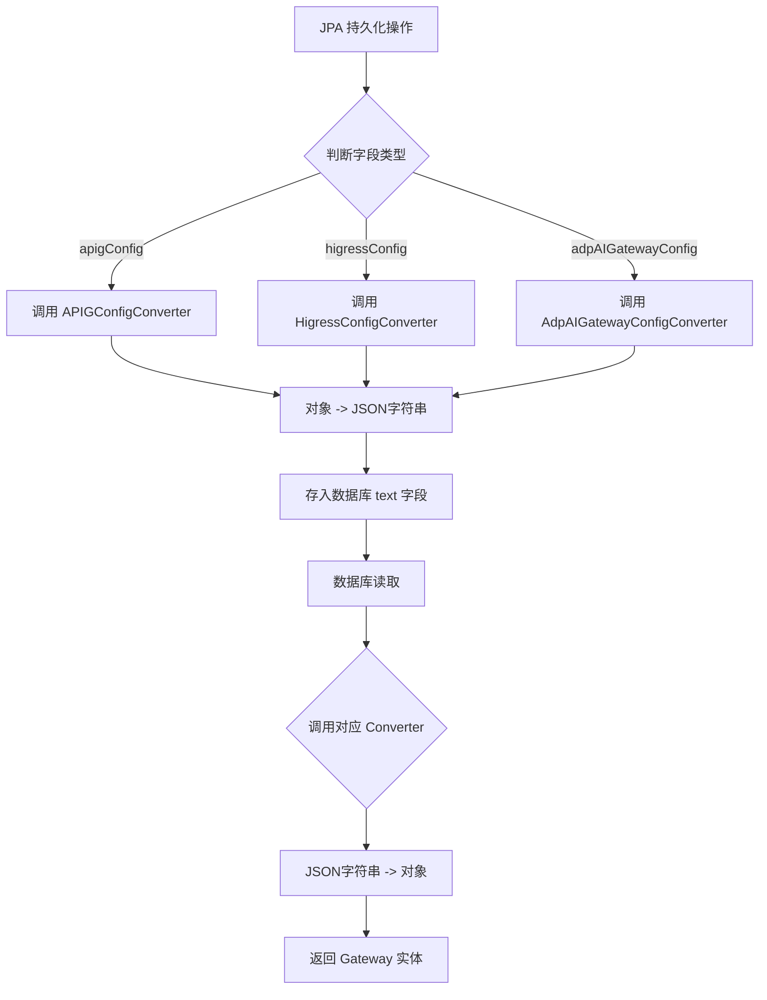
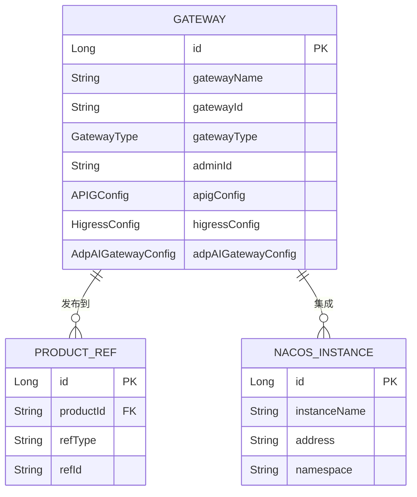

# 网关实体解析

<cite>
**本文档引用文件**  
- [Gateway.java](file://portal-dal/src/main/java/com/alibaba/apiopenplatform/entity/Gateway.java#L0-L71)
- [GatewayType.java](file://portal-dal/src/main/java/com/alibaba/apiopenplatform/support/enums/GatewayType.java#L0-L68)
- [APIGConfig.java](file://portal-dal/src/main/java/com/alibaba/apiopenplatform/support/gateway/APIGConfig.java#L0-L39)
- [HigressConfig.java](file://portal-dal/src/main/java/com/alibaba/apiopenplatform/support/gateway/HigressConfig.java#L0-L38)
- [AdpAIGatewayConfig.java](file://portal-dal/src/main/java/com/alibaba/apiopenplatform/support/gateway/AdpAIGatewayConfig.java#L0-L37)
- [APIGConfigConverter.java](file://portal-dal/src/main/java/com/alibaba/apiopenplatform/converter/APIGConfigConverter.java)
- [HigressConfigConverter.java](file://portal-dal/src/main/java/com/alibaba/apiopenplatform/converter/HigressConfigConverter.java)
- [AdpAIGatewayConfigConverter.java](file://portal-dal/src/main/java/com/alibaba/apiopenplatform/converter/AdpAIGatewayConfigConverter.java)
</cite>

## 目录
1. [引言](#引言)
2. [网关实体结构解析](#网关实体结构解析)
3. [网关类型枚举分析](#网关类型枚举分析)
4. [配置字段与JSON序列化机制](#配置字段与json序列化机制)
5. [Converter模式与类型转换实现](#converter模式与类型转换实现)
6. [网关实体的核心作用](#网关实体的核心作用)
7. [与其他实体的关联关系](#与其他实体的关联关系)
8. [总结](#总结)

## 引言
本文档旨在全面解析`Gateway`实体的设计与实现，涵盖其字段定义、多类型网关支持机制、配置存储方式及在系统中的核心作用。通过深入分析`Gateway`类及其相关组件，揭示其在网关实例管理、API同步和路由配置中的关键角色。

## 网关实体结构解析
`Gateway`实体是系统中用于统一建模各类API网关的核心数据结构，定义于`portal-dal`模块中，继承自`BaseEntity`，并映射到数据库表`gateway`。

### 核心字段说明
- **id**: 主键，自增长，类型为`Long`，对应数据库列`id`
- **gatewayName**: 网关名称，非空，最大长度64字符，对应列`gateway_name`
- **gatewayType**: 网关类型，使用`GatewayType`枚举，存储为字符串，对应列`gateway_type`
- **gatewayId**: 网关唯一标识符，非空，最大长度64字符，对应列`gateway_id`
- **adminId**: 管理员ID，非空，用于权限控制，对应列`admin_id`

### 配置字段设计
`Gateway`实体通过三个独立的配置字段支持不同类型的网关：
- **apigConfig**: 用于存储`APIG`类型网关的配置，类型为`APIGConfig`
- **adpAIGatewayConfig**: 用于存储`ADP AI Gateway`类型网关的配置，类型为`AdpAIGatewayConfig`
- **higressConfig**: 用于存储`Higress`类型网关的配置，类型为`HigressConfig`

这些字段在数据库中均以`text`类型存储，通过JPA的`@Convert`注解与相应的`Converter`类关联，实现对象与JSON字符串的自动转换。

**Section sources**
- [Gateway.java](file://portal-dal/src/main/java/com/alibaba/apiopenplatform/entity/Gateway.java#L0-L71)

## 网关类型枚举分析
`GatewayType`枚举定义在`portal-dal`模块的`support.enums`包中，用于统一标识系统支持的多种网关类型。

### 枚举值定义
```java
public enum GatewayType {
    /**
     * 云原生API网关
     */
    APIG_API("API"),

    /**
     * AI网关
     */
    APIG_AI("AI"),

    /**
     * ADP AI网关
     */
    ADP_AI_GATEWAY("ADP_AI_GATEWAY"),

    /**
     * Higress
     */
    HIGRESS("Higress"),
}
```

### 类型判断方法
枚举提供了便捷的布尔方法来判断网关类型：
- `isHigress()`: 判断是否为Higress网关
- `isAPIG()`: 判断是否为任何APIG系列网关（包括API、AI、ADP_AI_GATEWAY）
- `isAIGateway()`: 判断是否为AI类网关
- `isAdpAIGateway()`: 判断是否为ADP AI网关

这种设计使得业务逻辑可以根据网关类型进行分支处理，而无需直接比较字符串，提高了代码的可读性和健壮性。

**Section sources**
- [GatewayType.java](file://portal-dal/src/main/java/com/alibaba/apiopenplatform/support/enums/GatewayType.java#L0-L68)

## 配置字段与JSON序列化机制
`Gateway`实体采用**多字段分离存储**的策略来管理不同类型网关的配置，每个配置字段对应一个具体的Java类，并通过JSON序列化存储到数据库。

### 配置类结构
#### APIGConfig
```java
@Data
public class APIGConfig {
    @Encrypted
    private String accessKey;
    @Encrypted
    private String secretKey;
    private String region;
}
```
用于存储云原生API网关的认证密钥和区域信息，其中`accessKey`和`secretKey`被`@Encrypted`注解标记，表示需要加密存储。

#### HigressConfig
```java
@Data
public class HigressConfig {
    private String address;
    private String username;
    @Encrypted
    private String password;
}
```
用于存储Higress网关的地址、用户名和密码，密码字段同样需要加密。

#### AdpAIGatewayConfig
```java
@Data
public class AdpAIGatewayConfig {
    private String baseUrl;
    private Integer port;
    private String authSeed;
    private java.util.List<AuthHeader> authHeaders;
    
    @Data
    public static class AuthHeader {
        private String key;
        private String value;
    }
}
```
用于存储ADP AI网关的连接和认证信息，支持复杂的认证头列表。

### 存储机制
每个配置类实例在持久化时，会被其对应的`Converter`转换为JSON字符串，存储在数据库的`text`类型字段中。这种方式实现了**灵活的模式扩展**，新增网关类型时只需添加新的配置类和Converter，无需修改数据库表结构。

**Section sources**
- [APIGConfig.java](file://portal-dal/src/main/java/com/alibaba/apiopenplatform/support/gateway/APIGConfig.java#L0-L39)
- [HigressConfig.java](file://portal-dal/src/main/java/com/alibaba/apiopenplatform/support/gateway/HigressConfig.java#L0-L38)
- [AdpAIGatewayConfig.java](file://portal-dal/src/main/java/com/alibaba/apiopenplatform/support/gateway/AdpAIGatewayConfig.java#L0-L37)

## Converter模式与类型转换实现
系统采用JPA的`AttributeConverter`模式，通过自定义的`Converter`类实现配置对象与数据库字符串之间的双向转换。

### 转换器实现
系统为每种配置类型提供了专用的转换器：
- `APIGConfigConverter`: 继承自`JsonConverter<APIGConfig>`
- `HigressConfigConverter`: 继承自`JsonConverter<HigressConfig>`
- `AdpAIGatewayConfigConverter`: 继承自`JsonConverter<AdpAIGatewayConfig>`

这些转换器均继承自一个通用的`JsonConverter<T>`基类，该类利用JSON序列化库（如Jackson或Gson）将对象转换为JSON字符串，反之亦然。

### 转换流程


**Diagram sources**
- [APIGConfigConverter.java](file://portal-dal/src/main/java/com/alibaba/apiopenplatform/converter/APIGConfigConverter.java)
- [HigressConfigConverter.java](file://portal-dal/src/main/java/com/alibaba/apiopenplatform/converter/HigressConfigConverter.java)
- [AdpAIGatewayConfigConverter.java](file://portal-dal/src/main/java/com/alibaba/apiopenplatform/converter/AdpAIGatewayConfigConverter.java)

**Section sources**
- [Gateway.java](file://portal-dal/src/main/java/com/alibaba/apiopenplatform/entity/Gateway.java#L0-L71)

## 网关实体的核心作用
`Gateway`实体在系统中扮演着核心枢纽的角色，支撑着多项关键功能。

### 网关实例管理
`Gateway`实体是所有网关实例的统一数据模型。通过`GatewayService`和`GatewayRepository`，系统可以对网关进行增删改查操作。前端通过`GatewayController`暴露REST API，允许用户导入和管理不同类型的网关实例。

### API同步与路由配置
当需要与特定网关（如APIG或Higress）进行交互时，系统会从数据库加载对应的`Gateway`实体。根据`gatewayType`选择相应的`GatewayOperator`（如`APIGOperator`或`HigressOperator`），并将`apigConfig`或`higressConfig`作为参数传递，用于建立连接和执行API同步、路由配置等操作。

### 多类型网关统一建模
通过`gatewayType`字段和分离的配置字段，`Gateway`实体实现了对异构网关的统一建模。业务逻辑层可以根据类型判断方法（如`isHigress()`）动态选择处理策略，实现了**高内聚、低耦合**的设计。

**Section sources**
- [Gateway.java](file://portal-dal/src/main/java/com/alibaba/apiopenplatform/entity/Gateway.java#L0-L71)
- [GatewayType.java](file://portal-dal/src/main/java/com/alibaba/apiopenplatform/support/enums/GatewayType.java#L0-L68)

## 与其他实体的关联关系
虽然`Gateway`实体的直接关联在代码中未完全体现，但根据系统架构可以推断其潜在的关联。

### 与NacosInstance的关联
`NacosInstance`实体（位于`portal-dal/entity`）代表Nacos注册中心实例。在微服务架构中，网关（尤其是Higress）通常与Nacos集成，用于服务发现。因此，`Gateway`可能通过某种方式（如配置中的地址或独立的关联表）与`NacosInstance`建立关联，实现服务路由的自动同步。

### 与ProductRef的关联
`ProductRef`实体代表产品与外部资源的引用。一个API产品（`Product`）可能需要发布到一个或多个网关实例上。`Gateway`实体的`gatewayId`可以作为`ProductRef`中的一个引用目标，表明该产品已发布到此网关，从而实现API的统一管理和分发。



**Diagram sources**
- [Gateway.java](file://portal-dal/src/main/java/com/alibaba/apiopenplatform/entity/Gateway.java#L0-L71)
- [NacosInstance.java](file://portal-dal/src/main/java/com/alibaba/apiopenplatform/entity/NacosInstance.java)
- [ProductRef.java](file://portal-dal/src/main/java/com/alibaba/apiopenplatform/entity/ProductRef.java)

## 总结
`Gateway`实体通过精巧的设计，实现了对多类型网关的统一建模与管理。其核心在于：
1.  **类型枚举**：`GatewayType`提供清晰的类型划分和便捷的判断方法。
2.  **分离配置**：为每种网关类型使用独立的配置字段，避免了大而全的配置类。
3.  **Converter模式**：利用JPA Converter实现对象与JSON的自动转换，保证了数据的灵活性和可扩展性。
4.  **统一接口**：为上层业务提供了统一的操作入口，屏蔽了底层网关的差异性。

这一设计模式不仅满足了当前对APIG、Higress和ADP AI网关的支持，也为未来集成更多类型的网关奠定了坚实的基础。