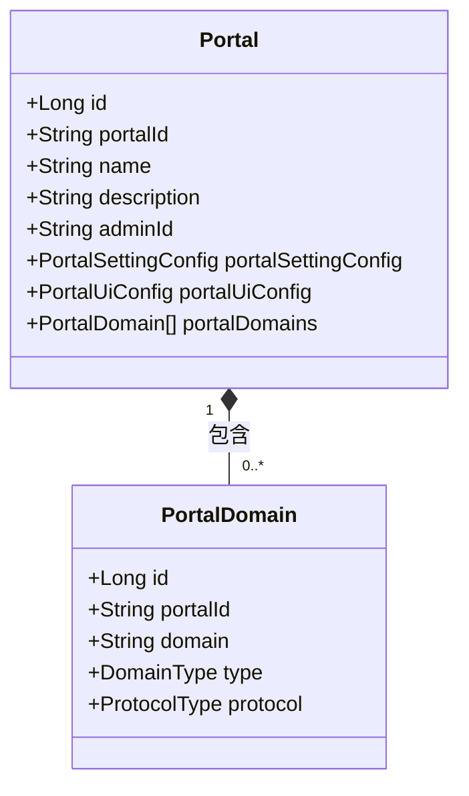
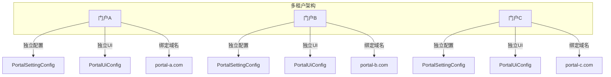
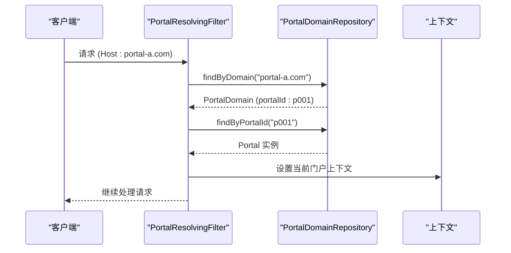
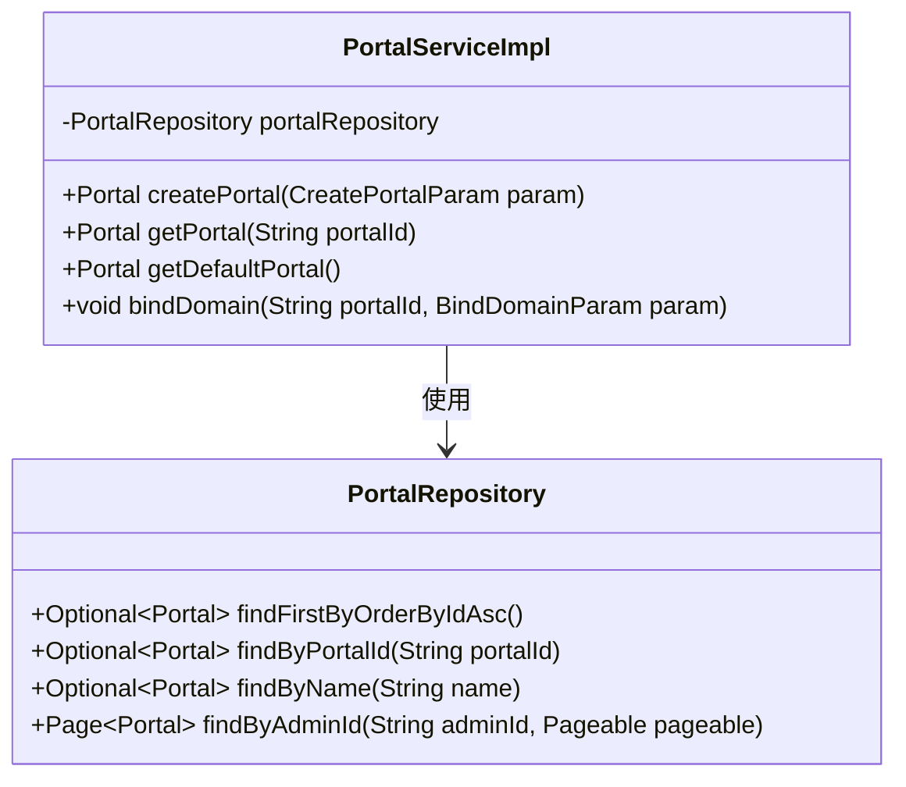

# Portal

<cite>
**本文档引用的文件**  
- [Portal.java](file://portal-dal/src/main/java/com/alibaba/apiopenplatform/entity/Portal.java)
- [PortalDomain.java](file://portal-dal/src/main/java/com/alibaba/apiopenplatform/entity/PortalDomain.java)
- [PortalSettingConfig.java](file://portal-dal/src/main/java/com/alibaba/apiopenplatform/support/portal/PortalSettingConfig.java)
- [PortalUiConfig.java](file://portal-dal/src/main/java/com/alibaba/apiopenplatform/support/portal/PortalUiConfig.java)
- [PortalRepository.java](file://portal-dal/src/main/java/com/alibaba/apiopenplatform/repository/PortalRepository.java)
- [PortalServiceImpl.java](file://portal-server/src/main/java/com/alibaba/apiopenplatform/service/impl/PortalServiceImpl.java)
</cite>

## 目录
1. [简介](#简介)
2. [核心实体结构](#核心实体结构)
3. [Portal与PortalDomain的关系](#portal与portaldomain的关系)
4. [门户配置结构](#门户配置结构)
5. [多租户架构中的角色](#多租户架构中的角色)
6. [域名路由机制](#域名路由机制)
7. [数据访问与持久化](#数据访问与持久化)

## 简介
`Portal` 实体是本系统中实现多租户门户隔离的核心数据模型。它代表一个独立的门户实例，支持通过自定义域名访问，并具备独立的配置体系。每个 `Portal` 可以关联多个域名（`PortalDomain`），并通过 `settings` 字段存储门户级配置，如认证策略、UI 展示等。该实体在系统中承担着上下文隔离和路由定位的关键职责。

## 核心实体结构
`Portal` 类定义了门户实例的基本属性，继承自 `BaseEntity`，包含以下关键字段：

- **id**: 主键，自增长整型
- **portalId**: 门户唯一标识符，不可为空，长度限制64字符
- **name**: 门户名称，不可为空，长度限制64字符，与 `adminId` 联合唯一
- **description**: 门户描述，最大长度256字符
- **adminId**: 管理员ID，关联门户创建者
- **portalSettingConfig**: 门户设置配置对象，使用 `PortalSettingConfigConverter` 进行类型转换，存储为文本字段
- **portalUiConfig**: 门户UI配置对象，同样通过转换器存储为文本
- **portalDomains**: 瞬态字段，用于运行时关联的域名列表，不直接映射到数据库

```java
@Entity
@Table(name = "portal")
@Data
public class Portal extends BaseEntity {
    @Id
    private Long id;
    private String portalId;
    private String name;
    private String description;
    private String adminId;
    
    @Convert(converter = PortalSettingConfigConverter.class)
    private PortalSettingConfig portalSettingConfig;
    
    @Convert(converter = PortalUiConfigConverter.class)
    private PortalUiConfig portalUiConfig;

    @Transient
    private List<PortalDomain> portalDomains = new ArrayList<>();
}
```

**Section sources**
- [Portal.java](file://portal-dal/src/main/java/com/alibaba/apiopenplatform/entity/Portal.java#L1-L67)

## Portal与PortalDomain的关系
`Portal` 与 `PortalDomain` 构成一对多关系，即一个门户可绑定多个访问域名。`PortalDomain` 实体包含以下字段：

- **id**: 主键
- **portalId**: 关联的门户ID，不可为空
- **domain**: 域名，不可为空，最大长度128字符，全局唯一
- **type**: 域名类型，枚举 `DomainType`，默认为 `DEFAULT`
- **protocol**: 协议类型，枚举 `ProtocolType`，默认为 `HTTP`

该关系通过 `portalId` 字段建立外键关联，但未在 JPA 中显式声明 `@OneToMany`，而是通过服务层逻辑维护。`Portal` 实体中的 `portalDomains` 字段为 `@Transient`，表示其值由查询动态填充。



**Diagram sources**
- [Portal.java](file://portal-dal/src/main/java/com/alibaba/apiopenplatform/entity/Portal.java#L1-L67)
- [PortalDomain.java](file://portal-dal/src/main/java/com/alibaba/apiopenplatform/entity/PortalDomain.java#L1-L54)

## 门户配置结构
门户的配置信息通过两个独立的对象进行管理，分别存储不同类型的设置：

### PortalUiConfig（UI配置）
存储与用户界面相关的展示信息：
- **logo**: 门户Logo的URL或路径
- **icon**: 门户图标

```java
@Data
public class PortalUiConfig {
    private String logo;
    private String icon;
}
```

### PortalSettingConfig（功能配置）
存储门户的核心功能策略：
- **builtinAuthEnabled**: 是否启用内置认证，默认为 `true`
- **oidcConfigs**: OIDC 认证提供者配置列表
- **autoApproveDevelopers**: 是否自动批准开发者注册，默认为 `false`
- **autoApproveSubscriptions**: 是否自动批准订阅请求，默认为 `true`

```java
@Data
public class PortalSettingConfig {
    private Boolean builtinAuthEnabled = true;
    private List<OidcConfig> oidcConfigs;
    private Boolean autoApproveDevelopers = false;
    private Boolean autoApproveSubscriptions = true;
}
```

这些配置对象通过 JPA 的 `@Convert` 注解，使用对应的转换器（`PortalSettingConfigConverter` 和 `PortalUiConfigConverter`）序列化为 JSON 文本存储在数据库中。

**Section sources**
- [PortalSettingConfig.java](file://portal-dal/src/main/java/com/alibaba/apiopenplatform/support/portal/PortalSettingConfig.java#L1-L36)
- [PortalUiConfig.java](file://portal-dal/src/main/java/com/alibaba/apiopenplatform/support/portal/PortalUiConfig.java#L1-L30)

## 多租户架构中的角色
`Portal` 实体是实现多租户架构的核心。每个 `Portal` 代表一个独立的租户实例，具备以下特征：

- **数据隔离**: 不同门户的数据通过 `portalId` 进行逻辑隔离
- **配置独立**: 每个门户拥有独立的 `portalSettingConfig` 和 `portalUiConfig`
- **域名独立**: 可绑定专属域名，实现品牌化访问
- **管理独立**: 由独立的管理员（`adminId`）进行管理

这种设计允许系统在同一套代码部署下，为不同客户或业务线提供完全独立的门户体验，实现资源复用与隔离的平衡。



**Diagram sources**
- [Portal.java](file://portal-dal/src/main/java/com/alibaba/apiopenplatform/entity/Portal.java#L1-L67)
- [PortalSettingConfig.java](file://portal-dal/src/main/java/com/alibaba/apiopenplatform/support/portal/PortalSettingConfig.java#L1-L36)

## 域名路由机制
系统通过 `PortalDomain` 实现基于域名的路由定位。当请求到达时，系统会：

1. 解析请求的 `Host` 头部获取域名
2. 查询 `portal_domain` 表，查找匹配的 `domain` 记录
3. 根据 `portalId` 定位到具体的 `Portal` 实例
4. 将请求上下文绑定到该门户，加载其配置（`portalSettingConfig` 和 `portalUiConfig`）
5. 执行后续的业务逻辑

该流程主要由 `PortalResolvingFilter`（位于 `portal-bootstrap` 模块）实现，确保每个请求都能正确地路由到对应的门户上下文，实现多租户的透明访问。



**Diagram sources**
- [PortalDomain.java](file://portal-dal/src/main/java/com/alibaba/apiopenplatform/entity/PortalDomain.java#L1-L54)
- [PortalRepository.java](file://portal-dal/src/main/java/com/alibaba/apiopenplatform/repository/PortalRepository.java#L1-L41)

## 数据访问与持久化
`Portal` 实体的持久化操作通过 `PortalRepository` 接口定义，遵循 Spring Data JPA 规范。主要方法包括：

- `findFirstByOrderByIdAsc()`: 获取首个创建的门户（通常作为默认门户）
- `findByPortalId(String)`: 根据门户ID查询
- `findByName(String)`: 根据名称查询
- `findByAdminId(String, Pageable)`: 根据管理员ID分页查询其管理的门户

服务层 `PortalServiceImpl` 封装了业务逻辑，如创建门户时生成唯一 `portalId`，绑定域名时校验域名唯一性等。



**Diagram sources**
- [PortalRepository.java](file://portal-dal/src/main/java/com/alibaba/apiopenplatform/repository/PortalRepository.java#L1-L41)
- [PortalServiceImpl.java](file://portal-server/src/main/java/com/alibaba/apiopenplatform/service/impl/PortalServiceImpl.java)