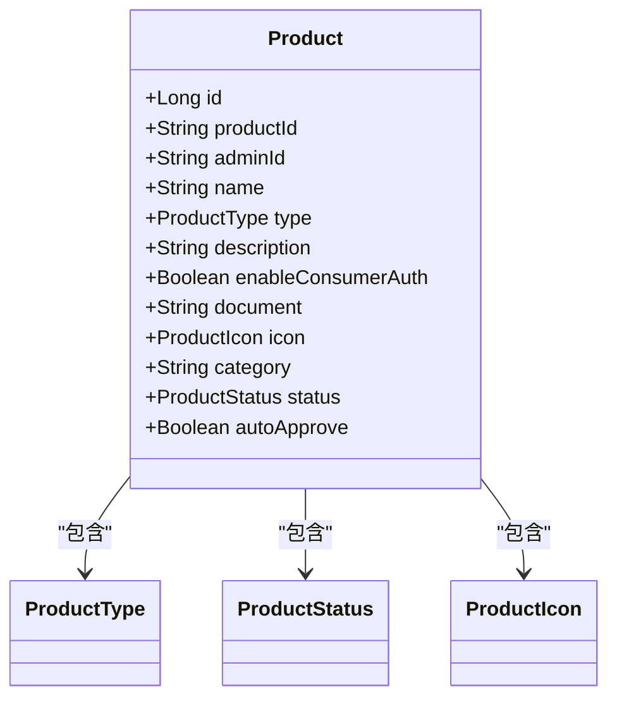
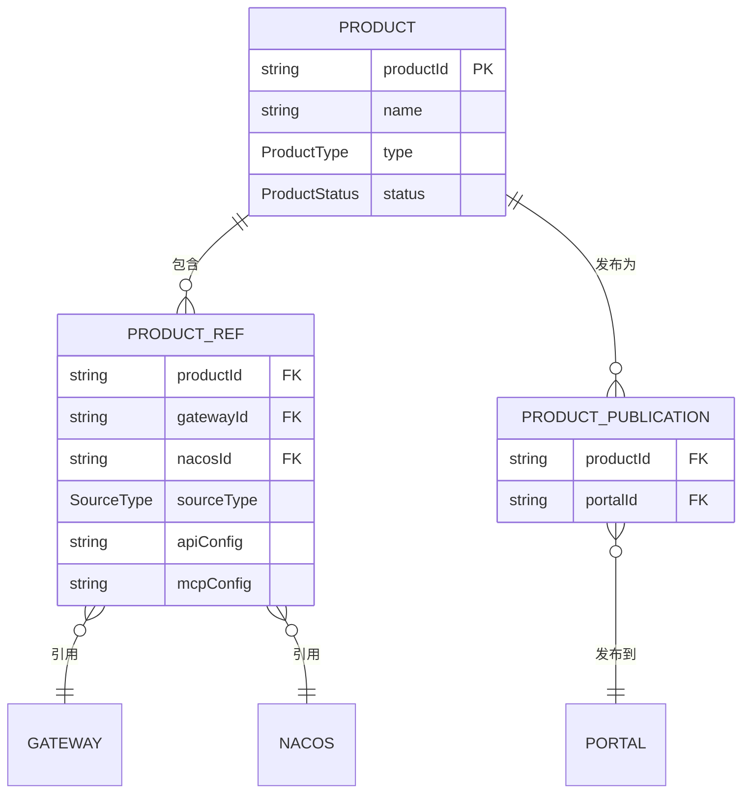
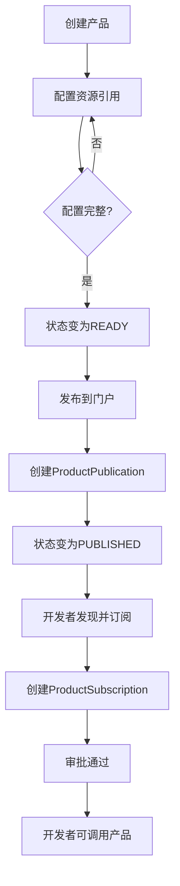

# 产品实体设计文档

<cite>
**本文档引用文件**  
- [Product.java](file://portal-dal/src/main/java/com/alibaba/apiopenplatform/entity/Product.java#L0-L78)
- [ProductType.java](file://portal-dal/src/main/java/com/alibaba/apiopenplatform/support/enums/ProductType.java#L0-L29)
- [ProductStatus.java](file://portal-dal/src/main/java/com/alibaba/apiopenplatform/support/enums/ProductStatus.java#L0-L40)
- [ProductPublication.java](file://portal-dal/src/main/java/com/alibaba/apiopenplatform/entity/ProductPublication.java#L0-L41)
- [ProductRef.java](file://portal-dal/src/main/java/com/alibaba/apiopenplatform/entity/ProductRef.java#L0-L81)
- [ProductRepository.java](file://portal-dal/src/main/java/com/alibaba/apiopenplatform/repository/ProductRepository.java)
- [ProductServiceImpl.java](file://portal-server/src/main/java/com/alibaba/apiopenplatform/service/impl/ProductServiceImpl.java)
- [ProductController.java](file://portal-server/src/main/java/com/alibaba/apiopenplatform/controller/ProductController.java)
</cite>

## 目录
1. [产品实体概述](#产品实体概述)  
2. [核心字段设计](#核心字段设计)  
3. [产品类型与状态枚举](#产品类型与状态枚举)  
4. [关联实体关系分析](#关联实体关系分析)  
5. [JPA映射与数据库设计](#jpa映射与数据库设计)  
6. [生命周期管理流程](#生命周期管理流程)  
7. [实际应用场景](#实际应用场景)  
8. [总结](#总结)

## 产品实体概述

`Product` 实体是平台中用于管理可发布资源的核心数据模型，代表一个可被开发者发现、订阅和使用的“产品”。该实体不仅包含基础信息（如名称、描述），还定义了其类型、状态、图标等元数据，并通过外键与其他实体建立关联，实现从创建、配置、发布到订阅的完整生命周期管理。

该实体位于 `portal-dal` 模块的 `entity` 包中，继承自 `BaseEntity`，具备通用的审计字段（如创建时间、更新时间）。其设计遵循领域驱动设计（DDD）原则，将业务逻辑与数据结构紧密结合。

**Section sources**  
- [Product.java](file://portal-dal/src/main/java/com/alibaba/apiopenplatform/entity/Product.java#L0-L78)

## 核心字段设计

`Product` 实体包含以下关键字段，每个字段均通过 JPA 注解映射到数据库表 `product` 的对应列：



**Diagram sources**  
- [Product.java](file://portal-dal/src/main/java/com/alibaba/apiopenplatform/entity/Product.java#L0-L78)

### 字段说明

- **id**: 主键，自增长，对应数据库列 `id`。  
- **productId**: 产品的唯一业务标识符，非空，长度限制64字符，数据库唯一约束 `uk_product_id`。  
- **adminId**: 创建该产品的管理员ID，用于权限追踪。  
- **name**: 产品名称，非空，长度限制64字符，数据库唯一约束 `uk_name`。  
- **type**: 产品类型，使用 `@Enumerated(EnumType.STRING)` 映射为字符串存储，关联 `ProductType` 枚举。  
- **description**: 产品描述，最大长度256字符，用于简要说明产品功能。  
- **enableConsumerAuth**: 是否启用消费者认证，布尔值，决定调用该产品是否需要身份验证。  
- **document**: 产品文档，使用 `text` 类型存储，可存放详细的使用说明、API文档等。  
- **icon**: 产品图标，通过 `@Convert(converter = ProductIconConverter.class)` 将 `ProductIcon` 对象序列化为JSON字符串存储。  
- **category**: 产品分类，用于前端分组展示。  
- **status**: 产品状态，初始值为 `PENDING`，关联 `ProductStatus` 枚举。  
- **autoApprove**: 是否自动批准订阅请求，影响 `ProductSubscription` 的审批流程。

**Section sources**  
- [Product.java](file://portal-dal/src/main/java/com/alibaba/apiopenplatform/entity/Product.java#L0-L78)

## 产品类型与状态枚举

### 产品类型 (ProductType)

`ProductType` 枚举定义了产品的主要分类，目前包含三种类型：

```java
public enum ProductType {
    REST_API,
    HTTP_API,
    MCP_SERVER,
}
```

- **REST_API**: 表示该产品封装了一组RESTful风格的API接口。  
- **HTTP_API**: 表示该产品提供基于HTTP协议的通用API服务。  
- **MCP_SERVER**: 表示该产品关联一个MCP（Model Control Plane）服务，通常用于AI模型管理。

该分类逻辑从业务功能角度出发，区分了产品对外暴露的接口形式或服务类型，便于在门户中进行分类展示和路由处理。

**Section sources**  
- [ProductType.java](file://portal-dal/src/main/java/com/alibaba/apiopenplatform/support/enums/ProductType.java#L0-L29)

### 产品状态 (ProductStatus)

`ProductStatus` 枚举定义了产品在其生命周期中的不同阶段：

```java
public enum ProductStatus {
    /**
     * 未配置API和MCP Server
     */
    PENDING,

    /**
     * 已配置API或MCP Server
     */
    READY,

    /**
     * 已发布
     */
    PUBLISHED,
}
```

- **PENDING（草稿）**: 产品刚创建，尚未关联任何API或MCP服务，处于可编辑状态。  
- **READY（就绪）**: 产品已配置至少一个API或MCP服务（通过 `ProductRef`），可以进入发布流程。  
- **PUBLISHED（已发布）**: 产品已成功发布到指定门户（通过 `ProductPublication`），对开发者可见。

此状态机设计清晰地划分了产品从创建到上线的流程，确保只有配置完整的产品才能被发布，保障了数据一致性。

**Section sources**  
- [ProductStatus.java](file://portal-dal/src/main/java/com/alibaba/apiopenplatform/support/enums/ProductStatus.java#L0-L40)

## 关联实体关系分析

`Product` 实体通过多个关联实体实现其完整功能，形成一个以 `productId` 为核心的网状结构。



**Diagram sources**  
- [Product.java](file://portal-dal/src/main/java/com/alibaba/apiopenplatform/entity/Product.java#L0-L78)
- [ProductRef.java](file://portal-dal/src/main/java/com/alibaba/apiopenplatform/entity/ProductRef.java#L0-L81)
- [ProductPublication.java](file://portal-dal/src/main/java/com/alibaba/apiopenplatform/entity/ProductPublication.java#L0-L41)

### ProductRef（产品引用）

`ProductRef` 实体表示产品与底层资源（如网关、Nacos实例）的绑定关系。

- **外键关联**: `productId` 字段关联 `Product`，形成一对多关系。  
- **资源引用**: `gatewayId` 和 `nacosId` 分别指向 `Gateway` 和 `NacosInstance` 实体。  
- **配置存储**: `apigRefConfig`, `higressRefConfig`, `nacosRefConfig` 等字段通过自定义 `Converter` 将复杂对象（如 `APIGRefConfig`）序列化为JSON存储。  
- **源类型**: `sourceType` 枚举字段标识资源来源，用于区分不同类型的引用。  
- **功能配置**: `apiConfig` 和 `mcpConfig` 存储产品级别的API或MCP配置。

此设计实现了产品与具体技术实现的解耦，一个产品可以引用多个不同类型的资源。

**Section sources**  
- [ProductRef.java](file://portal-dal/src/main/java/com/alibaba/apiopenplatform/entity/ProductRef.java#L0-L81)

### ProductPublication（产品发布）

`ProductPublication` 实体表示产品在某个门户（Portal）中的发布记录。

- **外键关联**: `productId` 关联 `Product`，`portalId` 关联 `Portal`，形成产品与门户的多对多关系。  
- **发布事实**: 每条记录代表一次发布行为，删除该记录即表示产品从门户下线。

此设计支持一个产品发布到多个门户，也支持一个门户展示多个产品，灵活性高。

**Section sources**  
- [ProductPublication.java](file://portal-dal/src/main/java/com/alibaba/apiopenplatform/entity/ProductPublication.java#L0-L41)

### ProductSubscription（产品订阅）

虽然未直接分析其代码，但根据命名和业务逻辑，`ProductSubscription` 实体应表示开发者对产品的订阅关系。

- **外键关联**: 应包含 `productId` 和 `developerId`，形成产品与开发者的多对多关系。  
- **状态管理**: 应包含 `SubscriptionStatus` 枚举，管理订阅的审批状态。  
- **生命周期**: 订阅关系依赖于产品的发布状态，只有已发布的产品才能被订阅。

**Section sources**  
- [ProductSubscription.java](file://portal-dal/src/main/java/com/alibaba/apiopenplatform/entity/ProductSubscription.java)

## JPA映射与数据库设计

`Product` 及其关联实体通过JPA注解实现与数据库的精确映射。

### 主要注解说明

- **@Entity**: 标识类为JPA实体，映射到数据库表。  
- **@Table(name = "...")**: 指定数据库表名。  
- **@Id + @GeneratedValue**: 定义主键及其生成策略（IDENTITY）。  
- **@Column**: 映射字段到数据库列，可指定长度、是否可空、列定义等。  
- **@Enumerated(EnumType.STRING)**: 将枚举值以字符串形式存储，提高可读性。  
- **@Convert(converter = ...)**: 使用自定义转换器处理复杂对象的序列化/反序列化。  
- **@UniqueConstraint**: 在表级别定义唯一约束，确保数据完整性。

### 外键维护

在当前设计中，外键关系主要通过 `productId` 字符串字段在业务逻辑层维护，而非使用 `@ManyToOne` 等关系注解。这种“逻辑外键”设计有以下优点：

1. **降低耦合**: 避免了实体间的强依赖，便于模块独立开发。  
2. **提高性能**: 减少了JPA的级联操作和懒加载/急加载的复杂性。  
3. **增强灵活性**: 便于进行跨库查询或未来微服务化拆分。

**Section sources**  
- [Product.java](file://portal-dal/src/main/java/com/alibaba/apiopenplatform/entity/Product.java#L0-L78)
- [ProductRef.java](file://portal-dal/src/main/java/com/alibaba/apiopenplatform/entity/ProductRef.java#L0-L81)
- [ProductPublication.java](file://portal-dal/src/main/java/com/alibaba/apiopenplatform/entity/ProductPublication.java#L0-L41)

## 生命周期管理流程

产品的完整生命周期包括创建、配置、发布和订阅四个阶段。



**Diagram sources**  
- [ProductServiceImpl.java](file://portal-server/src/main/java/com/alibaba/apiopenplatform/service/impl/ProductServiceImpl.java)
- [ProductController.java](file://portal-server/src/main/java/com/alibaba/apiopenplatform/controller/ProductController.java)

### 流程说明

1. **创建**: 管理员通过 `ProductController.createProduct()` 创建产品，初始状态为 `PENDING`。  
2. **配置**: 调用 `ProductRef` 相关接口，为产品添加API或MCP配置，当配置完整后，状态可更新为 `READY`。  
3. **发布**: 调用 `ProductController.publishProduct()`，系统创建 `ProductPublication` 记录，并将产品状态更新为 `PUBLISHED`。  
4. **订阅**: 开发者在门户前端看到已发布的产品，发起订阅请求，系统创建 `ProductSubscription` 记录，经审批后生效。

**Section sources**  
- [ProductServiceImpl.java](file://portal-server/src/main/java/com/alibaba/apiopenplatform/service/impl/ProductServiceImpl.java#L15-L100)
- [ProductController.java](file://portal-server/src/main/java/com/alibaba/apiopenplatform/controller/ProductController.java#L20-L80)

## 实际应用场景

### 门户展示

在门户前端（`api-portal-frontend`），`Product` 实体的 `name`, `description`, `icon`, `category` 等字段被用于构建产品列表和详情页。`status` 字段确保只有 `PUBLISHED` 的产品才会被查询和展示。

```typescript
// 伪代码：前端获取产品列表
const publishedProducts = await api.get('/products', { status: 'PUBLISHED' });
```

### API调用

当开发者调用产品关联的API时，后端服务会根据 `Product` 的 `enableConsumerAuth` 字段决定是否进行身份验证，并根据 `ProductRef` 中的配置路由到正确的网关或服务。

**Section sources**  
- [ProductController.java](file://portal-server/src/main/java/com/alibaba/apiopenplatform/controller/ProductController.java)
- [ProductServiceImpl.java](file://portal-server/src/main/java/com/alibaba/apiopenplatform/service/impl/ProductServiceImpl.java)

## 总结

`Product` 实体是平台资源管理的核心，其设计通过清晰的字段划分、枚举分类和关联实体，实现了产品从创建到订阅的全生命周期管理。采用逻辑外键和自定义转换器的JPA映射策略，在保证数据完整性的同时，兼顾了系统的灵活性和可扩展性。该设计模式为构建复杂的B2D（Business to Developer）平台提供了坚实的基础。