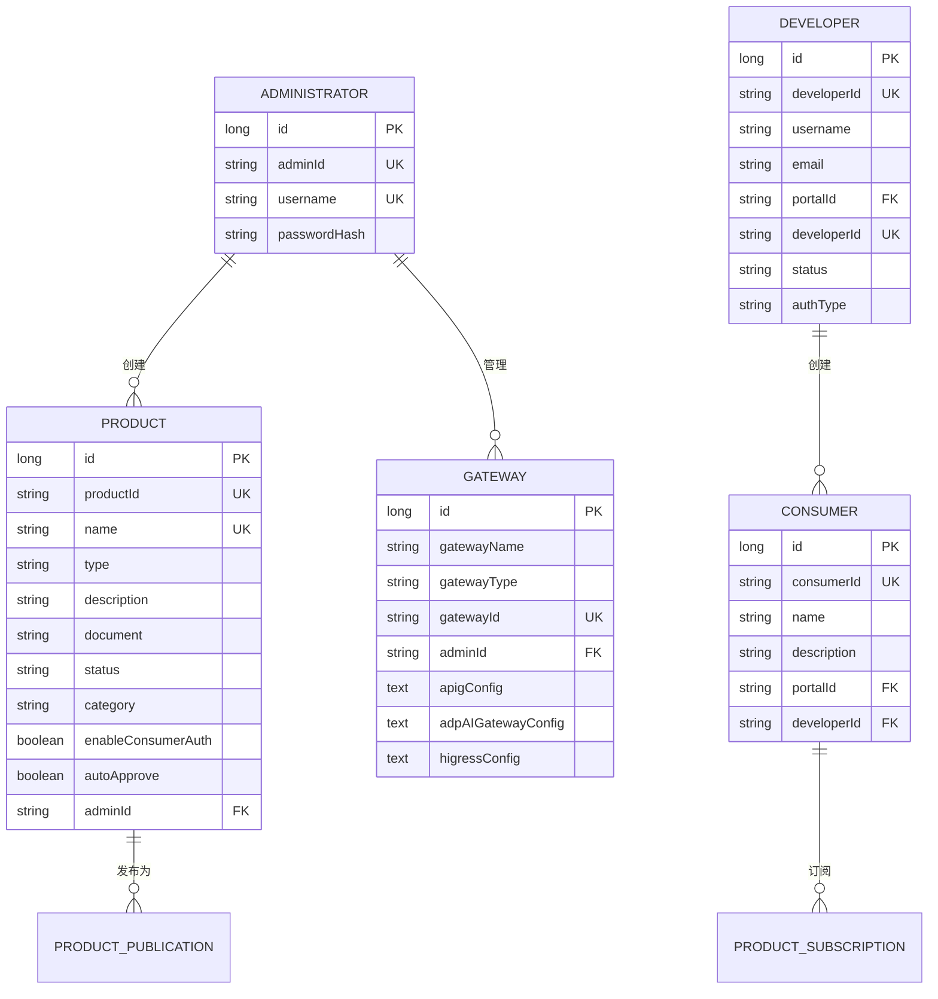

# 数据库与数据模型

<cite>
**本文档引用的文件**  
- [Administrator.java](file://portal-dal/src/main/java/com/alibaba/apiopenplatform/entity/Administrator.java)
- [Developer.java](file://portal-dal/src/main/java/com/alibaba/apiopenplatform/entity/Developer.java)
- [Consumer.java](file://portal-dal/src/main/java/com/alibaba/apiopenplatform/entity/Consumer.java)
- [Product.java](file://portal-dal/src/main/java/com/alibaba/apiopenplatform/entity/Product.java)
- [Gateway.java](file://portal-dal/src/main/java/com/alibaba/apiopenplatform/entity/Gateway.java)
- [ConsumerAuthType.java](file://portal-dal/src/main/java/com/alibaba/apiopenplatform/support/enums/ConsumerAuthType.java)
- [ProductStatus.java](file://portal-dal/src/main/java/com/alibaba/apiopenplatform/support/enums/ProductStatus.java)
- [BaseRepository.java](file://portal-dal/src/main/java/com/alibaba/apiopenplatform/repository/BaseRepository.java)
- [ProductRepository.java](file://portal-dal/src/main/java/com/alibaba/apiopenplatform/repository/ProductRepository.java)
- [DeveloperRepository.java](file://portal-dal/src/main/java/com/alibaba/apiopenplatform/repository/DeveloperRepository.java)
- [ConsumerRepository.java](file://portal-dal/src/main/java/com/alibaba/apiopenplatform/repository/ConsumerRepository.java)
- [GatewayRepository.java](file://portal-dal/src/main/java/com/alibaba/apiopenplatform/repository/GatewayRepository.java)
</cite>

## 目录
1. [简介](#简介)
2. [核心实体模型分析](#核心实体模型分析)
3. [关键枚举类型说明](#关键枚举类型说明)
4. [数据访问层设计](#数据访问层设计)
5. [实体关系图（ERD）](#实体关系图（erd）)
6. [数据模型总结](#数据模型总结)

## 简介
Himarket 是一个API开放平台，其数据模型设计围绕核心业务实体展开，包括管理员、开发者、消费者、产品和网关等。本文档基于 `portal-dal` 模块中的JPA实体类，详细解析数据库Schema设计，涵盖字段定义、数据类型、主键/外键约束及实体间关系。通过分析JPA注解（如 `@Entity`, `@Table`, `@Id`, `@ManyToOne`），揭示了底层表结构与对象关系映射（ORM）机制。

**Section sources**
- [Administrator.java](file://portal-dal/src/main/java/com/alibaba/apiopenplatform/entity/Administrator.java#L1-L55)
- [Developer.java](file://portal-dal/src/main/java/com/alibaba/apiopenplatform/entity/Developer.java#L1-L76)

## 核心实体模型分析

### 管理员实体 (Administrator)
`Administrator` 实体映射系统管理员账户信息，是平台的超级用户。

**字段定义与约束：**
- **id**: 主键，自增长（`@Id`, `@GeneratedValue(strategy = GenerationType.IDENTITY)`）。
- **adminId**: 管理员唯一标识，非空且唯一（`@Column(nullable = false, unique = true)`）。
- **username**: 登录用户名，非空且唯一。
- **passwordHash**: 密码哈希值，非空，用于安全存储密码。

该实体继承自 `BaseEntity`，包含 `createdAt` 和 `updatedAt` 等基础时间戳字段。

```java
@Entity
@Table(name = "administrator", uniqueConstraints = {
    @UniqueConstraint(columnNames = {"adminId"}),
    @UniqueConstraint(columnNames = {"username"})
})
public class Administrator extends BaseEntity {
    @Id
    @GeneratedValue(strategy = GenerationType.IDENTITY)
    private Long id;

    @Column(nullable = false, unique = true, length = 64)
    private String adminId;

    @Column(nullable = false, unique = true, length = 64)
    private String username;

    @Column(nullable = false)
    private String passwordHash;
}
```

**Section sources**
- [Administrator.java](file://portal-dal/src/main/java/com/alibaba/apiopenplatform/entity/Administrator.java#L1-L55)

### 开发者实体 (Developer)
`Developer` 实体代表在特定门户（Portal）下注册的开发者账户。

**字段定义与约束：**
- **id**: 主键，自增长。
- **developerId**: 开发者唯一标识，非空且唯一。
- **username**: 开发者用户名，在同一 `portalId` 下与 `portalId` 组合唯一。
- **passwordHash**: 密码哈希值。
- **email**: 邮箱地址。
- **portalId**: 所属门户ID，非空，建立与 `Portal` 实体的关联。
- **avatarUrl**: 头像URL。
- **status**: 账户状态，使用 `DeveloperStatus` 枚举（如 PENDING, APPROVED）。
- **authType**: 认证类型，字符串表示（如 BUILT, OIDC）。

```java
@Entity
@Table(name = "developer", uniqueConstraints = {
    @UniqueConstraint(columnNames = {"developerId"}),
    @UniqueConstraint(columnNames = {"portalId", "username"})
})
public class Developer extends BaseEntity implements Serializable {
    @Id
    @GeneratedValue(strategy = GenerationType.IDENTITY)
    private Long id;

    @Column(nullable = false, unique = true, length = 64)
    private String developerId;

    @Column(nullable = true, length = 64)
    private String username;

    // ... 其他字段
    @Column(nullable = false, length = 16)
    @Enumerated(EnumType.STRING)
    private DeveloperStatus status;
}
```

**Section sources**
- [Developer.java](file://portal-dal/src/main/java/com/alibaba/apiopenplatform/entity/Developer.java#L1-L76)

### 消费者实体 (Consumer)
`Consumer` 实体代表使用API产品的应用或服务。

**字段定义与约束：**
- **id**: 主键，自增长。
- **consumerId**: 消费者唯一标识，非空且唯一。
- **name**: 消费者名称，在同一 `portalId` 和 `developerId` 下组合唯一。
- **description**: 描述信息。
- **portalId**: 所属门户ID，非空。
- **developerId**: 创建者开发者ID，非空，建立与 `Developer` 实体的外键关系。

```java
@Entity
@Table(name = "consumer",
    uniqueConstraints = {
        @UniqueConstraint(columnNames = {"consumer_id"}, name = "uk_consumer_id"),
        @UniqueConstraint(columnNames = {"name", "portal_id", "developer_id"},
                name = "uk_name_portal_developer")
    })
public class Consumer extends BaseEntity {
    @Id
    @GeneratedValue(strategy = GenerationType.IDENTITY)
    private Long id;

    @Column(name = "consumer_id", length = 64, nullable = false)
    private String consumerId;

    @Column(name = "name", length = 64, nullable = false)
    private String name;

    @Column(name = "portal_id", length = 64, nullable = false)
    private String portalId;

    @Column(name = "developer_id", length = 64, nullable = false)
    private String developerId;
}
```

**Section sources**
- [Consumer.java](file://portal-dal/src/main/java/com/alibaba/apiopenplatform/entity/Consumer.java#L1-L62)

### 产品实体 (Product)
`Product` 实体是平台的核心，代表一个可被发布的API产品。

**字段定义与约束：**
- **id**: 主键，自增长。
- **productId**: 产品唯一标识，非空且唯一。
- **adminId**: 创建者管理员ID。
- **name**: 产品名称，非空且唯一。
- **type**: 产品类型，使用 `ProductType` 枚举。
- **description**: 产品描述。
- **enableConsumerAuth**: 是否启用消费者认证。
- **document**: 产品文档，使用 `text` 类型存储。
- **icon**: 产品图标，通过 `ProductIconConverter` 进行对象与JSON的转换。
- **category**: 产品分类。
- **status**: 产品状态，使用 `ProductStatus` 枚举，默认为 `PENDING`。
- **autoApprove**: 是否自动批准订阅。

```java
@Entity
@Table(name = "product",
    uniqueConstraints = {
        @UniqueConstraint(columnNames = {"product_id"}, name = "uk_product_id"),
        @UniqueConstraint(columnNames = {"name"}, name = "uk_name")
    })
public class Product extends BaseEntity {
    @Id
    @GeneratedValue(strategy = GenerationType.IDENTITY)
    private Long id;

    @Column(name = "product_id", length = 64, nullable = false)
    private String productId;

    @Column(name = "name", length = 64, nullable = false)
    private String name;

    @Column(name = "type", length = 64)
    @Enumerated(EnumType.STRING)
    private ProductType type;

    @Column(name = "status", length = 64)
    @Enumerated(EnumType.STRING)
    private ProductStatus status = ProductStatus.PENDING;

    @Convert(converter = ProductIconConverter.class)
    private ProductIcon icon;
}
```

**Section sources**
- [Product.java](file://portal-dal/src/main/java/com/alibaba/apiopenplatform/entity/Product.java#L1-L78)

### 网关实体 (Gateway)
`Gateway` 实体代表接入平台的API网关实例。

**字段定义与约束：**
- **id**: 主键，自增长。
- **gatewayName**: 网关名称，非空。
- **gatewayType**: 网关类型，使用 `GatewayType` 枚举（如 APIG, HIGRESS, ADP_AI）。
- **gatewayId**: 网关唯一标识，非空且唯一。
- **adminId**: 关联的管理员ID，非空。
- **apigConfig**, **adpAIGatewayConfig**, **higressConfig**: 分别存储不同类型网关的配置信息，使用对应的 `Converter` 将复杂对象（如 `APIGConfig`）序列化为JSON文本存储。

```java
@Entity
@Table(name = "gateway",
    uniqueConstraints = {
        @UniqueConstraint(columnNames = {"gateway_id"}, name = "uk_gateway_id"),
    })
public class Gateway extends BaseEntity {
    @Id
    @GeneratedValue(strategy = GenerationType.IDENTITY)
    private Long id;

    @Column(name = "gateway_name", length = 64, nullable = false)
    private String gatewayName;

    @Enumerated(EnumType.STRING)
    @Column(name = "gateway_type", length = 32, nullable = false)
    private GatewayType gatewayType;

    @Column(name = "gateway_id", length = 64, nullable = false)
    private String gatewayId;

    @Convert(converter = APIGConfigConverter.class)
    @Column(name = "apig_config", columnDefinition = "text")
    private APIGConfig apigConfig;

    @Convert(converter = HigressConfigConverter.class)
    @Column(name = "higress_config", columnDefinition = "text")
    private HigressConfig higressConfig;
}
```

**Section sources**
- [Gateway.java](file://portal-dal/src/main/java/com/alibaba/apiopenplatform/entity/Gateway.java#L1-L71)

## 关键枚举类型说明

### 消费者认证类型 (ConsumerAuthType)
定义了消费者访问API时可使用的认证方式。

```java
public enum ConsumerAuthType {
    KEY_AUTH, // API Key 认证
    HMAC,     // HMAC 签名认证
    JWT,      // JWT 令牌认证
}
```

**业务含义**：此枚举决定了 `ConsumerCredential` 实体中凭证的生成和验证逻辑，是API安全访问的核心配置之一。

**Section sources**
- [ConsumerAuthType.java](file://portal-dal/src/main/java/com/alibaba/apiopenplatform/support/enums/ConsumerAuthType.java#L1-L31)

### 产品状态 (ProductStatus)
定义了产品在其生命周期中的不同状态。

```java
public enum ProductStatus {
    /**
     * 待配置：产品已创建，但尚未配置API或MCP Server。
     */
    PENDING,

    /**
     * 已就绪：产品已配置了API或MCP Server，可以发布。
     */
    READY,

    /**
     * 已发布：产品已在门户中上线，可供消费者订阅。
     */
    PUBLISHED,
}
```

**业务含义**：该状态驱动产品发布流程。管理员创建产品后状态为 `PENDING`，配置完API后变为 `READY`，最终通过发布操作进入 `PUBLISHED` 状态。

**Section sources**
- [ProductStatus.java](file://portal-dal/src/main/java/com/alibaba/apiopenplatform/support/enums/ProductStatus.java#L1-L40)

## 数据访问层设计

### 通用数据访问 (BaseRepository)
`BaseRepository` 接口继承自Spring Data JPA的 `JpaRepository`，为所有实体提供了基础的CRUD（创建、读取、更新、删除）操作和分页查询功能。它作为所有具体Repository的基类，实现了代码复用。

```java
public interface BaseRepository<T, ID extends Serializable> extends JpaRepository<T, ID> {
    // 继承了 save, findById, findAll, deleteById 等方法
}
```

**Section sources**
- [BaseRepository.java](file://portal-dal/src/main/java/com/alibaba/apiopenplatform/repository/BaseRepository.java)

### 特定实体仓库
每个核心实体都有一个对应的Repository接口，用于执行特定于该实体的查询。

- **ProductRepository**: 提供对 `Product` 实体的访问，可进行按ID、名称、状态等条件的查询。
- **DeveloperRepository**: 提供对 `Developer` 实体的访问，支持按 `developerId` 或 `portalId` 查询。
- **ConsumerRepository**: 提供对 `Consumer` 实体的访问，支持按 `consumerId` 或 `developerId` 查询。
- **GatewayRepository**: 提供对 `Gateway` 实体的访问。

这些Repository接口无需实现，Spring Data JPA会根据接口方法名自动生成查询语句。

```java
public interface ProductRepository extends BaseRepository<Product, Long> {
    Optional<Product> findByProductId(String productId);
    List<Product> findByStatus(ProductStatus status);
}
```

**Section sources**
- [ProductRepository.java](file://portal-dal/src/main/java/com/alibaba/apiopenplatform/repository/ProductRepository.java)
- [DeveloperRepository.java](file://portal-dal/src/main/java/com/alibaba/apiopenplatform/repository/DeveloperRepository.java)
- [ConsumerRepository.java](file://portal-dal/src/main/java/com/alibaba/apiopenplatform/repository/ConsumerRepository.java)
- [GatewayRepository.java](file://portal-dal/src/main/java/com/alibaba/apiopenplatform/repository/GatewayRepository.java)

## 实体关系图（ERD）



**Diagram sources**
- [Administrator.java](file://portal-dal/src/main/java/com/alibaba/apiopenplatform/entity/Administrator.java)
- [Developer.java](file://portal-dal/src/main/java/com/alibaba/apiopenplatform/entity/Developer.java)
- [Consumer.java](file://portal-dal/src/main/java/com/alibaba/apiopenplatform/entity/Consumer.java)
- [Product.java](file://portal-dal/src/main/java/com/alibaba/apiopenplatform/entity/Product.java)
- [Gateway.java](file://portal-dal/src/main/java/com/alibaba/apiopenplatform/entity/Gateway.java)

## 数据模型总结
Himarket的数据模型设计清晰地划分了平台中的核心角色和资源：`Administrator` 管理全局资源，`Developer` 在 `Portal` 下管理 `Consumer`，`Product` 作为核心资产由 `Administrator` 创建并发布，最终被 `Consumer` 订阅使用。`Gateway` 作为API的入口，其配置与 `Product` 关联。通过JPA注解和Spring Data JPA，实现了高效的对象关系映射和数据访问，为上层业务逻辑提供了坚实的基础。