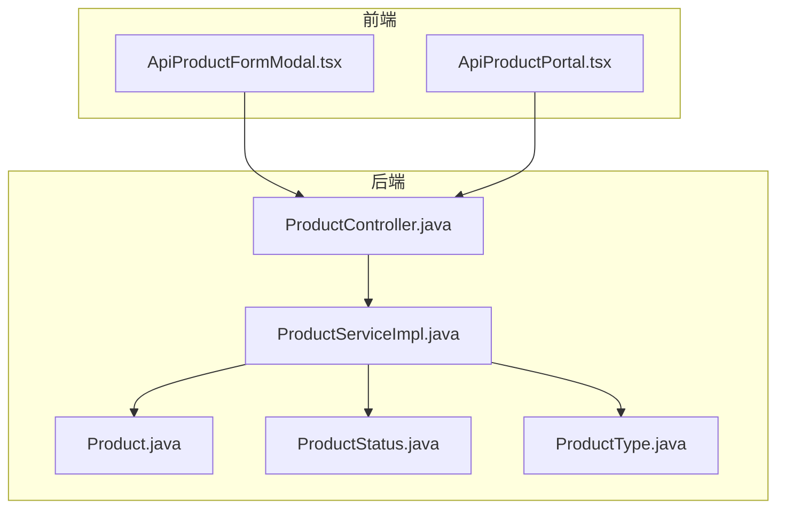
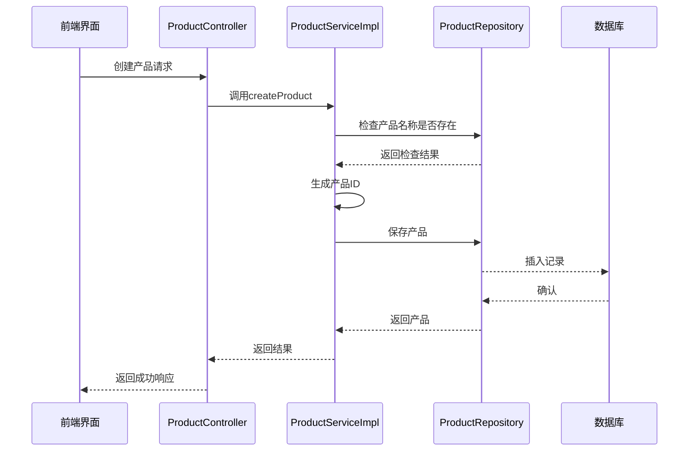
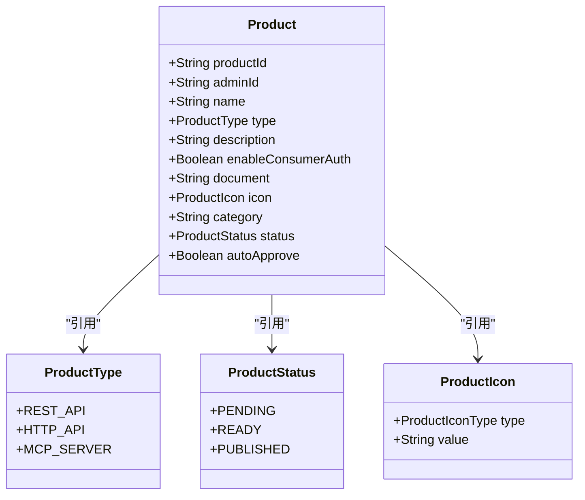
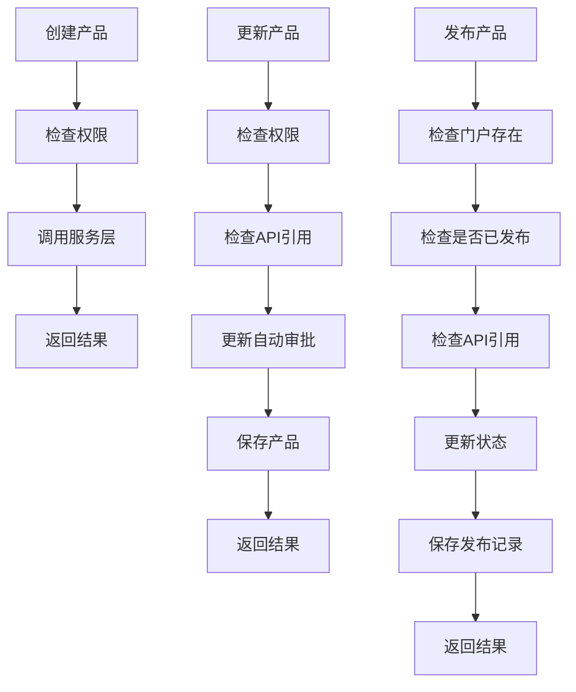
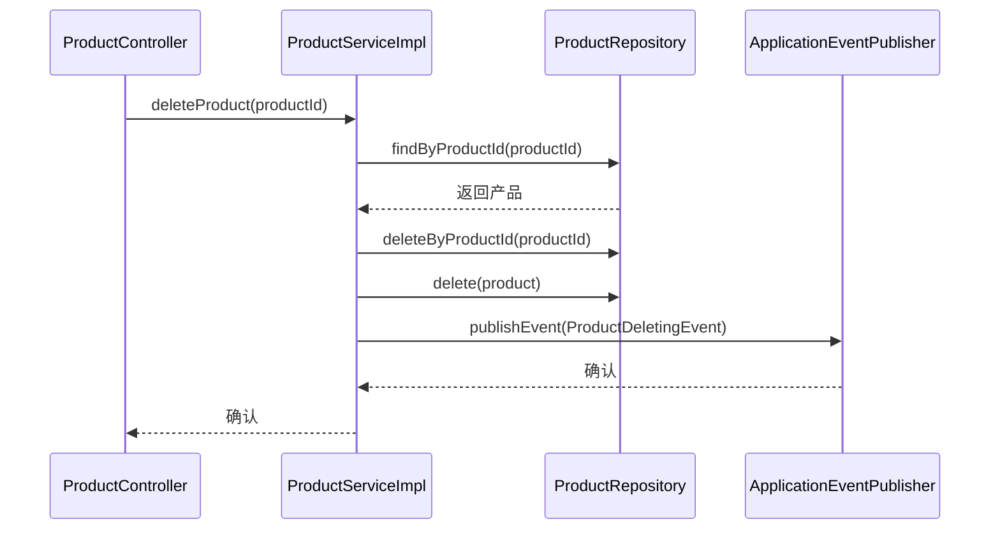
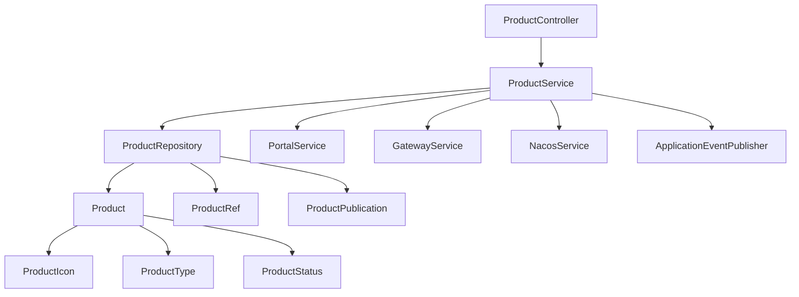
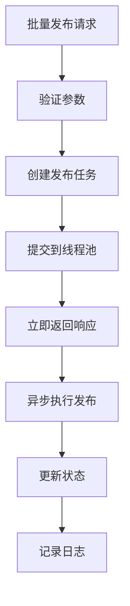

# AI产品管理

<cite>
**本文档引用文件**  
- [ProductController.java](file://portal-server/src/main/java/com/alibaba/apiopenplatform/controller/ProductController.java#L38-L121)
- [ProductServiceImpl.java](file://portal-server/src/main/java/com/alibaba/apiopenplatform/service/impl/ProductServiceImpl.java#L63-L379)
- [Product.java](file://portal-dal/src/main/java/com/alibaba/apiopenplatform/entity/Product.java#L30-L78)
- [ProductStatus.java](file://portal-dal/src/main/java/com/alibaba/apiopenplatform/support/enums/ProductStatus.java#L21-L39)
- [ProductType.java](file://portal-dal/src/main/java/com/alibaba/apiopenplatform/support/enums/ProductType.java#L21-L28)
- [ProductIconConverter.java](file://portal-dal/src/main/java/com/alibaba/apiopenplatform/converter/ProductIconConverter.java#L9-L15)
- [ProductIcon.java](file://portal-dal/src/main/java/com/alibaba/apiopenplatform/support/product/ProductIcon.java#L8-L14)
- [CreateProductParam.java](file://portal-server/src/main/java/com/alibaba/apiopenplatform/dto/params/product/CreateProductParam.java)
- [PublishProductParam.java](file://portal-server/src/main/java/com/alibaba/apiopenplatform/dto/params/product/PublishProductParam.java)
- [ApiProductFormModal.tsx](file://portal-web/api-portal-admin/src/components/api-product/ApiProductFormModal.tsx)
- [ProductPublication.java](file://portal-dal/src/main/java/com/alibaba/apiopenplatform/entity/ProductPublication.java)
- [ProductSubscription.java](file://portal-dal/src/main/java/com/alibaba/apiopenplatform/entity/ProductSubscription.java)
</cite>

## 目录
1. [简介](#简介)
2. [项目结构](#项目结构)
3. [核心组件](#核心组件)
4. [架构概览](#架构概览)
5. [详细组件分析](#详细组件分析)
6. [依赖分析](#依赖分析)
7. [性能考虑](#性能考虑)
8. [故障排查指南](#故障排查指南)
9. [结论](#结论)

## 简介
本文档深入探讨AI产品管理功能的完整生命周期，涵盖从产品创建、配置、发布到门户的全过程。重点分析`Product`实体、`ProductController`和`ProductServiceImpl`的实现逻辑，以及前端组件`ApiProductFormModal.tsx`如何与后端交互。文档还涵盖产品状态流转、类型定义、图标管理、与门户和消费者订阅的关系，并提供发布失败的排查方法和性能优化建议。

## 项目结构
AI产品管理功能分布在多个模块中，主要包括：
- `portal-dal`：数据访问层，包含实体类、枚举和转换器
- `portal-server`：服务层，包含控制器和业务逻辑实现
- `portal-web`：前端模块，包含管理界面和用户界面组件

**图示来源**
- [ProductController.java](file://portal-server/src/main/java/com/alibaba/apiopenplatform/controller/ProductController.java#L38-L121)
- [ProductServiceImpl.java](file://portal-server/src/main/java/com/alibaba/apiopenplatform/service/impl/ProductServiceImpl.java#L63-L379)
- [Product.java](file://portal-dal/src/main/java/com/alibaba/apiopenplatform/entity/Product.java#L30-L78)

## 核心组件
AI产品管理的核心组件包括：
- `Product`：产品实体，存储产品基本信息
- `ProductController`：提供REST API接口
- `ProductServiceImpl`：实现业务逻辑
- `ProductStatus`：产品状态枚举
- `ProductType`：产品类型枚举
- `ProductIconConverter`：产品图标转换器

**组件来源**
- [Product.java](file://portal-dal/src/main/java/com/alibaba/apiopenplatform/entity/Product.java#L30-L78)
- [ProductController.java](file://portal-server/src/main/java/com/alibaba/apiopenplatform/controller/ProductController.java#L38-L121)
- [ProductServiceImpl.java](file://portal-server/src/main/java/com/alibaba/apiopenplatform/service/impl/ProductServiceImpl.java#L63-L379)

## 架构概览
系统采用典型的分层架构，从前端到后端的数据流如下：

**图示来源**
- [ProductController.java](file://portal-server/src/main/java/com/alibaba/apiopenplatform/controller/ProductController.java#L38-L121)
- [ProductServiceImpl.java](file://portal-server/src/main/java/com/alibaba/apiopenplatform/service/impl/ProductServiceImpl.java#L63-L379)

## 详细组件分析

### 产品实体分析
`Product`实体类定义了产品的所有属性，包括ID、名称、类型、描述、状态等。

**图示来源**
- [Product.java](file://portal-dal/src/main/java/com/alibaba/apiopenplatform/entity/Product.java#L30-L78)
- [ProductType.java](file://portal-dal/src/main/java/com/alibaba/apiopenplatform/support/enums/ProductType.java#L21-L28)
- [ProductStatus.java](file://portal-dal/src/main/java/com/alibaba/apiopenplatform/support/enums/ProductStatus.java#L21-L39)
- [ProductIcon.java](file://portal-dal/src/main/java/com/alibaba/apiopenplatform/support/product/ProductIcon.java#L8-L14)

### 产品控制器分析
`ProductController`提供了完整的REST API接口，支持产品的增删改查和发布操作。

**图示来源**
- [ProductController.java](file://portal-server/src/main/java/com/alibaba/apiopenplatform/controller/ProductController.java#L38-L121)

### 产品服务实现分析
`ProductServiceImpl`实现了核心业务逻辑，包括产品创建、更新、发布等操作。

**图示来源**
- [ProductServiceImpl.java](file://portal-server/src/main/java/com/alibaba/apiopenplatform/service/impl/ProductServiceImpl.java#L63-L379)

## 依赖分析
产品管理模块与其他模块存在紧密依赖关系：

**图示来源**
- [ProductServiceImpl.java](file://portal-server/src/main/java/com/alibaba/apiopenplatform/service/impl/ProductServiceImpl.java#L63-L379)
- [Product.java](file://portal-dal/src/main/java/com/alibaba/apiopenplatform/entity/Product.java#L30-L78)

## 性能考虑
在处理批量发布等高负载操作时，系统采用异步处理策略：

建议在高并发场景下：
1. 使用分页查询避免内存溢出
2. 对频繁查询的字段添加数据库索引
3. 合理配置线程池大小
4. 实现缓存机制减少数据库访问

## 故障排查指南
### 发布失败常见原因
1. **未关联API或MCP Server**：产品必须先关联API或MCP Server才能发布
2. **门户不存在**：检查门户ID是否正确
3. **重复发布**：同一产品在同一门户上只能发布一次
4. **权限不足**：需要管理员权限才能发布

### 排查步骤
1. 检查产品状态是否为`READY`
2. 验证API引用是否存在
3. 确认门户ID有效
4. 查看服务日志获取详细错误信息

**组件来源**
- [ProductServiceImpl.java](file://portal-server/src/main/java/com/alibaba/apiopenplatform/service/impl/ProductServiceImpl.java#L63-L379)

## 结论
AI产品管理功能实现了从创建到发布的完整生命周期管理，通过清晰的分层架构和严谨的状态控制，确保了系统的稳定性和可维护性。系统支持多种产品类型，与API网关和Nacos服务紧密集成，为开发者提供了强大的产品管理能力。通过异步处理和事件驱动机制，系统在保证功能完整性的同时也具备良好的性能表现。