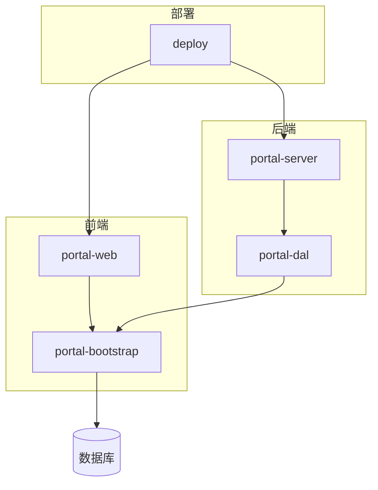
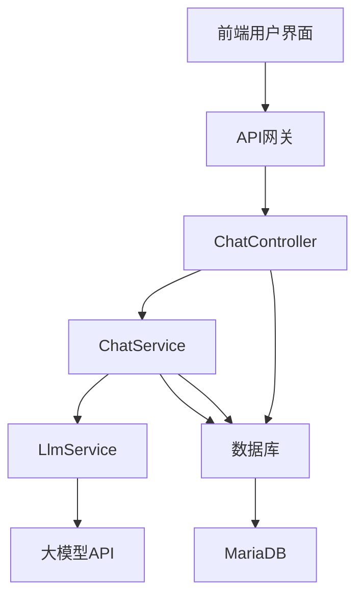
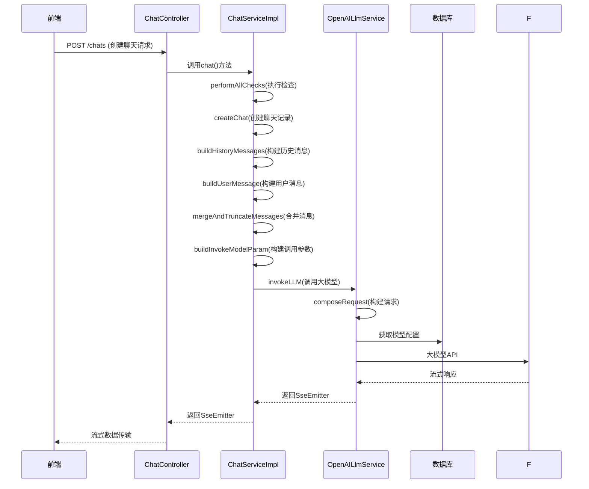
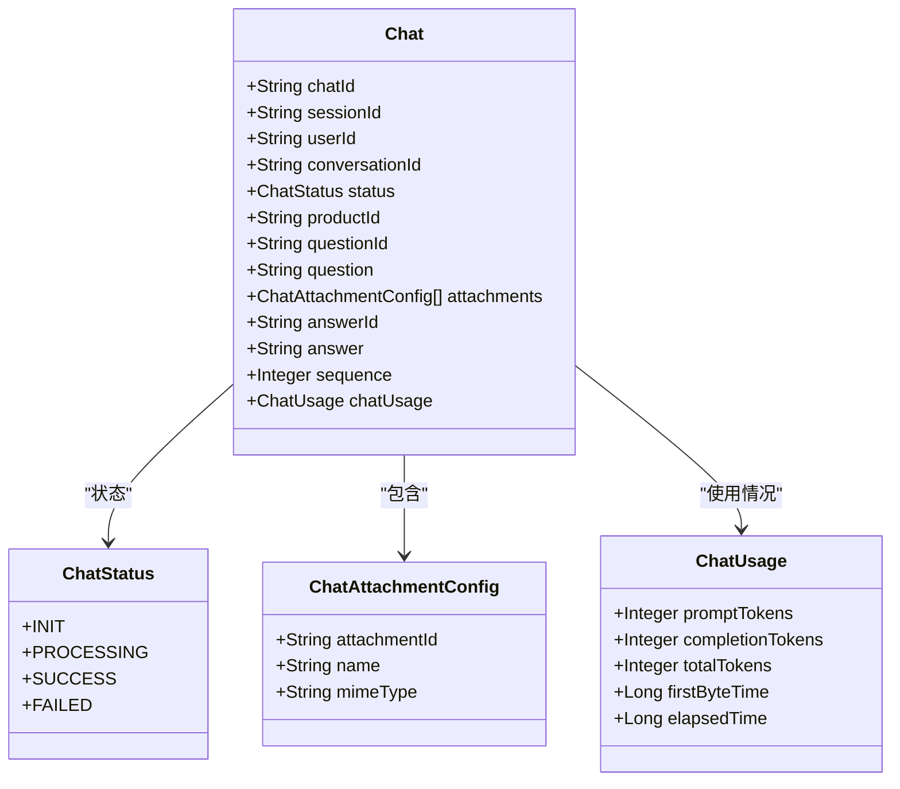
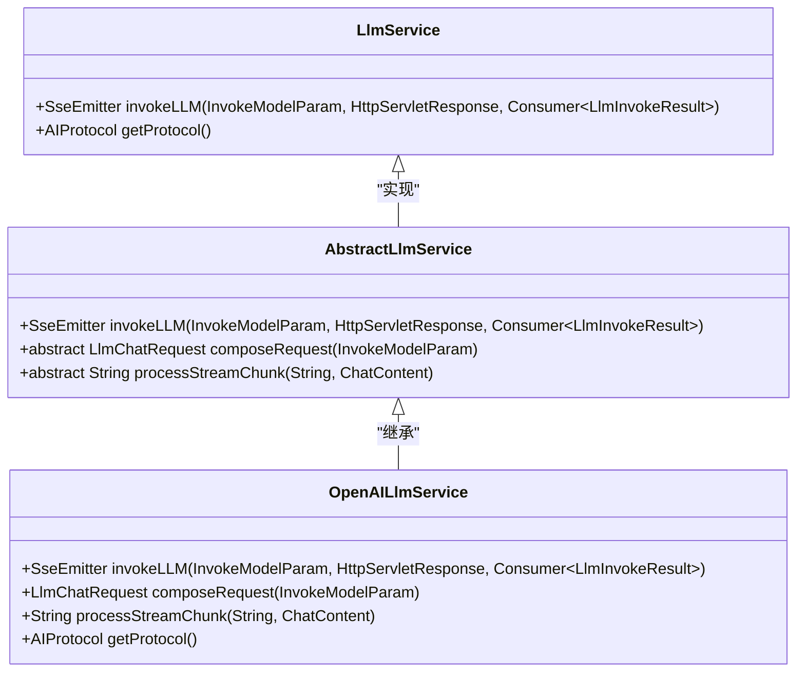
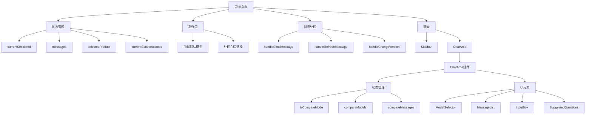
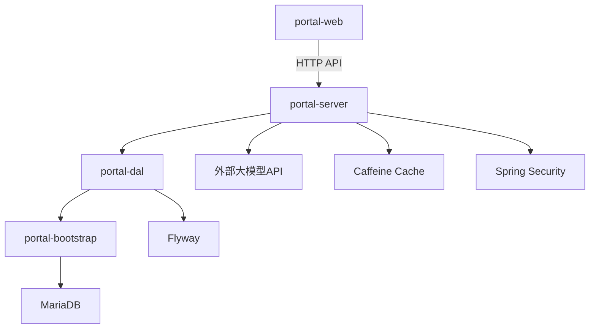

# Ai Chat System

<cite>
**本文档引用的文件**
- [application.yaml](file://portal-bootstrap/src/main/resources/application.yaml)
- [ChatController.java](file://portal-server/src/main/java/com/alibaba/apiopenplatform/controller/ChatController.java)
- [ChatServiceImpl.java](file://portal-server/src/main/java/com/alibaba/apiopenplatform/service/impl/ChatServiceImpl.java)
- [Chat.java](file://portal-dal/src/main/java/com/alibaba/apiopenplatform/entity/Chat.java)
- [ChatResult.java](file://portal-server/src/main/java/com/alibaba/apiopenplatform/dto/result/chat/ChatResult.java)
- [ChatMessage.java](file://portal-dal/src/main/java/com/alibaba/apiopenplatform/support/chat/ChatMessage.java)
- [LlmService.java](file://portal-server/src/main/java/com/alibaba/apiopenplatform/service/LlmService.java)
- [OpenAILlmService.java](file://portal-server/src/main/java/com/alibaba/apiopenplatform/service/impl/OpenAILlmService.java)
- [Chat.tsx](file://portal-web/api-portal-frontend/src/pages/Chat.tsx)
- [ChatArea.tsx](file://portal-web/api-portal-frontend/src/components/chat/ChatArea.tsx)
- [chat.ts](file://portal-web/api-portal-frontend/src/lib/apis/chat.ts)
- [V3__Add_chat_tables.sql](file://portal-bootstrap/src/main/resources/db/migration/V3__Add_chat_tables.sql)
</cite>

## 目录
1. [项目结构](#项目结构)
2. [核心组件](#核心组件)
3. [架构概述](#架构概述)
4. [详细组件分析](#详细组件分析)
5. [依赖分析](#依赖分析)
6. [性能考虑](#性能考虑)
7. [故障排除指南](#故障排除指南)
8. [结论](#结论)

## 项目结构

AI聊天系统采用模块化架构，主要由四个核心模块组成：`portal-bootstrap`、`portal-dal`、`portal-server`和`portal-web`。这种分层设计实现了关注点分离，提高了代码的可维护性和可扩展性。

**Diagram sources**
- [portal-bootstrap](file://portal-bootstrap)
- [portal-dal](file://portal-dal)
- [portal-server](file://portal-server)
- [portal-web](file://portal-web)

**Section sources**
- [portal-bootstrap](file://portal-bootstrap)
- [portal-dal](file://portal-dal)
- [portal-server](file://portal-server)
- [portal-web](file://portal-web)

## 核心组件

AI聊天系统的核心功能围绕聊天会话管理、消息处理和大模型调用展开。系统通过`ChatController`接收前端请求，由`ChatServiceImpl`处理业务逻辑，并通过`LlmService`接口调用底层大模型服务。前端通过`Chat.tsx`和`ChatArea.tsx`组件提供用户交互界面，支持单模型对话和多模型对比功能。

**Section sources**
- [ChatController.java](file://portal-server/src/main/java/com/alibaba/apiopenplatform/controller/ChatController.java)
- [ChatServiceImpl.java](file://portal-server/src/main/java/com/alibaba/apiopenplatform/service/impl/ChatServiceImpl.java)
- [Chat.tsx](file://portal-web/api-portal-frontend/src/pages/Chat.tsx)

## 架构概述

AI聊天系统采用典型的前后端分离架构，后端基于Spring Boot框架实现RESTful API，前端使用React构建用户界面。系统通过SSE（Server-Sent Events）实现流式响应，为用户提供实时的聊天体验。数据持久化使用JPA与MariaDB数据库交互，通过Flyway进行数据库版本管理。

**Diagram sources**
- [ChatController.java](file://portal-server/src/main/java/com/alibaba/apiopenplatform/controller/ChatController.java)
- [ChatServiceImpl.java](file://portal-server/src/main/java/com/alibaba/apiopenplatform/service/impl/ChatServiceImpl.java)
- [LlmService.java](file://portal-server/src/main/java/com/alibaba/apiopenplatform/service/LlmService.java)

## 详细组件分析

### 聊天服务实现分析

`ChatServiceImpl`是AI聊天系统的核心业务逻辑实现类，负责处理聊天请求的完整生命周期。该服务通过`chat`方法接收创建聊天的请求参数，执行必要的检查，构建聊天消息，并调用大模型服务进行处理。

**Diagram sources**
- [ChatServiceImpl.java](file://portal-server/src/main/java/com/alibaba/apiopenplatform/service/impl/ChatServiceImpl.java)
- [ChatController.java](file://portal-server/src/main/java/com/alibaba/apiopenplatform/controller/ChatController.java)
- [OpenAILlmService.java](file://portal-server/src/main/java/com/alibaba/apiopenplatform/service/impl/OpenAILlmService.java)

**Section sources**
- [ChatServiceImpl.java](file://portal-server/src/main/java/com/alibaba/apiopenplatform/service/impl/ChatServiceImpl.java)
- [ChatController.java](file://portal-server/src/main/java/com/alibaba/apiopenplatform/controller/ChatController.java)

### 聊天实体分析

`Chat`实体类定义了聊天记录的数据结构，包含聊天ID、会话ID、用户ID、对话ID、产品ID、问题、答案等关键字段。该实体通过JPA注解映射到数据库表，支持JSON格式的附件和使用情况数据存储。

**Diagram sources**
- [Chat.java](file://portal-dal/src/main/java/com/alibaba/apiopenplatform/entity/Chat.java)
- [ChatStatus.java](file://portal-dal/src/main/java/com/alibaba/apiopenplatform/support/enums/ChatStatus.java)

**Section sources**
- [Chat.java](file://portal-dal/src/main/java/com/alibaba/apiopenplatform/entity/Chat.java)

### 大模型服务分析

大模型服务采用策略模式设计，通过`LlmService`接口定义通用的调用方法，`OpenAILlmService`实现具体的OpenAI协议调用逻辑。这种设计支持多种AI协议的扩展，目前系统主要支持OpenAI协议。

**Diagram sources**
- [LlmService.java](file://portal-server/src/main/java/com/alibaba/apiopenplatform/service/LlmService.java)
- [OpenAILlmService.java](file://portal-server/src/main/java/com/alibaba/apiopenplatform/service/impl/OpenAILlmService.java)

**Section sources**
- [LlmService.java](file://portal-server/src/main/java/com/alibaba/apiopenplatform/service/LlmService.java)
- [OpenAILlmService.java](file://portal-server/src/main/java/com/alibaba/apiopenplatform/service/impl/OpenAILlmService.java)

### 前端聊天界面分析

前端聊天界面由`Chat.tsx`主页面和`ChatArea.tsx`组件构成，提供完整的用户交互体验。系统支持单模型对话和多模型对比两种模式，用户可以轻松切换和比较不同AI模型的响应效果。

**Diagram sources**
- [Chat.tsx](file://portal-web/api-portal-frontend/src/pages/Chat.tsx)
- [ChatArea.tsx](file://portal-web/api-portal-frontend/src/components/chat/ChatArea.tsx)

**Section sources**
- [Chat.tsx](file://portal-web/api-portal-frontend/src/pages/Chat.tsx)
- [ChatArea.tsx](file://portal-web/api-portal-frontend/src/components/chat/ChatArea.tsx)

## 依赖分析

AI聊天系统各组件之间的依赖关系清晰，遵循分层架构原则。前端通过HTTP API与后端通信，后端服务层依赖数据访问层，数据访问层通过JPA与数据库交互。系统还依赖外部的大模型API服务提供AI能力。

**Diagram sources**
- [pom.xml](file://portal-server/pom.xml)
- [pom.xml](file://portal-dal/pom.xml)
- [pom.xml](file://portal-bootstrap/pom.xml)

**Section sources**
- [pom.xml](file://portal-server/pom.xml)
- [pom.xml](file://portal-dal/pom.xml)
- [pom.xml](file://portal-bootstrap/pom.xml)

## 性能考虑

AI聊天系统在设计时考虑了多个性能优化点。首先，系统使用Caffeine缓存网关IP地址，减少重复查询数据库的开销。其次，聊天历史消息采用截断策略，只保留最近的20条历史消息，避免内存占用过高。此外，系统通过SSE实现流式响应，用户可以即时看到AI生成的内容，提升用户体验。

**Section sources**
- [ChatServiceImpl.java](file://portal-server/src/main/java/com/alibaba/apiopenplatform/service/impl/ChatServiceImpl.java)
- [OpenAILlmService.java](file://portal-server/src/main/java/com/alibaba/apiopenplatform/service/impl/OpenAILlmService.java)

## 故障排除指南

当AI聊天系统出现问题时，可以从以下几个方面进行排查：

1. **检查数据库连接**：确保`application.yaml`中的数据库配置正确，数据库服务正常运行。
2. **验证大模型API访问**：确认大模型API的路由配置正确，外部域名可访问。
3. **检查会话状态**：确保用户会话有效，产品ID在会话的授权产品列表中。
4. **查看日志信息**：检查后端服务日志，特别是`ChatServiceImpl`和`OpenAILlmService`的日志输出。
5. **验证前端配置**：确保前端API请求的URL和认证信息正确。

**Section sources**
- [application.yaml](file://portal-bootstrap/src/main/resources/application.yaml)
- [ChatServiceImpl.java](file://portal-server/src/main/java/com/alibaba/apiopenplatform/service/impl/ChatServiceImpl.java)
- [OpenAILlmService.java](file://portal-server/src/main/java/com/alibaba/apiopenplatform/service/impl/OpenAILlmService.java)

## 结论

AI聊天系统是一个功能完整的对话式AI平台，支持单模型对话和多模型对比功能。系统采用现代化的前后端分离架构，具有良好的可扩展性和可维护性。通过流式响应技术，系统能够为用户提供实时的交互体验。未来可以考虑增加更多AI协议支持，优化聊天历史管理策略，以及增强多模型对比的可视化效果。