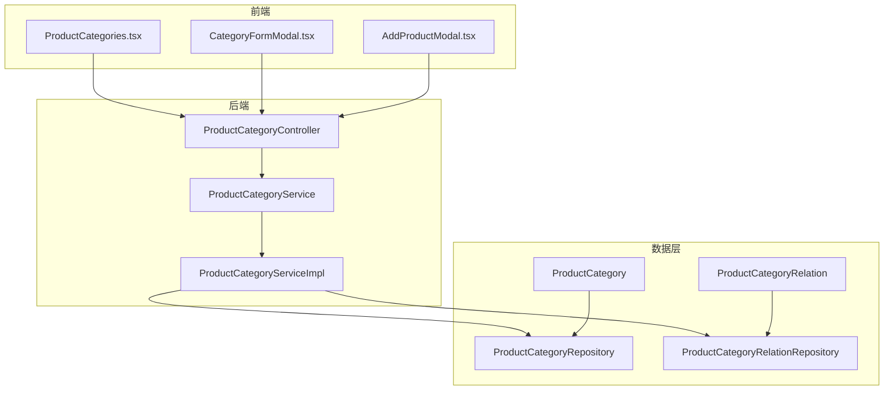
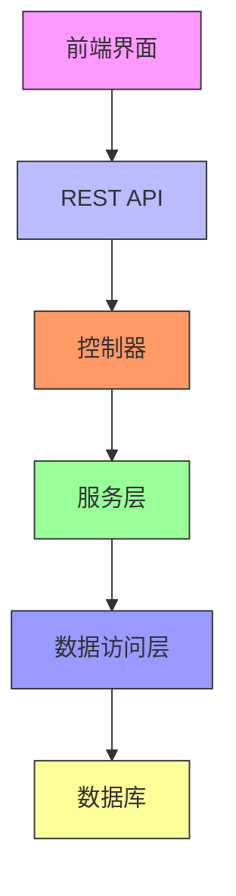
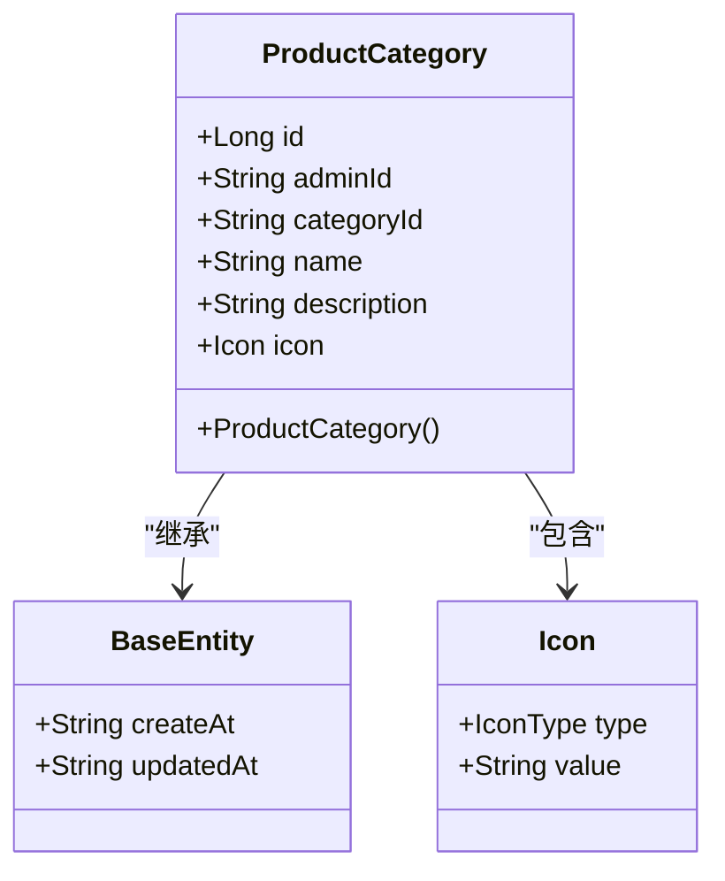
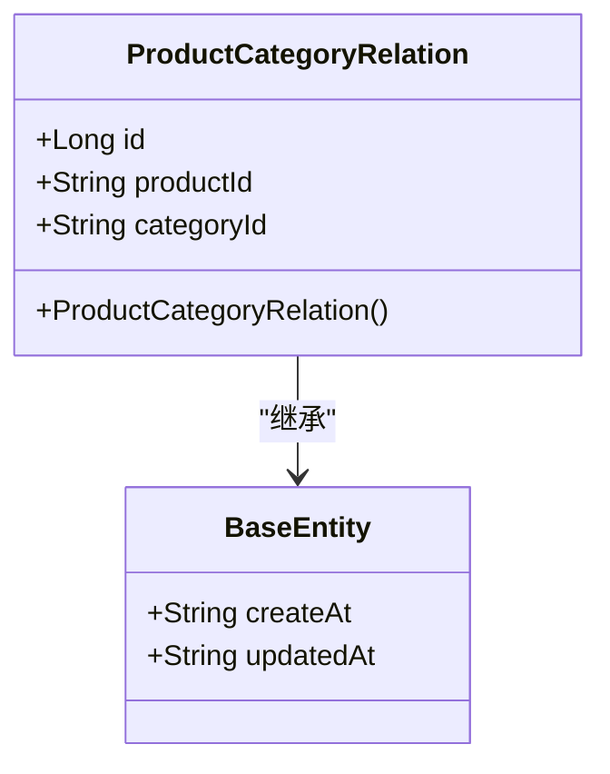
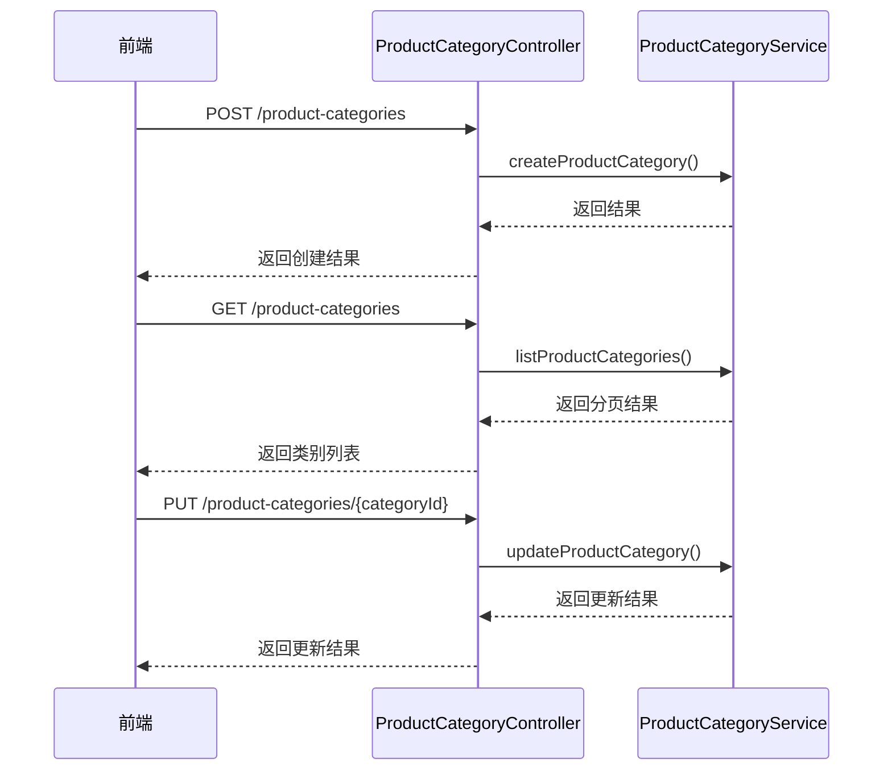
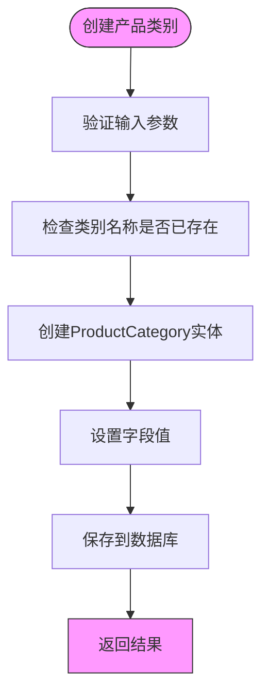
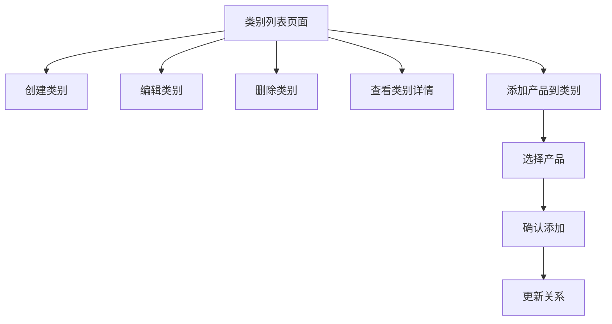
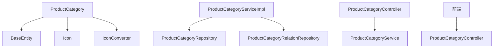

# 产品分类系统

<cite>
**本文档引用的文件**   
- [ProductCategory.java](file://portal-dal/src/main/java/com/alibaba/apiopenplatform/entity/ProductCategory.java)
- [ProductCategoryRelation.java](file://portal-dal/src/main/java/com/alibaba/apiopenplatform/entity/ProductCategoryRelation.java)
- [ProductCategoryController.java](file://portal-server/src/main/java/com/alibaba/apiopenplatform/controller/ProductCategoryController.java)
- [ProductCategoryService.java](file://portal-server/src/main/java/com/alibaba/apiopenplatform/service/ProductCategoryService.java)
- [ProductCategoryServiceImpl.java](file://portal-server/src/main/java/com/alibaba/apiopenplatform/service/impl/ProductCategoryServiceImpl.java)
- [ProductCategoryRepository.java](file://portal-dal/src/main/java/com/alibaba/apiopenplatform/repository/ProductCategoryRepository.java)
- [ProductCategoryRelationRepository.java](file://portal-dal/src/main/java/com/alibaba/apiopenplatform/repository/ProductCategoryRelationRepository.java)
- [Icon.java](file://portal-dal/src/main/java/com/alibaba/apiopenplatform/support/product/Icon.java)
- [IconConverter.java](file://portal-dal/src/main/java/com/alibaba/apiopenplatform/converter/IconConverter.java)
- [productCategoryApi.ts](file://portal-web/api-portal-admin/src/lib/productCategoryApi.ts)
- [ProductCategories.tsx](file://portal-web/api-portal-admin/src/pages/ProductCategories.tsx)
- [CategoryFormModal.tsx](file://portal-web/api-portal-admin/src/components/product-category/CategoryFormModal.tsx)
- [AddProductModal.tsx](file://portal-web/api-portal-admin/src/components/product-category/AddProductModal.tsx)
- [category.ts](file://portal-web/api-portal-frontend/src/lib/apis/category.ts)
- [product-category.ts](file://portal-web/api-portal-admin/src/types/product-category.ts)
</cite>

## 目录
1. [简介](#简介)
2. [项目结构](#项目结构)
3. [核心组件](#核心组件)
4. [架构概述](#架构概述)
5. [详细组件分析](#详细组件分析)
6. [依赖分析](#依赖分析)
7. [性能考虑](#性能考虑)
8. [故障排除指南](#故障排除指南)
9. [结论](#结论)

## 简介
产品分类系统是HiMarket平台的核心功能之一，用于对API产品进行分类管理。该系统提供了一套完整的分类管理功能，包括创建、更新、删除和查询产品类别，以及将产品与类别进行关联。系统采用分层架构设计，包含前端界面、后端服务和数据访问层，实现了前后端分离的现代化架构。

## 项目结构
产品分类系统分布在多个模块中，主要包括：
- **portal-dal**: 数据访问层，包含实体类和仓库接口
- **portal-server**: 服务层，包含控制器、服务接口和实现
- **portal-web**: 前端层，包含管理界面和前端API调用

**图表来源**
- [ProductCategories.tsx](file://portal-web/api-portal-admin/src/pages/ProductCategories.tsx)
- [ProductCategoryController.java](file://portal-server/src/main/java/com/alibaba/apiopenplatform/controller/ProductCategoryController.java)
- [ProductCategoryRepository.java](file://portal-dal/src/main/java/com/alibaba/apiopenplatform/repository/ProductCategoryRepository.java)

**章节来源**
- [ProductCategories.tsx](file://portal-web/api-portal-admin/src/pages/ProductCategories.tsx)
- [ProductCategoryController.java](file://portal-server/src/main/java/com/alibaba/apiopenplatform/controller/ProductCategoryController.java)
- [ProductCategoryRepository.java](file://portal-dal/src/main/java/com/alibaba/apiopenplatform/repository/ProductCategoryRepository.java)

## 核心组件
产品分类系统的核心组件包括产品类别实体、产品类别关系实体、控制器、服务接口及其实现。这些组件共同协作，实现了产品分类的完整生命周期管理功能。

**章节来源**
- [ProductCategory.java](file://portal-dal/src/main/java/com/alibaba/apiopenplatform/entity/ProductCategory.java)
- [ProductCategoryRelation.java](file://portal-dal/src/main/java/com/alibaba/apiopenplatform/entity/ProductCategoryRelation.java)
- [ProductCategoryController.java](file://portal-server/src/main/java/com/alibaba/apiopenplatform/controller/ProductCategoryController.java)
- [ProductCategoryService.java](file://portal-server/src/main/java/com/alibaba/apiopenplatform/service/ProductCategoryService.java)
- [ProductCategoryServiceImpl.java](file://portal-server/src/main/java/com/alibaba/apiopenplatform/service/impl/ProductCategoryServiceImpl.java)

## 架构概述
产品分类系统采用典型的三层架构设计，包括表现层、业务逻辑层和数据访问层。系统通过RESTful API提供服务，前端通过HTTP请求与后端交互，后端通过JPA与数据库进行数据操作。

**图表来源**
- [ProductCategoryController.java](file://portal-server/src/main/java/com/alibaba/apiopenplatform/controller/ProductCategoryController.java)
- [ProductCategoryService.java](file://portal-server/src/main/java/com/alibaba/apiopenplatform/service/ProductCategoryService.java)
- [ProductCategoryRepository.java](file://portal-dal/src/main/java/com/alibaba/apiopenplatform/repository/ProductCategoryRepository.java)

## 详细组件分析

### 产品类别实体分析
产品类别实体定义了产品分类的基本属性，包括类别ID、名称、描述和图标等信息。该实体通过JPA注解映射到数据库表，并使用Lombok注解简化代码。

**图表来源**
- [ProductCategory.java](file://portal-dal/src/main/java/com/alibaba/apiopenplatform/entity/ProductCategory.java)
- [BaseEntity.java](file://portal-dal/src/main/java/com/alibaba/apiopenplatform/entity/BaseEntity.java)
- [Icon.java](file://portal-dal/src/main/java/com/alibaba/apiopenplatform/support/product/Icon.java)

**章节来源**
- [ProductCategory.java](file://portal-dal/src/main/java/com/alibaba/apiopenplatform/entity/ProductCategory.java)

### 产品类别关系实体分析
产品类别关系实体用于建立产品与类别之间的多对多关系。由于产品和类别之间存在多对多关联，系统通过中间表来维护这种关系，确保数据的一致性和完整性。

**图表来源**
- [ProductCategoryRelation.java](file://portal-dal/src/main/java/com/alibaba/apiopenplatform/entity/ProductCategoryRelation.java)
- [BaseEntity.java](file://portal-dal/src/main/java/com/alibaba/apiopenplatform/entity/BaseEntity.java)

**章节来源**
- [ProductCategoryRelation.java](file://portal-dal/src/main/java/com/alibaba/apiopenplatform/entity/ProductCategoryRelation.java)

### 控制器分析
产品类别控制器提供了RESTful API接口，处理前端的各种HTTP请求。控制器使用Spring MVC注解定义路由和请求方法，并通过服务层实现业务逻辑。

**图表来源**
- [ProductCategoryController.java](file://portal-server/src/main/java/com/alibaba/apiopenplatform/controller/ProductCategoryController.java)
- [ProductCategoryService.java](file://portal-server/src/main/java/com/alibaba/apiopenplatform/service/ProductCategoryService.java)

**章节来源**
- [ProductCategoryController.java](file://portal-server/src/main/java/com/alibaba/apiopenplatform/controller/ProductCategoryController.java)

### 服务层分析
产品类别服务层定义了业务逻辑接口，并提供了具体的实现。服务层负责处理业务规则、数据验证和事务管理，确保系统的稳定性和数据的一致性。

**图表来源**
- [ProductCategoryServiceImpl.java](file://portal-server/src/main/java/com/alibaba/apiopenplatform/service/impl/ProductCategoryServiceImpl.java)

**章节来源**
- [ProductCategoryServiceImpl.java](file://portal-server/src/main/java/com/alibaba/apiopenplatform/service/impl/ProductCategoryServiceImpl.java)

### 前端组件分析
前端组件提供了用户友好的界面，使管理员能够方便地管理产品分类。系统包括类别列表页面、创建/编辑弹窗和添加产品弹窗等组件。

**图表来源**
- [ProductCategories.tsx](file://portal-web/api-portal-admin/src/pages/ProductCategories.tsx)
- [CategoryFormModal.tsx](file://portal-web/api-portal-admin/src/components/product-category/CategoryFormModal.tsx)
- [AddProductModal.tsx](file://portal-web/api-portal-admin/src/components/product-category/AddProductModal.tsx)

**章节来源**
- [ProductCategories.tsx](file://portal-web/api-portal-admin/src/pages/ProductCategories.tsx)
- [CategoryFormModal.tsx](file://portal-web/api-portal-admin/src/components/product-category/CategoryFormModal.tsx)

## 依赖分析
产品分类系统与其他模块存在紧密的依赖关系。系统依赖于基础实体类、图标转换器和数据访问仓库，同时为前端界面提供API服务。

**图表来源**
- [ProductCategory.java](file://portal-dal/src/main/java/com/alibaba/apiopenplatform/entity/ProductCategory.java)
- [ProductCategoryServiceImpl.java](file://portal-server/src/main/java/com/alibaba/apiopenplatform/service/impl/ProductCategoryServiceImpl.java)
- [ProductCategoryController.java](file://portal-server/src/main/java/com/alibaba/apiopenplatform/controller/ProductCategoryController.java)

**章节来源**
- [ProductCategory.java](file://portal-dal/src/main/java/com/alibaba/apiopenplatform/entity/ProductCategory.java)
- [ProductCategoryServiceImpl.java](file://portal-server/src/main/java/com/alibaba/apiopenplatform/service/impl/ProductCategoryServiceImpl.java)

## 性能考虑
产品分类系统在设计时考虑了性能优化。系统使用分页查询来处理大量数据，避免一次性加载所有记录。同时，通过JPA的Specification机制实现动态查询，提高查询效率。

## 故障排除指南
当产品分类系统出现问题时，可以按照以下步骤进行排查：
1. 检查数据库连接是否正常
2. 验证API端点是否正确
3. 查看日志文件中的错误信息
4. 确认权限配置是否正确
5. 检查数据完整性约束

**章节来源**
- [ProductCategoryServiceImpl.java](file://portal-server/src/main/java/com/alibaba/apiopenplatform/service/impl/ProductCategoryServiceImpl.java)
- [ProductCategoryController.java](file://portal-server/src/main/java/com/alibaba/apiopenplatform/controller/ProductCategoryController.java)

## 结论
产品分类系统是一个功能完整、架构清晰的模块，为HiMarket平台提供了强大的分类管理能力。系统采用现代化的技术栈和设计模式，具有良好的可扩展性和维护性。通过前后端分离的设计，系统能够支持多种客户端访问，为用户提供一致的使用体验。