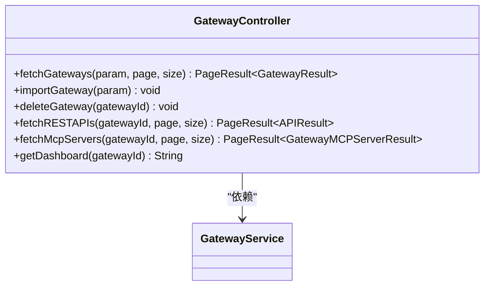
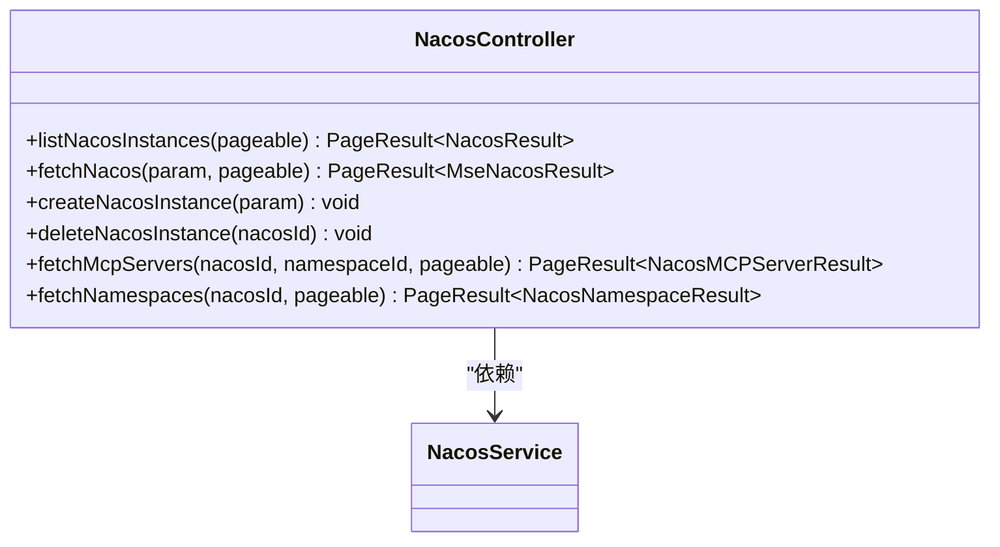
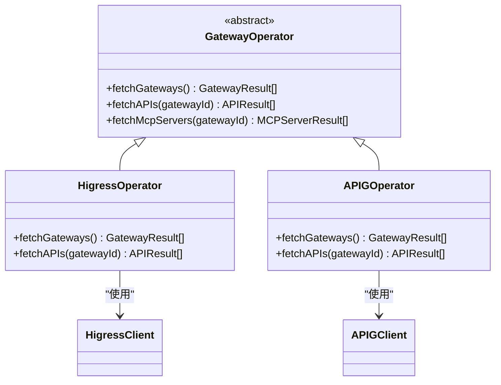
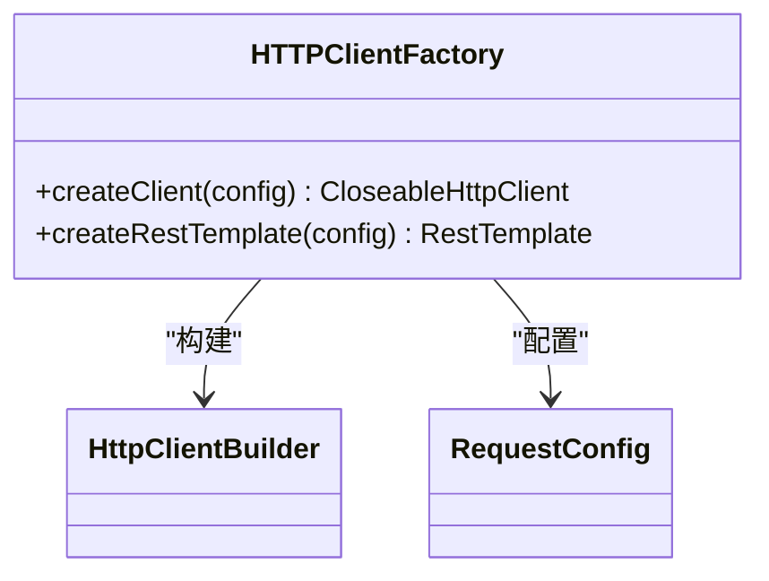
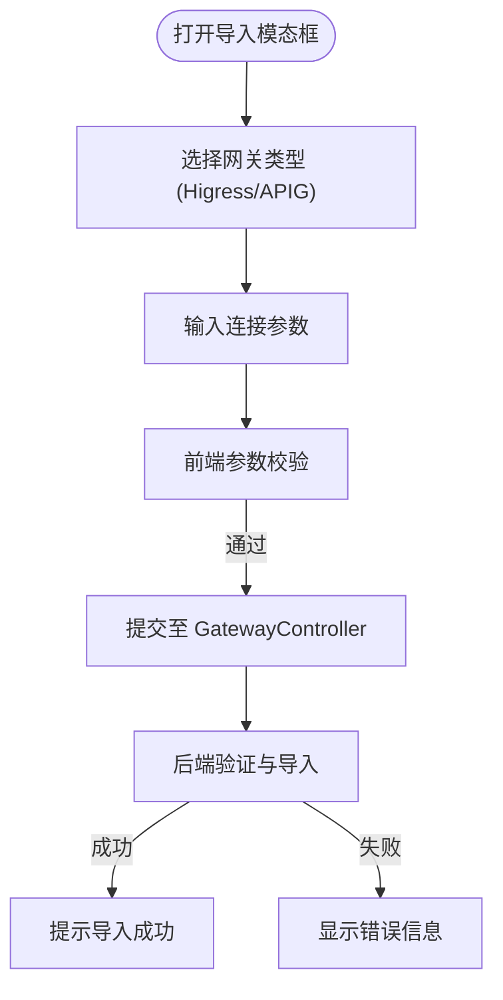
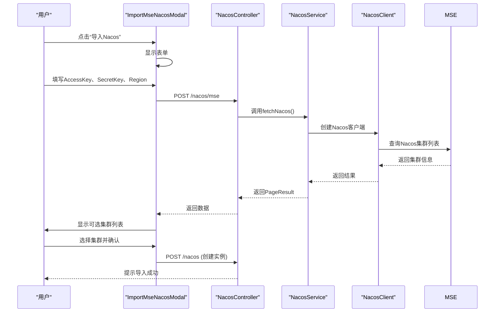
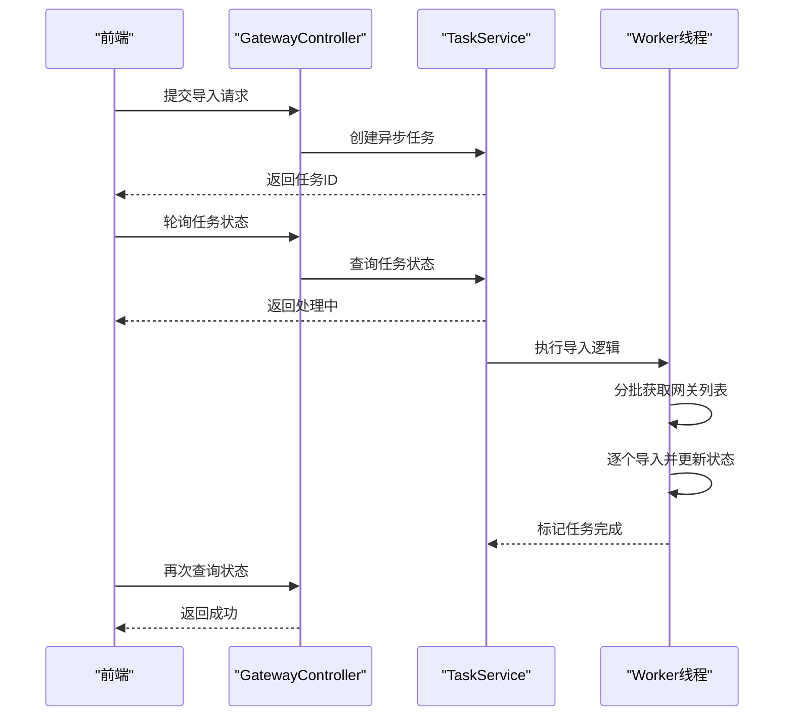

# 外部系统集成

<cite>
**本文档引用文件**  
- [GatewayController.java](file://portal-server/src/main/java/com/alibaba/apiopenplatform/controller/GatewayController.java#L37-L110)
- [NacosController.java](file://portal-server/src/main/java/com/alibaba/apiopenplatform/controller/NacosController.java#L39-L100)
- [GatewayConfig.java](file://portal-dal/src/main/java/com/alibaba/apiopenplatform/support/gateway/GatewayConfig.java#L25-L36)
- [HigressConfig.java](file://portal-dal/src/main/java/com/alibaba/apiopenplatform/support/gateway/HigressConfig.java#L24-L37)
- [APIGConfig.java](file://portal-dal/src/main/java/com/alibaba/apiopenplatform/support/gateway/APIGConfig.java#L24-L38)
- [gateway.ts](file://portal-web/api-portal-admin/src/types/gateway.ts#L15-L19)
- [ImportGatewayModal.tsx](file://portal-web/api-portal-admin/src/components/console/ImportGatewayModal.tsx)
- [ImportMseNacosModal.tsx](file://portal-web/api-portal-admin/src/components/console/ImportMseNacosModal.tsx)
- [HTTPClientFactory.java](file://portal-server/src/main/java/com/alibaba/apiopenplatform/service/gateway/factory/HTTPClientFactory.java)
- [GatewayOperator.java](file://portal-server/src/main/java/com/alibaba/apiopenplatform/service/gateway/GatewayOperator.java)
- [HigressOperator.java](file://portal-server/src/main/java/com/alibaba/apiopenplatform/service/gateway/HigressOperator.java)
- [APIGOperator.java](file://portal-server/src/main/java/com/alibaba/apiopenplatform/service/gateway/APIGOperator.java)
</cite>

## 目录
1. [集成概述](#集成概述)
2. [核心配置模型](#核心配置模型)
3. [导入接口与控制器](#导入接口与控制器)
4. [统一操作机制](#统一操作机制)
5. [前端用户流程](#前端用户流程)
6. [连接参数与认证方式](#连接参数与认证方式)
7. [常见问题与排查](#常见问题与排查)
8. [性能优化建议](#性能优化建议)

## 集成概述

Himarket 系统通过标准化接口与 Higress、APIG、Nacos 等外部系统实现深度集成。该集成机制支持用户将外部网关和注册中心实例导入平台，统一管理 API 资源、服务发现与访问策略。系统采用模块化设计，通过配置模型、操作器（Operator）模式和异步任务处理，确保高可用性与扩展性。

**本文档引用文件**  
- [GatewayController.java](file://portal-server/src/main/java/com/alibaba/apiopenplatform/controller/GatewayController.java#L37-L110)
- [NacosController.java](file://portal-server/src/main/java/com/alibaba/apiopenplatform/controller/NacosController.java#L39-L100)

## 核心配置模型

系统定义了统一的配置模型来描述不同外部系统的连接信息。这些模型通过注解实现敏感字段加密，确保安全存储。

### GatewayConfig 配置根模型

`GatewayConfig` 是网关配置的顶层模型，包含网关类型及具体配置。

```java
@Data
@Builder
public class GatewayConfig {
    private GatewayType gatewayType;
    private APIGConfig apigConfig;
    private AdpAIGatewayConfig adpAIGatewayConfig;
    private HigressConfig higressConfig;
}
```

**Section sources**
- [GatewayConfig.java](file://portal-dal/src/main/java/com/alibaba/apiopenplatform/support/gateway/GatewayConfig.java#L25-L36)

### HigressConfig 配置模型

用于存储 Higress 网关的连接信息，密码字段使用 `@Encrypted` 注解加密。

```java
@Data
public class HigressConfig {
    private String address;
    private String username;
    @Encrypted
    private String password;

    public String buildUniqueKey() {
        return String.format("%s:%s:%s", address, username, password);
    }
}
```

对应的前端 TypeScript 接口定义如下：

```typescript
export interface HigressConfig {
  username: string
  address: string
  password: string
}
```

**Section sources**
- [HigressConfig.java](file://portal-dal/src/main/java/com/alibaba/apiopenplatform/support/gateway/HigressConfig.java#L24-L37)
- [gateway.ts](file://portal-web/api-portal-admin/src/types/gateway.ts#L15-L19)

### APIGConfig 配置模型

用于存储阿里云 API 网关（APIG）的 AK/SK 认证信息。

```java
@Data
public class APIGConfig {
    @Encrypted
    private String accessKey;
    @Encrypted
    private String secretKey;
    private String region;

    public String buildUniqueKey() {
        return String.format("%s:%s:%s", accessKey, secretKey, region);
    }
}
```

**Section sources**
- [APIGConfig.java](file://portal-dal/src/main/java/com/alibaba/apiopenplatform/support/gateway/APIGConfig.java#L24-L38)

## 导入接口与控制器

系统通过 RESTful 控制器暴露导入接口，支持管理员权限访问。

### GatewayController 接口

提供网关实例的导入、查询与删除功能。



**Diagram sources**
- [GatewayController.java](file://portal-server/src/main/java/com/alibaba/apiopenplatform/controller/GatewayController.java#L37-L110)

### NacosController 接口

提供 Nacos 实例的管理与 MCP Server 发现功能。



**Diagram sources**
- [NacosController.java](file://portal-server/src/main/java/com/alibaba/apiopenplatform/controller/NacosController.java#L39-L100)

## 统一操作机制

系统通过 `GatewayOperator` 和 `HTTPClientFactory` 实现对不同网关的统一操作。

### GatewayOperator 抽象操作器

`GatewayOperator` 是所有网关操作器的基类，定义了通用操作接口。



**Diagram sources**
- [GatewayOperator.java](file://portal-server/src/main/java/com/alibaba/apiopenplatform/service/gateway/GatewayOperator.java)
- [HigressOperator.java](file://portal-server/src/main/java/com/alibaba/apiopenplatform/service/gateway/HigressOperator.java)
- [APIGOperator.java](file://portal-server/src/main/java/com/alibaba/apiopenplatform/service/gateway/APIGOperator.java)

### HTTPClientFactory 客户端工厂

`HTTPClientFactory` 负责创建和管理 HTTP 客户端实例，支持连接池、超时配置和认证。



**Section sources**
- [HTTPClientFactory.java](file://portal-server/src/main/java/com/alibaba/apiopenplatform/service/gateway/factory/HTTPClientFactory.java)

## 前端用户流程

用户通过前端组件完成网关和 Nacos 实例的导入。

### ImportGatewayModal 组件

提供网关导入的模态框界面，支持选择网关类型并填写连接参数。



**Section sources**
- [ImportGatewayModal.tsx](file://portal-web/api-portal-admin/src/components/console/ImportGatewayModal.tsx)

### ImportMseNacosModal 组件

用于从阿里云 MSE 导入 Nacos 集群。



**Section sources**
- [ImportMseNacosModal.tsx](file://portal-web/api-portal-admin/src/components/console/ImportMseNacosModal.tsx)

## 连接参数与认证方式

### Higress 连接参数

- **地址（address）**：Higress 控制台访问地址
- **用户名（username）**：登录用户名
- **密码（password）**：登录密码（加密存储）

### APIG 连接参数

- **AccessKey**：阿里云 AK（加密存储）
- **SecretKey**：阿里云 SK（加密存储）
- **Region**：API 网关所在地域

### Nacos 连接参数（MSE）

- **AccessKey**：阿里云 AK
- **SecretKey**：阿里云 SK
- **Region**：MSE 实例所在地域

### 网络配置要求

- Himarket 服务器需能访问目标网关或 Nacos 实例的控制台地址
- 若使用内网地址，需确保网络互通
- 建议配置合理的连接与读取超时时间（默认 30s）

## 常见问题与排查

### 连接超时

- **现象**：导入时提示“连接超时”或“无法访问”
- **排查步骤**：
  1. 检查目标地址是否可从 Himarket 服务器访问（使用 `telnet` 或 `curl` 测试）
  2. 检查防火墙或安全组是否放行相应端口
  3. 检查网络路由是否正确
  4. 尝试增加超时时间配置

### 权限不足

- **现象**：提示“认证失败”或“无权限访问资源”
- **排查步骤**：
  1. 确认 AK/SK 或用户名密码正确
  2. 检查 APIG 的 RAM 权限策略是否包含 `apig:Describe*` 等只读权限
  3. 检查 Higress 用户是否具有查看网关和 API 的权限
  4. 检查 Nacos 命名空间权限（如启用鉴权）

### 实例无法列出

- **现象**：导入后无法获取 API 列表
- **排查步骤**：
  1. 确认网关中已创建 API 且处于“已发布”状态
  2. 检查网关类型是否匹配（如 Higress 是否为 MCP 模式）
  3. 查看后端日志是否有解析异常

## 性能优化建议

对于大规模实例导入（如数百个网关或 Nacos 集群），建议采用异步任务处理：

1. **前端提交后立即返回任务ID**，避免长时间等待
2. **后端使用 @Async 注解或消息队列** 处理导入逻辑
3. **提供任务状态查询接口**，前端轮询获取进度
4. **分批处理资源**，避免单次请求过多数据导致超时
5. **启用缓存机制**，对频繁访问的元数据进行缓存



**Section sources**
- [AsyncConfig.java](file://portal-bootstrap/src/main/java/com/alibaba/apiopenplatform/config/AsyncConfig.java)