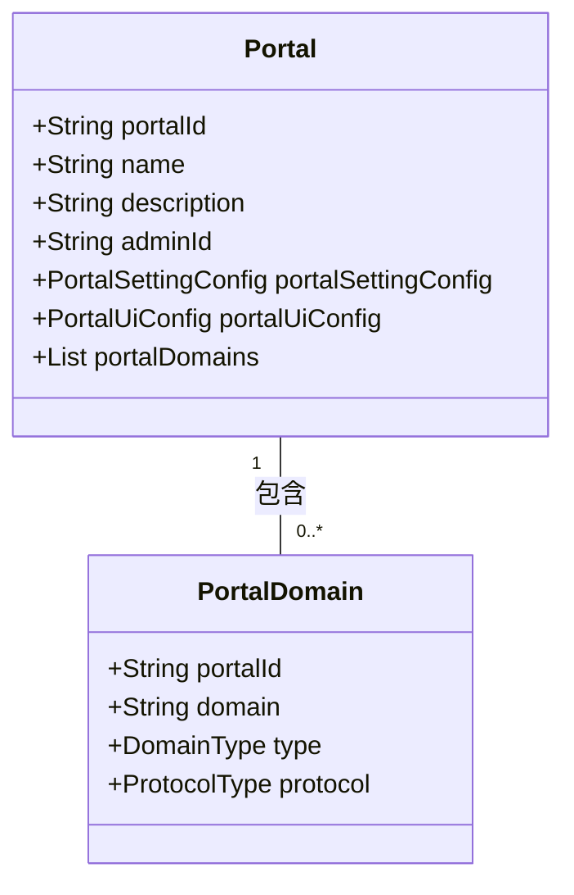
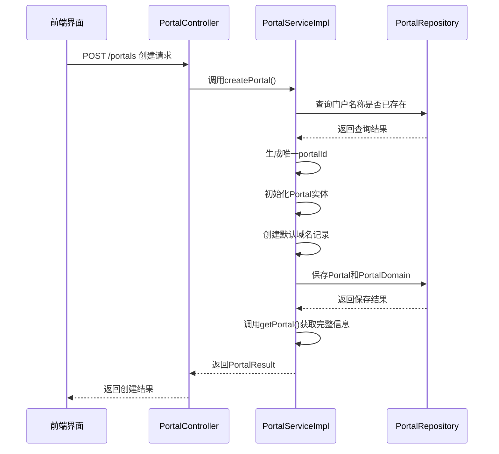
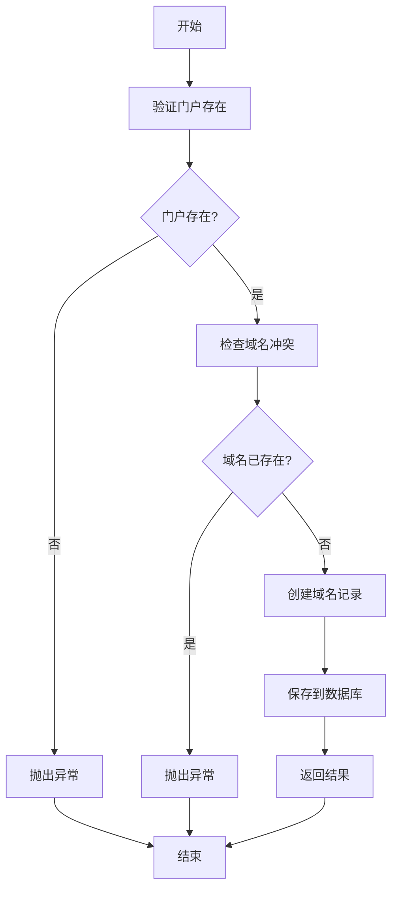
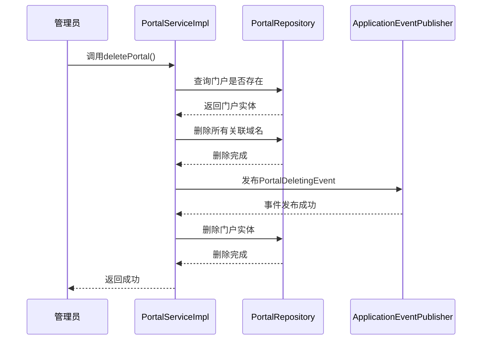

# 多租户门户管理

<cite>
**本文档引用文件**   
- [Portal.java](file://portal-dal/src/main/java/com/alibaba/apiopenplatform/entity/Portal.java#L0-L67)
- [PortalDomain.java](file://portal-dal/src/main/java/com/alibaba/apiopenplatform/entity/PortalDomain.java#L0-L54)
- [CreatePortalParam.java](file://portal-server/src/main/java/com/alibaba/apiopenplatform/dto/params/portal/CreatePortalParam.java#L0-L40)
- [PortalSettingConfig.java](file://portal-dal/src/main/java/com/alibaba/apiopenplatform/support/portal/PortalSettingConfig.java#L0-L36)
- [PortalUiConfig.java](file://portal-dal/src/main/java/com/alibaba/apiopenplatform/support/portal/PortalUiConfig.java#L0-L30)
- [PortalServiceImpl.java](file://portal-server/src/main/java/com/alibaba/apiopenplatform/service/impl/PortalServiceImpl.java#L0-L251)
- [PortalDeletingEvent.java](file://portal-server/src/main/java/com/alibaba/apiopenplatform/core/event/PortalDeletingEvent.java#L0-L34)
- [Portals.tsx](file://portal-web/api-portal-admin/src/pages/Portals.tsx)
- [PortalSettings.tsx](file://portal-web/api-portal-admin/src/components/portal/PortalSettings.tsx)
</cite>

## 目录
1. [多租户门户概述](#多租户门户概述)
2. [核心实体与关系](#核心实体与关系)
3. [门户创建与初始化](#门户创建与初始化)
4. [域名绑定与管理](#域名绑定与管理)
5. [门户配置与UI定制](#门户配置与ui定制)
6. [门户生命周期管理](#门户生命周期管理)
7. [前端管理界面](#前端管理界面)
8. [安全与隔离设计](#安全与隔离设计)

## 多租户门户概述

多租户门户系统为每个租户提供独立的API门户实例，支持完全隔离的域名、UI样式和认证配置。系统通过`Portal`实体作为核心管理单元，每个门户拥有唯一的`portalId`，并可绑定多个自定义域名。门户支持管理员独立管理其开发者、消费者、产品和订阅等资源，实现租户间的完全隔离。

系统采用微服务架构，后端由`portal-server`提供REST API，`portal-dal`负责数据访问，前端管理界面位于`portal-web/api-portal-admin`。门户的创建、配置和生命周期管理均通过标准化的API流程实现。

## 核心实体与关系

### Portal 与 PortalDomain 关系

`Portal`（门户）是系统的核心实体，代表一个独立的租户门户实例。每个`Portal`通过`portalId`唯一标识，并包含配置信息和关联的域名集合。`PortalDomain`（门户域名）实体用于管理门户绑定的域名，实现多域名支持。

两者关系为一对多：一个`Portal`可拥有多个`PortalDomain`，但每个`PortalDomain`只能属于一个`Portal`。这种设计支持门户的默认域名和多个自定义域名绑定。



**图示来源**
- [Portal.java](file://portal-dal/src/main/java/com/alibaba/apiopenplatform/entity/Portal.java#L0-L67)
- [PortalDomain.java](file://portal-dal/src/main/java/com/alibaba/apiopenplatform/entity/PortalDomain.java#L0-L54)

**本节来源**
- [Portal.java](file://portal-dal/src/main/java/com/alibaba/apiopenplatform/entity/Portal.java#L0-L67)
- [PortalDomain.java](file://portal-dal/src/main/java/com/alibaba/apiopenplatform/entity/PortalDomain.java#L0-L54)

## 门户创建与初始化

### CreatePortalParam 参数结构

门户创建通过`CreatePortalParam`参数对象初始化，该对象定义了创建门户所需的基本信息：

```json
{
  "name": "门户名称",
  "description": "门户描述"
}
```

- **name**: 门户名称，必填，长度不超过50字符
- **description**: 门户描述，可选，长度不超过1024字符

### 门户创建流程

门户创建流程在`PortalServiceImpl.createPortal()`方法中实现，包含以下关键步骤：



**图示来源**
- [CreatePortalParam.java](file://portal-server/src/main/java/com/alibaba/apiopenplatform/dto/params/portal/CreatePortalParam.java#L0-L40)
- [PortalServiceImpl.java](file://portal-server/src/main/java/com/alibaba/apiopenplatform/service/impl/PortalServiceImpl.java#L0-L251)

**本节来源**
- [CreatePortalParam.java](file://portal-server/src/main/java/com/alibaba/apiopenplatform/dto/params/portal/CreatePortalParam.java#L0-L40)
- [PortalServiceImpl.java](file://portal-server/src/main/java/com/alibaba/apiopenplatform/service/impl/PortalServiceImpl.java#L0-L251)

## 域名绑定与管理

### 域名类型与协议

`PortalDomain`实体支持多种域名类型和协议：

- **DomainType**: 域名类型，包括`DEFAULT`（默认域名）和自定义类型
- **ProtocolType**: 协议类型，支持`HTTP`和`HTTPS`

### 域名绑定流程

域名绑定通过`bindDomain`接口实现，流程如下：

1. 验证门户是否存在
2. 检查域名是否已绑定（防止冲突）
3. 创建`PortalDomain`实体并保存
4. 返回更新后的门户信息



**图示来源**
- [PortalDomain.java](file://portal-dal/src/main/java/com/alibaba/apiopenplatform/entity/PortalDomain.java#L0-L54)
- [PortalServiceImpl.java](file://portal-server/src/main/java/com/alibaba/apiopenplatform/service/impl/PortalServiceImpl.java#L0-L251)

**本节来源**
- [PortalDomain.java](file://portal-dal/src/main/java/com/alibaba/apiopenplatform/entity/PortalDomain.java#L0-L54)
- [PortalServiceImpl.java](file://portal-server/src/main/java/com/alibaba/apiopenplatform/service/impl/PortalServiceImpl.java#L0-L251)

## 门户配置与UI定制

### PortalSettingConfig 配置

`PortalSettingConfig`类定义了门户的核心功能配置：

```json
{
  "builtinAuthEnabled": true,
  "oidcConfigs": [
    {
      "issuer": "https://example.com",
      "clientId": "client123",
      "enabled": true
    }
  ],
  "autoApproveDevelopers": false,
  "autoApproveSubscriptions": true
}
```

- **builtinAuthEnabled**: 是否启用内置认证
- **oidcConfigs**: OIDC认证配置列表
- **autoApproveDevelopers**: 开发者注册是否自动审批
- **autoApproveSubscriptions**: 订阅是否自动审批

### PortalUiConfig UI定制

`PortalUiConfig`类用于UI样式定制：

```json
{
  "logo": "https://example.com/logo.png",
  "icon": "https://example.com/icon.png"
}
```

- **logo**: 门户Logo图片URL
- **icon**: 门户图标URL

### 配置初始化

在门户创建时，系统自动初始化默认配置：

```java
// 初始化设置配置
portal.setPortalSettingConfig(new PortalSettingConfig());
// 初始化UI配置
portal.setPortalUiConfig(new PortalUiConfig());
```

**本节来源**
- [PortalSettingConfig.java](file://portal-dal/src/main/java/com/alibaba/apiopenplatform/support/portal/PortalSettingConfig.java#L0-L36)
- [PortalUiConfig.java](file://portal-dal/src/main/java/com/alibaba/apiopenplatform/support/portal/PortalUiConfig.java#L0-L30)
- [PortalServiceImpl.java](file://portal-server/src/main/java/com/alibaba/apiopenplatform/service/impl/PortalServiceImpl.java#L0-L251)

## 门户生命周期管理

### 门户删除流程

门户删除通过`deletePortal`方法实现，包含级联删除和事件发布机制：



### PortalDeletingEvent 事件机制

`PortalDeletingEvent`是Spring应用事件，用于异步清理门户相关资源：

```java
public class PortalDeletingEvent extends ApplicationEvent {
    private final String portalId;
    
    public PortalDeletingEvent(String portalId) {
        super(portalId);
        this.portalId = portalId;
    }
}
```

该事件允许系统在门户删除后异步执行清理任务，如删除关联的API、订阅、用户等资源，确保数据一致性。

**图示来源**
- [PortalDeletingEvent.java](file://portal-server/src/main/java/com/alibaba/apiopenplatform/core/event/PortalDeletingEvent.java#L0-L34)
- [PortalServiceImpl.java](file://portal-server/src/main/java/com/alibaba/apiopenplatform/service/impl/PortalServiceImpl.java#L0-L251)

**本节来源**
- [PortalDeletingEvent.java](file://portal-server/src/main/java/com/alibaba/apiopenplatform/core/event/PortalDeletingEvent.java#L0-L34)
- [PortalServiceImpl.java](file://portal-server/src/main/java/com/alibaba/apiopenplatform/service/impl/PortalServiceImpl.java#L0-L251)

## 前端管理界面

### Portals.tsx 门户列表

`Portals.tsx`是门户管理的主界面，提供以下功能：

- 门户列表展示
- 创建新门户
- 查看门户详情
- 删除门户

界面通过调用`/portals` API获取门户列表，并支持分页浏览。

### PortalSettings.tsx 配置管理

`PortalSettings.tsx`组件提供门户配置管理界面：

- 基本信息编辑
- UI配置（Logo、图标）
- 认证方式配置
- 审批策略设置
- 域名管理

界面通过`UpdatePortalParam`对象提交配置变更，与后端`updatePortal`接口对接。

**本节来源**
- [Portals.tsx](file://portal-web/api-portal-admin/src/pages/Portals.tsx)
- [PortalSettings.tsx](file://portal-web/api-portal-admin/src/components/portal/PortalSettings.tsx)

## 安全与隔离设计

### 门户隔离机制

系统通过以下机制确保多租户隔离：

1. **数据隔离**: 所有租户数据通过`portalId`字段隔离
2. **域名隔离**: 每个请求通过`PortalResolvingFilter`解析`portalId`
3. **权限控制**: 管理员只能管理所属门户的资源

### 域名解析配置

域名解析通过`PortalResolvingFilter`实现：

```java
public class PortalResolvingFilter implements Filter {
    private final PortalService portalService;
    
    public void doFilter(ServletRequest request, ServletResponse response, FilterChain chain) {
        String domain = request.getServerName();
        String portalId = portalService.resolvePortal(domain);
        // 将portalId存入上下文
        ContextHolder.setPortalId(portalId);
        chain.doFilter(request, response);
    }
}
```

### 常见问题解决方案

**域名冲突**: 当尝试绑定已存在的域名时，系统返回`RESOURCE_EXIST`错误，提示用户选择其他域名。

**默认域名保护**: 系统禁止解绑`DEFAULT`类型的域名，确保门户始终有访问入口。

**认证方式校验**: 更新配置时，系统校验至少保留一种认证方式（内置认证或OIDC），防止门户无法访问。

**本节来源**
- [PortalServiceImpl.java](file://portal-server/src/main/java/com/alibaba/apiopenplatform/service/impl/PortalServiceImpl.java#L0-L251)
- [PortalDomain.java](file://portal-dal/src/main/java/com/alibaba/apiopenplatform/entity/PortalDomain.java#L0-L54)