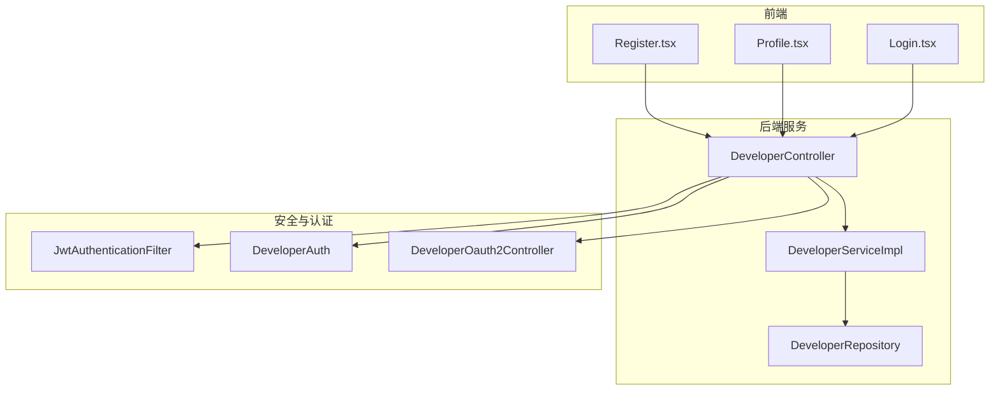
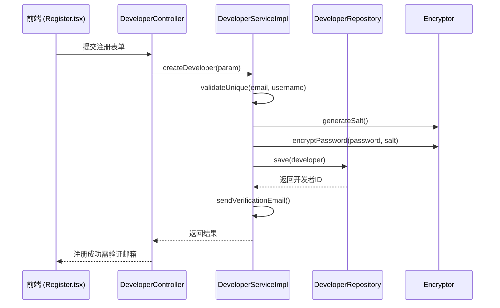
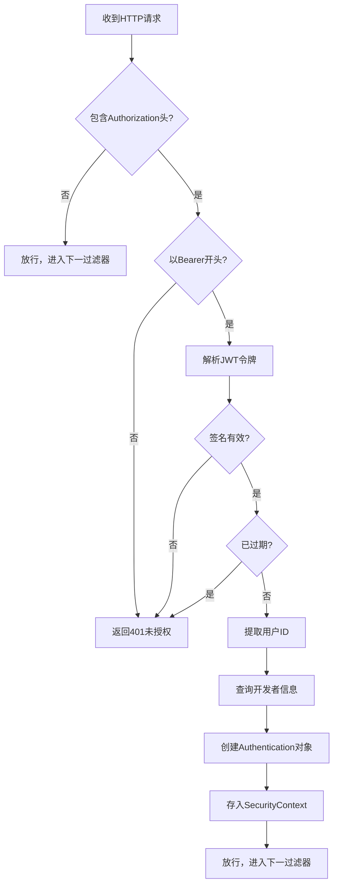
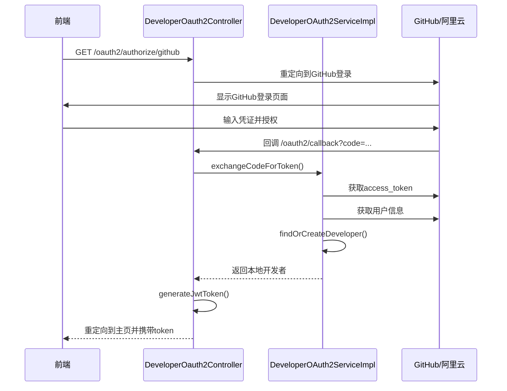
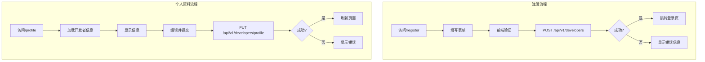

# 开发者生命周期管理

<cite>
**本文档引用文件**  
- [DeveloperController.java](file://portal-server/src/main/java/com/alibaba/apiopenplatform/controller/DeveloperController.java)
- [DeveloperServiceImpl.java](file://portal-server/src/main/java/com/alibaba/apiopenplatform/service/impl/DeveloperServiceImpl.java)
- [DeveloperCreateParam.java](file://portal-server/src/main/java/com/alibaba/apiopenplatform/dto/params/developer/DeveloperCreateParam.java)
- [JwtAuthenticationFilter.java](file://portal-server/src/main/java/com/alibaba/apiopenplatform/core/security/JwtAuthenticationFilter.java)
- [DeveloperOauth2Controller.java](file://portal-server/src/main/java/com/alibaba/apiopenplatform/controller/DeveloperOauth2Controller.java)
- [DeveloperAuth.java](file://portal-server/src/main/java/com/alibaba/apiopenplatform/core/annotation/DeveloperAuth.java)
- [Developer.java](file://portal-dal/src/main/java/com/alibaba/apiopenplatform/entity/Developer.java)
- [DeveloperStatus.java](file://portal-dal/src/main/java/com/alibaba/apiopenplatform/support/enums/DeveloperStatus.java)
- [Encryptor.java](file://portal-dal/src/main/java/com/alibaba/apiopenplatform/support/common/Encryptor.java)
- [Register.tsx](file://portal-web/api-portal-frontend/src/pages/Register.tsx)
- [Profile.tsx](file://portal-web/api-portal-frontend/src/pages/Profile.tsx)
</cite>

## 目录
1. [引言](#引言)
2. [项目结构分析](#项目结构分析)
3. [核心组件分析](#核心组件分析)
4. [开发者实体与状态管理](#开发者实体与状态管理)
5. [注册与认证流程](#注册与认证流程)
6. [JWT认证机制](#jwt认证机制)
7. [第三方登录集成](#第三方登录集成)
8. [权限控制与注解](#权限控制与注解)
9. [凭证安全与加密](#凭证安全与加密)
10. [前端交互流程](#前端交互流程)
11. [常见问题与解决方案](#常见问题与解决方案)
12. [结论](#结论)

## 引言

本文档全面阐述了开发者从注册、认证、凭证管理到注销的完整生命周期。通过分析后端服务逻辑与前端交互组件，详细说明了开发者管理的核心机制，包括注册流程、JWT认证、第三方登录集成、状态管理、权限控制和安全加密策略。文档旨在为开发者和系统管理员提供清晰的技术指导和问题排查依据。

## 项目结构分析

项目采用典型的分层架构，包含前端（portal-web）、启动引导（portal-bootstrap）、数据访问层（portal-dal）和业务服务层（portal-server）。各模块职责明确，便于维护和扩展。



**图示来源**  
- [DeveloperController.java](file://portal-server/src/main/java/com/alibaba/apiopenplatform/controller/DeveloperController.java)
- [Register.tsx](file://portal-web/api-portal-frontend/src/pages/Register.tsx)
- [Profile.tsx](file://portal-web/api-portal-frontend/src/pages/Profile.tsx)

## 核心组件分析

### 开发者服务组件

`DeveloperServiceImpl` 是开发者管理的核心业务逻辑实现类，负责处理注册、登录、信息更新、状态变更等操作。它依赖于 `DeveloperRepository` 进行数据持久化，并通过 `Encryptor` 对敏感信息进行加密存储。

**组件来源**  
- [DeveloperServiceImpl.java](file://portal-server/src/main/java/com/alibaba/apiopenplatform/service/impl/DeveloperServiceImpl.java)
- [DeveloperRepository.java](file://portal-dal/src/main/java/com/alibaba/apiopenplatform/repository/DeveloperRepository.java)

### 认证过滤器组件

`JwtAuthenticationFilter` 是Spring Security框架中的关键过滤器，负责拦截请求并验证JWT令牌的有效性。若令牌有效，则将用户信息存入安全上下文，供后续业务逻辑使用。

**组件来源**  
- [JwtAuthenticationFilter.java](file://portal-server/src/main/java/com/alibaba/apiopenplatform/core/security/JwtAuthenticationFilter.java)

## 开发者实体与状态管理

### Developer实体结构

`Developer` 实体类定义了开发者的基本信息，包括：
- 基础信息：ID、用户名、邮箱、手机号
- 安全信息：加密密码、盐值
- 状态信息：状态码、创建/更新时间
- 扩展信息：头像、简介

```java
public class Developer extends BaseEntity {
    private String username;
    private String email;
    private String phone;
    private String password;
    private String salt;
    private DeveloperStatus status;
    private String avatar;
    private String bio;
}
```

### DeveloperStatus状态枚举

`DeveloperStatus` 枚举定义了开发者账户的生命周期状态：
- **ACTIVE**: 活跃状态，可正常登录和使用服务
- **INACTIVE**: 非活跃状态，账户被禁用
- **PENDING**: 待激活状态，注册后未完成邮箱验证
- **LOCKED**: 锁定状态，因多次登录失败被临时锁定
- **DELETED**: 已删除状态，软删除标记

**实体来源**  
- [Developer.java](file://portal-dal/src/main/java/com/alibaba/apiopenplatform/entity/Developer.java)
- [DeveloperStatus.java](file://portal-dal/src/main/java/com/alibaba/apiopenplatform/support/enums/DeveloperStatus.java)

## 注册与认证流程

### 注册流程分析

开发者注册流程由 `DeveloperCreateParam` 参数类驱动，包含以下步骤：

1. 前端提交注册表单（Register.tsx）
2. 后端接收 `DeveloperCreateParam` 请求参数
3. 验证邮箱/用户名唯一性
4. 生成密码盐值并加密存储
5. 设置初始状态为 PENDING（待激活）
6. 发送邮箱验证链接
7. 验证成功后状态变更为 ACTIVE



**图示来源**  
- [DeveloperCreateParam.java](file://portal-server/src/main/java/com/alibaba/apiopenplatform/dto/params/developer/DeveloperCreateParam.java)
- [DeveloperServiceImpl.java](file://portal-server/src/main/java/com/alibaba/apiopenplatform/service/impl/DeveloperServiceImpl.java)
- [Register.tsx](file://portal-web/api-portal-frontend/src/pages/Register.tsx)

## JWT认证机制

### JwtAuthenticationFilter工作流程

JWT认证过滤器在每次请求时执行以下逻辑：

1. 从请求头获取Authorization字段
2. 验证是否以"Bearer "开头
3. 解析JWT令牌
4. 验证签名和过期时间
5. 从令牌中提取用户ID
6. 查询数据库获取完整用户信息
7. 将用户信息存入SecurityContext



**图示来源**  
- [JwtAuthenticationFilter.java](file://portal-server/src/main/java/com/alibaba/apiopenplatform/core/security/JwtAuthenticationFilter.java)

## 第三方登录集成

### OIDC集成流程

系统通过 `DeveloperOauth2Controller` 支持OIDC协议的第三方登录（如阿里云、GitHub），流程如下：

1. 前端跳转到 `/oauth2/authorize/{provider}`
2. 重定向到第三方登录页面
3. 用户授权后回调 `/oauth2/callback`
4. 获取访问令牌和用户信息
5. 绑定或创建本地开发者账户
6. 生成本地JWT令牌返回前端



**图示来源**  
- [DeveloperOauth2Controller.java](file://portal-server/src/main/java/com/alibaba/apiopenplatform/controller/DeveloperOauth2Controller.java)
- [DeveloperOAuth2ServiceImpl.java](file://portal-server/src/main/java/com/alibaba/apiopenplatform/service/impl/DeveloperOAuth2ServiceImpl.java)

## 权限控制与注解

### DeveloperAuth注解机制

`@DeveloperAuth` 是自定义注解，用于方法级别的权限控制。配合AOP实现，确保只有认证通过的开发者才能访问受保护的接口。

```java
@Target(ElementType.METHOD)
@Retention(RetentionPolicy.RUNTIME)
public @interface DeveloperAuth {
    boolean required() default true;
}
```

#### 执行流程：

1. AOP拦截带有 `@DeveloperAuth` 注解的方法
2. 从SecurityContext获取当前认证用户
3. 验证用户是否为开发者身份
4. 检查开发者状态是否为ACTIVE
5. 通过则执行目标方法，否则抛出异常

```mermaid
flowchart TD
A[调用受保护方法] --> B{方法有@DeveloperAuth?}
B --> |否| C[直接执行]
B --> |是| D[获取SecurityContext]
D --> E{已认证?}
E --> |否| F[抛出未认证异常]
E --> |是| G[获取开发者信息]
G --> H{状态为ACTIVE?}
H --> |否| I[抛出权限不足异常]
H --> |是| J[执行目标方法]
```

**组件来源**  
- [DeveloperAuth.java](file://portal-server/src/main/java/com/alibaba/apiopenplatform/core/annotation/DeveloperAuth.java)

## 凭证安全与加密

### Encryptor加密机制

系统使用 `Encryptor` 工具类对敏感信息进行加密存储，主要应用于：
- 密码加密：使用加盐哈希算法（如bcrypt）
- 敏感字段加密：对邮箱、手机号等进行对称加密

#### 加密流程：

1. 生成随机盐值
2. 使用盐值和密码生成哈希值
3. 存储哈希值和盐值
4. 验证时使用相同盐值重新计算并比对

```java
public class Encryptor {
    public static String hashPassword(String password, String salt) {
        // 使用BCrypt或其他安全哈希算法
        return BCrypt.hashpw(password + salt, BCrypt.gensalt());
    }
    
    public static boolean verifyPassword(String password, String salt, String hash) {
        return BCrypt.checkpw(password + salt, hash);
    }
}
```

**组件来源**  
- [Encryptor.java](file://portal-dal/src/main/java/com/alibaba/apiopenplatform/support/common/Encryptor.java)

## 前端交互流程

### 注册页面 (Register.tsx)

注册页面提供表单输入，包含：
- 用户名、邮箱、密码、确认密码
- 表单验证（邮箱格式、密码强度）
- 提交后调用 `/api/v1/developers` 接口
- 处理成功/失败响应

### 个人资料页面 (Profile.tsx)

个人资料页面允许开发者：
- 查看和编辑基本信息
- 修改密码
- 管理外部身份绑定（阿里云、GitHub等）
- 注销账户



**组件来源**  
- [Register.tsx](file://portal-web/api-portal-frontend/src/pages/Register.tsx)
- [Profile.tsx](file://portal-web/api-portal-frontend/src/pages/Profile.tsx)

## 常见问题与解决方案

### 认证失败常见原因

| 问题现象 | 可能原因 | 解决方案 |
|---------|---------|---------|
| 登录失败 | 密码错误 | 提示用户重置密码 |
| 登录失败 | 账户未激活 | 重新发送验证邮件 |
| 登录失败 | 账户被锁定 | 等待锁定时间结束或联系管理员 |
| API访问被拒 | JWT令牌过期 | 重新登录获取新令牌 |
| API访问被拒 | 账户状态非ACTIVE | 检查账户状态并联系管理员 |
| 第三方登录失败 | 授权中断 | 重新发起授权流程 |
| 第三方登录失败 | 用户信息冲突 | 手动绑定已有账户 |

### 调试建议

1. 检查请求头中的Authorization字段格式
2. 验证JWT令牌的有效期
3. 查看后端日志中的认证失败原因
4. 确认数据库中开发者状态是否为ACTIVE
5. 检查加密盐值是否正确存储和使用

**问题来源**  
- [DeveloperServiceImpl.java](file://portal-server/src/main/java/com/alibaba/apiopenplatform/service/impl/DeveloperServiceImpl.java)
- [JwtAuthenticationFilter.java](file://portal-server/src/main/java/com/alibaba/apiopenplatform/core/security/JwtAuthenticationFilter.java)

## 结论

本文档详细阐述了开发者生命周期管理的完整流程，涵盖了从注册、认证、权限控制到安全加密的各个方面。系统通过清晰的分层架构和模块化设计，实现了高内聚、低耦合的开发者管理体系。JWT认证机制保证了无状态的安全访问，而OIDC集成则提供了灵活的第三方登录支持。通过 `@DeveloperAuth` 注解实现了细粒度的权限控制，`Encryptor` 工具确保了敏感信息的安全存储。前端组件与后端API的紧密配合，为开发者提供了流畅的用户体验。建议在实际使用中关注账户状态管理和认证失败的排查，以确保系统的稳定运行。