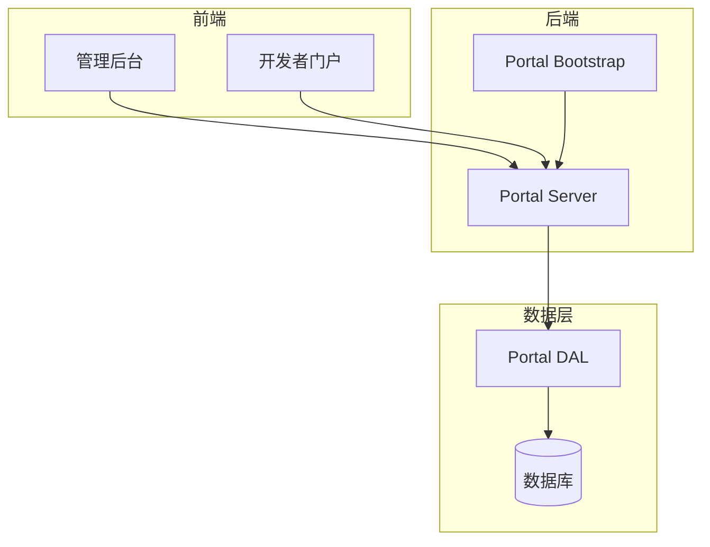
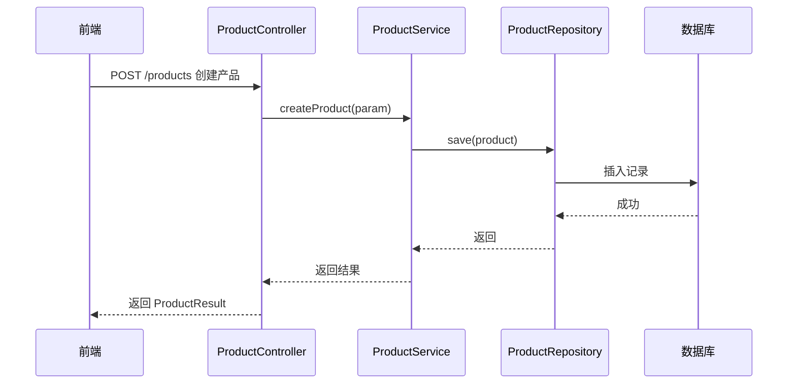
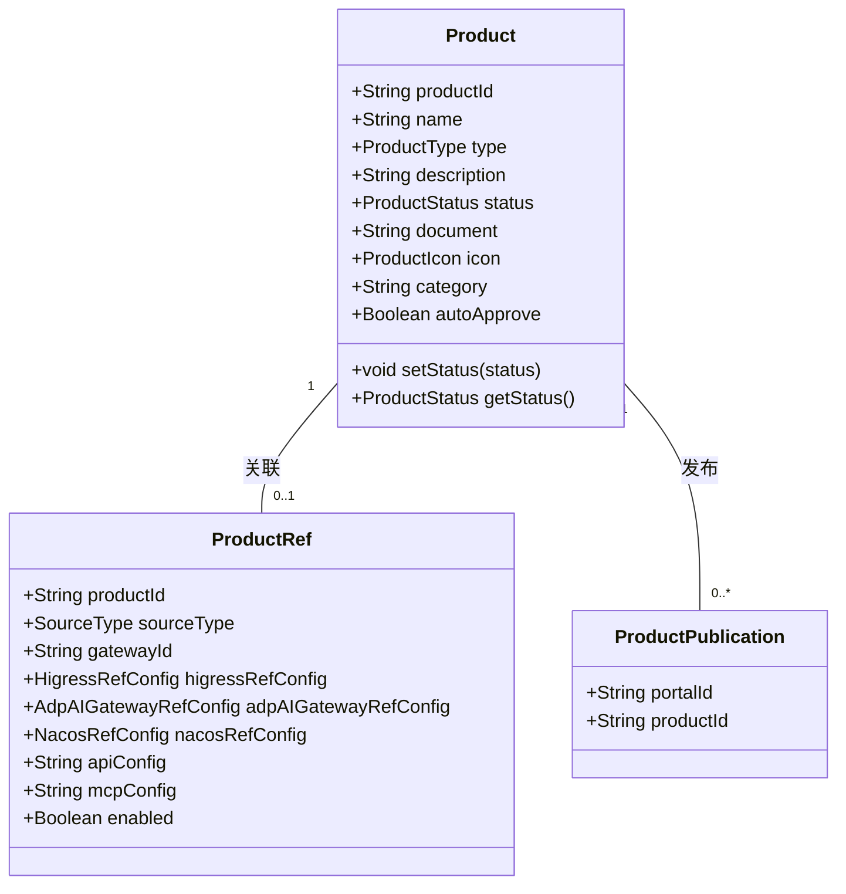
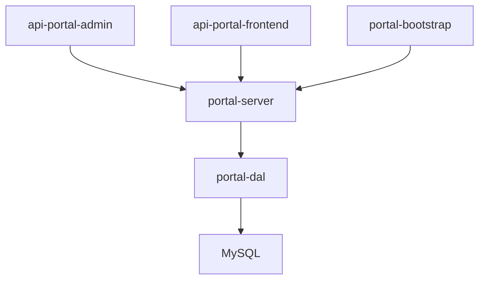

# 核心功能详解

<cite>
**本文档引用的文件**   
- [ProductService.java](file://portal-server/src/main/java/com/alibaba/apiopenplatform/service/ProductService.java)
- [ProductServiceImpl.java](file://portal-server/src/main/java/com/alibaba/apiopenplatform/service/impl/ProductServiceImpl.java)
- [ProductController.java](file://portal-server/src/main/java/com/alibaba/apiopenplatform/controller/ProductController.java)
- [CreateProductParam.java](file://portal-server/src/main/java/com/alibaba/apiopenplatform/dto/params/product/CreateProductParam.java)
- [Product.java](file://portal-dal/src/main/java/com/alibaba/apiopenplatform/entity/Product.java)
- [ProductStatus.java](file://portal-dal/src/main/java/com/alibaba/apiopenplatform/support/enums/ProductStatus.java)
</cite>

## 目录
1. [引言](#引言)
2. [项目结构](#项目结构)
3. [核心组件](#核心组件)
4. [架构概述](#架构概述)
5. [详细组件分析](#详细组件分析)
6. [依赖分析](#依赖分析)
7. [性能考虑](#性能考虑)
8. [故障排除指南](#故障排除指南)
9. [结论](#结论)

## 引言
Himarket 是一个开箱即用的 AI 开放平台解决方案，旨在帮助企业构建 AI 能力市场与开发者生态中心。该平台围绕四大核心支柱功能展开：AI 产品管理、开发者生命周期管理、门户管理以及外部系统集成。本文档将深入剖析这些功能，特别是 AI 产品管理模块，从创建产品、关联 API、发布到门户的完整流程，并结合实际代码片段展示关键逻辑实现。

## 项目结构
Himarket 项目采用模块化设计，主要分为以下几个部分：
- `deploy`：包含 Docker 和 Helm 部署配置。
- `portal-bootstrap`：启动引导模块，负责应用初始化。
- `portal-dal`：数据访问层，定义实体类和数据库操作。
- `portal-server`：核心业务逻辑处理层，提供 REST API 接口。
- `portal-web`：前端展示层，分为管理后台和开发者门户两个子项目。



**图示来源**
- [portal-server](file://portal-server)
- [portal-dal](file://portal-dal)
- [portal-web](file://portal-web)

**本节来源**
- [README.md](file://README.md#L1-L220)

## 核心组件
Himarket 的核心组件主要包括 AI 产品管理、开发者管理、门户管理和网关集成。其中，AI 产品管理是平台的核心功能之一，它允许管理员将底层的模型服务、MCP Server 等 AI 能力打包成标准化的“AI 产品”，并通过门户发布给开发者使用。

**本节来源**
- [README.md](file://README.md#L1-L220)

## 架构概述
Himarket 采用典型的分层架构，从前端到后端再到数据层，各层职责分明。前端通过 HTTP 请求与后端交互，后端服务通过定义良好的接口处理业务逻辑，并通过数据访问层与数据库通信。



**图示来源**
- [ProductController.java](file://portal-server/src/main/java/com/alibaba/apiopenplatform/controller/ProductController.java#L38-L121)
- [ProductService.java](file://portal-server/src/main/java/com/alibaba/apiopenplatform/service/ProductService.java#L32-L133)
- [ProductRepository.java](file://portal-dal/src/main/java/com/alibaba/apiopenplatform/repository/ProductRepository.java)

## 详细组件分析

### AI 产品管理分析
AI 产品管理模块是 Himarket 的核心功能之一，涵盖了从产品创建、更新、删除到发布的全生命周期管理。

#### 对象关系图


**图示来源**
- [Product.java](file://portal-dal/src/main/java/com/alibaba/apiopenplatform/entity/Product.java#L30-L78)
- [ProductRef.java](file://portal-dal/src/main/java/com/alibaba/apiopenplatform/entity/ProductRef.java)
- [ProductPublication.java](file://portal-dal/src/main/java/com/alibaba/apiopenplatform/entity/ProductPublication.java)

#### 创建产品流程
当管理员在管理后台创建一个新的 AI 产品时，前端会发送一个包含产品信息的 JSON 请求体到 `/products` 接口。后端的 `ProductController` 接收到请求后，调用 `ProductService` 的 `createProduct` 方法进行处理。

```java
@Operation(summary = "创建API产品")
@PostMapping
@AdminAuth
public ProductResult createProduct(@RequestBody @Valid CreateProductParam param) {
    return productService.createProduct(param);
}
```

`ProductService` 实现类首先检查产品名称是否已存在，然后生成唯一的产品 ID，设置创建者信息并保存到数据库。

```java
@Override
public ProductResult createProduct(CreateProductParam param) {
    productRepository.findByNameAndAdminId(param.getName(), contextHolder.getUser())
            .ifPresent(APIProduct -> {
                throw new BusinessException(ErrorCode.RESOURCE_EXIST, Resources.PRODUCT, param.getName());
            });

    String productId = IdGenerator.genApiProductId();

    Product product = param.convertTo();
    product.setProductId(productId);
    product.setAdminId(contextHolder.getUser());
    
    if (param.getAutoApprove() != null) {
        product.setAutoApprove(param.getAutoApprove());
    }
    
    productRepository.save(product);

    return getProduct(productId);
}
```

**本节来源**
- [ProductController.java](file://portal-server/src/main/java/com/alibaba/apiopenplatform/controller/ProductController.java#L38-L50)
- [ProductServiceImpl.java](file://portal-server/src/main/java/com/alibaba/apiopenplatform/service/impl/ProductServiceImpl.java#L63-L85)

#### 发布产品流程
产品创建完成后，需要将其发布到指定的门户才能被开发者使用。发布操作通过调用 `publishProduct` 方法完成。

```java
@Operation(summary = "发布API产品")
@PostMapping("/{productId}/publications/{portalId}")
@AdminAuth
public void publishProduct(@PathVariable String productId, @PathVariable String portalId) {
    productService.publishProduct(productId, portalId);
}
```

服务层逻辑如下：首先验证门户是否存在，然后检查产品是否已经发布。接着，将产品状态更新为 `PUBLISHED`，并创建一条发布记录。

```java
@Override
public void publishProduct(String productId, String portalId) {
    portalService.existsPortal(portalId);
    if (publicationRepository.findByPortalIdAndProductId(portalId, productId).isPresent()) {
        return;
    }

    Product product = findProduct(productId);
    product.setStatus(ProductStatus.PUBLISHED);

    if (getProductRef(productId) == null) {
        throw new BusinessException(ErrorCode.PRODUCT_API_NOT_FOUND, productId);
    }

    ProductPublication productPublication = new ProductPublication();
    productPublication.setPortalId(portalId);
    productPublication.setProductId(productId);

    publicationRepository.save(productPublication);
    productRepository.save(product);
}
```

**本节来源**
- [ProductController.java](file://portal-server/src/main/java/com/alibaba/apiopenplatform/controller/ProductController.java#L70-L77)
- [ProductServiceImpl.java](file://portal-server/src/main/java/com/alibaba/apiopenplatform/service/impl/ProductServiceImpl.java#L159-L180)

## 依赖分析
Himarket 各模块之间存在明确的依赖关系。前端依赖后端提供的 REST API，后端服务依赖数据访问层进行持久化操作，而数据访问层则依赖具体的数据库实现。



**图示来源**
- [pom.xml](file://pom.xml)
- [portal-server](file://portal-server)
- [portal-dal](file://portal-dal)

**本节来源**
- [pom.xml](file://pom.xml#L1-L100)

## 性能考虑
在产品发布过程中，涉及到多次数据库查询和更新操作。为了提高性能，建议对频繁查询的字段（如 `productId`、`portalId`）建立索引。此外，发布操作中的状态更新和记录插入应尽量使用批量操作以减少数据库往返次数。

## 故障排除指南
如果产品无法成功发布，请检查以下几点：
1. 产品是否已关联 API 或 MCP Server。
2. 目标门户是否存在。
3. 产品是否已被发布到同一门户。
4. 数据库连接是否正常。

**本节来源**
- [ProductServiceImpl.java](file://portal-server/src/main/java/com/alibaba/apiopenplatform/service/impl/ProductServiceImpl.java#L159-L180)

## 结论
Himarket 通过清晰的模块划分和严谨的业务流程设计，实现了 AI 产品的全生命周期管理。从产品创建、关联资源到发布门户，每一步都有相应的校验和处理逻辑，确保了系统的稳定性和可靠性。未来可以进一步优化性能，提升用户体验。