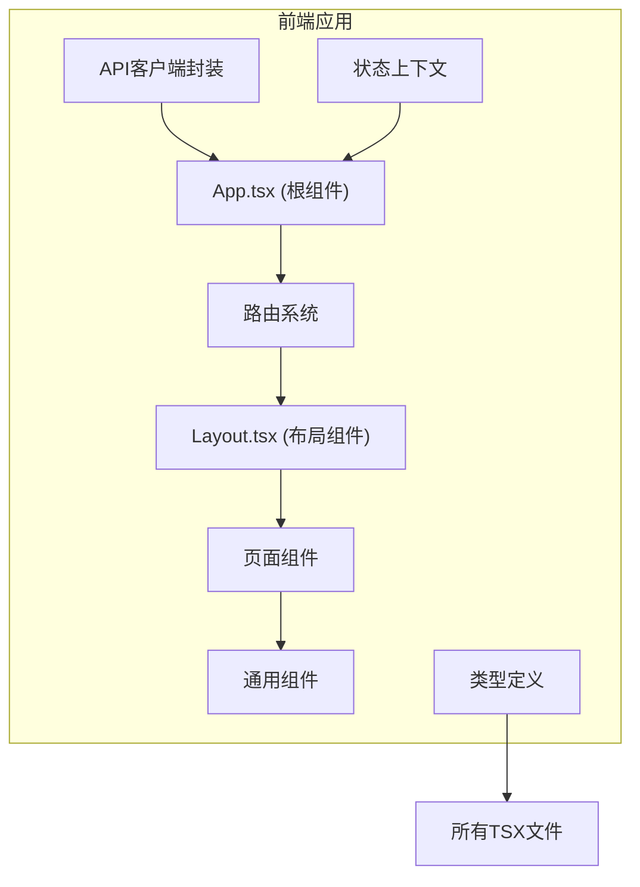
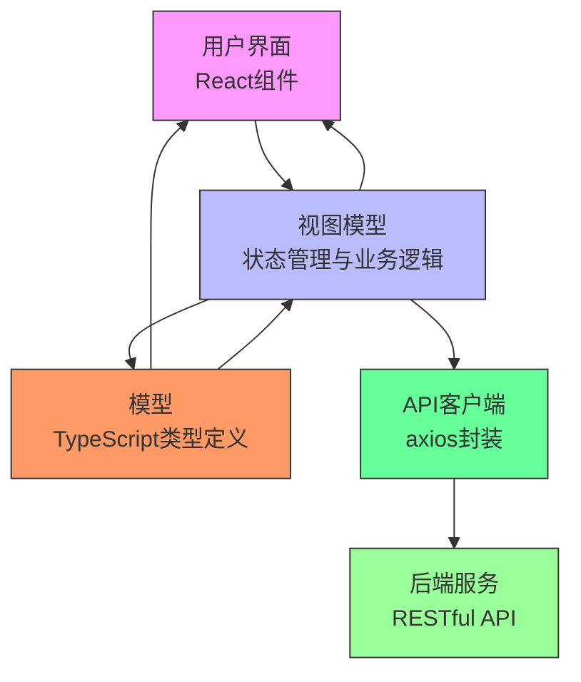
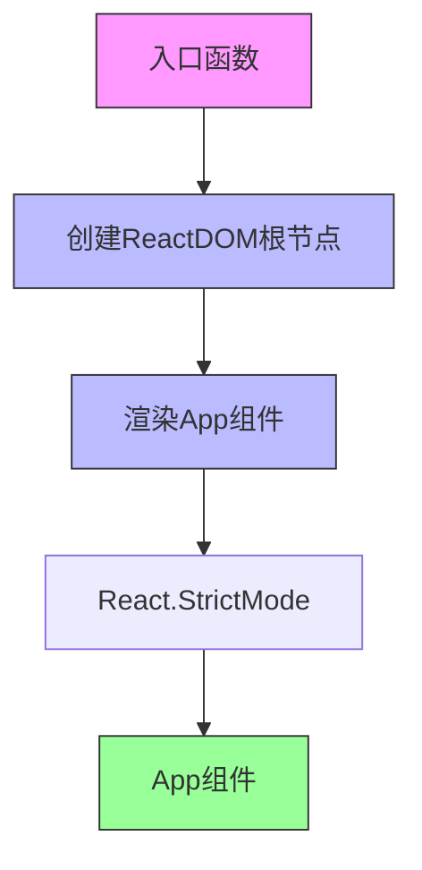
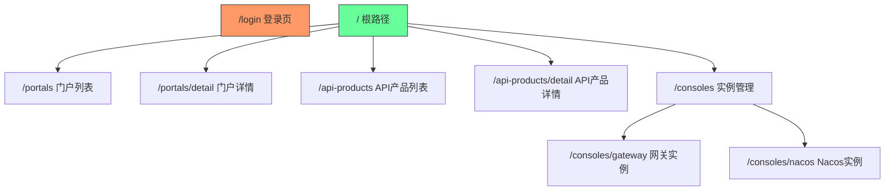
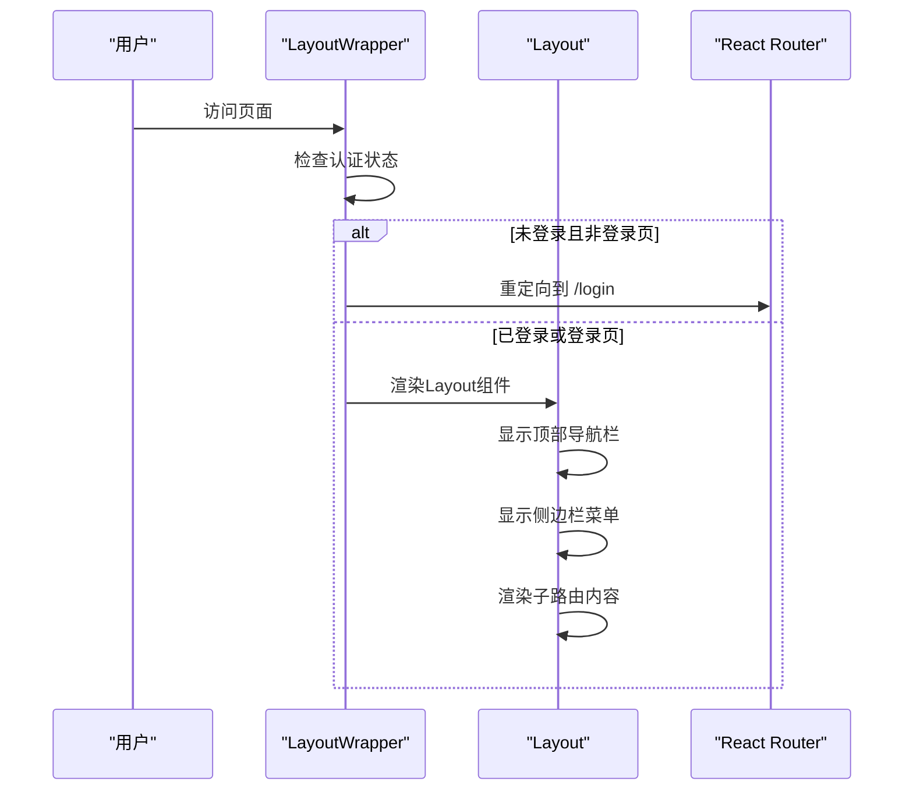
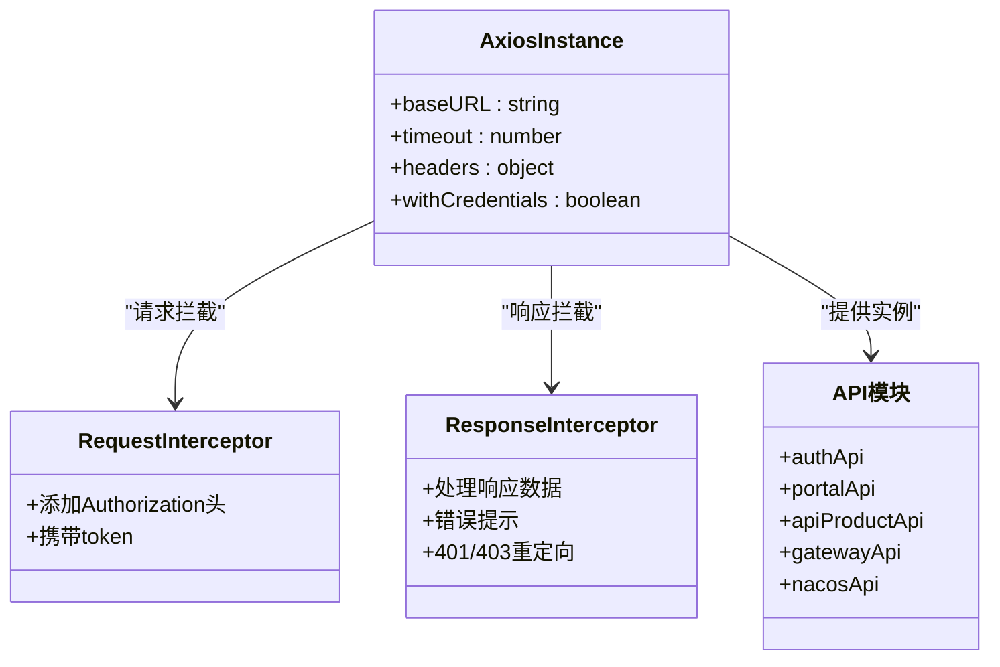
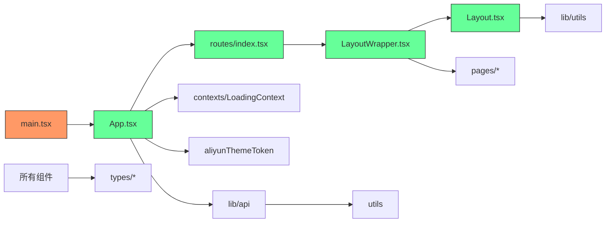

# 前端架构

<cite>
**本文档引用的文件**  
- [main.tsx](file://portal-web/api-portal-admin/src/main.tsx)
- [App.tsx](file://portal-web/api-portal-admin/src/App.tsx)
- [routes/index.tsx](file://portal-web/api-portal-admin/src/routes/index.tsx)
- [LayoutWrapper.tsx](file://portal-web/api-portal-admin/src/components/LayoutWrapper.tsx)
- [Layout.tsx](file://portal-web/api-portal-admin/src/components/Layout.tsx)
- [api.ts](file://portal-web/api-portal-admin/src/lib/api.ts)
- [utils.ts](file://portal-web/api-portal-admin/src/lib/utils.ts)
- [index.ts](file://portal-web/api-portal-admin/src/types/index.ts)
</cite>

## 目录
1. [项目结构](#项目结构)
2. [核心组件](#核心组件)
3. [架构概览](#架构概览)
4. [详细组件分析](#详细组件分析)
5. [依赖分析](#依赖分析)
6. [性能考虑](#性能考虑)
7. [故障排除指南](#故障排除指南)
8. [结论](#结论)

## 项目结构

Himarket前端项目位于`portal-web`目录下，包含两个独立的前端应用：管理后台（api-portal-admin）和开发者门户（api-portal-frontend）。本文档重点分析管理后台`api-portal-admin`，该应用基于React + Vite构建，采用TypeScript、Ant Design、Tailwind CSS等技术栈。

管理后台的主要目录结构如下：
- `src/components`：存放可复用的UI组件，如布局、表单、模态框等
- `src/pages`：存放页面级组件，如门户列表、API产品详情等
- `src/routes`：定义应用的路由配置
- `src/lib`：包含API客户端封装和工具函数
- `src/types`：定义TypeScript类型
- `src/contexts`：提供React上下文管理
- `vite.config.ts`、`tsconfig.json`：构建和类型配置文件



**图示来源**
- [App.tsx](file://portal-web/api-portal-admin/src/App.tsx)
- [routes/index.tsx](file://portal-web/api-portal-admin/src/routes/index.tsx)
- [Layout.tsx](file://portal-web/api-portal-admin/src/components/Layout.tsx)

## 核心组件

管理后台的核心组件包括应用入口、路由系统、布局组件和API客户端。这些组件共同构成了应用的基础架构。

**本文档引用的文件**
- [main.tsx](file://portal-web/api-portal-admin/src/main.tsx)
- [App.tsx](file://portal-web/api-portal-admin/src/App.tsx)
- [routes/index.tsx](file://portal-web/api-portal-admin/src/routes/index.tsx)
- [LayoutWrapper.tsx](file://portal-web/api-portal-admin/src/components/LayoutWrapper.tsx)
- [Layout.tsx](file://portal-web/api-portal-admin/src/components/Layout.tsx)
- [api.ts](file://portal-web/api-portal-admin/src/lib/api.ts)

## 架构概览

Himarket管理后台采用典型的MVVM（Model-View-ViewModel）架构模式，通过React组件作为View层，TypeScript类型定义作为Model层，业务逻辑和状态管理作为ViewModel层。



**图示来源**
- [App.tsx](file://portal-web/api-portal-admin/src/App.tsx)
- [types/index.ts](file://portal-web/api-portal-admin/src/types/index.ts)
- [lib/api.ts](file://portal-web/api-portal-admin/src/lib/api.ts)

## 详细组件分析

### 应用入口分析

应用的入口文件`main.tsx`负责初始化React应用，创建根节点并渲染根组件。



**图示来源**
- [main.tsx](file://portal-web/api-portal-admin/src/main.tsx#L1-L14)

**本节来源**
- [main.tsx](file://portal-web/api-portal-admin/src/main.tsx#L1-L14)

### 根组件分析

`App.tsx`是应用的根组件，负责配置全局依赖，包括Ant Design的主题、国际化和路由系统。

```typescript
function App() {
  return (
    <LoadingProvider>
      <ConfigProvider
        locale={zhCN}
        theme={{
          token: aliyunThemeToken,
        }}
      >
        <RouterProvider router={router} />
      </ConfigProvider>
    </LoadingProvider>
  )
}
```

该组件使用了Ant Design的`ConfigProvider`来设置中文语言环境（`zhCN`）和阿里云主题令牌（`aliyunThemeToken`），并通过`RouterProvider`将路由系统注入应用。

**本节来源**
- [App.tsx](file://portal-web/api-portal-admin/src/App.tsx#L1-L24)

### 路由系统分析

路由系统由`routes/index.tsx`文件定义，使用`react-router-dom`的`createBrowserRouter`创建浏览器路由。



路由配置中使用了嵌套路由，根路径`/`对应`LayoutWrapper`组件，其他页面作为其子路由。未匹配的路径会重定向到`/portals`。

**本节来源**
- [routes/index.tsx](file://portal-web/api-portal-admin/src/routes/index.tsx#L1-L58)

### 布局系统分析

`LayoutWrapper.tsx`和`Layout.tsx`共同构成了应用的布局系统。`LayoutWrapper`负责权限验证和加载状态管理，`Layout`负责UI布局。



`LayoutWrapper`通过`useEffect`监听路由变化，为非登录页面设置加载状态。`Layout`组件包含顶部导航栏、侧边栏和主内容区域，支持侧边栏折叠。

**图示来源**
- [LayoutWrapper.tsx](file://portal-web/api-portal-admin/src/components/LayoutWrapper.tsx#L1-L46)
- [Layout.tsx](file://portal-web/api-portal-admin/src/components/Layout.tsx#L1-L214)

**本节来源**
- [LayoutWrapper.tsx](file://portal-web/api-portal-admin/src/components/LayoutWrapper.tsx#L1-L46)
- [Layout.tsx](file://portal-web/api-portal-admin/src/components/Layout.tsx#L1-L214)

### API客户端分析

`lib/api.ts`文件封装了axios实例，提供了统一的API调用接口和拦截器。



API客户端配置了基础URL、超时时间、内容类型等参数，并设置了请求拦截器自动添加认证令牌，响应拦截器统一处理错误和数据格式。同时导出了多个API模块，按功能组织API调用。

**图示来源**
- [api.ts](file://portal-web/api-portal-admin/src/lib/api.ts#L1-L244)

**本节来源**
- [api.ts](file://portal-web/api-portal-admin/src/lib/api.ts#L1-L244)

### 工具函数分析

`lib/utils.ts`文件提供了多个实用工具函数，包括Token管理、状态判断、日期格式化等。

```typescript
// Token管理
export const getToken = (): string | null => localStorage.getItem('token')
export const removeToken = (): void => {
  localStorage.removeItem('token')
  localStorage.removeItem('userInfo')
}
export const isAuthenticated = (): boolean => !!getToken()

// 日期格式化
export const formatDateTime = (dateString: string | Date): string => {
  return date.toLocaleString('zh-CN', {
    year: 'numeric',
    month: '2-digit',
    day: '2-digit',
    hour: '2-digit',
    minute: '2-digit',
    second: '2-digit',
    hour12: false
  })
}
```

这些工具函数被广泛应用于各个组件中，实现了代码复用和逻辑分离。

**本节来源**
- [utils.ts](file://portal-web/api-portal-admin/src/lib/utils.ts#L1-L100)

### 类型定义分析

`types/index.ts`文件集中导出了所有类型定义，并定义了通用的API响应类型。

```typescript
export interface ApiResponse<T = any> {
  code: string;
  message: string;
  data: T;
}
```

通过集中管理类型定义，确保了类型的一致性和可维护性。各功能模块的类型定义分别存放在对应的类型文件中。

**本节来源**
- [index.ts](file://portal-web/api-portal-admin/src/types/index.ts#L1-L11)

## 依赖分析



**图示来源**
- [main.tsx](file://portal-web/api-portal-admin/src/main.tsx)
- [App.tsx](file://portal-web/api-portal-admin/src/App.tsx)
- [routes/index.tsx](file://portal-web/api-portal-admin/src/routes/index.tsx)
- [LayoutWrapper.tsx](file://portal-web/api-portal-admin/src/components/LayoutWrapper.tsx)
- [Layout.tsx](file://portal-web/api-portal-admin/src/components/Layout.tsx)
- [api.ts](file://portal-web/api-portal-admin/src/lib/api.ts)
- [utils.ts](file://portal-web/api-portal-admin/src/lib/utils.ts)
- [index.ts](file://portal-web/api-portal-admin/src/types/index.ts)

## 性能考虑

管理后台在性能方面做了以下优化：
1. **骨架屏加载**：在`Layout.tsx`中为内容区域实现了骨架屏，提升加载体验
2. **懒加载**：路由系统天然支持代码分割，按需加载页面组件
3. **状态管理**：使用React Context管理全局加载状态，避免不必要的重渲染
4. **防抖处理**：虽然当前代码未体现，但建议在搜索等频繁操作中添加防抖
5. **资源优化**：使用Vite构建，支持现代浏览器特性，生成优化的生产代码

## 故障排除指南

### 认证问题
- **现象**：登录后无法访问页面，自动跳转到登录页
- **原因**：`localStorage`中的token未正确设置或已被清除
- **解决方案**：检查`utils.ts`中的`getToken`和`isAuthenticated`函数，确保token存储机制正确

### API调用失败
- **现象**：API调用返回401或403错误
- **原因**：认证令牌缺失或过期
- **解决方案**：检查`api.ts`中的请求拦截器，确保Authorization头正确添加

### 样式问题
- **现象**：页面样式错乱
- **原因**：Tailwind CSS类名冲突或Ant Design主题未正确应用
- **解决方案**：检查`App.tsx`中的`ConfigProvider`配置，确保`aliyunThemeToken`正确导入

### 路由问题
- **现象**：页面无法访问或重定向错误
- **原因**：路由配置错误或`LayoutWrapper`的权限验证逻辑问题
- **解决方案**：检查`routes/index.tsx`的路由定义和`LayoutWrapper.tsx`的认证逻辑

**本节来源**
- [utils.ts](file://portal-web/api-portal-admin/src/lib/utils.ts#L15-L25)
- [api.ts](file://portal-web/api-portal-admin/src/lib/api.ts#L15-L45)
- [App.tsx](file://portal-web/api-portal-admin/src/App.tsx#L10-L15)
- [routes/index.tsx](file://portal-web/api-portal-admin/src/routes/index.tsx#L1-L58)
- [LayoutWrapper.tsx](file://portal-web/api-portal-admin/src/components/LayoutWrapper.tsx#L1-L46)

## 结论

Himarket管理后台采用现代化的前端技术栈，基于React + Vite构建，具有良好的架构设计和代码组织。通过MVVM模式实现了关注点分离，组件化设计提高了代码复用性，TypeScript类型系统增强了代码的可维护性。路由系统、布局组件、API客户端等核心模块设计合理，形成了一个稳定、可扩展的前端应用架构。建议继续保持良好的代码规范，并在后续开发中考虑引入更高级的状态管理方案（如Redux Toolkit）以应对更复杂的业务场景。