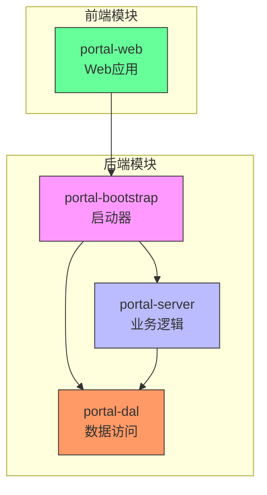
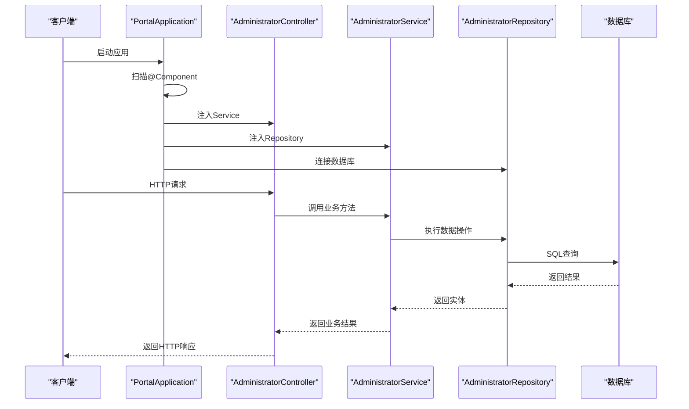
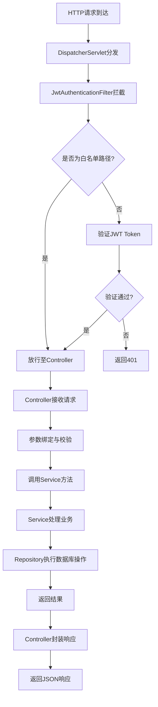
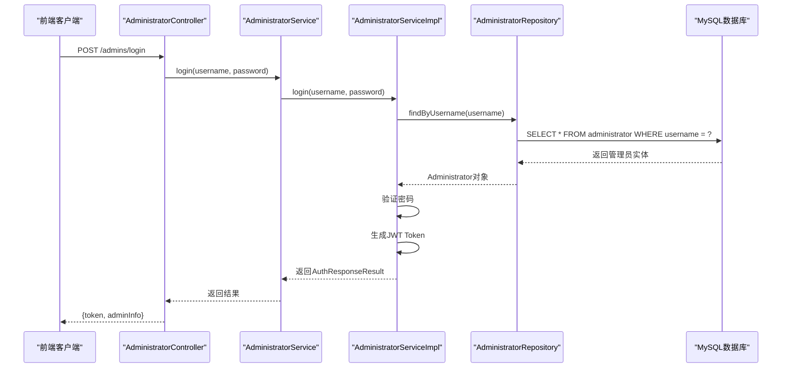
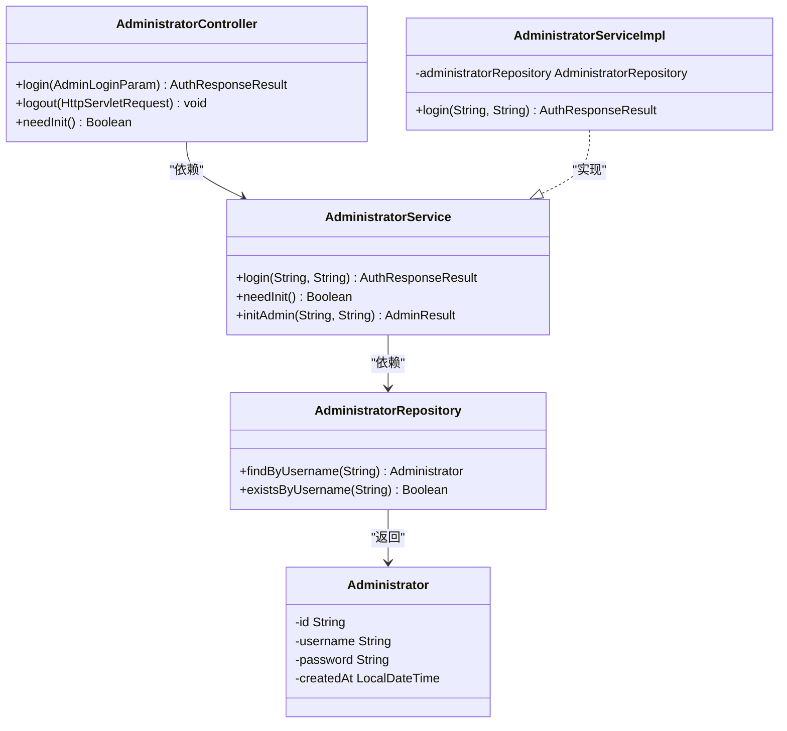

# 后端架构

<cite>
**本文档引用的文件**  
- [PortalApplication.java](file://portal-bootstrap/src/main/java/com/alibaba/apiopenplatform/PortalApplication.java)
- [SecurityConfig.java](file://portal-bootstrap/src/main/java/com/alibaba/apiopenplatform/config/SecurityConfig.java)
- [JwtAuthenticationFilter.java](file://portal-server/src/main/java/com/alibaba/apiopenplatform/core/security/JwtAuthenticationFilter.java)
- [AdministratorController.java](file://portal-server/src/main/java/com/alibaba/apiopenplatform/controller/AdministratorController.java)
- [AdministratorService.java](file://portal-server/src/main/java/com/alibaba/apiopenplatform/service/AdministratorService.java)
- [AdministratorServiceImpl.java](file://portal-server/src/main/java/com/alibaba/apiopenplatform/service/impl/AdministratorServiceImpl.java)
- [AdministratorRepository.java](file://portal-dal/src/main/java/com/alibaba/apiopenplatform/repository/AdministratorRepository.java)
- [Administrator.java](file://portal-dal/src/main/java/com/alibaba/apiopenplatform/entity/Administrator.java)
</cite>

## 目录
1. [引言](#引言)
2. [项目结构](#项目结构)
3. [核心组件](#核心组件)
4. [架构概览](#架构概览)
5. [详细组件分析](#详细组件分析)
6. [依赖分析](#依赖分析)
7. [性能考量](#性能考量)
8. [故障排查指南](#故障排查指南)
9. [结论](#结论)

## 引言
本文档旨在全面解析Himarket后端系统的架构设计，重点阐述其基于Spring Boot与Spring Security的分层架构体系。系统采用标准的MVC模式，划分为表现层（Controller）、业务逻辑层（Service）、数据访问层（Repository）和实体层（Entity），并通过portal-bootstrap模块作为统一的Spring Boot启动入口。文档将深入分析JWT认证机制、双角色权限控制（管理员与开发者）以及从HTTP请求到数据库操作的完整调用链路。

## 项目结构
Himarket后端项目采用模块化设计，主要包含四个核心模块：`portal-bootstrap`、`portal-server`、`portal-dal` 和 `portal-web`。其中，`portal-bootstrap` 是应用的启动模块，`portal-server` 包含控制器和业务服务，`portal-dal` 负责数据持久化，`portal-web` 则是前端应用。



**图示来源**  
- [PortalApplication.java](file://portal-bootstrap/src/main/java/com/alibaba/apiopenplatform/PortalApplication.java)
- [项目结构](file://)

## 核心组件
系统的核心组件遵循典型的Java EE分层架构：
- **表现层**：位于`portal-server`模块的`controller`包中，处理HTTP请求与响应。
- **业务逻辑层**：位于`portal-server`模块的`service`包中，封装核心业务规则。
- **数据访问层**：位于`portal-dal`模块的`repository`包中，负责与数据库交互。
- **实体层**：位于`portal-dal`模块的`entity`包中，映射数据库表结构。

**组件来源**  
- [AdministratorController.java](file://portal-server/src/main/java/com/alibaba/apiopenplatform/controller/AdministratorController.java)
- [AdministratorService.java](file://portal-server/src/main/java/com/alibaba/apiopenplatform/service/AdministratorService.java)
- [AdministratorRepository.java](file://portal-dal/src/main/java/com/alibaba/apiopenplatform/repository/AdministratorRepository.java)
- [Administrator.java](file://portal-dal/src/main/java/com/alibaba/apiopenplatform/entity/Administrator.java)

## 架构概览
Himarket后端采用Spring Boot驱动的微服务架构，通过`portal-bootstrap`模块的`PortalApplication`类作为唯一启动入口。该类使用`@SpringBootApplication`注解，自动扫描并加载`portal-server`中的所有控制器和服务组件。Spring容器负责管理所有Bean的生命周期和依赖注入。



**图示来源**  
- [PortalApplication.java](file://portal-bootstrap/src/main/java/com/alibaba/apiopenplatform/PortalApplication.java)
- [AdministratorController.java](file://portal-server/src/main/java/com/alibaba/apiopenplatform/controller/AdministratorController.java)
- [AdministratorServiceImpl.java](file://portal-server/src/main/java/com/alibaba/apiopenplatform/service/impl/AdministratorServiceImpl.java)

## 详细组件分析

### MVC模式实现机制
系统严格遵循MVC设计模式，实现请求的清晰分层处理。

#### 请求处理流程


**图示来源**  
- [SecurityConfig.java](file://portal-bootstrap/src/main/java/com/alibaba/apiopenplatform/config/SecurityConfig.java#L49-L125)
- [JwtAuthenticationFilter.java](file://portal-server/src/main/java/com/alibaba/apiopenplatform/core/security/JwtAuthenticationFilter.java)
- [AdministratorController.java](file://portal-server/src/main/java/com/alibaba/apiopenplatform/controller/AdministratorController.java)

### JWT认证与权限控制
系统通过Spring Security集成JWT实现无状态认证，支持管理员与开发者双角色权限控制。

#### 安全配置分析
`SecurityConfig`类定义了详细的访问控制策略：
- **认证白名单**：`/admins/init`, `/admins/login`, `/developers`等无需认证的接口。
- **Swagger白名单**：`/portal/swagger-ui/**`等API文档路径。
- **过滤器链**：在`UsernamePasswordAuthenticationFilter`之前添加`JwtAuthenticationFilter`，实现Token验证。

```java
// SecurityConfig.java 片段
@Bean
public SecurityFilterChain filterChain(HttpSecurity http) throws Exception {
    http
        .cors(Customizer.withDefaults())
        .csrf().disable()
        .sessionManagement()
        .sessionCreationPolicy(SessionCreationPolicy.STATELESS)
        .and()
        .authorizeRequests()
        .antMatchers(HttpMethod.OPTIONS, "/**").permitAll()
        .antMatchers(AUTH_WHITELIST).permitAll()
        .antMatchers(SWAGGER_WHITELIST).permitAll()
        .antMatchers(SYSTEM_WHITELIST).permitAll()
        .anyRequest().authenticated()
        .and()
        .addFilterBefore(new JwtAuthenticationFilter(), UsernamePasswordAuthenticationFilter.class)
        .authenticationProvider(developerAuthenticationProvider);
    return http.build();
}
```

**组件来源**  
- [SecurityConfig.java](file://portal-bootstrap/src/main/java/com/alibaba/apiopenplatform/config/SecurityConfig.java#L49-L125)
- [JwtAuthenticationFilter.java](file://portal-server/src/main/java/com/alibaba/apiopenplatform/core/security/JwtAuthenticationFilter.java)

### 完整调用链路示例
以管理员登录流程为例，展示从HTTP请求到数据库操作的完整路径。

#### 管理员登录调用链


**图示来源**  
- [AdministratorController.java](file://portal-server/src/main/java/com/alibaba/apiopenplatform/controller/AdministratorController.java#L35-L40)
- [AdministratorServiceImpl.java](file://portal-server/src/main/java/com/alibaba/apiopenplatform/service/impl/AdministratorServiceImpl.java)
- [AdministratorRepository.java](file://portal-dal/src/main/java/com/alibaba/apiopenplatform/repository/AdministratorRepository.java)

### ORM框架选择分析
系统选用Spring Data JPA作为ORM框架，主要基于以下考量：

| 优势 | 说明 |
|------|------|
| **开发效率** | 提供`JpaRepository`基础接口，自动生成CRUD方法，减少样板代码 |
| **标准化** | 遵循JPA规范，保证代码可移植性 |
| **查询能力** | 支持方法名推导查询、`@Query`注解和Criteria API |
| **集成度** | 与Spring生态无缝集成，支持事务管理、分页等 |

| 权衡 | 说明 |
|------|------|
| **灵活性** | 复杂查询仍需原生SQL或自定义实现 |
| **性能** | 二级缓存和性能调优需要额外配置 |
| **学习曲线** | 需要理解JPA的实体状态、延迟加载等概念 |

**组件来源**  
- [BaseRepository.java](file://portal-dal/src/main/java/com/alibaba/apiopenplatform/repository/BaseRepository.java)
- [AdministratorRepository.java](file://portal-dal/src/main/java/com/alibaba/apiopenplatform/repository/AdministratorRepository.java)

## 依赖分析
系统各层之间遵循严格的依赖方向：Controller → Service → Repository → Entity。



**图示来源**  
- [AdministratorController.java](file://portal-server/src/main/java/com/alibaba/apiopenplatform/controller/AdministratorController.java)
- [AdministratorService.java](file://portal-server/src/main/java/com/alibaba/apiopenplatform/service/AdministratorService.java)
- [AdministratorServiceImpl.java](file://portal-server/src/main/java/com/alibaba/apiopenplatform/service/impl/AdministratorServiceImpl.java)
- [AdministratorRepository.java](file://portal-dal/src/main/java/com/alibaba/apiopenplatform/repository/AdministratorRepository.java)
- [Administrator.java](file://portal-dal/src/main/java/com/alibaba/apiopenplatform/entity/Administrator.java)

## 性能考量
- **无状态认证**：JWT避免了服务器端Session存储，提升横向扩展能力。
- **数据库连接**：通过Spring Data JPA的连接池管理提高数据库访问效率。
- **缓存策略**：当前未实现应用层缓存，热点数据查询可考虑引入Redis。
- **异步处理**：`AsyncConfig`配置了异步任务执行器，可用于非关键路径的异步操作。

## 故障排查指南
常见问题及解决方案：
- **401 Unauthorized**：检查JWT Token是否过期或格式错误，确认请求路径是否在白名单。
- **500 Internal Error**：查看服务日志，检查数据库连接和实体映射。
- **CORS错误**：确认`CorsConfigurationSource`已正确配置通配符域名。
- **依赖注入失败**：确保组件被`@Component`或其衍生注解标记，并在主应用类可扫描路径下。

**组件来源**  
- [SecurityConfig.java](file://portal-bootstrap/src/main/java/com/alibaba/apiopenplatform/config/SecurityConfig.java)
- [ExceptionAdvice.java](file://portal-server/src/main/java/com/alibaba/apiopenplatform/core/advice/ExceptionAdvice.java)

## 结论
Himarket后端架构设计合理，采用标准的分层模式和现代安全机制。通过Spring Boot的自动配置和组件扫描，`portal-bootstrap`模块能够高效加载`portal-server`中的所有业务组件。JWT与Spring Security的集成提供了灵活的双角色权限控制。建议未来可引入分布式缓存和更精细的监控指标以进一步提升系统性能和可观测性。