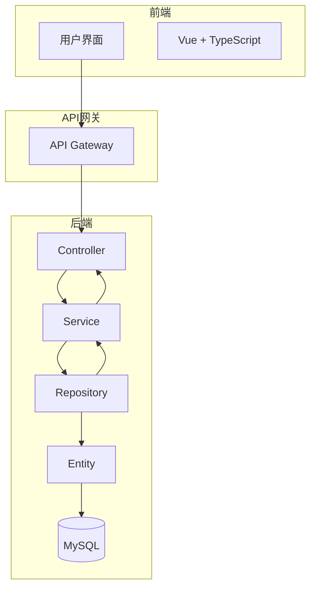
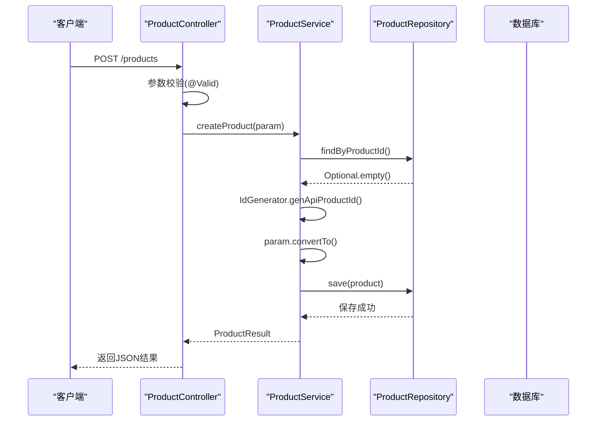
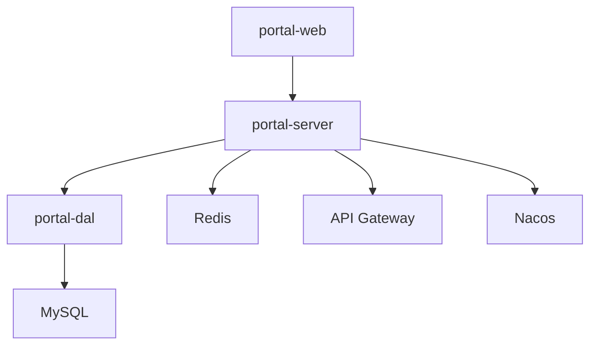

# 系统架构设计

<cite>
**本文档引用文件**  
- [PortalApplication.java](file://portal-bootstrap/src/main/java/com/alibaba/apiopenplatform/PortalApplication.java)
- [ProductController.java](file://portal-server/src/main/java/com/alibaba/apiopenplatform/controller/ProductController.java)
- [ProductService.java](file://portal-server/src/main/java/com/alibaba/apiopenplatform/service/ProductService.java)
- [ProductServiceImpl.java](file://portal-server/src/main/java/com/alibaba/apiopenplatform/service/impl/ProductServiceImpl.java)
- [ProductRepository.java](file://portal-dal/src/main/java/com/alibaba/apiopenplatform/repository/ProductRepository.java)
- [Product.java](file://portal-dal/src/main/java/com/alibaba/apiopenplatform/entity/Product.java)
</cite>

## 目录
1. [简介](#简介)
2. [项目结构](#项目结构)
3. [核心组件](#核心组件)
4. [架构概览](#架构概览)
5. [详细组件分析](#详细组件分析)
6. [依赖分析](#依赖分析)
7. [性能考量](#性能考量)
8. [故障排查指南](#故障排查指南)
9. [结论](#结论)

## 简介
Himarket 是一个基于微服务架构的API市场平台，支持API产品管理、开发者门户、网关集成与订阅管理。本架构设计文档深入解析其分层架构模式（表现层-业务层-数据访问层-实体层）、组件调用关系、前后端设计模式（MVC/MVVM）以及数据流路径。文档还探讨了关键技术选型背后的权衡，如使用JPA而非MyBatis的原因。

## 项目结构
Himarket 采用模块化分层架构，主要由以下模块构成：
- **portal-bootstrap**：应用启动器，负责引导整个系统。
- **portal-server**：核心业务逻辑层，实现MVC模式中的Controller、Service和Repository。
- **portal-dal**：数据访问层，包含实体类、JPA Repository接口及数据转换器。
- **portal-web**：前端门户，分为管理后台（api-portal-admin）和用户前端（api-portal-frontend），采用MVVM模式。
- **deploy**：部署配置，包含Docker和Helm部署文件。

该结构清晰地划分了职责，实现了前后端分离与关注点分离。

**Section sources**
- [PortalApplication.java](file://portal-bootstrap/src/main/java/com/alibaba/apiopenplatform/PortalApplication.java)

## 核心组件
系统的核心组件围绕API产品（Product）的全生命周期管理展开，包括创建、发布、订阅和删除。关键组件包括：
- **Controller**：接收HTTP请求并返回响应。
- **Service**：处理核心业务逻辑。
- **Repository**：执行数据库操作。
- **Entity**：持久化数据模型。

这些组件共同构成了典型的MVC后端架构。

**Section sources**
- [ProductController.java](file://portal-server/src/main/java/com/alibaba/apiopenplatform/controller/ProductController.java)
- [ProductService.java](file://portal-server/src/main/java/com/alibaba/apiopenplatform/service/ProductService.java)
- [ProductRepository.java](file://portal-dal/src/main/java/com/alibaba/apiopenplatform/repository/ProductRepository.java)
- [Product.java](file://portal-dal/src/main/java/com/alibaba/apiopenplatform/entity/Product.java)

## 架构概览
Himarket 采用四层架构模式：表现层（portal-web）、业务逻辑层（portal-server）、数据访问层（portal-dal）和实体层（entity）。前端通过API网关与后端通信，后端服务通过Service层调用DAL层完成数据持久化。



**Diagram sources**
- [ProductController.java](file://portal-server/src/main/java/com/alibaba/apiopenplatform/controller/ProductController.java)
- [ProductServiceImpl.java](file://portal-server/src/main/java/com/alibaba/apiopenplatform/service/impl/ProductServiceImpl.java)
- [ProductRepository.java](file://portal-dal/src/main/java/com/alibaba/apiopenplatform/repository/ProductRepository.java)
- [Product.java](file://portal-dal/src/main/java/com/alibaba/apiopenplatform/entity/Product.java)

## 详细组件分析

### 启动流程分析
系统启动由 `portal-bootstrap` 模块引导。`PortalApplication.java` 是Spring Boot的主启动类，通过 `@SpringBootApplication` 注解启用自动配置，并通过 `SpringApplication.run()` 启动应用上下文。

```java
@SpringBootApplication
@EnableJpaAuditing
public class PortalApplication {
    public static void main(String[] args) {
        SpringApplication.run(PortalApplication.class, args);
    }
}
```

该类位于 `portal-bootstrap` 模块，作为整个系统的入口点，加载所有配置并初始化各组件。

**Section sources**
- [PortalApplication.java](file://portal-bootstrap/src/main/java/com/alibaba/apiopenplatform/PortalApplication.java)

### 产品管理流程分析
以API产品创建为例，展示MVC模式在后端的完整调用链。

#### 控制器层（Controller）
`ProductController` 接收HTTP POST请求，验证参数后委托给Service层处理。



**Diagram sources**
- [ProductController.java](file://portal-server/src/main/java/com/alibaba/apiopenplatform/controller/ProductController.java)
- [ProductServiceImpl.java](file://portal-server/src/main/java/com/alibaba/apiopenplatform/service/impl/ProductServiceImpl.java)
- [ProductRepository.java](file://portal-dal/src/main/java/com/alibaba/apiopenplatform/repository/ProductRepository.java)

#### 服务层（Service）
`ProductServiceImpl` 实现核心业务逻辑，确保产品名称在管理员范围内唯一，并生成唯一的产品ID。

```java
@Override
public ProductResult createProduct(CreateProductParam param) {
    productRepository.findByNameAndAdminId(param.getName(), contextHolder.getUser())
            .ifPresent(APIProduct -> {
                throw new BusinessException(ErrorCode.RESOURCE_EXIST, Resources.PRODUCT, param.getName());
            });

    String productId = IdGenerator.genApiProductId();
    Product product = param.convertTo();
    product.setProductId(productId);
    product.setAdminId(contextHolder.getUser());
    productRepository.save(product);
    return getProduct(productId);
}
```

此方法体现了事务性操作和业务规则校验。

**Section sources**
- [ProductServiceImpl.java](file://portal-server/src/main/java/com/alibaba/apiopenplatform/service/impl/ProductServiceImpl.java)

#### 数据访问层（Repository）
`ProductRepository` 继承自 `BaseRepository`，利用Spring Data JPA提供类型安全的数据库访问方法。

```java
public interface ProductRepository extends BaseRepository<Product, Long> {
    Optional<Product> findByProductId(String productId);
    Optional<Product> findByNameAndAdminId(String name, String adminId);
}
```

这些方法无需手动编写SQL，由JPA根据方法名自动生成查询语句。

**Section sources**
- [ProductRepository.java](file://portal-dal/src/main/java/com/alibaba/apiopenplatform/repository/ProductRepository.java)

#### 实体层（Entity）
`Product` 实体类映射数据库表 `product`，使用JPA注解定义字段与表结构的映射关系。

```java
@Entity
@Table(name = "product", uniqueConstraints = {
    @UniqueConstraint(columnNames = {"product_id"}, name = "uk_product_id"),
    @UniqueConstraint(columnNames = {"name"}, name = "uk_name")
})
@Data
public class Product extends BaseEntity {
    @Id
    @GeneratedValue(strategy = GenerationType.IDENTITY)
    private Long id;
    private String productId;
    private String name;
    // 其他字段...
}
```

该类通过 `@Convert(converter = ProductIconConverter.class)` 支持复杂类型的持久化。

**Section sources**
- [Product.java](file://portal-dal/src/main/java/com/alibaba/apiopenplatform/entity/Product.java)

## 依赖分析
系统各模块间依赖关系清晰，遵循依赖倒置原则。高层模块（portal-server）依赖抽象（Service接口），低层模块（portal-dal）实现具体逻辑。



`portal-server` 通过Service接口与 `portal-dal` 解耦，便于单元测试和替换实现。

**Diagram sources**
- [ProductService.java](file://portal-server/src/main/java/com/alibaba/apiopenplatform/service/ProductService.java)
- [ProductRepository.java](file://portal-dal/src/main/java/com/alibaba/apiopenplatform/repository/ProductRepository.java)

## 性能考量
- **JPA优势**：选择JPA而非MyBatis的主要原因是开发效率高、类型安全、易于维护。JPA的缓存机制（一级/二级缓存）可提升查询性能。
- **分页查询**：所有列表接口均支持分页（Pageable），避免全表扫描。
- **异步事件**：使用 `@EventListener` 和 `@Async` 处理耗时操作（如资源清理），提升响应速度。
- **ID生成**：使用分布式ID生成器（IdGenerator）避免主键冲突。

## 故障排查指南
常见问题及解决方案：
- **产品创建失败**：检查名称是否重复（`RESOURCE_EXIST` 错误码）。
- **发布失败**：确认产品已关联API或MCP Server（`PRODUCT_API_NOT_FOUND`）。
- **权限不足**：确保请求携带有效JWT令牌且用户具有管理员权限（`AdminAuth` 注解）。
- **数据库连接异常**：检查 `application.yaml` 中的数据库配置。

日志记录使用SLF4J，关键操作均有日志输出，便于追踪问题。

**Section sources**
- [ProductServiceImpl.java](file://portal-server/src/main/java/com/alibaba/apiopenplatform/service/impl/ProductServiceImpl.java)
- [ExceptionAdvice.java](file://portal-server/src/main/java/com/alibaba/apiopenplatform/core/advice/ExceptionAdvice.java)

## 结论
Himarket 采用清晰的分层架构和现代开发技术栈，实现了高内聚、低耦合的系统设计。通过Spring Boot + JPA + Vue的技术组合，兼顾了开发效率与系统稳定性。MVC模式在后端确保了业务逻辑的清晰分离，MVVM模式在前端提供了响应式的用户体验。系统具备良好的可扩展性和可维护性，适合持续迭代演进。