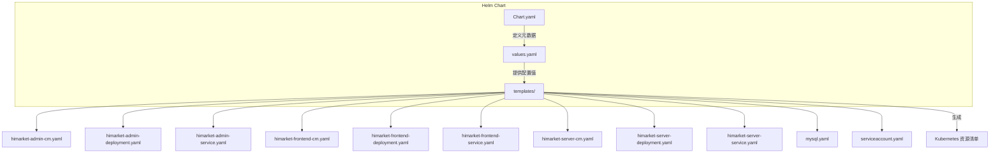
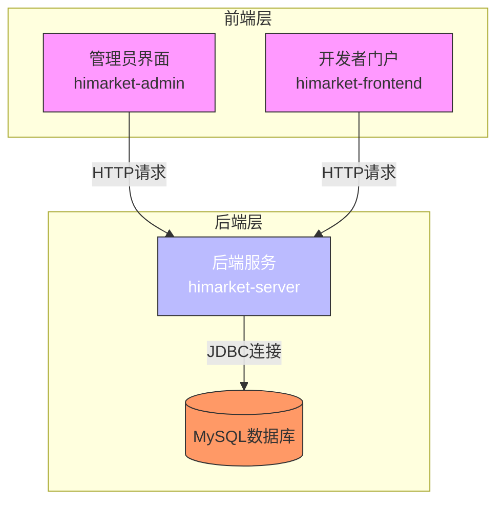
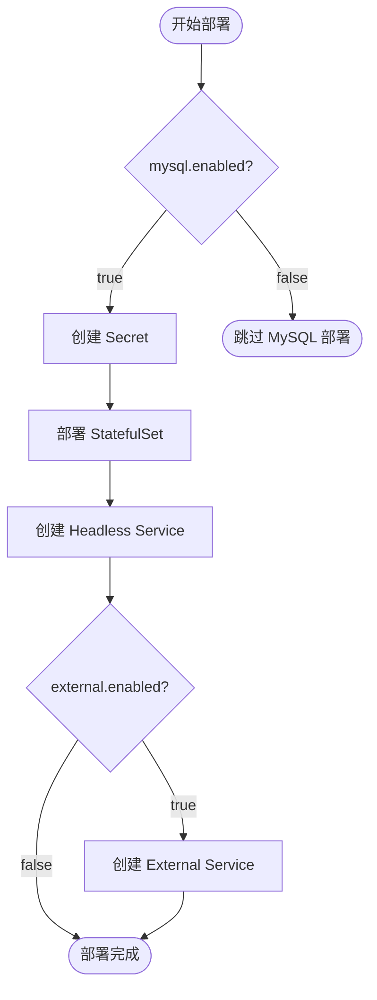
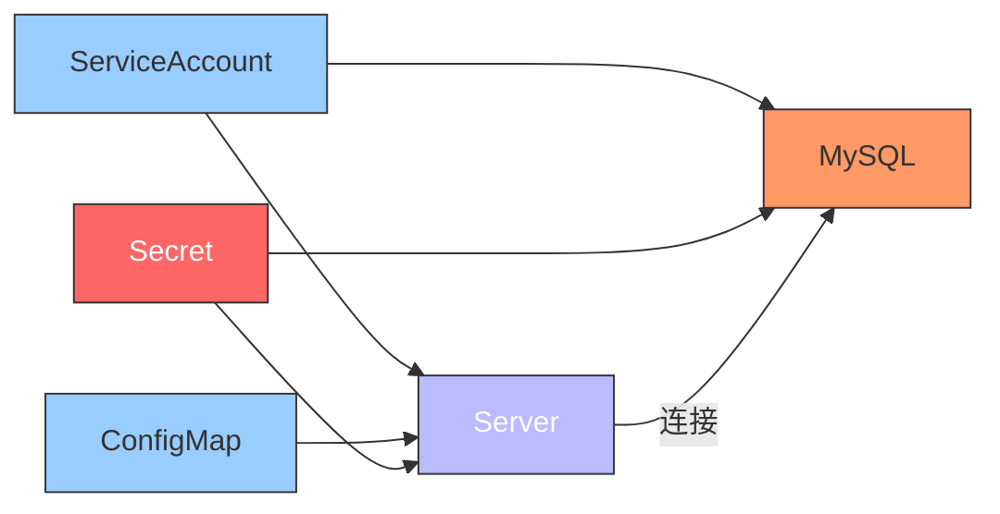

# Helm 部署指南

<cite>
**本文档引用的文件**   
- [Chart.yaml](file://deploy/helm/Chart.yaml)
- [values.yaml](file://deploy/helm/values.yaml)
- [Helm部署说明.md](file://deploy/helm/Helm部署说明.md)
- [himarket-server-deployment.yaml](file://deploy/helm/templates/himarket-server-deployment.yaml)
- [himarket-server-service.yaml](file://deploy/helm/templates/himarket-server-service.yaml)
- [himarket-server-cm.yaml](file://deploy/helm/templates/himarket-server-cm.yaml)
- [mysql.yaml](file://deploy/helm/templates/mysql.yaml)
- [serviceaccount.yaml](file://deploy/helm/templates/serviceaccount.yaml)
- [himarket-admin-deployment.yaml](file://deploy/helm/templates/himarket-admin-deployment.yaml)
- [himarket-frontend-deployment.yaml](file://deploy/helm/templates/himarket-frontend-deployment.yaml)
</cite>

## 目录
1. [简介](#简介)
2. [项目结构](#项目结构)
3. [核心组件](#核心组件)
4. [架构概览](#架构概览)
5. [详细组件分析](#详细组件分析)
6. [依赖关系分析](#依赖关系分析)
7. [性能考量](#性能考量)
8. [故障排查指南](#故障排查指南)
9. [结论](#结论)

## 简介

Himarket 是一个 AI 开放平台，提供前后端分离的微服务架构，支持通过 Helm 在 Kubernetes 集群中快速部署。本指南详细说明如何使用 Helm Chart 部署 Himarket 应用，涵盖 Chart 元数据、values.yaml 配置项、Helm 模板机制、部署命令及最佳实践。

**本节不涉及具体源码分析，因此无来源文件**

## 项目结构

Himarket 项目的 Helm 部署配置位于 `deploy/helm` 目录下，包含 Chart 定义、值配置和模板文件。整体结构清晰，遵循 Helm 最佳实践。



**图示来源**
- [Chart.yaml](file://deploy/helm/Chart.yaml)
- [values.yaml](file://deploy/helm/values.yaml)
- [templates/](file://deploy/helm/templates/)

**本节来源**
- [Chart.yaml](file://deploy/helm/Chart.yaml#L1-L25)
- [values.yaml](file://deploy/helm/values.yaml#L1-L94)

## 核心组件

Himarket Helm Chart 包含以下核心组件：
- **himarket-server**: 后端服务，处理所有业务逻辑
- **himarket-admin**: 管理后台前端，供管理员配置系统
- **himarket-frontend**: 开发者门户前端，供用户浏览和使用 API
- **MySQL**: 内置数据库，用于持久化存储（可选）
- **ServiceAccount**: 为工作负载提供身份标识

这些组件通过 Helm 模板和 values.yaml 中的配置值协同工作，实现灵活部署。

**本节来源**
- [Helm部署说明.md](file://deploy/helm/Helm部署说明.md#L5-L20)
- [values.yaml](file://deploy/helm/values.yaml#L1-L94)

## 架构概览

Himarket 采用典型的前后端分离架构，后端服务与数据库通信，两个前端应用分别面向管理员和开发者。



**图示来源**
- [Helm部署说明.md](file://deploy/helm/Helm部署说明.md#L5-L25)
- [values.yaml](file://deploy/helm/values.yaml#L1-L94)

## 详细组件分析

### himarket-server 分析

`himarket-server` 是 Himarket 的核心后端服务，负责处理所有业务逻辑、API 请求和数据库交互。

#### Deployment 配置分析

`himarket-server-deployment.yaml` 模板定义了后端服务的部署配置，使用 Helm 模板语法从 `values.yaml` 中提取配置值。

```yaml
apiVersion: apps/v1
kind: Deployment
metadata:
  name: himarket-server
  labels:
    app: himarket-server
spec:
  replicas: {{ .Values.server.replicaCount }}
  selector:
    matchLabels:
      app: himarket-server
  template:
    metadata:
      labels:
        app: himarket-server
    spec:
      serviceAccountName: {{ include "himarket.serviceAccountName" . }}
      containers:
        - name: server
          image: "{{ .Values.hub }}/{{ .Values.server.image.repository }}:{{ .Values.server.image.tag}}"
          imagePullPolicy: {{ .Values.server.image.pullPolicy }}
          ports:
            - name: http
              containerPort: {{ .Values.server.serverPort }}
          envFrom:
            - configMapRef:
                name: himarket-server
{{- if .Values.mysql.enabled }}
            - secretRef:
                name: himarket-server-secret
{{- end }}
          {{- with .Values.resources }}
          resources:
            {{- toYaml . | nindent 12 }}
          {{- end }}
```

该模板的关键特性包括：
- 使用 `.Values.server.replicaCount` 控制副本数量
- 动态构建镜像地址：`hub/repository:tag`
- 条件性注入 Secret（仅当启用内置 MySQL 时）
- 支持资源限制配置

**图示来源**
- [himarket-server-deployment.yaml](file://deploy/helm/templates/himarket-server-deployment.yaml#L1-L69)

**本节来源**
- [himarket-server-deployment.yaml](file://deploy/helm/templates/himarket-server-deployment.yaml#L1-L69)
- [values.yaml](file://deploy/helm/values.yaml#L35-L45)

#### Service 配置分析

`himarket-server-service.yaml` 定义了后端服务的服务暴露方式。

```yaml
apiVersion: v1
kind: Service
metadata:
  name: himarket-server
  labels:
    app: himarket-server
spec:
  type: {{ .Values.server.service.type }}
  ports:
    - port: {{ .Values.server.service.port }}
      targetPort: http
      protocol: TCP
      name: http
  selector:
    app: himarket-server
```

服务类型由 `values.yaml` 中的 `server.service.type` 控制，默认为 `ClusterIP`，确保后端服务仅在集群内部可访问。

**本节来源**
- [himarket-server-service.yaml](file://deploy/helm/templates/himarket-server-service.yaml#L1-L16)

#### ConfigMap 配置分析

`himarket-server-cm.yaml` 定义了非敏感配置信息，通过环境变量注入容器。

```yaml
kind: ConfigMap
apiVersion: v1
metadata:
  labels:
    app: himarket-server
  name: himarket-server
data:
  SERVER_PORT: "8080"
{{- if not .Values.mysql.enabled }}
  DB_HOST: {{ .Values.database.host | quote }}
  DB_PORT: {{ .Values.database.port | quote }}
  DB_NAME: {{ .Values.database.name | quote }}
  DB_USERNAME: {{ .Values.database.username | quote }}
  DB_PASSWORD: {{ .Values.database.password | quote }}
{{- end }}
```

ConfigMap 的智能之处在于根据 `mysql.enabled` 值决定是否包含外部数据库配置，实现了部署模式的无缝切换。

**本节来源**
- [himarket-server-cm.yaml](file://deploy/helm/templates/himarket-server-cm.yaml#L1-L18)

### MySQL 组件分析

MySQL 组件通过 `mysql.yaml` 模板实现条件性部署，支持内置和外置两种模式。

#### 内置 MySQL 部署逻辑

当 `mysql.enabled` 为 `true` 时，Helm 会部署完整的 MySQL StatefulSet，包括：
- **Secret**: 存储数据库凭据，支持自动生成随机密码
- **Headless Service**: 为 StatefulSet 提供稳定网络标识
- **External Service**: 可选，用于外部访问
- **StatefulSet**: 部署 MySQL 实例，配置持久化存储



**图示来源**
- [mysql.yaml](file://deploy/helm/templates/mysql.yaml#L1-L162)

**本节来源**
- [mysql.yaml](file://deploy/helm/templates/mysql.yaml#L1-L162)
- [values.yaml](file://deploy/helm/values.yaml#L47-L93)

#### 密码管理机制

MySQL 组件实现了智能密码管理：
1. 优先使用用户在 `values.yaml` 中指定的密码
2. 若未指定，则自动生成 16 位随机密码
3. 密码存储在 Secret 中，确保安全性
4. 支持通过 `kubectl` 命令获取自动生成的密码

```bash
kubectl get secret mysql-secret -n himarket -o jsonpath="{.data.MYSQL_ROOT_PASSWORD}" | base64 -d
```

**本节来源**
- [mysql.yaml](file://deploy/helm/templates/mysql.yaml#L2-L40)
- [Helm部署说明.md](file://deploy/helm/Helm部署说明.md#L45-L55)

### ServiceAccount 分析

`serviceaccount.yaml` 定义了工作负载使用的身份标识。

```yaml
apiVersion: v1
kind: ServiceAccount
metadata:
  name: {{ include "himarket.serviceAccountName" . }}
```

ServiceAccount 名称通过 Helm 辅助函数动态生成，确保命名一致性。

**本节来源**
- [serviceaccount.yaml](file://deploy/helm/templates/serviceaccount.yaml#L1-L4)

## 依赖关系分析

Himarket 各组件之间存在明确的依赖关系，这些关系通过 Helm 模板和 Kubernetes 资源定义实现。



**图示来源**
- [serviceaccount.yaml](file://deploy/helm/templates/serviceaccount.yaml)
- [himarket-server-deployment.yaml](file://deploy/helm/templates/himarket-server-deployment.yaml)
- [mysql.yaml](file://deploy/helm/templates/mysql.yaml)

**本节来源**
- 所有 templates/ 目录下的 YAML 文件

## 性能考量

Himarket Helm Chart 在设计时考虑了性能和资源管理：

- **资源限制**: 通过 `resources` 字段为各组件设置 CPU 和内存限制
- **持久化存储**: MySQL 使用 SSD 存储类（alicloud-disk-essd），确保 I/O 性能
- **副本控制**: 支持通过 `replicaCount` 调整各组件的副本数量
- **健康检查**: MySQL 配置了 liveness 和 readiness 探针，确保服务稳定性

建议根据实际负载调整资源请求和限制，避免资源浪费或性能瓶颈。

**本节不涉及具体代码实现，因此无来源文件**

## 故障排查指南

### 常见问题及解决方案

1. **Pod 无法启动**
   - 检查镜像拉取是否成功：`kubectl describe pod <pod-name>`
   - 确认镜像仓库可访问且凭据正确
   - 检查资源配额是否充足

2. **数据库连接失败**
   - 验证 MySQL 是否正常运行：`kubectl get pods -l app=mysql`
   - 检查 Secret 中的数据库凭据是否正确
   - 确认网络策略是否允许连接

3. **服务无法访问**
   - 检查服务类型和端口配置
   - 验证 LoadBalancer 是否成功分配外部 IP
   - 检查 Ingress 配置（如适用）

### 状态检查命令

```bash
# 查看所有 Pod 状态
kubectl get pods -n himarket

# 查看服务信息
kubectl get svc -n himarket

# 查看部署状态
kubectl get deployments -n himarket

# 查看日志
kubectl logs -f <pod-name> -n himarket
```

**本节来源**
- [Helm部署说明.md](file://deploy/helm/Helm部署说明.md#L100-L150)

## 结论

Himarket Helm Chart 提供了一套完整、灵活且安全的部署方案。通过合理的配置管理、条件性资源部署和智能密码机制，能够适应不同环境的部署需求。建议用户根据实际生产环境调整 values.yaml 中的配置，特别是资源限制、存储类和数据库设置，以确保系统的稳定性和性能。

**本节为总结性内容，不涉及具体源码，因此无来源文件**