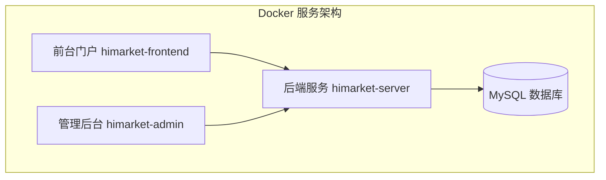
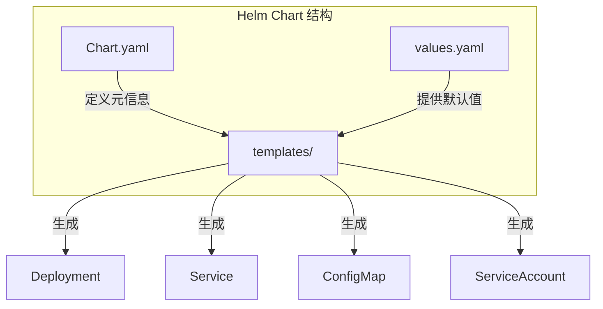

# 部署与运维指南

<cite>
**本文档引用文件**  
- [docker-compose.yml](file://deploy/docker/docker-compose.yml)
- [Docker部署说明.md](file://deploy/docker/Docker部署说明.md)
- [Chart.yaml](file://deploy/helm/Chart.yaml)
- [values.yaml](file://deploy/helm/values.yaml)
- [application.yaml](file://portal-bootstrap/src/main/resources/application.yaml)
</cite>

## 目录
1. [简介](#简介)
2. [Docker 部署详解](#docker-部署详解)
3. [Helm 部署详解](#helm-部署详解)
4. [核心配置项说明](#核心配置项说明)
5. [监控与日志建议](#监控与日志建议)
6. [常见问题排查](#常见问题排查)

## 简介
HiMarket 是一个 AI 开放平台，提供前后端分离的微服务架构，支持通过 Docker 和 Helm 两种方式部署。本指南详细说明了两种部署方式的配置、步骤及运维建议，帮助用户快速部署并稳定运行系统。

## Docker 部署详解

### 服务组件说明
根据 `Docker部署说明.md` 文件，HiMarket 包含以下四个核心服务：

- **mysql**：数据库服务，使用 MariaDB/MySQL 存储平台数据；
- **himarket-server**：后端服务，提供 REST API 接口，运行于 8080 端口；
- **himarket-admin**：管理后台界面，供管理员配置门户和产品，运行于 5174 端口；
- **himarket-frontend**：前台用户门户，供开发者浏览 API 产品，运行于 5173 端口。



**图示来源**  
- [docker-compose.yml](file://deploy/docker/docker-compose.yml#L1-L51)
- [Docker部署说明.md](file://deploy/docker/Docker部署说明.md#L1-L181)

### docker-compose.yml 配置解析
`docker-compose.yml` 定义了四个服务的容器化配置，关键配置如下：

#### mysql 服务
- **镜像**: `opensource-registry.cn-hangzhou.cr.aliyuncs.com/higress-group/mysql:latest`
- **环境变量**:
  - `MYSQL_ROOT_PASSWORD`: root 用户密码
  - `MYSQL_DATABASE`: 初始化数据库名（`portal_db`）
  - `MYSQL_USER` / `MYSQL_PASSWORD`: 应用连接用户
- **端口映射**: 主机 3306 → 容器 3306
- **数据卷**: `./mysql/data` 持久化数据
- **依赖**: 无（基础服务）

#### himarket-server 服务
- **镜像**: `himarket-server:latest`
- **环境变量**:
  - `DB_HOST`: 数据库主机（指向 `mysql`）
  - `DB_PORT`, `DB_NAME`, `DB_USERNAME`, `DB_PASSWORD`: 数据库连接信息
- **端口映射**: 主机 8080 → 容器 8080
- **依赖**: `mysql`（启动前需数据库就绪）

#### himarket-admin 与 himarket-frontend
- **镜像**: 分别为 `himarket-admin:1.0.0` 和 `himarket-frontend:1.0.0`
- **环境变量**:
  - `HIMARKET_SERVER`: 指向后端服务地址（`http://himarket-server:8080`）
- **端口映射**:
  - admin: 主机 5174 → 容器 8000
  - frontend: 主机 5173 → 容器 8000
- **依赖**: `himarket-server`

**本节来源**  
- [docker-compose.yml](file://deploy/docker/docker-compose.yml#L1-L51)
- [Docker部署说明.md](file://deploy/docker/Docker部署说明.md#L1-L181)

### 部署步骤
1. **准备配置文件**  
   将 `docker-compose.yml` 放置于部署目录。

2. **启动服务**  
   执行以下命令：
   ```bash
   docker-compose up -d
   ```

3. **验证状态**  
   ```bash
   docker-compose ps
   docker-compose logs -f
   ```

4. **访问服务**  
   - 管理后台：`http://localhost:5174`
   - 前台门户：`http://localhost:5173`
   - 后端 API：`http://localhost:8080`

### 自定义配置
- **使用外部数据库**：移除 `mysql` 服务，修改 `himarket-server` 的 `DB_HOST` 等环境变量。
- **修改端口**：调整 `ports` 映射，如将前端改为 `80:8000`。
- **本地镜像构建**：运行 `./build.sh` 构建本地镜像，并在 `docker-compose.yml` 中引用。

**本节来源**  
- [Docker部署说明.md](file://deploy/docker/Docker部署说明.md#L1-L181)

## Helm 部署详解

### Chart 结构说明
Helm Chart 位于 `deploy/helm/` 目录，包含以下文件：

- **Chart.yaml**: 定义 Chart 元信息
- **values.yaml**: 默认配置值
- **templates/**: Kubernetes 资源模板

#### Chart.yaml 解析
```yaml
apiVersion: v2
name: himarket
description: HiMarket AI 开放平台 Helm Chart
type: application
version: 0.1.0
appVersion: "1.16.0"
```
- `type: application` 表示这是一个可部署的应用 Chart。
- `version` 是 Chart 版本，`appVersion` 是应用版本。

**本节来源**  
- [Chart.yaml](file://deploy/helm/Chart.yaml#L1-L25)

#### values.yaml 配置详解
`values.yaml` 提供了可覆盖的默认配置，主要分为以下模块：

##### 镜像配置
```yaml
hub: opensource-registry.cn-hangzhou.cr.aliyuncs.com/higress-group
frontend:
  image:
    repository: himarket-frontend
    tag: "1.0.0"
    pullPolicy: Always
```
- 所有镜像基于 `hub` 前缀构建完整路径。

##### 服务配置
- `frontend` 和 `admin` 使用 `LoadBalancer` 类型 Service，暴露公网访问。
- `server` 使用 `ClusterIP`，仅集群内部访问。

##### MySQL 配置
- 内置 MySQL：`mysql.enabled: true` 时启用，包含持久化存储、资源限制等。
- 外部数据库：`mysql.enabled: false` 时，使用 `database` 字段配置连接信息。

##### 资源限制
```yaml
resources:
  limits:
    cpu: 2
    memory: 2000Mi
  requests:
    cpu: 1
    memory: 1000Mi
```
为所有服务设置默认资源请求与限制。



**图示来源**  
- [Chart.yaml](file://deploy/helm/Chart.yaml#L1-L25)
- [values.yaml](file://deploy/helm/values.yaml#L1-L94)

### Helm 部署步骤
1. **安装 Helm**
   确保 Kubernetes 集群和 Helm 已就绪。

2. **部署 Chart**
   ```bash
   helm install himarket ./deploy/helm
   ```

3. **自定义配置**
   创建 `custom-values.yaml` 覆盖默认值：
   ```yaml
   database:
     host: prod-db.example.com
     password: securePass123
   frontend:
     replicaCount: 3
   ```
   部署时指定：
   ```bash
   helm install himarket ./deploy/helm -f custom-values.yaml
   ```

4. **升级与回滚**
   ```bash
   helm upgrade himarket ./deploy/helm -f custom-values.yaml
   helm rollback himarket 1
   ```

**本节来源**  
- [Chart.yaml](file://deploy/helm/Chart.yaml#L1-L25)
- [values.yaml](file://deploy/helm/values.yaml#L1-L94)

## 核心配置项说明

### application.yaml 关键配置
该文件位于 `portal-bootstrap/src/main/resources/application.yaml`，是后端服务的核心配置。

#### 数据库连接
```yaml
spring:
  datasource:
    url: jdbc:mariadb://${db.host}:${db.port}/${db.name}?...
    username: ${db.username}
    password: ${db.password}
```
- 实际值由环境变量或 Helm values 注入。
- 支持 MariaDB/MySQL。

#### JWT 配置
```yaml
jwt:
  secret: YourJWTSecret
  expiration: 2h
```
- `secret` 用于生成和验证 JWT Token，**必须在生产环境替换为高强度密钥**。
- `expiration` 设置 Token 有效期。

#### 加密配置
```yaml
encryption:
  root-key: portalmanagement
```
- 用于敏感字段加密（如 API Key）。

#### 日志配置
```yaml
logging:
  level:
    com.alibaba.apiopenplatform: INFO
```
- 建议生产环境设为 `WARN` 或 `ERROR` 以减少日志量。

**本节来源**  
- [application.yaml](file://portal-bootstrap/src/main/resources/application.yaml#L1-L44)

### 环境覆盖机制
- **Docker**: 通过 `docker-compose.yml` 的 `environment` 覆盖 `application.yaml` 中的占位符（如 `${db.host}`）。
- **Helm**: 在 `values.yaml` 中定义数据库、镜像等参数，模板中通过 `{{ .Values.database.host }}` 注入。

## 监控与日志建议

### 日志收集
- 所有服务应将日志输出到 stdout/stderr。
- 建议使用 **EFK**（Elasticsearch + Fluentd + Kibana）或 **Loki + Promtail + Grafana** 收集容器日志。
- 关键日志级别：`ERROR` 和 `WARN` 应实时告警。

### 监控指标
- **Prometheus + Grafana** 采集以下指标：
  - JVM 指标（himarket-server）
  - HTTP 请求延迟、QPS、错误率
  - MySQL 连接数、慢查询
- 建议为 `himarket-server` 添加 Micrometer 监控支持。

### 健康检查
- **Liveness Probe**: `/actuator/health` 检查服务是否存活。
- **Readiness Probe**: 确保服务已准备好接收流量。

## 常见问题排查

### 服务无法启动
- **现象**: `docker-compose up` 后服务退出。
- **排查**:
  1. 查看日志：`docker-compose logs <service>`
  2. 检查数据库连接：确保 `DB_HOST` 可达，用户名密码正确。
  3. 检查端口冲突：`netstat -an | grep <port>`。

### 前端无法访问后端
- **现象**: 前台或管理后台提示“网络错误”。
- **原因**: `HIMARKET_SERVER` 环境变量指向错误。
- **解决**: 确保前端容器内能解析 `himarket-server`（Docker 网络）或使用正确 IP。

### 数据库初始化失败
- **现象**: `himarket-server` 启动时报错“无法连接数据库”。
- **解决**:
  - 检查 `mysql` 容器是否正常运行。
  - 确认 `MYSQL_DATABASE` 与 `DB_NAME` 一致。
  - 检查 `datasource.url` 中的参数是否正确。

### Helm 部署后服务无响应
- **排查**:
  1. `kubectl get pods` 查看 Pod 状态。
  2. `kubectl logs <pod>` 查看日志。
  3. `kubectl describe pod <pod>` 检查事件（如镜像拉取失败、资源不足）。

**本节来源**  
- [Docker部署说明.md](file://deploy/docker/Docker部署说明.md#L1-L181)
- [docker-compose.yml](file://deploy/docker/docker-compose.yml#L1-L51)
- [values.yaml](file://deploy/helm/values.yaml#L1-L94)