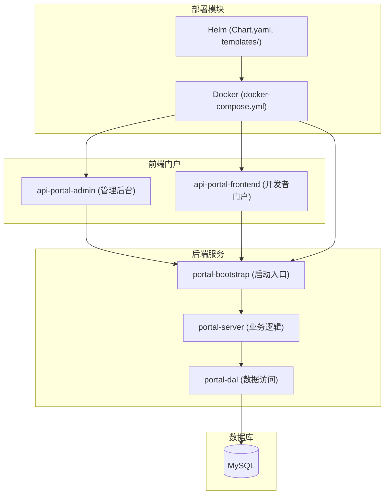
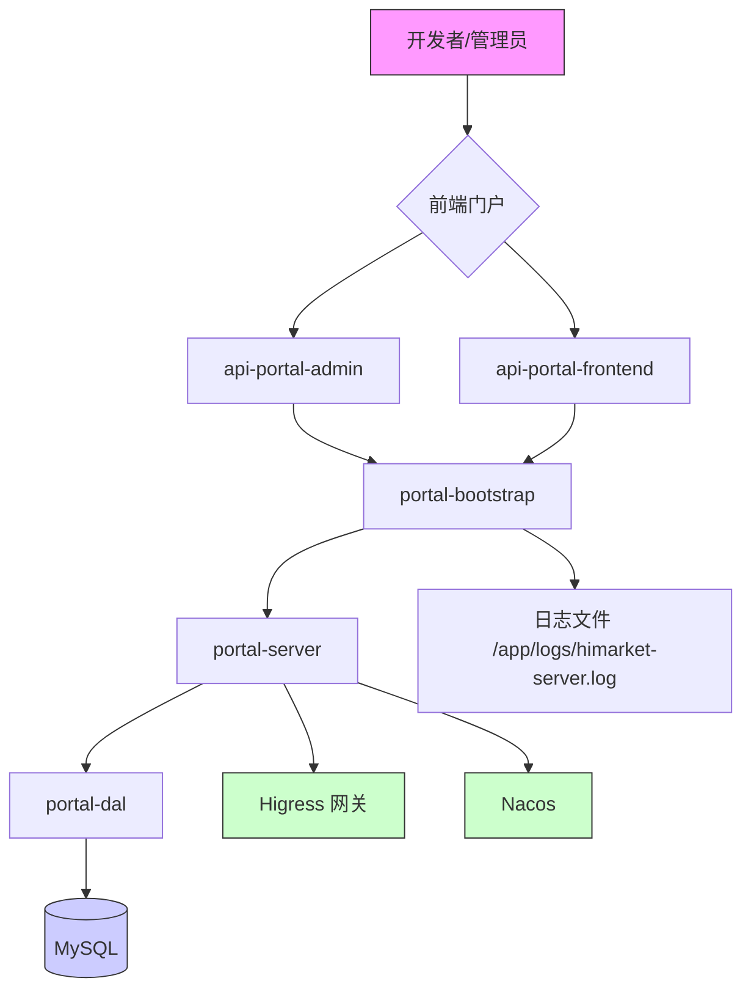
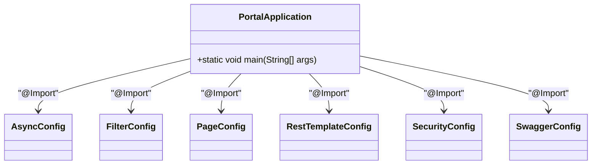
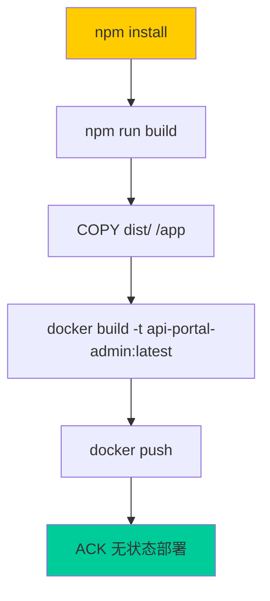
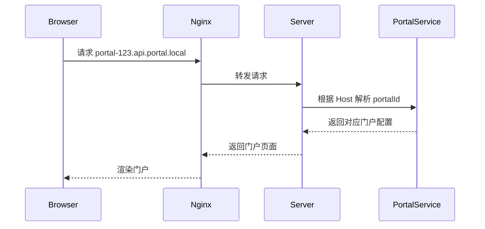
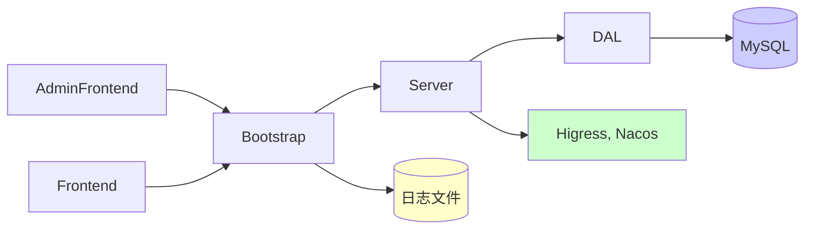

# 项目概述

<cite>
**本文档引用文件**   
- [README.md](file://README.md)
- [portal-bootstrap/Dockerfile](file://portal-bootstrap/Dockerfile)
- [portal-web/api-portal-admin/README.md](file://portal-web/api-portal-admin/README.md)
- [portal-web/api-portal-frontend/README.md](file://portal-web/api-portal-frontend/README.md)
- [portal-web/api-portal-admin/Dockerfile](file://portal-web/api-portal-admin/Dockerfile)
- [portal-web/api-portal-frontend/Dockerfile](file://portal-web/api-portal-frontend/Dockerfile)
- [portal-bootstrap/src/main/resources/application.yaml](file://portal-bootstrap/src/main/resources/application.yaml)
</cite>

## 目录
1. [简介](#简介)
2. [项目结构](#项目结构)
3. [核心组件](#核心组件)
4. [架构概览](#架构概览)
5. [详细组件分析](#详细组件分析)
6. [依赖分析](#依赖分析)
7. [性能考量](#性能考量)
8. [故障排查指南](#故障排查指南)
9. [结论](#结论)

## 简介

Himarket 是一个开箱即用的企业级 AI 开放平台解决方案，旨在帮助企业构建 AI 能力市场与开发者生态。该平台通过三大核心模块满足企业内不同角色的需求：管理员可通过管理后台将底层模型服务、MCP Server 和 Agent 等 AI 能力打包为标准化的“AI 产品”并发布；开发者可通过门户完成注册、订阅、调用和监控；AI 网关则负责所有调用的认证、安全、流控与可观测性。

平台采用微服务架构，前后端分离设计，支持多租户门户、统一身份认证、外部系统集成（如 Higress、Nacos）等关键特性。整体技术栈基于 Spring Boot、React、Vite 和 MySQL，具备良好的可扩展性与可维护性。

**Section sources**
- [README.md](file://README.md#L1-L219)

## 项目结构

Himarket 项目采用模块化分层结构，主要分为部署模块、后端服务模块和前端门户模块，各模块职责清晰，便于独立开发与部署。

**Diagram sources**
- [README.md](file://README.md#L1-L219)
- [deploy/docker/docker-compose.yml](file://deploy/docker/docker-compose.yml)
- [deploy/helm/Chart.yaml](file://deploy/helm/Chart.yaml)

**Section sources**
- [README.md](file://README.md#L1-L219)

## 核心组件

Himarket 的核心组件包括三大门户前端与三大后端服务模块，共同构成完整的 AI 开放平台能力。

### 前端组件

- **api-portal-admin**：基于 Vite + React + Redux 构建的管理后台，供管理员进行产品创建、门户配置、网关导入等操作。
- **api-portal-frontend**：开发者门户前端，支持开发者注册、消费者创建、API 订阅与调用测试，采用多租户域名路由机制。

### 后端组件

- **portal-bootstrap**：Spring Boot 应用启动入口，负责加载配置、初始化上下文。
- **portal-server**：核心业务逻辑层，提供 REST API 接口，处理管理员、开发者、消费者、门户、产品等实体的增删改查。
- **portal-dal**：数据访问层，封装 JPA Repository 与实体类，实现与 MySQL 的持久化交互。

**Section sources**
- [README.md](file://README.md#L1-L219)
- [portal-web/api-portal-admin/README.md](file://portal-web/api-portal-admin/README.md#L1-L61)
- [portal-web/api-portal-frontend/README.md](file://portal-web/api-portal-frontend/README.md#L1-L23)

## 架构概览

Himarket 采用典型的前后端分离微服务架构，整体分为四层：展示层、API 层、服务层与数据层。

**Diagram sources**
- [README.md](file://README.md#L1-L219)
- [portal-bootstrap/Dockerfile](file://portal-bootstrap/Dockerfile#L1-L8)
- [portal-bootstrap/src/main/resources/application.yaml](file://portal-bootstrap/src/main/resources/application.yaml)

**Section sources**
- [README.md](file://README.md#L1-L219)

## 详细组件分析

### portal-bootstrap 分析

作为 Spring Boot 应用的启动模块，`portal-bootstrap` 负责加载主类 `PortalApplication.java` 并注入全局配置。其 `application.yaml` 文件中定义了数据库连接、日志路径等关键参数。

**Diagram sources**
- [portal-bootstrap/src/main/java/com/alibaba/apiopenplatform/PortalApplication.java](file://portal-bootstrap/src/main/java/com/alibaba/apiopenplatform/PortalApplication.java)
- [portal-bootstrap/src/main/java/com/alibaba/apiopenplatform/config/*.java](file://portal-bootstrap/src/main/java/com/alibaba/apiopenplatform/config/)

**Section sources**
- [portal-bootstrap/Dockerfile](file://portal-bootstrap/Dockerfile#L1-L8)

### api-portal-admin 前端分析

该模块是基于 Vite + React + Redux 的管理后台，采用组件化开发模式，支持热更新与高效构建。

#### 技术栈
- 构建工具: Vite
- 前端框架: React 19
- 状态管理: Redux Toolkit
- 路由: React Router DOM
- UI组件: Radix UI + Tailwind CSS
- HTTP客户端: Axios
- 表单处理: React Hook Form + Zod

#### 构建与部署流程

**Diagram sources**
- [portal-web/api-portal-admin/Dockerfile](file://portal-web/api-portal-admin/Dockerfile#L1-L11)
- [portal-web/api-portal-admin/README.md](file://portal-web/api-portal-admin/README.md#L1-L61)

**Section sources**
- [portal-web/api-portal-admin/README.md](file://portal-web/api-portal-admin/README.md#L1-L61)

### api-portal-frontend 前端分析

开发者门户前端，同样基于 Vite + React 技术栈，通过域名路由识别不同租户门户。

#### 多租户路由机制

**Diagram sources**
- [portal-web/api-portal-frontend/Dockerfile](file://portal-web/api-portal-frontend/Dockerfile#L1-L10)
- [portal-web/api-portal-frontend/README.md](file://portal-web/api-portal-frontend/README.md#L1-L23)

**Section sources**
- [portal-web/api-portal-frontend/README.md](file://portal-web/api-portal-frontend/README.md#L1-L23)

## 依赖分析

Himarket 项目依赖关系清晰，模块间低耦合，便于独立升级与维护。

**Diagram sources**
- [README.md](file://README.md#L1-L219)
- [pom.xml](file://pom.xml)

**Section sources**
- [README.md](file://README.md#L1-L219)

## 性能考量

- **前端性能**：采用 Vite 构建，支持 ES 模块原生加载，开发环境启动极快；生产构建使用 Rollup 优化打包体积。
- **后端性能**：Spring Boot 默认配置已优化，可通过 JVM 参数调优堆内存与 GC 策略。
- **数据库性能**：建议使用 SSD 存储，合理配置连接池（HikariCP），避免 N+1 查询。
- **网关集成**：与 Higress 网关通过 HTTP Client 通信，建议启用连接池与超时控制。

[无具体文件分析，不添加来源]

## 故障排查指南

### 常见问题
1. **无法启动 portal-bootstrap**
   - 检查数据库连接参数是否正确（`application.yaml` 或启动参数）
   - 确认 MySQL 服务已启动且网络可达

2. **前端无法访问**
   - 检查 `npm run dev` 是否成功启动
   - 确认端口 5173/5174 未被占用
   - 检查 `.env` 环境变量配置

3. **Docker 镜像构建失败**
   - 确保 `dist/` 目录已存在（先执行 `npm run build`）
   - 检查 `Dockerfile` 中 COPY 路径是否正确

**Section sources**
- [README.md](file://README.md#L1-L219)
- [portal-bootstrap/Dockerfile](file://portal-bootstrap/Dockerfile#L1-L8)
- [portal-web/api-portal-admin/Dockerfile](file://portal-web/api-portal-admin/Dockerfile#L1-L11)

## 结论

Himarket 是一个功能完整、架构清晰的企业级 AI 开放平台解决方案。其采用前后端分离、微服务化设计，具备良好的可扩展性与可维护性。通过管理后台、开发者门户与 AI 网关的协同，实现了从能力封装、产品发布到开发者调用的全链路闭环。项目文档完善，支持 Docker 与 Helm 部署，适合企业快速落地 AI 能力开放战略。

[无具体文件分析，不添加来源]